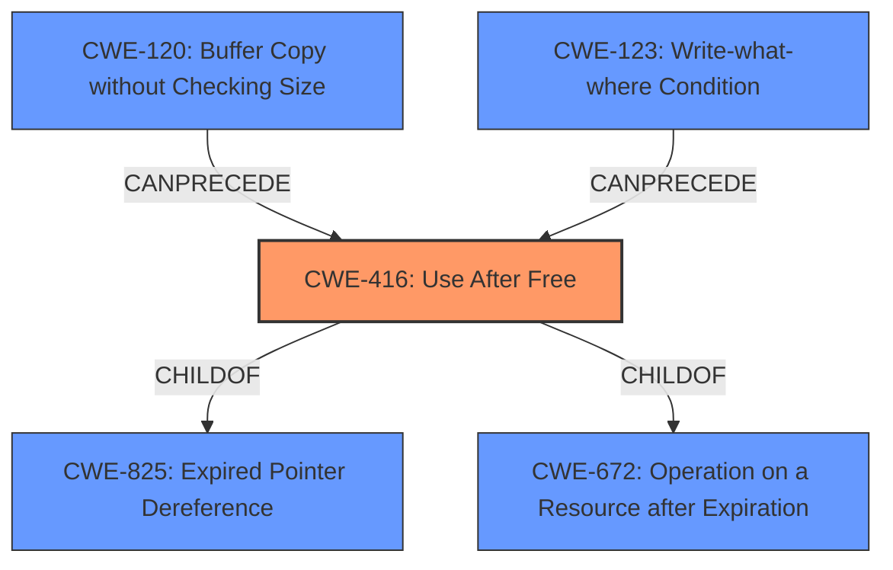

# Analysis Report for CVE-2021-21195

# Vulnerability Analysis Report: CVE-2021-21195

## Description


## Analysis (with Relationship Data)

# Summary
| CWE ID  | CWE Name                    | Confidence | CWE Abstraction Level | CWE Vulnerability Mapping Label | CWE-Vulnerability Mapping Notes |
| :-------- | :-------------------------- | :--------- | :-------------------- | :------------------------------ | :------------------------------ |
| CWE-416 | Use After Free            | 1.0        | Variant               | Allowed                       | Primary CWE                     |

## Evidence and Confidence

*   **Confidence Score:** 1.0
*   **Evidence Strength:** HIGH

## Relationship Analysis
The primary identified weakness is CWE-416 **Use After Free**, which is a Variant level CWE. It is related to other CWEs through hierarchical relationships. CWE-416 is a ChildOf CWE-825 **Expired Pointer Dereference**, CWE-672 **Operation on a Resource after Expiration**. The `CanPrecede` relationship shows that CWE-416 can be a result of memory corruption issues such as CWE-120 **Buffer Copy without Checking Size** and CWE-123 **Write-what-where Condition**.



## Vulnerability Chain
The vulnerability chain starts with a **Use After Free (CWE-416)** in the V8 component of Google Chrome. The vulnerability allows a remote attacker to potentially exploit heap corruption.

## Summary of Analysis
The vulnerability is classified as CWE-416 **Use After Free** based on the provided evidence. The "Vulnerability Description Key Phrases" section explicitly mentions "**rootcause:** **use after free**". The "CVE Reference Links Content Summary" confirms this by stating "**root_cause:** Use after free in the V8 component of the Chromium browser." and "**weaknesses:** Use after free". The vulnerability allows a remote attacker to potentially exploit heap corruption. The retriever results also lists CWE-416 as the top combined result. Given the explicit mention of "use after free" as the root cause and the high confidence score from the retriever, CWE-416 is the most appropriate mapping. The fact that CWE-416 is a Variant makes it a preferred level of abstraction.

Other CWEs like CWE-787 **Out-of-bounds Write**, CWE-362 **Concurrent Execution using Shared Resource with Improper Synchronization ('Race Condition')**, and CWE-415 **Double Free** were considered but not selected. CWE-787 was considered because heap corruption often leads to out-of-bounds writes. However, the primary weakness is the use after free, not the write itself. CWE-362 was considered because race conditions can lead to use-after-free vulnerabilities, but there's no explicit evidence of a race condition in this case. CWE-415 was considered because it is similar to CWE-416, but the description explicitly states use after free, not a double free.


## CWE Relationship Analysis

Current CWEs represent these abstraction levels: .


### Vulnerability Chain Analysis

**Chain starting from CWE-787:**
- 787 (Out-of-bounds Write) - ROOT


**Chain starting from CWE-415:**
- 415 (Double Free) - ROOT


### CWE Relationship Diagram

```mermaid
graph TD
    classDef primary fill:#f96,stroke:#333,stroke-width:2px
    classDef secondary fill:#69f,stroke:#333
    classDef tertiary fill:#9e9,stroke:#333
```


*Report generated on 2025-04-02 09:32:11*
