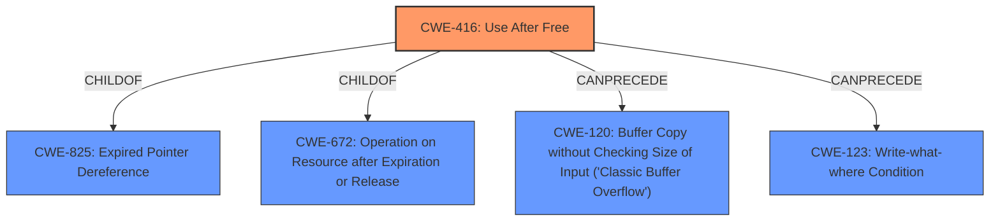

# Raw Analyzer Response for CVE-2021-21199

# Summary
| CWE ID  | CWE Name          | Confidence | CWE Abstraction Level | CWE Vulnerability Mapping Label | CWE-Vulnerability Mapping Notes |
| :------- | :----------------- | :---------- | :------------------- | :----------------------------- | :----------------------------- |
| CWE-416 | Use After Free     | 1.0         | Variant              | Primary CWE                  | Allowed                      |

## Evidence and Confidence

*   **Confidence Score:** 1.0
*   **Evidence Strength:** HIGH

## Relationship Analysis
The primary identified CWE is CWE-416.
  - CWE-416 (Use After Free) is a variant of CWE-825 (Expired Pointer Dereference) and CWE-672 (Operation on Resource after Expiration or Release).
  - CWE-416 can be preceded by CWE-120 (Buffer Copy without Checking Size of Input ('Classic Buffer Overflow')) and CWE-123 (Write-what-where Condition).

## Vulnerability Chain
The vulnerability chain for this description is quite direct:
  - **Root Cause:** **Use after free** (CWE-416)
  - **Impact:** Heap corruption leading to potential arbitrary code execution.

## Summary of Analysis
The vulnerability description explicitly states "**Use after free**" as the root cause and the CVE Reference Links Content Summary confirms this. The Retriever Results also lists CWE-416 as the top combined result.
The evidence supports the selection of CWE-416 as the primary CWE.

"**Use after free** in Aura in Google Chrome on Linux prior to 89.0.4389.114 allowed a remote attacker who had compromised the renderer process to potentially exploit heap corruption via a crafted HTML page."

The CWE-416 description matches the vulnerability: "The product reuses or references memory after it has been freed."

Other CWEs Considered and Rejected:
- CWE-366: Race Condition within a Thread was considered but rejected because the vulnerability description does not indicate a race condition.
- CWE-122: Heap-based Buffer Overflow was considered but rejected because the vulnerability description specifies a use-after-free, not a buffer overflow.
- CWE-843: Access of Resource Using Incompatible Type ('Type Confusion') was considered but rejected because the vulnerability description does not suggest type confusion.
- CWE-415: Double Free was considered but rejected because the vulnerability description specifies use after free and not a double free.
- CWE-123: Write-what-where Condition was considered but rejected because the vulnerability description specifies use after free and not an arbitrary write.
- CWE-911: Improper Update of Reference Count was considered but rejected because there is no mention of reference counting in the vulnerability description.
- CWE-346: Origin Validation Error was considered but rejected because there is no mention of origin validation in the vulnerability description.
- CWE-653: Improper Isolation or Compartmentalization was considered but rejected because there is no mention of compartmentalization in the vulnerability description.