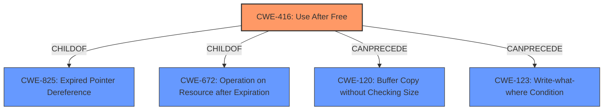

# Enhanced Analysis for CVE-2021-21203

# Summary
| CWE ID  | CWE Name                                                                                       | Confidence | CWE Abstraction Level | CWE Vulnerability Mapping Label | CWE-Vulnerability Mapping Notes |
| ------- | ---------------------------------------------------------------------------------------------- | ---------- | ----------------------- | ------------------------------- | ------------------------------- |
| CWE-416 | Use After Free                                                                                 | 1.0        | Variant                 | Allowed                         |                                 |

## Evidence and Confidence

*   **Confidence Score:** 1.0
*   **Evidence Strength:** HIGH

## Relationship Analysis
The primary CWE is CWE-416, which is a Variant level CWE. It has parent relationships to CWE-825 and CWE-672. CWE-416 can precede CWE-120 and CWE-123. This relationship suggests that use-after-free can lead to buffer overflows or write-what-where conditions.



## Vulnerability Chain
The vulnerability chain starts with a **use-after-free** condition (CWE-416), which then leads to heap corruption.
  - CWE-416: **Use After Free** (Root Cause)
  - Heap corruption (Impact)

## Summary of Analysis
The vulnerability description clearly states "**Use after free** in Blink". The CVE Reference Links Content Summary confirms "A **use-after-free** vulnerability exists in the Blink component." The primary CWE match is CWE-416 (Use After Free). Retriever results also list CWE-416 as the top result.

The description of CWE-416 (Use After Free) states: "The product reuses or references memory after it has been freed." This aligns directly with the vulnerability description. The CWE Usage is "Allowed" and the rationale states that this CWE entry is at the Variant level of abstraction, which is a preferred level of abstraction for mapping to the root causes of vulnerabilities. The confidence in this mapping is high.

CWEs considered but not used:
*   CWE-366: Race Condition within a Thread - While race conditions can lead to use-after-free, there is no direct evidence of a race condition in the provided description.
*   CWE-843: Access of Resource Using Incompatible Type ('Type Confusion') - There is no evidence of type confusion in the description.
*   CWE-122: Heap-based Buffer Overflow - While the vulnerability leads to heap corruption, the root cause is use-after-free, not a buffer overflow.
*   CWE-415: Double Free - There is no evidence of a double free in the description.
*   CWE-1021: Improper Restriction of Rendered UI Layers or Frames - This CWE is related to clickjacking and is not relevant to the use-after-free vulnerability.
*   CWE-123: Write-what-where Condition - While a write-what-where condition might occur as a consequence of use-after-free, it is not the root cause.

The selection of CWE-416 is at the optimal level of specificity because it accurately describes the root cause of the vulnerability.


## CWE Relationship Analysis

Current CWEs represent these abstraction levels: .


### Vulnerability Chain Analysis

**Chain starting from CWE-415:**
- 415 (Double Free) - ROOT


**Chain starting from CWE-123:**
- 123 (Write-what-where Condition) - ROOT


### CWE Relationship Diagram

```mermaid
graph TD
    classDef primary fill:#f96,stroke:#333,stroke-width:2px
    classDef secondary fill:#69f,stroke:#333
    classDef tertiary fill:#9e9,stroke:#333
```