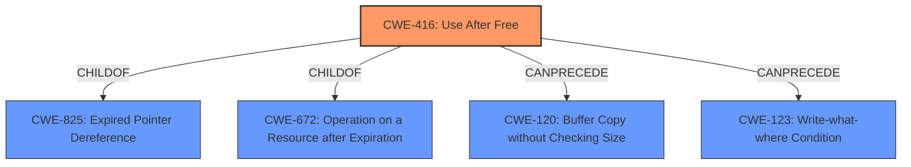

# Enhanced Analysis for CVE-2021-21204

# Summary
| CWE ID | CWE Name | Confidence | CWE Abstraction Level | CWE Vulnerability Mapping Label | CWE-Vulnerability Mapping Notes |
|---|---|---|---|---|---|
| CWE-416 | Use After Free | 1.0 | Variant | Allowed | Primary CWE |

## Evidence and Confidence

*   **Confidence Score:** 1.0
*   **Evidence Strength:** HIGH

## Relationship Analysis
The primary identified CWE is CWE-416 (**Use After Free**). This is a variant level CWE. CWE-416 has several ChildOf relationships to CWE-825 and CWE-672. CWE-416 also has CanPrecede relationships to CWE-120 and CWE-123, suggesting that **Use After Free** can lead to buffer overflows or write-what-where conditions.



## Vulnerability Chain
The vulnerability chain starts with a **Use After Free** (CWE-416), which allows a remote attacker to potentially exploit heap corruption. The vulnerability occurs in Blink in Google Chrome. The **Use After Free** (CWE-416) can potentially lead to heap corruption.

## Summary of Analysis
The vulnerability description explicitly states "**Use after free** in Blink in Google Chrome...allowed a remote attacker to potentially exploit heap corruption...". The CVE Reference Links Content Summary confirms this, stating "Root cause of vulnerability: **Use-after-free**" and "Weaknesses/vulnerabilities present: A **use-after-free** vulnerability exists in Blink/Webkit."

The primary CWE match from similar CVE descriptions is CWE-416 (**Use After Free**). The Retriever Results also list CWE-416 as the top combined result. The CWE-416 description states: "The product reuses or references memory after it has been freed." The Mapping Guidance for CWE-416 indicates a Usage of "Allowed" and a Rationale that "This CWE entry is at the Variant level of abstraction, which is a preferred level of abstraction for mapping to the root causes of vulnerabilities."

The next highest scoring CWEs in the Retriever Results were CWE-366, CWE-843, CWE-122, CWE-362, CWE-415, CWE-123, CWE-252, CWE-911 and CWE-404.
- CWE-366 (**Race Condition within a Thread**) was not selected because the description does not indicate a race condition.
- CWE-843 (**Access of Resource Using Incompatible Type ('Type Confusion')**) was not selected because the description does not describe type confusion.
- CWE-122 (**Heap-based Buffer Overflow**) was not selected because the description specifically points to a **Use After Free** not a heap overflow.
- CWE-362 (**Concurrent Execution using Shared Resource with Improper Synchronization ('Race Condition')**) was not selected because the description does not indicate a race condition.
- CWE-415 (**Double Free**) was not selected because the description does not indicate a double free.
- CWE-123 (**Write-what-where Condition**) was not selected as the primary CWE because while **Use After Free** can lead to write-what-where, the description identifies the **Use After Free** as the root cause.
- CWE-252 (**Unchecked Return Value**) was not selected because the description does not indicate an unchecked return value.
- CWE-911 (**Improper Update of Reference Count**) was not selected because the description does not indicate a problem with reference counting.
- CWE-404 (**Improper Resource Shutdown or Release**) was not selected because the description does not indicate a resource shutdown or release issue.

The choice of CWE-416 is based on the explicit mention of "**use-after-free**" in the vulnerability description and supporting evidence. This is the most specific and accurate representation of the vulnerability's root cause.


## CWE Relationship Analysis

Current CWEs represent these abstraction levels: .


### Vulnerability Chain Analysis

**Chain starting from CWE-415:**
- 415 (Double Free) - ROOT


**Chain starting from CWE-123:**
- 123 (Write-what-where Condition) - ROOT


### CWE Relationship Diagram

```mermaid
graph TD
    classDef primary fill:#f96,stroke:#333,stroke-width:2px
    classDef secondary fill:#69f,stroke:#333
    classDef tertiary fill:#9e9,stroke:#333
```