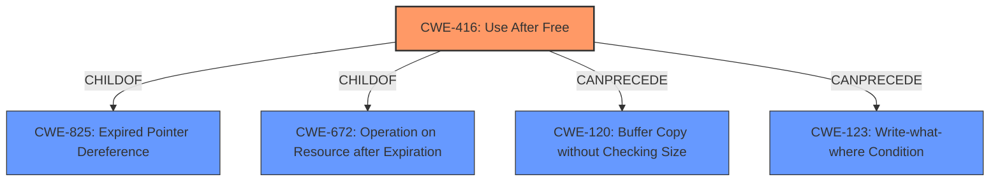

# Analysis for CVE-2021-21213

# Summary
| CWE ID | CWE Name | Confidence | CWE Abstraction Level | CWE Vulnerability Mapping Label | CWE-Vulnerability Mapping Notes |
|---|---|---|---|---|---|
| CWE-416 | Use After Free | 1.0 | Variant | Allowed | Primary CWE |

## Evidence and Confidence

*   **Confidence Score:** 1.0
*   **Evidence Strength:** HIGH

## Relationship Analysis
The primary relationship that influenced the decision was the direct match of the vulnerability description to CWE-416. The retriever results also highly ranked CWE-416.

## Vulnerability Chain
The vulnerability chain starts with a **use after free** condition which leads to heap corruption.

## Summary of Analysis
The vulnerability description clearly states a **use after free** condition in WebMIDI in Google Chrome, leading to potential heap corruption. This aligns directly with CWE-416. The "CVE Reference Links Content Summary" confirms this with:
*   "rootCause": "**Use-after-free** in the WebMIDI implementation."
*   "weaknesses": ["**Use After Free**"]

The primary CWE match from similar CVE descriptions is also CWE-416. The retriever results list CWE-416 as the top combined result.

CWE-416 is a Variant level CWE, which is a preferred level of abstraction. The mapping guidance for CWE-416 allows its usage, further solidifying its selection.

Other CWEs Considered:

*   CWE-366: Race Condition within a Thread: While concurrency might be involved, the core issue is the **use after free**, not a race condition.
*   CWE-843: Access of Resource Using Incompatible Type ('Type Confusion'): This doesn't directly describe the **use after free** condition.
*   CWE-122: Heap-based Buffer Overflow: The impact is heap corruption, but the root cause is **use after free**, not a buffer overflow.
*   CWE-415: Double Free: This is a different memory management issue than **use after free**.
*   CWE-1021: Improper Restriction of Rendered UI Layers or Frames: Irrelevant to the vulnerability description.
*   CWE-123: Write-what-where Condition: This could be a consequence of **use after free**, but is not the root cause.
*   CWE-362: Concurrent Execution using Shared Resource with Improper Synchronization ('Race Condition'): As with CWE-366, concurrency may be involved, but the core issue is the **use after free**.
*   CWE-252: Unchecked Return Value: Not applicable to this vulnerability.
*   CWE-911: Improper Update of Reference Count: Not applicable to this vulnerability.

Relevant CWE Information:

# Enhanced Context (25 CWEs)

## CWE-416: Use After Free
**Abstraction:** Variant
**Status:** Stable

### Description
The product reuses or references memory after it has been freed. At some point afterward, the memory may be allocated again and saved in another pointer, while the original pointer references a location somewhere within the new allocation. Any operations using the original pointer are no longer valid because the memory "belongs" to the code that operates on the new pointer.

### Extended Description
Not provided

### Alternative Terms
Dangling pointer: a pointer that no longer points to valid memory, often after it has been freed
UAF: commonly used acronym for Use After Free
Use-After-Free

### Relationships
ChildOf -> CWE-825
ChildOf -> CWE-672
ChildOf -> CWE-672
ChildOf -> CWE-672
CanPrecede -> CWE-120
CanPrecede -> CWE-123

### Mapping Guidance
**Usage:** Allowed
**Rationale:** This CWE entry is at the Variant level of abstraction, which is a preferred level of abstraction for mapping to the root causes of vulnerabilities.
**Comments:** Carefully read both the name and description to ensure that this mapping is an appropriate fit. Do not try to 'force' a mapping to a lower-level Base/Variant simply to comply with this preferred level of abstraction.
**Reasons:**
- Acceptable-Use