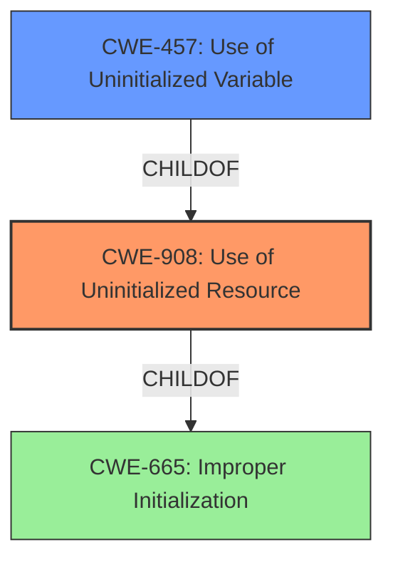

# Analysis Report for CVE-2021-21217

# Vulnerability Analysis Report: CVE-2021-21217

## Description


## Analysis (with Relationship Data)

# Summary
| CWE ID | CWE Name | Confidence | CWE Abstraction Level | CWE Vulnerability Mapping Label | CWE-Vulnerability Mapping Notes |
|---|---|---|---|---|---|
| CWE-908 | Use of Uninitialized Resource | 0.9 | Base | Allowed | Primary CWE |
| CWE-457 | Use of Uninitialized Variable | 0.7 | Variant | Allowed | Secondary Candidate |
| CWE-665 | Improper Initialization | 0.5 | Class | Discouraged | Secondary Candidate |

## Evidence and Confidence

*   **Confidence Score:** 0.9
*   **Evidence Strength:** HIGH

## Relationship Analysis
The primary CWE is CWE-908, which describes the **use of an uninitialized resource**. CWE-908 is a base level CWE. CWE-457 is a Variant of CWE-908 and describes the **use of an uninitialized variable**, which is a specific type of resource. CWE-665 is a Class level CWE that describes **improper initialization**, which is a parent of CWE-908.



## Vulnerability Chain
The vulnerability chain starts with the **lack of initialization of data** (CWE-908). This leads to the **use of uninitialized data** which in turn allows a remote attacker to obtain potentially sensitive information from process memory.

## Summary of Analysis
The vulnerability is due to the **use of uninitialized data** in PDFium. The "Vulnerability Description Key Phrases" section highlights "**uninitialized data**" as the root cause. The "CVE Reference Links Content Summary" also mentions "Use of **uninitialized** memory in the PDFium library" and "**Uninitialized** use" as weaknesses. This evidence strongly supports the selection of CWE-908 (Use of Uninitialized Resource) as the primary CWE.

CWE-908 is at the Base level of abstraction and accurately represents the weakness. While CWE-457 (Use of Uninitialized Variable) is more specific, the description refers to "data" and "memory" which are broader than just "variables," so CWE-908 is a better fit.

CWE-665 (Improper Initialization) was considered, but the description focuses on the **use** of the uninitialized resource, making CWE-908 more appropriate.

The Retriever Results also listed CWE-252 (Unchecked Return Value), CWE-416 (Use After Free), and CWE-843 (Access of Resource Using Incompatible Type ('Type Confusion')). These CWEs do not directly relate to the **use of uninitialized data**, so they were not selected.

The final selection of CWE-908 is based on the evidence from the vulnerability description, the CWE descriptions, and the relationships between the CWEs. The confidence in this selection is high.

Relevant CWE Information:


## CWE Relationship Analysis

Current CWEs represent these abstraction levels: .


### Vulnerability Chain Analysis

**Chain starting from CWE-843:**
- 843 (Access of Resource Using Incompatible Type ('Type Confusion')) - ROOT


**Chain starting from CWE-416:**
- 416 (Use After Free) - ROOT


### CWE Relationship Diagram

```mermaid
graph TD
    classDef primary fill:#f96,stroke:#333,stroke-width:2px
    classDef secondary fill:#69f,stroke:#333
    classDef tertiary fill:#9e9,stroke:#333
```


*Report generated on 2025-04-02 09:30:49*
