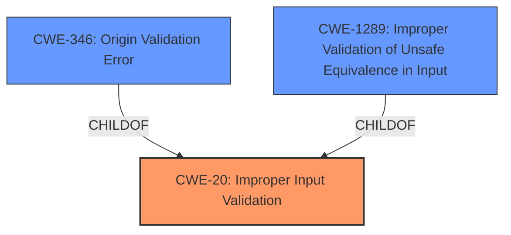

# Enhanced Analysis for CVE-2021-21221

# Summary
| CWE ID | CWE Name | Confidence | CWE Abstraction Level | CWE Vulnerability Mapping Label | CWE-Vulnerability Mapping Notes |
|---|---|---|---|---|---|
| CWE-20 | Improper Input Validation | 0.75 | Class | Primary | Discouraged, but appropriate due to lack of more specific information |
| CWE-346 | Origin Validation Error | 0.5 | Class | Secondary | Allowed-with-Review |
| CWE-1289 | Improper Validation of Unsafe Equivalence in Input | 0.4 | Base | Secondary | Allowed |

## Evidence and Confidence

*   **Confidence Score:** 0.7
*   **Evidence Strength:** MEDIUM

## Relationship Analysis
The primary CWE is CWE-20, a class-level weakness indicating a general failure to validate input. CWE-346 (Origin Validation Error) and CWE-1289 (Improper Validation of Unsafe Equivalence in Input) are more specific potential weaknesses related to origin validation. The relationship between CWE-20 and these more specific CWEs is ChildOf relationship. However, the provided information is not detailed enough to confirm which of these child CWEs is the best fit, so I'm sticking with the parent.



## Vulnerability Chain
The chain starts with **insufficient validation of untrusted input** (root cause), leading to the potential to leak cross-origin data (impact).

## Summary of Analysis
The initial assessment identified **insufficient validation of untrusted input** as the root cause, pointing towards CWE-20. The CVE Reference Links Content Summary further supports this by explicitly mentioning "Insufficient input validation" as a weakness.

The retriever results suggested several CWEs, including CWE-670, CWE-416, CWE-346, and CWE-451. While CWE-346 (Origin Validation Error) seemed relevant, the description lacked specific details to confirm it. CWE-416 (Use After Free) and CWE-451 (User Interface Misrepresentation of Critical Information) were less relevant to the described vulnerability.

The final decision is to assign CWE-20 as the primary weakness due to the direct evidence of **insufficient input validation**. The other considered CWEs either require more specific information that isn't available in the description or are less directly related to the root cause. While CWE-20 is discouraged, it fits due to the lack of more specific information. CWE-346 and CWE-1289 are considered secondary because the vulnerability involves leaking cross-origin data, suggesting a potential origin validation issue, but further investigation is needed.

The selected CWEs are at an appropriate level of specificity given the available information. More detailed information about the exact nature of the **insufficient validation** would allow for a more specific CWE to be assigned.

Relevant CWE Information:

# Enhanced Context (25 CWEs)

## CWE-1289: Improper Validation of Unsafe Equivalence in Input
**Abstraction Level**: Base
**Similarity Score**: 0.77
**Source**: dense

**Description**:
The product receives an input value that is used as a resource identifier or other type of reference, but it does not validate or incorrectly validates that the input is equivalent to a potentially-unsafe value.

**Mapping Guidance**:
- Usage: Allowed
- Rationale: This CWE entry is at the Base level of abstraction, which is a preferred level of abstraction for mapping to the root causes of vulnerabilities.

## CWE-20: Improper Input Validation
**Abstraction Level**: Class
**Similarity Score**: 2.98
**Source**: graph

**Description**:
CWE-20: Improper Input Validation

**Mapping Guidance**:
- Usage: Discouraged
- Rationale: CWE-20 is commonly misused in low-information vulnerability reports when lower-level CWEs could be used instead, or when more details about the vulnerability are available [REF-1287]. It is not useful for trend analysis. It is also a level-1 Class (i.e., a child of a Pillar).

**Relationships**:
- CHILDOF -> CWE-707
- PEEROF -> CWE-345
- CANPRECEDE -> CWE-22
- CANPRECEDE -> CWE-41
- CANPRECEDE -> CWE-74

## CWE-346: Origin Validation Error
**Abstraction Level**: Class
**Similarity Score**: 5911.78
**Source**: sparse

**Description**:
The product does not properly verify that the source of data or communication is valid.

**Mapping Guidance**:
- Usage: Allowed-with-Review
- Rationale: This CWE entry is a Class and might have Base-level children that would be more appropriate

### Technical Explanation for CWE-20:
The vulnerability description explicitly states "**Insufficient validation of untrusted input**". CWE-20 (Improper Input Validation) directly addresses this weakness, where the software fails to adequately validate input, leading to potential security vulnerabilities. The security implication is that a malicious actor can craft input that bypasses the intended validation mechanisms, leading to unintended or harmful behavior.

While CWE-20 is a Class-level CWE and is generally discouraged when more specific CWEs are available, in this case, the provided information lacks the detail necessary to pinpoint a more precise weakness. Therefore, CWE-20 serves as the most appropriate initial classification.

### Technical Explanation for CWE-346:
The vulnerability results in a leak of cross-origin data, which suggests that origin validation might be a contributing factor. CWE-346 (Origin Validation Error) describes situations where a product does not properly verify the source of data or communication. The security implication is that an attacker could potentially spoof the origin of a request, gaining unauthorized access to resources or data.

CWE-346 is considered a secondary candidate because the description doesn't explicitly mention origin validation failures, but the impact (cross-origin data leak) strongly suggests it as a possible contributing factor. As a Class-level CWE, a more specific child CWE might be more appropriate if more information was available.

### Technical Explanation for CWE-1289:
CWE-1289 (Improper Validation of Unsafe Equivalence in Input) is another potential child of CWE-20 where the input is not validated to confirm it is not equivalent to a potentially unsafe value. It is similar to CWE-346, but could be more appropriate if the origin is being improperly compared.

### Considered but not used:
*   CWE-670: Always-Incorrect Control Flow Implementation: This CWE doesn't fit the description, as the issue is related to input validation rather than incorrect control flow.
*   CWE-416: Use After Free: There's no mention of memory being freed and then reused, so this CWE is not relevant.
*   CWE-451: User Interface (UI) Misrepresentation of Critical Information: This CWE is related to UI misrepresentation, which is not mentioned in the vulnerability description.
*   CWE-116: Improper Encoding or Escaping of Output: The vulnerability is about **insufficient input validation**, not output encoding.
*   CWE-1385: Missing Origin Validation in WebSockets: Although the cross-origin data leak hints towards origin validation, there is no mention of WebSockets.
*   CWE-123: Write-what-where Condition: There's no indication of an arbitrary write condition.
*   CWE-843: Access of Resource Using Incompatible Type ('Type Confusion'): The description doesn't suggest type confusion.
*   CWE-356: Product UI does not Warn User of Unsafe Actions: This is not related to the vulnerability description.
*   CWE-122: Heap-based Buffer Overflow: No buffer overflow mentioned in the description.
*   CWE-191: Integer Underflow (Wrap or Wraparound): No integer underflow mentioned in the description.
*   CWE-131: Incorrect Calculation of Buffer Size: No indication this is present.
*   CWE-125: Out-of-bounds Read: No out-of-bounds read mentioned in the description.
*   CWE-404: Improper Resource Shutdown or Release: No improper resource shutdown mentioned in the description.
*   CWE-789: Memory Allocation with Excessive Size Value: No mention of memory allocation issues.
*   CWE-667: Improper Locking: No issues with locking mentioned in the description.
*   CWE-226: Sensitive Information in Resource Not Removed Before Reuse: No mention


## CWE Relationship Analysis

Current CWEs represent these abstraction levels: .


### Vulnerability Chain Analysis

**Chain starting from CWE-123:**
- 123 (Write-what-where Condition) - ROOT


**Chain starting from CWE-404:**
- 404 (Improper Resource Shutdown or Release) - ROOT


### CWE Relationship Diagram

```mermaid
graph TD
    classDef primary fill:#f96,stroke:#333,stroke-width:2px
    classDef secondary fill:#69f,stroke:#333
    classDef tertiary fill:#9e9,stroke:#333
```