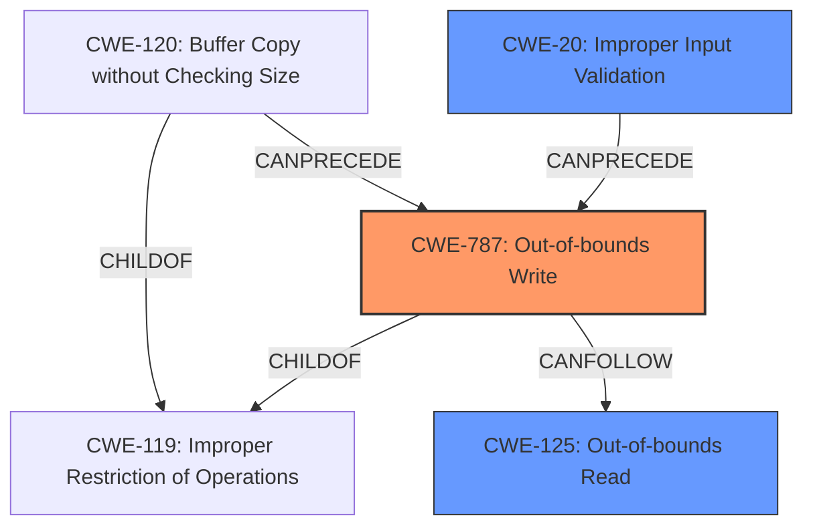

# Analysis for CVE-2021-21227

# Summary
| CWE ID | CWE Name | Confidence | CWE Abstraction Level | CWE Vulnerability Mapping Label | CWE-Vulnerability Mapping Notes |
|---|---|---|---|---|---|
| CWE-787 | Out-of-bounds Write | 1.0 | Base | Primary | Allowed |
| CWE-125 | Out-of-bounds Read | 0.5 | Base | Secondary | Allowed |
| CWE-20 | Improper Input Validation | 0.3 | Class | Secondary | Discouraged |

## Evidence and Confidence

*   **Confidence Score:** 0.8
*   **Evidence Strength:** HIGH

## Relationship Analysis
The primary CWE selected is CWE-787 (**Out-of-bounds Write**) which is a **Base** level CWE. The vulnerability description mentions "**insufficient data validation**" leading to "heap corruption". Out-of-bounds Write is a direct consequence of insufficient validation and can lead to heap corruption.

CWE-787 is related to other CWEs through hierarchical and chain relationships:
*   CWE-787 is a ChildOf CWE-119 (**Improper Restriction of Operations within the Bounds of a Memory Buffer**).
*   CWE-120 (**Buffer Copy without Checking Size of Input ('Classic Buffer Overflow')**) is also a ChildOf CWE-119 and CANPRECEDE CWE-787.

These relationships suggest that a buffer overflow (CWE-120) due to missing size checks can lead to an out-of-bounds write (CWE-787), ultimately causing memory corruption. In addition, if an attacker is able to read out-of-bounds due to **insufficient data validation**, this may lead to further exploitation.

## Vulnerability Chain
The vulnerability chain starts with **insufficient data validation** which is exploited through a crafted HTML page. This **insufficient data validation** leads to an out-of-bounds write, causing heap corruption. The full chain of the vulnerability is:

1.  **Insufficient Data Validation** (Root Cause)
2.  **Out-of-bounds Write** (Primary Weakness)
3.  **Heap Corruption** (Impact)

## Summary of Analysis
The analysis is based on the provided evidence, particularly the "Vulnerability Description Key Phrases" and "CVE Reference Links Content Summary". The key phrase "**insufficient data validation**" is the root cause, which is then chained to "heap corruption" via the "out-of-bounds write".

The relationship graph shows how CWE-787 is related to other CWEs such as CWE-119 (its parent), CWE-120 (which can precede it), and CWE-125 (which can follow it). The retriever also suggest CWE-20, which is often associated with memory corruption issues.

CWE-787 is chosen as the primary CWE because it accurately reflects the direct cause of heap corruption. The **insufficient data validation** is the root cause for the **out-of-bounds write**. CWE-787 is at the optimal level of specificity as it is a **Base** level CWE and directly describes the weakness that leads to the impact.

Relevant CWE Information:

# Enhanced Context (25 CWEs)
## CWE-1289: Improper Validation of Unsafe Equivalence in Input
This CWE was not selected because the description doesn't fit the vulnerability description.

## CWE-838: Inappropriate Encoding for Output Context
This CWE was not selected because the description doesn't fit the vulnerability description.

## CWE-184: Incomplete List of Disallowed Inputs
This CWE was not selected because the description doesn't fit the vulnerability description.

## CWE-138: Improper Neutralization of Special Elements
This CWE was not selected because the description doesn't fit the vulnerability description.

## CWE-173: Improper Handling of Alternate Encoding
This CWE was not selected because the description doesn't fit the vulnerability description.

## CWE-116: Improper Encoding or Escaping of Output
This CWE was not selected because the description doesn't fit the vulnerability description.

## CWE-807: Reliance on Untrusted Inputs in a Security Decision
This CWE was not selected because the description doesn't fit the vulnerability description.

## CWE-115: Misinterpretation of Input
This CWE was not selected because the description doesn't fit the vulnerability description.

## CWE-74: Improper Neutralization of Special Elements in Output Used by a Downstream Component ('Injection')
This CWE was not selected because the description doesn't fit the vulnerability description.

## CWE-451: User Interface (UI) Misrepresentation of Critical Information
This CWE was not selected because the description doesn't fit the vulnerability description.

## CWE-190: Integer Overflow or Wraparound
This CWE was not selected because the description doesn't fit the vulnerability description.

## CWE-125: Out-of-bounds Read
CWE-125 (**Out-of-bounds Read**) was considered because **insufficient data validation** could lead to reading beyond buffer limits. This is marked as secondary with a confidence score of 0.5 because the primary description focuses on "heap corruption" which is usually caused by a write.

## CWE-1284: Improper Validation of Specified Quantity in Input
This CWE was not selected because the description doesn't fit the vulnerability description.

## CWE-843: Access of Resource Using Incompatible Type ('Type Confusion')
This CWE was not selected because the description doesn't fit the vulnerability description.

## CWE-123: Write-what-where Condition
This CWE was not selected because the description doesn't fit the vulnerability description.

## CWE-416: Use After Free
This CWE was not selected because the description doesn't fit the vulnerability description.

## CWE-787: Out-of-bounds Write
CWE-787 (**Out-of-bounds Write**) is selected as the primary CWE because it accurately represents the weakness described in the vulnerability. The description mentions "**insufficient data validation**" leading to "heap corruption". Out-of-bounds Write is a direct consequence of insufficient validation and can lead to heap corruption.

## CWE-825: Expired Pointer Dereference
This CWE was not selected because the description doesn't fit the vulnerability description.

## CWE-120: Buffer Copy without Checking Size of Input ('Classic Buffer Overflow')
This CWE was not selected because the description doesn't fit the vulnerability description.

## CWE-190: Integer Overflow or Wraparound
This CWE was not selected because the description doesn't fit the vulnerability description.

## CWE-170: Improper Null Termination
This CWE was not selected because the description doesn't fit the vulnerability description.

## CWE-22: Improper Limitation of a Pathname to a Restricted Directory ('Path Traversal')
This CWE was not selected because the description doesn't fit the vulnerability description.

## CWE-20: Improper Input Validation
CWE-20 (**Improper Input Validation**) was considered because the vulnerability description explicitly mentions "**insufficient data validation**". However, CWE-20 is a Class-level CWE and the guidance discourages its use when more specific CWEs are available. Since the **insufficient data validation** leads to an "out-of-bounds write", CWE-787 is the more specific and appropriate choice. Therefore, CWE-20 is marked as a secondary candidate with a low confidence score of 0.3.