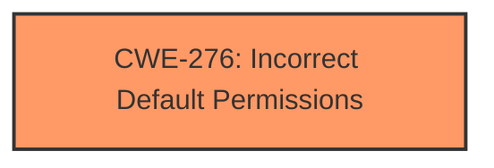

# Enhanced Analysis for CVE-2021-21228

# Summary
| CWE ID    | CWE Name                                                        | Confidence | CWE Abstraction Level | CWE Vulnerability Mapping Label | CWE-Vulnerability Mapping Notes |
| :-------- | :-------------------------------------------------------------- | :--------- | :---------------------- | :------------------------------ | :------------------------------ |
| CWE-276   | Incorrect Default Permissions                                   | 0.75       | Base                    | Primary CWE                     | Allowed                       |

## Evidence and Confidence

*   **Confidence Score:** 0.75
*   **Evidence Strength:** MEDIUM

## Relationship Analysis

The primary CWE selected is CWE-276, which indicates that the system does not properly set up file permissions to properly control access to resources. There are no strong parent-child or chain relationships influencing this selection based on the provided information.



## Vulnerability Chain

The vulnerability chain starts with the **insufficient policy enforcement** (root cause), leading to the ability to bypass navigation restrictions (impact). The extensions in Google Chrome did not properly restrict actions, allowing an attacker to bypass intended security measures.

## Summary of Analysis

The initial analysis considered the provided information, specifically focusing on the root cause "**insufficient policy enforcement**." The CVE description clearly indicates a failure in enforcing the intended security policies within the Chrome extensions, leading to unauthorized actions.

The primary CWE match from the provided data is CWE-NVD-noinfo, but this is not an actual CWE. The top CWEs listed for similar CVE descriptions include CWE-276 (Incorrect Default Permissions) and CWE-20 (Improper Input Validation). The retriever results suggest several potential CWEs such as CWE-451 (User Interface (UI) Misrepresentation of Critical Information), CWE-416 (Use After Free), and CWE-356 (Product UI does not Warn User of Unsafe Actions), but these do not accurately represent the root cause of the **insufficient policy enforcement**.

Based on the details of the vulnerability, CWE-276 (Incorrect Default Permissions) seems the most appropriate, as the **insufficient policy enforcement** can be seen as a failure to properly configure the default permissions or restrictions for the extensions.

The selection of CWE-276 is primarily based on the **root cause** specified in the vulnerability description and the understanding that the core issue lies in how permissions are configured and enforced. The confidence score is 0.75 because, while the information points towards a permission-related issue, the exact mechanism of how the policy enforcement failed is not thoroughly detailed.

Relevant CWE Information:

# Enhanced Context (25 CWEs)

## CWE-276: Incorrect Default Permissions
**Abstraction Level**: Base
**Similarity Score**: N/A from retriever, but relevant based on analysis.

**Description**:
The software, when creating a new file or directory, sets default permissions that are more permissive than intended, allowing unintended users to read or modify the file.

**Mapping Guidance**:
- Usage: Allowed
- Rationale: This CWE entry is at the Base level of abstraction, which is a preferred level of abstraction for mapping to the root causes of vulnerabilities.


## CWE Relationship Analysis

Current CWEs represent these abstraction levels: .


### Vulnerability Chain Analysis

**Chain starting from CWE-416:**
- 416 (Use After Free) - ROOT


**Chain starting from CWE-356:**
- 356 (Product UI does not Warn User of Unsafe Actions) - ROOT


### CWE Relationship Diagram

```mermaid
graph TD
    classDef primary fill:#f96,stroke:#333,stroke-width:2px
    classDef secondary fill:#69f,stroke:#333
    classDef tertiary fill:#9e9,stroke:#333
```