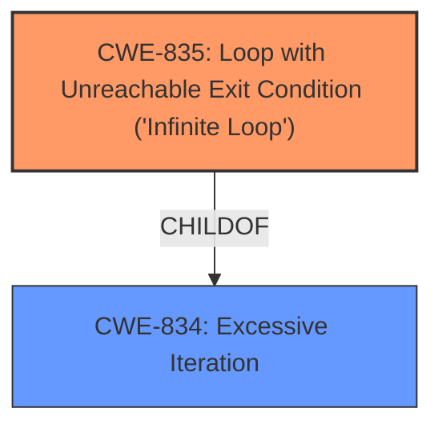

# Analysis for CVE-2021-21235

# Summary
| CWE ID | CWE Name | Confidence | CWE Abstraction Level | CWE Vulnerability Mapping Label | CWE-Vulnerability Mapping Notes |
|---|---|---|---|---|---|
| CWE-835 | Loop with Unreachable Exit Condition ('Infinite Loop') | 1.0 | Base | Allowed | Primary CWE |

## Evidence and Confidence

*   **Confidence Score:** 1.0
*   **Evidence Strength:** HIGH

## Relationship Analysis
The primary relationship impacting the CWE selection is the ChildOf relationship between CWE-835 and CWE-834 (Excessive Iteration). While CWE-834 is a broader class, CWE-835 specifically addresses loops with unreachable exit conditions, which directly aligns with the vulnerability description of an "infinite loop".

## Vulnerability Chain
The vulnerability chain consists of the following:
1.  Crafted PNG file (attack vector)
2.  Improper handling in `Reader::read_from_container` (root cause)
3.  **Infinite Loop** (CWE-835)
4.  Denial-of-Service (impact)

## Summary of Analysis
The initial analysis, based on the vulnerability description and CVE details, strongly points to CWE-835 (Loop with Unreachable Exit Condition ('Infinite Loop')). The description explicitly mentions "infinite loop", which is the core of CWE-835. The CVE Reference Links Content Summary confirms that the root cause is an infinite loop in `Reader::read_from_container` when parsing a crafted PNG file.

The retriever results also list CWE-835 as the top candidate.

The evidence supporting this classification is strong:
*   "**infinite loop** in parsing crafted PNG files" (Vulnerability Description)
*   "`Reader::read_from_container` can cause an **infinite loop** when a crafted PNG file is given." (Vulnerability Description)
*   "The vulnerability stems from an infinite loop within the `Reader::read_from_container` function when processing a specially crafted PNG file." (CVE Reference Links Content Summary)
*   "The `Reader::read_from_container` function lacks proper bounds checking or logic to prevent infinite loops." (CVE Reference Links Content Summary)

CWE-835 is at the Base level of abstraction, which is the preferred level, and accurately describes the vulnerability.

Other CWEs Considered:
*   CWE-834 (Excessive Iteration): While related, it's a broader category. CWE-835 is more specific to an infinite loop.
*   CWE-674 (Uncontrolled Recursion): Although recursion *could* be present, the description explicitly mentions an "infinite loop," making CWE-835 a better fit.
*   CWE-789 (Memory Allocation with Excessive Size Value): Not relevant as the vulnerability doesn't appear to involve excessive memory allocation directly causing the infinite loop, but rather a logical error that causes the loop to never terminate.
*   CWE-1322 (Use of Blocking Code in Single-threaded, Non-blocking Context): This is not relevant because the vulnerability description doesn't mention anything about blocking code or a single-threaded, non-blocking context.

The final selection of CWE-835 is based on the explicit mention of an "infinite loop" in the vulnerability description and the confirmation in the CVE summary, making it the most accurate and specific classification.