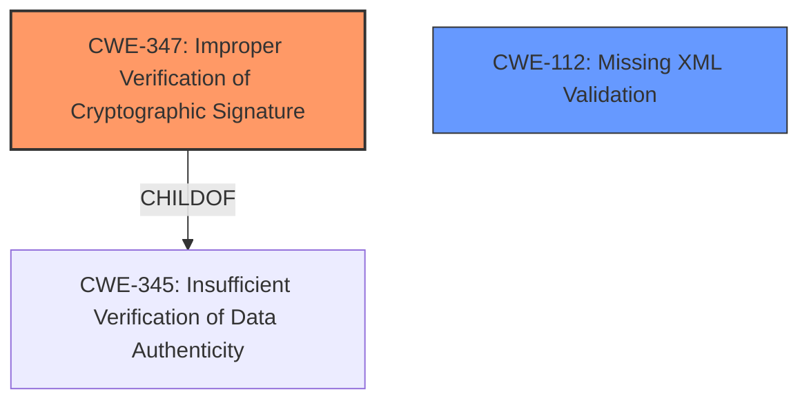

# Analysis Report for CVE-2021-21238

# Vulnerability Analysis Report: CVE-2021-21238

## Description


## Analysis (with Relationship Data)

# Summary
| CWE ID  | CWE Name                                                        | Confidence | CWE Abstraction Level | CWE Vulnerability Mapping Label | CWE-Vulnerability Mapping Notes |
| :-------- | :-------------------------------------------------------------- | :--------- | :---------------------- | :------------------------------ | :------------------------------ |
| CWE-347 | Improper Verification of Cryptographic Signature                               | 1.0      | Base                    | Primary                         | Allowed                       |
| CWE-112 | Missing XML Validation                                     | 0.75      | Base                    | Secondary                       | Allowed                       |

## Evidence and Confidence

*   **Confidence Score:** 0.9
*   **Evidence Strength:** HIGH

## Relationship Analysis
The primary weakness is CWE-347, which falls under the broader class CWE-345 (Insufficient Verification of Data Authenticity). CWE-112 (Missing XML Validation) is also linked as a contributing factor, since the lack of XML validation allows the **improper verification of cryptographic signatures**. Both CWE-347 and CWE-112 are at the Base level, providing an appropriate level of detail.



## Vulnerability Chain
The vulnerability chain starts with the **missing XML validation** (CWE-112), which leads to the **improper verification of the cryptographic signature** (CWE-347). This allows an attacker to bypass signature checks and potentially execute malicious code or gain unauthorized access.

## Summary of Analysis
Based on the vulnerability description and the provided information, the primary CWE is CWE-347 (**Improper Verification of Cryptographic Signature**). The vulnerability lies in the fact that PySAML2 does not properly verify the cryptographic signature of SAML documents. Specifically, it fails to validate the SAML document against an XML schema, leading to XML Signature Wrapping attacks.

Supporting Evidence:
- Vulnerability Description Key Phrases: "**rootcause:** **improper verification of cryptographic signature**"
- CVE Reference Links Content Summary: "The root cause lies in the lack of XML schema validation in `pysaml2` when processing SAML documents."
- CVE Reference Links Content Summary: "The primary vulnerability is the absence of proper XML schema validation before signature verification."

The secondary CWE is CWE-112 (**Missing XML Validation**), because the lack of XML validation is a prerequisite for the **improper verification of the cryptographic signature**.

CWE-190 (Integer Overflow or Wraparound), CWE-611 (Improper Restriction of XML External Entity Reference), CWE-328 (Use of Weak Hash), and CWE-345 (Insufficient Verification of Data Authenticity) were considered but deemed less relevant. CWE-190 is not relevant as there is no evidence of integer overflow. CWE-611 is not directly applicable because the vulnerability is not specifically related to external entity injection, but rather the overall lack of XML schema validation. CWE-328 is not relevant as there is no use of weak hashes involved. CWE-345 is a parent of CWE-347, but CWE-347 is more specific to the vulnerability.


## CWE Relationship Analysis

Current CWEs represent these abstraction levels: .


### Vulnerability Chain Analysis

**Chain starting from CWE-345:**
- 345 (Insufficient Verification of Data Authenticity) - ROOT


**Chain starting from CWE-190:**
- 190 (Integer Overflow or Wraparound) - ROOT


### CWE Relationship Diagram

```mermaid
graph TD
    classDef primary fill:#f96,stroke:#333,stroke-width:2px
    classDef secondary fill:#69f,stroke:#333
    classDef tertiary fill:#9e9,stroke:#333
```


*Report generated on 2025-04-02 04:40:05*
