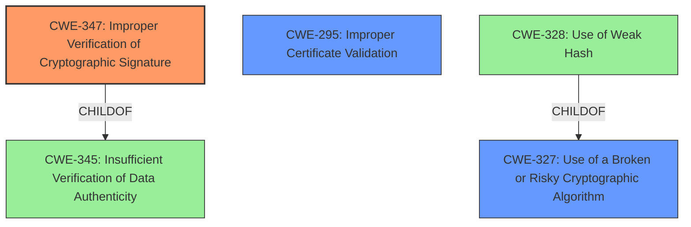

# Analysis Report for CVE-2021-21239

# Vulnerability Analysis Report: CVE-2021-21239

## Description


## Analysis (with Relationship Data)

# Summary
| CWE ID  | CWE Name                                                    | Confidence | CWE Abstraction Level | CWE Vulnerability Mapping Label | CWE-Vulnerability Mapping Notes |
| :-------- | :---------------------------------------------------------- | :--------- | :-------------------- | :------------------------------ | :------------------------------ |
| CWE-347   | Improper Verification of Cryptographic Signature          | 1          | Base                  | Allowed                       | Primary CWE                     |
| CWE-295   | Improper Certificate Validation                           | 0.7        | Base                  | Allowed                       | Secondary Candidate             |
| CWE-327   | Use of a Broken or Risky Cryptographic Algorithm          | 0.6        | Class                 | Allowed-with-Review           | Secondary Candidate             |

## Evidence and Confidence

*   **Confidence Score:** 0.8
*   **Evidence Strength:** HIGH

## Relationship Analysis

The primary CWE, CWE-347 (Improper Verification of Cryptographic Signature), is a base-level CWE that directly addresses the **improper verification of cryptographic signature** identified in the vulnerability description. CWE-347 is a child of CWE-345 (Insufficient Verification of Data Authenticity). CWE-295 (Improper Certificate Validation) is a peer of CWE-322 (Key Exchange without Entity Authentication). CWE-327 (Use of a Broken or Risky Cryptographic Algorithm) is a class-level CWE and parent to CWE-328 (Use of Weak Hash) as well as other cryptographic algorithm weaknesses. The relationships informed the decision to prioritize the base-level CWE-347, as it is more specific than the class-level CWE-327.



## Vulnerability Chain

The vulnerability chain starts with the **improper verification of cryptographic signature** in PySAML2. This leads to the acceptance of SAML documents that are not correctly signed, potentially due to the insecure default configuration of the underlying `xmlsec1` library. The final impact is an authentication bypass, where an attacker can impersonate a legitimate user.

## Summary of Analysis

The initial analysis focused on identifying the root cause of the vulnerability, which is the **improper verification of cryptographic signatures**. The vulnerability description and CVE Reference Links Content Summary provide strong evidence for this. The selection of CWE-347 is based on the vulnerability description, which explicitly states "**improper verification of cryptographic signature**" as the root cause.

The evidence from the CVE Reference Links Content Summary states:
"The vulnerability stems from the `xmlsec1` library's default behavior of accepting any key type for signature verification, instead of strictly adhering to X.509 certificates. `pysaml2` uses `xmlsec1` for SAML signature verification but does not explicitly enforce the use of X.509 certificates."

The graph relationships helped prioritize CWE-347 as the primary CWE because it is a base-level CWE directly addressing the identified weakness, providing a more specific classification than higher-level CWEs like CWE-327 (Use of a Broken or Risky Cryptographic Algorithm) or CWE-345 (Insufficient Verification of Data Authenticity). While CWE-295 (Improper Certificate Validation) was considered, the issue is broader than just certificate validation, encompassing the overall signature verification process.

The selected CWEs are at the optimal level of specificity because they accurately represent the root cause and contributing factors to the vulnerability, based on the provided evidence.

Relevant CWE Information:

# Enhanced Context (25 CWEs)

## CWE-297: Improper Validation of Certificate with Host Mismatch
**Abstraction Level**: Variant
**Similarity Score**: 0.79
**Source**: dense

**Description**:
The product communicates with a host that provides a certificate, but the product does not properly ensure that the certificate is actually associated with that host.

**Mapping Guidance**:
- Usage: Allowed
- Rationale: This CWE entry is at the Variant level of abstraction, which is a preferred level of abstraction for mapping to the root causes of vulnerabilities.

## CWE-345: Insufficient Verification of Data Authenticity
**Abstraction Level**: Class
**Similarity Score**: 0.78
**Source**: dense

**Description**:
The product does not sufficiently verify the origin or authenticity of data, in a way that causes it to accept invalid data.

**Mapping Guidance**:
- Usage: Discouraged
- Rationale: This CWE entry is a level-1 Class (i.e., a child of a Pillar). It might have lower-level children that would be more appropriate

## CWE-295: Improper Certificate Validation
**Abstraction Level**: Base
**Similarity Score**: 0.78
**Source**: dense

**Description**:
The product does not validate, or incorrectly validates, a certificate.

**Mapping Guidance**:
- Usage: Allowed
- Rationale: This CWE entry is at the Base level of abstraction, which is a preferred level of abstraction for mapping to the root causes of vulnerabilities.

## CWE-1289: Improper Validation of Unsafe Equivalence in Input
**Abstraction Level**: Base
**Similarity Score**: 0.77
**Source**: dense

**Description**:
The product receives an input value that is used as a resource identifier or other type of reference, but it does not validate or incorrectly validates that the input is equivalent to a potentially-unsafe value.

**Mapping Guidance**:
- Usage: Allowed
- Rationale: This CWE entry is at the Base level of abstraction, which is a preferred level of abstraction for mapping to the root causes of vulnerabilities.

## CWE-347: Improper Verification of Cryptographic Signature
**Abstraction Level**: Base
**Similarity Score**: 0.77
**Source**: dense

**Description**:
The product does not verify, or incorrectly verifies, the cryptographic signature for data.

**Mapping Guidance**:
- Usage: Allowed
- Rationale: This CWE entry is at the Base level of abstraction, which is a preferred level of abstraction for mapping to the root causes of vulnerabilities.

## CWE-303: Incorrect Implementation of Authentication Algorithm
**Abstraction Level**: Base
**Similarity Score**: 0.76
**Source**: dense

**Description**:
The requirements for the product dictate the use of an established authentication algorithm, but the implementation of the algorithm is incorrect.

**Mapping Guidance**:
- Usage: Allowed
- Rationale: This CWE entry is at the Base level of abstraction, which is a preferred level of abstraction for mapping to the root causes of vulnerabilities.

## CWE-203: Observable Discrepancy
**Abstraction Level**: Base
**Similarity Score**: 0.75
**Source**: dense

**Description**:
The product behaves differently or sends different responses under different circumstances in a way that is observable to an unauthorized actor, which exposes security-relevant information about the state of the product, such as whether a particular operation was successful or not.

**Mapping Guidance**:
- Usage: Allowed
- Rationale: This CWE entry is at the Base level of abstraction, which is a preferred level of abstraction for mapping to the root causes of vulnerabilities.

## CWE-1391: Use of Weak Credentials
**Abstraction Level**: Class
**Similarity Score**: 0.75
**Source**: dense

**Description**:
The product uses weak credentials (such as a default key or hard-coded password) that can be calculated, derived, reused, or guessed by an attacker.

**Mapping Guidance**:
- Usage: Allowed-with-Review
- Rationale: This CWE entry is a Class and might have Base-level children that would be more appropriate

## CWE-668: Exposure of Resource to Wrong Sphere
**Abstraction Level**: Class
**Similarity Score**: 0.75
**Source**: dense

**Description**:
The product exposes a resource to the wrong control sphere, providing unintended actors with inappropriate access to the resource.

**Mapping Guidance**:
- Usage: Discouraged
- Rationale: CWE-668 is high-level and is often misused as a catch-all when lower-level CWE IDs might be applicable. It is sometimes used for low-information vulnerability reports [REF-1287]. It is a level-1 Class (i.e., a child of a Pillar). It is not useful for trend analysis.

## CWE-807: Reliance on Untrusted Inputs in a Security Decision
**Abstraction Level**: Base


## CWE Relationship Analysis

Current CWEs represent these abstraction levels: .


### Vulnerability Chain Analysis

**Chain starting from CWE-303:**
- 303 (Incorrect Implementation of Authentication Algorithm) - ROOT


**Chain starting from CWE-297:**
- 297 (Improper Validation of Certificate with Host Mismatch) - ROOT


### CWE Relationship Diagram

```mermaid
graph TD
    classDef primary fill:#f96,stroke:#333,stroke-width:2px
    classDef secondary fill:#69f,stroke:#333
    classDef tertiary fill:#9e9,stroke:#333
```


*Report generated on 2025-04-01 18:21:21*
