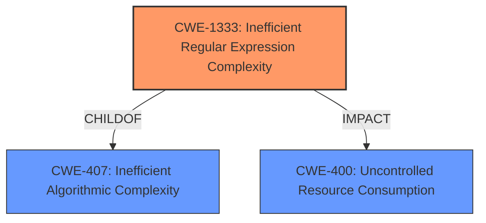

# Enhanced Analysis for CVE-2021-21240

# Summary
| CWE ID    | CWE Name                                                         | Confidence | CWE Abstraction Level | CWE Vulnerability Mapping Label | CWE-Vulnerability Mapping Notes |
| :--------- | :--------------------------------------------------------------- | :--------- | :---------------------- | :------------------------------ | :------------------------------ |
| CWE-1333  | Inefficient Regular Expression Complexity                        | 1.0        | Base                    | Primary                         | Allowed                       |
| CWE-400   | Uncontrolled Resource Consumption                                | 0.7        | Class                   | Secondary                       | Discouraged                     |

## Evidence and Confidence

*   **Confidence Score:** 0.9
*   **Evidence Strength:** HIGH

## Relationship Analysis
The primary CWE selected is CWE-1333, which is a child of CWE-407 (Inefficient Algorithmic Complexity), indicating a specific type of algorithmic inefficiency related to regular expressions. CWE-407 is a Class-level CWE, while CWE-1333 is a Base-level CWE, providing more specific details about the vulnerability. CWE-1333 is also related to CWE-400 (Uncontrolled Resource Consumption) as the inefficient regular expression leads to excessive CPU consumption, which can exhaust system resources.



## Vulnerability Chain
The vulnerability chain starts with the use of an inefficient regular expression (CWE-1333) in the httplib2 library. This regular expression, when processing a long series of `\xa0` characters in the `www-authenticate` header, exhibits cubic complexity, leading to excessive CPU consumption. The final impact is a denial-of-service (DoS) condition (CWE-400) on the client side.

## Summary of Analysis
The analysis indicates that the primary vulnerability is due to an **inefficient regular expression** that leads to a denial-of-service. The evidence for this includes:

*   The vulnerability description stating that a "malicious server which responds with long series of \xa0 characters in the www-authenticate header may cause Denial of Service (CPU burn while parsing header)."
*   The CVE reference links content summary, which notes that "The vulnerability stems from a regular expression used to parse authentication headers, specifically the `www-authenticate` header. The regex, named `WWW_AUTH_RELAXED`, exhibited cubic complexity when processing strings with many non-breaking space characters (`\xa0`). This caused a denial-of-service (DoS) condition due to excessive CPU consumption."
*   The CVE reference also states, "The core vulnerability is a poorly written regular expression that is susceptible to catastrophic backtracking."

Based on this evidence, CWE-1333 (Inefficient Regular Expression Complexity) is the most appropriate primary CWE. The retriever results also list CWE-1333 as the top result with a similarity score of 0.163.

CWE-400 (Uncontrolled Resource Consumption) is considered as a secondary CWE since the **inefficient regular expression** leads to excessive CPU consumption and denial of service. While it accurately describes the impact of the vulnerability, it is less specific than CWE-1333, which identifies the root cause.

CWE-789 (Memory Allocation with Excessive Size Value) was considered but not selected as the primary CWE because the vulnerability primarily involves CPU consumption rather than memory allocation. Although excessive CPU usage can indirectly lead to memory issues, the primary issue is the inefficient regular expression.

CWE-113 (Improper Neutralization of CRLF Sequences in HTTP Headers ('HTTP Request/Response Splitting')) and CWE-444 (Inconsistent Interpretation of HTTP Requests ('HTTP Request/Response Smuggling')) were also considered but not selected as the primary CWE because the vulnerability does not involve CRLF injection or HTTP request smuggling. The issue is specifically related to the inefficient regular expression used for parsing the `www-authenticate` header.

CWE-20 (Improper Input Validation) was also considered, but this is a very broad class, and the specific weakness is the inefficient regular expression.

The selected CWEs are at the optimal level of specificity because CWE-1333 directly identifies the root cause of the vulnerability, while CWE-400 describes the resulting impact.

Relevant CWE Information:

# Enhanced Context (25 CWEs)
The following CWEs were identified as potentially relevant to this vulnerability:

## CWE-1289: Improper Validation of Unsafe Equivalence in Input
**Abstraction Level**: Base
**Similarity Score**: 0.79
**Source**: dense

**Description**:
The product receives an input value that is used as a resource identifier or other type of reference, but it does not validate or incorrectly validates that the input is equivalent to a potentially-unsafe value.

**Mapping Guidance**:
- Usage: Allowed
- Rationale: This CWE entry is at the Base level of abstraction, which is a preferred level of abstraction for mapping to the root causes of vulnerabilities.

## CWE-113: Improper Neutralization of CRLF Sequences in HTTP Headers ('HTTP Request/Response Splitting')
**Abstraction Level**: Variant
**Similarity Score**: 0.75
**Source**: dense

**Description**:
The product receives data from an HTTP agent/component (e.g., web server, proxy, browser, etc.), but it does not neutralize or incorrectly neutralizes CR and LF characters before the data is included in outgoing HTTP headers.

**Mapping Guidance**:
- Usage: Allowed
- Rationale: This CWE entry is at the Variant level of abstraction, which is a preferred level of abstraction for mapping to the root causes of vulnerabilities.

## CWE-184: Incomplete List of Disallowed Inputs
**Abstraction Level**: Base
**Similarity Score**: 0.75
**Source**: dense

**Description**:
The product implements a protection mechanism that relies on a list of inputs (or properties of inputs) that are not allowed by policy or otherwise require other action to neutralize before additional processing takes place, but the list is incomplete.

**Mapping Guidance**:
- Usage: Allowed
- Rationale: This CWE entry is at the Base level of abstraction, which is a preferred level of abstraction for mapping to the root causes of vulnerabilities.

## CWE-1288: Improper Validation of Consistency within Input
**Abstraction Level**: Base
**Similarity Score**: 0.75
**Source**: dense

**Description**:
The product receives a complex input with multiple elements or fields that must be consistent with each other, but it does not validate or incorrectly validates that the input is actually consistent.

**Mapping Guidance**:
- Usage: Allowed
- Rationale: This CWE entry is at the Base level of abstraction, which is a preferred level of abstraction for mapping to the root causes of vulnerabilities.

## CWE-807: Reliance on Untrusted Inputs in a Security Decision
**Abstraction Level**: Base
**Similarity Score**: 0.75
**Source**: dense

**Description**:
The product uses a protection mechanism that relies on the existence or values of an input, but the input can be modified by an untrusted actor in a way that bypasses the protection mechanism.

**Mapping Guidance**:
- Usage: Allowed
- Rationale: This CWE entry is at the Base level of abstraction, which is a preferred level of abstraction for mapping to the root causes of vulnerabilities.

## CWE-138: Improper Neutralization of Special Elements
**Abstraction Level**: Class
**Similarity Score**: 0.75
**Source**: dense

**Description**:
The product receives input from an upstream component, but it does not neutralize or incorrectly neutralizes special elements that could be interpreted as control elements or syntactic markers when they are sent to a downstream component.

**Mapping Guidance**:
- Usage: Discouraged
- Rationale: This CWE entry is a level-1 Class (i.e., a child of a Pillar). It might have lower-level children that would be more appropriate

## CWE-226: Sensitive Information in Resource Not Removed Before Reuse
**Abstraction Level**: Base
**Similarity Score**: 0.74
**Source**: dense

**Description**:
The product releases a resource such as memory or a file so that it can be made available for reuse, but it does not clear or "zeroize" the information contained in the resource before the product performs a critical state transition or makes the resource available for reuse by other entities.

**Mapping Guidance**:
- Usage: Allowed
- Rationale: This CWE entry is at the Base level of abstraction, which is a preferred level of abstraction for mapping to the root causes of vulnerabilities.

## CWE-444: Inconsistent Interpretation of HTTP Requests ('HTTP Request/Response Smuggling')
**Abstraction Level**: Base
**


## CWE Relationship Analysis

Current CWEs represent these abstraction levels: .


### Vulnerability Chain Analysis

**Chain starting from CWE-113:**
- 113 (Improper Neutralization of CRLF Sequences in HTTP Headers ('HTTP Request/Response Splitting')) - ROOT


**Chain starting from CWE-1333:**
- 1333 (Inefficient Regular Expression Complexity) - ROOT


### CWE Relationship Diagram

```mermaid
graph TD
    classDef primary fill:#f96,stroke:#333,stroke-width:2px
    classDef secondary fill:#69f,stroke:#333
    classDef tertiary fill:#9e9,stroke:#333
```