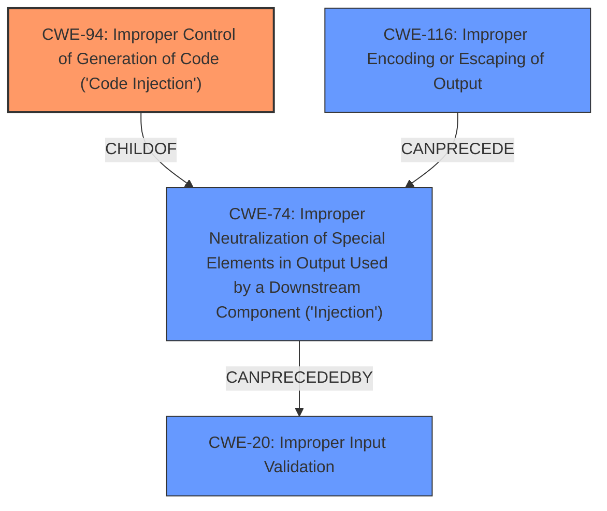

# Analysis Report for CVE-2021-21248

# Vulnerability Analysis Report: CVE-2021-21248

## Description


## Analysis (with Relationship Data)

# Summary
| CWE ID  | CWE Name                                                                                                                              | Confidence | CWE Abstraction Level | CWE Vulnerability Mapping Label | CWE-Vulnerability Mapping Notes |
| ------- | ------------------------------------------------------------------------------------------------------------------------------------- | ---------- | ----------------------- | ------------------------------- | ----------------------------- |
| CWE-94  | Improper Control of Generation of Code ('Code Injection')                                                                             | 0.95       | Base                    | Primary                         | Allowed-with-Review           |
| CWE-116 | Improper Encoding or Escaping of Output                                                                                               | 0.75       | Class                   | Secondary                       | Allowed-with-Review           |

## Evidence and Confidence

*   **Confidence Score:** 0.85
*   **Evidence Strength:** HIGH

## Relationship Analysis
The primary relationship impacting the decision is the ChildOf relationship between CWE-94 and CWE-74 (Improper Neutralization of Special Elements in Output Used by a Downstream Component ('Injection')). CWE-94 is a more specific case of CWE-74, focusing on code injection. The "CanPrecede" relationship of CWE-20 (Improper Input Validation) to CWE-74 highlights the typical vulnerability chain where **lack of input validation** leads to injection vulnerabilities. Also, CWE-1336 (Improper Neutralization of Special Elements Used in a Template Engine), CWE-917 (Improper Neutralization of Special Elements used in an Expression Language Statement ('Expression Language Injection')), and CWE-78 (Improper Neutralization of Special Elements used in an OS Command ('OS Command Injection')) are sibling CWEs, related to specific types of injection, but did not fit as directly as CWE-94.



## Vulnerability Chain
The chain of events for this vulnerability is:
1.  **Root Cause:** **Improper Control of Generation of Code ('Code Injection') (CWE-94)** due to dynamically generated Groovy classes using user-controlled input.
2.  **Contributing Factor:** **Improper Encoding or Escaping of Output (CWE-116)** as the user-provided input is not properly sanitized/escaped.
3.  **Impact:** Arbitrary code execution on the server.

## Summary of Analysis
Initially, the vulnerability description pointed towards a code injection issue related to dynamically generated Groovy classes. The CVE Reference Links Content Summary further solidified this by highlighting that user-controlled input was not properly sanitized before being used in a `@Pattern` annotation within the dynamically generated Groovy code, thus allowing for arbitrary code execution.

The primary CWE, CWE-94, was selected because the root cause is the **improper construction of a code segment** using externally-influenced input. The application dynamically generates Groovy classes based on user-provided input, but it fails to neutralize special elements that could modify the syntax or behavior of the intended code segment. This aligns directly with the description of CWE-94. "InputSpec is used to define parameters of a Build spec by using dynamically generated Groovy classes" which makes the application vulnerable to **code injection**.

CWE-116 was considered as a contributing factor because the **lack of proper encoding/escaping of user-provided input** is a key element in allowing the injection. "This issue was addressed in 4.0.3 by escaping special characters such as quote from user input."

The retriever results and graph relationships supported focusing on code injection. The evidence clearly showed that the application dynamically generates code based on user input without proper neutralization, resulting in the ability to inject arbitrary code. The selection of CWE-94 is at the optimal level of specificity, as it directly addresses the **root cause of the vulnerability**.
The mitigation also supports the finding: "This issue was addressed in 4.0.3 by escaping special characters such as quote from user input."

Other CWEs Considered and Rejected:

*   CWE-78 (Improper Neutralization of Special Elements used in an OS Command ('OS Command Injection')): While code execution is the end result, the **root cause isn't related to constructing OS commands**, but rather to dynamically generating code using user-supplied input.
*   CWE-79 (Improper Neutralization of Input During Web Page Generation ('Cross-site Scripting')): XSS is not the primary issue. The vulnerability exists server side with code injection.
*   CWE-1336 (Improper Neutralization of Special Elements Used in a Template Engine): Not directly related to template engines.
*   CWE-917 (Improper Neutralization of Special Elements used in an Expression Language Statement ('Expression Language Injection')): While Groovy could be considered an expression language, the core issue is broader than just expression language injection.
*   CWE-502 (Deserialization of Untrusted Data): No evidence of deserialization is present.
*   CWE-470 (Use of Externally-Controlled Input to Select Classes or Code ('Unsafe Reflection')): While Groovy involves classes, the issue isn't about selecting improper classes, but about injecting code into the generated class.
* CWE-20 (Improper Input Validation): While input validation is missing, it is a more general CWE.


## CWE Relationship Analysis

Current CWEs represent these abstraction levels: .


### Vulnerability Chain Analysis

**Chain starting from CWE-502:**
- 502 (Deserialization of Untrusted Data) - ROOT


**Chain starting from CWE-1336:**
- 1336 (Improper Neutralization of Special Elements Used in a Template Engine) - ROOT


### CWE Relationship Diagram

```mermaid
graph TD
    classDef primary fill:#f96,stroke:#333,stroke-width:2px
    classDef secondary fill:#69f,stroke:#333
    classDef tertiary fill:#9e9,stroke:#333
```


*Report generated on 2025-04-02 13:00:58*
