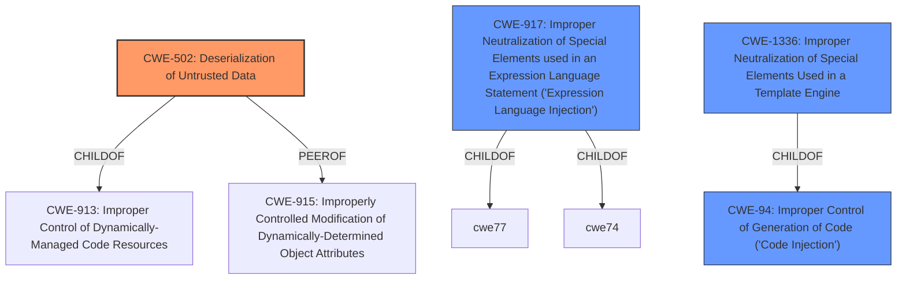

# Enhanced Analysis for CVE-2021-21249

# Summary
| CWE ID | CWE Name | Confidence | CWE Abstraction Level | CWE Vulnerability Mapping Label | CWE-Vulnerability Mapping Notes |
|---|---|---|---|---|---|
| **CWE-502** | **Deserialization of Untrusted Data** | 1.0 | Base | Primary | Allowed |
| CWE-917 | Improper Neutralization of Special Elements used in an Expression Language Statement ('Expression Language Injection') | 0.7 | Base | Secondary | Allowed |
| CWE-1336 | Improper Neutralization of Special Elements Used in a Template Engine | 0.6 | Base | Secondary | Allowed |
| CWE-94 | Improper Control of Generation of Code ('Code Injection') | 0.5 | Base | Secondary | Allowed-with-Review |

## Evidence and Confidence

*   **Confidence Score:** 1.0
*   **Evidence Strength:** HIGH

## Relationship Analysis
The primary CWE is CWE-502, which has peer relationships with CWE-915 (Improperly Controlled Modification of Dynamically-Determined Object Attributes). It is a child of CWE-913 (Improper Control of Dynamically-Managed Code Resources). The other candidate CWEs, CWE-917, CWE-1336 and CWE-94 are related to injection and code generation. These relationships help to contextualize the vulnerability as one stemming from the processing of untrusted data, which leads to potential code execution.



## Vulnerability Chain
The vulnerability chain starts with the application's use of SnakeYaml without `SafeConstructor`, leading to **unsafe deserialization (CWE-502)**. This allows an attacker to inject malicious YAML payloads, leading to **remote code execution**.

## Summary of Analysis
The primary weakness is the **deserialization of untrusted data (CWE-502)** using SnakeYaml without proper safeguards. The vulnerability description states that "OneDev uses SnakeYaml which by default (when not using `SafeConstructor`) allows the instantiation of arbitrary classes." This aligns directly with the description of CWE-502, which states: "The product deserializes untrusted data without sufficiently ensuring that the resulting data will be valid."

The use of `javax.script.ScriptEngineManager` and `URLClassLoader` to load the script engine provider and instantiate a user-controlled class is a direct consequence of the unsafe deserialization. This enables the attacker to execute arbitrary code on the server.

The selection of CWE-502 is at the optimal level of specificity because it directly addresses the root cause of the vulnerability: the unsafe deserialization of YAML files due to the default behavior of SnakeYaml. The other CWEs considered, such as CWE-917, CWE-1336 and CWE-94, are related to injection and code generation, but they are secondary to the primary weakness of unsafe deserialization.

Relevant CWE Information:

# Enhanced Context (25 CWEs)

## CWE-404: Improper Resource Shutdown or Release
**Abstraction Level**: Class
**Similarity Score**: 0.78

**Description**:
The product does not release or incorrectly releases a resource before it is made available for re-use.

**Mapping Guidance**:
- Usage: Allowed-with-Review
- Rationale: This CWE entry is a Class and might have Base-level children that would be more appropriate

*Not selected*: This is not directly related to the described vulnerability, which focuses on deserialization rather than resource management.

## CWE-789: Memory Allocation with Excessive Size Value
**Abstraction Level**: Variant
**Similarity Score**: 0.78

**Description**:
The product allocates memory based on an untrusted, large size value, but it does not ensure that the size is within expected limits, allowing arbitrary amounts of memory to be allocated.

**Mapping Guidance**:
- Usage: Allowed
- Rationale: This CWE entry is at the Variant level of abstraction, which is a preferred level of abstraction for mapping to the root causes of vulnerabilities.

*Not selected*: Memory allocation issues are not the primary focus of this vulnerability, which centers on the unsafe deserialization process.

## CWE-405: Asymmetric Resource Consumption (Amplification)
**Abstraction Level**: Class
**Similarity Score**: 0.78

**Description**:
The product does not properly control situations in which an adversary can cause the product to consume or produce excessive resources without requiring the adversary to invest equivalent work or otherwise prove authorization, i.e., the adversary's influence is "asymmetric."

**Mapping Guidance**:
- Usage: Allowed-with-Review
- Rationale: This CWE entry is a Class and might have Base-level children that would be more appropriate

*Not selected*: Resource consumption is not the main issue; the vulnerability is about arbitrary code execution via deserialization.

## CWE-226: Sensitive Information in Resource Not Removed Before Reuse
**Abstraction Level**: Base
**Similarity Score**: 0.77

**Description**:
The product releases a resource such as memory or a file so that it can be made available for reuse, but it does not clear or "zeroize" the information contained in the resource before the product performs a critical state transition or makes the resource available for reuse by other entities.

**Mapping Guidance**:
- Usage: Allowed
- Rationale: This CWE entry is at the Base level of abstraction, which is a preferred level of abstraction for mapping to the root causes of vulnerabilities.

*Not selected*: This is not related to the vulnerability description, which does not involve sensitive information being exposed during resource reuse.

## CWE-668: Exposure of Resource to Wrong Sphere
**Abstraction Level**: Class
**Similarity Score**: 0.76

**Description**:
The product exposes a resource to the wrong control sphere, providing unintended actors with inappropriate access to the resource.

**Mapping Guidance**:
- Usage: Discouraged
- Rationale: CWE-668 is high-level and is often misused as a catch-all when lower-level CWE IDs might be applicable. It is sometimes used for low-information vulnerability reports [REF-1287]. It is a level-1 Class (i.e., a child of a Pillar). It is not useful for trend analysis.

*Not selected*: Too high-level and not directly applicable. The vulnerability is more specific to deserialization.

## CWE-664: Improper Control of a Resource Through its Lifetime
**Abstraction Level**: Pillar
**Similarity Score**: 0.76

**Description**:
The product does not maintain or incorrectly maintains control over a resource throughout its lifetime of creation, use, and release.

**Mapping Guidance**:
- Usage: Discouraged
- Rationale: This CWE entry is high-level when lower-level children are available.

*Not selected*: Too high-level; CWE-502 is more specific.

## CWE-74: Improper Neutralization of Special Elements in Output Used by a Downstream Component ('Injection')
**Abstraction Level**: Class
**Similarity Score**: 0.76

**Description**:
The product constructs all or part of a command, data structure, or record using externally-influenced input from an upstream component, but it does not neutralize or incorrectly neutralizes special elements that could modify how it is parsed or interpreted when it is sent to a downstream component.

**Mapping Guidance**:
- Usage: Discouraged
- Rationale: CWE-74 is high-level and often misused when lower-level weaknesses are more appropriate.

*Not selected*: Too general; CWE-502 is a more specific root cause.

## CWE-1325: Improperly Controlled Sequential Memory Allocation
**Abstraction Level**: Base
**Similarity Score**: 0.76

**Description**:
The product manages a group of objects or resources and performs a separate memory allocation for each object, but it does not properly limit the total amount of memory that is consumed by all of the combined objects.

**


## CWE Relationship Analysis

Current CWEs represent these abstraction levels: .


### Vulnerability Chain Analysis

**Chain starting from CWE-502:**
- 502 (Deserialization of Untrusted Data) - ROOT


**Chain starting from CWE-664:**
- 664 (Improper Control of a Resource Through its Lifetime) - ROOT


### CWE Relationship Diagram

```mermaid
graph TD
    classDef primary fill:#f96,stroke:#333,stroke-width:2px
    classDef secondary fill:#69f,stroke:#333
    classDef tertiary fill:#9e9,stroke:#333
```