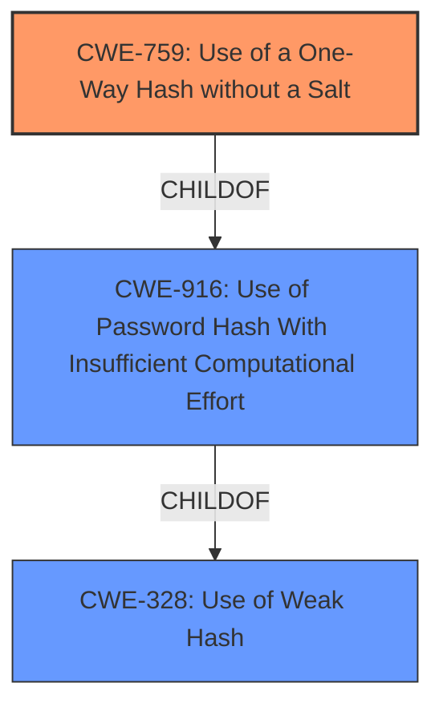

# Analysis Report for CVE-2021-21253

# Vulnerability Analysis Report: CVE-2021-21253

## Description


## Analysis (with Relationship Data)

# Summary
| CWE ID | CWE Name | Confidence | CWE Abstraction Level | CWE Vulnerability Mapping Label | CWE-Vulnerability Mapping Notes |
|---|---|---|---|---|---|
| CWE-759 | Use of a One-Way Hash without a Salt | 1.0 | Variant | Allowed | Primary CWE |
| CWE-916 | Use of Password Hash With Insufficient Computational Effort | 0.8 | Base | Allowed | Secondary Candidate |
| CWE-328 | Use of Weak Hash | 0.7 | Base | Allowed | Secondary Candidate |

## Evidence and Confidence

*   **Confidence Score:** 0.9
*   **Evidence Strength:** HIGH

## Relationship Analysis
The primary CWE, CWE-759, is a variant of CWE-916 and CWE-328, which indicates a hierarchical relationship. CWE-759 represents the specific scenario of using a one-way hash without a salt, while CWE-916 is a broader category about using password hashes with insufficient computational effort, and CWE-328 is even broader about using weak hashes in general. The variant level of CWE-759 is more appropriate because the vulnerability description specifies the exact weakness: the absence of a salt.



## Vulnerability Chain
The vulnerability chain starts with the **root cause**, which is using a one-way hash function without a salt (CWE-759). This leads to the potential impact of attackers being able to crack passwords due to the vulnerability to dictionary attacks and rainbow tables. The vulnerability chain can be mapped as follows:

CWE-759 (Use of a One-Way Hash without a Salt) -> Impact: Passwords can be cracked via dictionary attacks

## Summary of Analysis
The primary weakness is the application's failure to use a salt when hashing passwords. This is explicitly stated in the **Vulnerability Description Key Phrases** as "**weakness:** **hashes user passwords without a salt**" and in the **CVE Reference Links Content Summary** as "**Use of One-Way Hash without Salt (CWE-759):** The primary weakness was the absence of a salt when hashing passwords." This aligns perfectly with CWE-759 (Use of a One-Way Hash without a Salt), which is at the Variant level of abstraction. The retriever results also identify CWE-759 as the top match.

CWE-916 (Use of Password Hash With Insufficient Computational Effort) was considered as a broader classification, but CWE-759 is more specific and accurately reflects the root cause. CWE-328 (Use of Weak Hash) is also a broader classification that encompasses various weaknesses in hash functions, but the lack of a salt is the specific issue.

The selection of CWE-759 is at the optimal level of specificity because it precisely describes the vulnerability. The use of a variant-level CWE is appropriate given the clear evidence.

Relevant CWE Information:

# Enhanced Context (25 CWEs)
The following CWEs were identified as potentially relevant to this vulnerability:

## CWE-916: Use of Password Hash With Insufficient Computational Effort
**Abstraction Level**: Base
**Similarity Score**: 0.77
**Source**: dense

**Description**:
The product generates a hash for a password, but it uses a scheme that does not provide a sufficient level of computational effort that would make password cracking attacks infeasible or expensive.

**Mapping Guidance**:
- Usage: Allowed
- Rationale: This CWE entry is at the Base level of abstraction, which is a preferred level of abstraction for mapping to the root causes of vulnerabilities.

## CWE-759: Use of a One-Way Hash without a Salt
**Abstraction Level**: Variant
**Similarity Score**: 7623.29
**Source**: sparse

**Description**:
The product uses a one-way cryptographic hash against an input that should not be reversible, such as a password, but the product does not also use a salt as part of the input.

**Mapping Guidance**:
- Usage: Allowed
- Rationale: This CWE entry is at the Variant level of abstraction, which is a preferred level of abstraction for mapping to the root causes of vulnerabilities.

Technical Explanation for CWE-759:
The OnlineVotingSystem **hashes user passwords without a salt**, making it vulnerable to dictionary attacks. This matches the CWE-759 description: "The product uses a one-way cryptographic hash against an input that should not be reversible, such as a password, but the product does not also use a salt as part of the input." The security implication is that attackers can crack passwords more easily, leading to unauthorized access. The potential impact is a security breach in the voting system. CWE-759 is a child of CWE-916 (Use of Password Hash With Insufficient Computational Effort).


## CWE Relationship Analysis

Current CWEs represent these abstraction levels: .


### Vulnerability Chain Analysis

**Chain starting from CWE-759:**
- 759 (Use of a One-Way Hash without a Salt) - ROOT


**Chain starting from CWE-916:**
- 916 (Use of Password Hash With Insufficient Computational Effort) - ROOT


### CWE Relationship Diagram

```mermaid
graph TD
    classDef primary fill:#f96,stroke:#333,stroke-width:2px
    classDef secondary fill:#69f,stroke:#333
    classDef tertiary fill:#9e9,stroke:#333
```


*Report generated on 2025-04-02 00:58:16*
