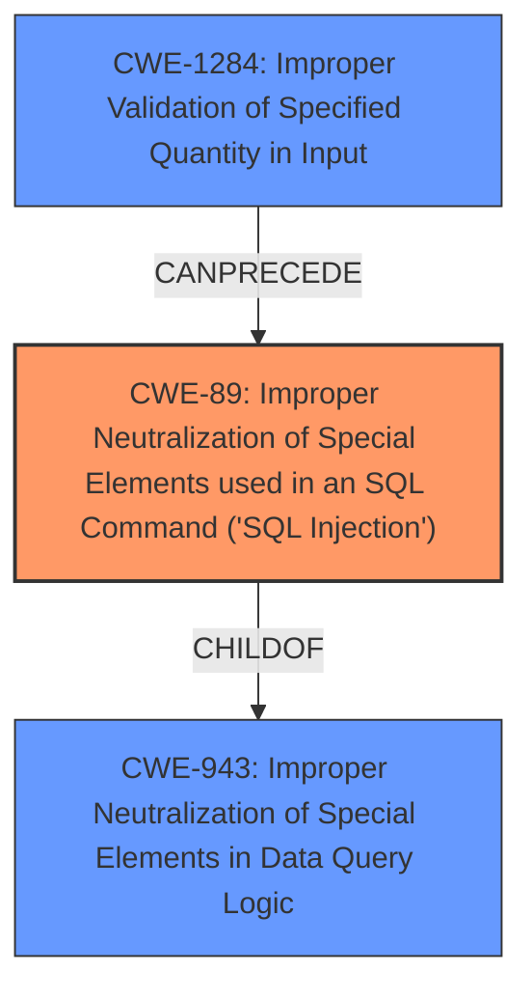

# Raw Analyzer Response for CVE-2021-21263

# Summary
| CWE ID | CWE Name | Confidence | CWE Abstraction Level | CWE Vulnerability Mapping Label | CWE-Vulnerability Mapping Notes |
|---|---|---|---|---|---|
| CWE-89 | Improper Neutralization of Special Elements used in an SQL Command ('SQL Injection') | 0.7 | Base | Allowed | Primary CWE. The vulnerability allows for the manipulation of SQL queries through improper input validation, potentially leading to SQL injection. |
| CWE-1284 | Improper Validation of Specified Quantity in Input | 0.6 | Base | Allowed | Secondary CWE. The root cause of the vulnerability is the improper validation of the input, which allows an attacker to inject an array into a field expecting a non-array value. |
| CWE-943 | Improper Neutralization of Special Elements in Data Query Logic | 0.5 | Class | Allowed-with-Review | Secondary CWE. The vulnerability involves generating a query without properly neutralizing special elements that can modify the query's logic. |

## Evidence and Confidence

*   **Confidence Score:** 0.7
*   **Evidence Strength:** HIGH

## Relationship Analysis
The primary CWE, CWE-89, is a child of CWE-943, indicating a more specific type of data query issue. CWE-1284 can precede CWE-789 (Memory Allocation with Excessive Size Value), which is not directly relevant here but highlights the potential for resource-related impacts from improper input validation. The hierarchical relationship between CWE-89 and CWE-943 helps refine the classification to a potential SQL injection issue arising from the broader category of improper data query neutralization. The Base level of CWE-89 and CWE-1284 is preferred for root cause mapping.

## Vulnerability Chain
The chain of root cause and weaknesses that followed for the Vulnerability Description.
  - The vulnerability begins with **improper input validation** (CWE-1284), where the system **fails to validate that a field is not an array when it should be**
  - Because of this **missing validation** the attacker can manipulate the query bindings
  - This leads to **improper neutralization of special elements in data query logic** (CWE-943)
  - Which can result in **SQL injection** (CWE-89) and the query returning unexpected results.
  - The final impact is the return of **unexpected results**, which could lead to further exploitation.

## Summary of Analysis
The initial assessment identified the possibility of SQL injection due to the **query binding exploitation**. The evidence from the "CVE Reference Links Content Summary" strongly supports this, stating that the **root cause** is the framework's **failure to properly validate or cast input types**, which can allow an attacker to control the structure of the SQL query. The description mentions that the impact could be queries returning no results or, more seriously, returning unexpected results or potentially, arbitrary SQL injection.

The "Retriever Results" listed CWE-89, CWE-1284 and CWE-943 as potential matches, with CWE-89 being the top result. Given the potential for SQL injection and the **improper input validation**, CWE-89 is selected as the primary CWE. CWE-1284 is a secondary CWE as the **improper validation** is the root cause. CWE-943 is also a secondary CWE since it describes the **improper neutralization** issue.

The hierarchical relationships show that CWE-89 is a child of CWE-943, making it a more specific classification. The chain relationship with CWE-1284 highlights how **improper input validation** can lead to this type of vulnerability.

The selection of CWE-89 is justified by the evidence of **query binding exploitation** potentially leading to SQL injection, and is at the optimal level of specificity as a Base CWE. The "CVE Reference Links Content Summary" section provides the best evidence.

Relevant CWE Information:

# Enhanced Context (25 CWEs)
The following CWEs were identified as potentially relevant to this vulnerability:

## CWE-404: Improper Resource Shutdown or Release
**Abstraction Level**: Class
**Similarity Score**: 0.77
**Source**: dense

**Description**:
The product does not release or incorrectly releases a resource before it is made available for re-use.

**Mapping Guidance**:
- Usage: Allowed-with-Review
- Rationale: This CWE entry is a Class and might have Base-level children that would be more appropriate

*Not Selected*: Not directly related to the SQL injection or input validation issue.

## CWE-668: Exposure of Resource to Wrong Sphere
**Abstraction Level**: Class
**Similarity Score**: 0.77
**Source**: dense

**Description**:
The product exposes a resource to the wrong control sphere, providing unintended actors with inappropriate access to the resource.

**Mapping Guidance**:
- Usage: Discouraged
- Rationale: CWE-668 is high-level and is often misused as a catch-all when lower-level CWE IDs might be applicable. It is sometimes used for low-information vulnerability reports [REF-1287]. It is a level-1 Class (i.e., a child of a Pillar). It is not useful for trend analysis.

*Not Selected*: Too general and not directly applicable to the **query binding exploitation** or **improper input validation**

## CWE-405: Asymmetric Resource Consumption (Amplification)
**Abstraction Level**: Class
**Similarity Score**: 0.76
**Source**: dense

**Description**:
The product does not properly control situations in which an adversary can cause the product to consume or produce excessive resources without requiring the adversary to invest equivalent work or otherwise prove authorization, i.e., the adversary's influence is "asymmetric."

**Mapping Guidance**:
- Usage: Allowed-with-Review
- Rationale: This CWE entry is a Class and might have Base-level children that would be more appropriate

*Not Selected*: Not directly relevant to the SQL injection or input validation issue.

## CWE-226: Sensitive Information in Resource Not Removed Before Reuse
**Abstraction Level**: Base
**Similarity Score**: 0.76
**Source**: dense

**Description**:
The product releases a resource such as memory or a file so that it can be made available for reuse, but it does not clear or "zeroize" the information contained in the resource before the product performs a critical state transition or makes the resource available for reuse by other entities.

**Mapping Guidance**:
- Usage: Allowed
- Rationale: This CWE entry is at the Base level of abstraction, which is a preferred level of abstraction for mapping to the root causes of vulnerabilities.

*Not Selected*: Not applicable to this vulnerability.

## CWE-407: Inefficient Algorithmic Complexity
**Abstraction Level**: Class
**Similarity Score**: 0.76
**Source**: dense

**Description**:
An algorithm in a product has an inefficient worst-case computational complexity that may be detrimental to system performance and can be triggered by an attacker, typically using crafted manipulations that ensure that the worst case is being reached.

**Mapping Guidance**:
- Usage: Allowed-with-Review
- Rationale: This CWE entry is a Class and might have Base-level children that would be more appropriate

*Not Selected*: Not applicable to the **query binding exploitation** vulnerability.

## CWE-212: Improper Removal of Sensitive Information Before Storage or Transfer
**Abstraction Level**: Base
**Similarity Score**: 0.76
**Source**: dense

**Description**:
The product stores, transfers, or shares a resource that contains sensitive information, but it does not properly remove that information before the product makes the resource available to unauthorized actors.

**Mapping Guidance**:
- Usage: Allowed
- Rationale: This CWE entry is at the Base level of abstraction, which is a preferred level of abstraction for mapping to the root causes of vulnerabilities.

*Not Selected*: Not directly related to the SQL injection or input validation issue.

## CWE-204: Observable Response Discrepancy
**Abstraction Level**: Base
**Similarity Score**: 0.76
**Source**: dense

**Description**:
The product provides different responses to incoming requests in a way that reveals internal state information to an unauthorized actor outside of the intended control sphere.

**Mapping Guidance**:
- Usage: Allowed
- Rationale: This CWE entry is at the Base level of abstraction, which is a preferred level of abstraction for mapping to the root causes of vulnerabilities.

*Not Selected*: Not applicable to this vulnerability.

## CWE-74: Improper Neutralization of