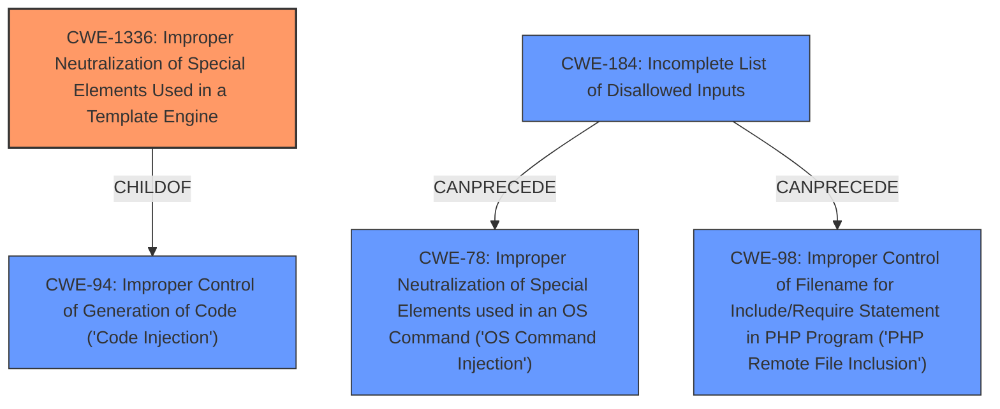

# Raw Analyzer Response for CVE-2021-21264

# Summary
| CWE ID  | CWE Name                                                                   | Confidence | CWE Abstraction Level | CWE Vulnerability Mapping Label | CWE-Vulnerability Mapping Notes |
| :-------- | :------------------------------------------------------------------------- | :--------- | :---------------------- | :------------------------------ | :-------------------------------- |
| CWE-1336 | Improper Neutralization of Special Elements Used in a Template Engine     | 0.9        | Base                    | Primary CWE                     | Allowed                           |
| CWE-184  | Incomplete List of Disallowed Inputs                                     | 0.7        | Base                    | Secondary                       | Allowed                           |

## Evidence and Confidence

*   **Confidence Score:** 0.8
*   **Evidence Strength:** HIGH

## Relationship Analysis
The primary CWE is CWE-1336, which is a child of CWE-94. This indicates that the vulnerability involves injecting code through a template engine. The secondary CWE, CWE-184, can precede CWE-78 and CWE-98. The relationships show the potential flow of how an incomplete list of disallowed inputs can lead to code execution vulnerabilities. The base abstraction level is used for both to provide the most specific description of the vulnerability.

## Vulnerability Chain
The chain of events starts with an **incomplete list of disallowed inputs** (CWE-184). This leads to the **bypass of the Twig sandbox**, where an attacker can inject special elements into the template engine (CWE-1336). The final impact is the ability to **execute arbitrary PHP code**.

## Summary of Analysis
The initial assessment pointed to CWE-1336 as the primary weakness due to the **bypass of the Twig sandbox** using specific Twig code. This aligns with the description of CWE-1336, which focuses on the improper neutralization of special elements in a template engine. The analysis also considered the context of the vulnerability, which involves an authenticated backend user exploiting the weakness even when `cms.enableSafeMode` is enabled.

The relationship analysis supports the selection of CWE-1336, as it is directly related to code injection through template engines (child of CWE-94). The secondary weakness, CWE-184, is chosen because it addresses the root cause of why the Twig sandbox bypass was possible. The provided evidence from the "CVE Reference Links Content Summary" confirms that the root cause is a bypass that allows specific Twig code to escape the sandbox.

The final selection of CWE-1336 and CWE-184 is based on the evidence provided, the relationship analysis, and the mapping guidance. These CWEs are at the optimal level of specificity because they accurately represent the technical details of the vulnerability.

Relevant CWE Information:

# Enhanced Context (25 CWEs)

## CWE-184: Incomplete List of Disallowed Inputs
**Abstraction Level**: Base
**Similarity Score**: 0.82
**Source**: dense

**Description**:
The product implements a protection mechanism that relies on a list of inputs (or properties of inputs) that are not allowed by policy or otherwise require other action to neutralize before additional processing takes place, but the list is incomplete.

**Mapping Guidance**:
- Usage: Allowed
- Rationale: This CWE entry is at the Base level of abstraction, which is a preferred level of abstraction for mapping to the root causes of vulnerabilities.

## CWE-1336: Improper Neutralization of Special Elements Used in a Template Engine
**Abstraction:** Base
**Status:** Incomplete

### Description
The product uses a template engine to insert or process externally-influenced input, but it does not neutralize or incorrectly neutralizes special elements or syntax that can be interpreted as template expressions or other code directives when processed by the engine.

### Observed Examples
- **CVE-2024-34359:** Chain: Python bindings for LLM library do not use a sandboxed environment when parsing a template and constructing a prompt, allowing jinja2 Server Side Template Injection and code execution - one variant of a "prompt injection" attack.
- **CVE-2017-16783:** server-side template injection in content management server
- **CVE-2020-9437:** authentication / identity management product has client-side template injection

## CWE-94: Improper Control of Generation of Code ('Code Injection')
**Abstraction:** Base
**Status:** Draft

### Description
The product constructs all or part of a code segment using externally-influenced input from an upstream component, but it does not neutralize or incorrectly neutralizes special elements that could modify the syntax or behavior of the intended code segment.

### Mapping Guidance
**Usage:** Allowed-with-Review
**Rationale:** This entry is frequently misused for vulnerabilities with a technical impact of "code execution," which does not by itself indicate a root cause weakness, since dozens of weaknesses can enable code execution.

**CWE-1336**: **Improper Neutralization of Special Elements Used in a Template Engine**
*   **How the vulnerability matches:** The vulnerability description explicitly mentions a **"bypass of the Twig sandbox"** which allows an attacker to **"write specific Twig code to escape the Twig sandbox and execute arbitrary PHP."** This directly corresponds to the description of CWE-1336, where the product uses a template engine (Twig) but does not properly neutralize special elements, allowing attackers to inject code.
*   **Security implications and potential impact:** This allows an attacker to execute arbitrary PHP code on the server, potentially leading to complete system compromise.
*   **Parent-child relationships or chain patterns:** CWE-1336 is a child of CWE-94 (**Improper Control of Generation of Code ('Code Injection')**), highlighting that the vulnerability results in code injection.
*   **Whether the weakness is primary or secondary:** This is the primary weakness, as it directly enables the exploitation.
*   **How the official MITRE mapping guidance influenced your decision:** The mapping guidance for CWE-1336 states that it is at the Base level of abstraction, which is the preferred level.

**CWE-184**: **Incomplete List of Disallowed Inputs**
*   **How the vulnerability matches:** The vulnerability is a **bypass** of a previous fix (CVE-2020-26231), suggesting that the initial list of disallowed inputs or patterns was incomplete. The **bypass** allows attackers to **escape the Twig sandbox**, indicating that the protection mechanism relying on the list of disallowed inputs was insufficient.
*   **Security implications and potential impact:** The incomplete list of disallowed inputs allows attackers to inject malicious code through the Twig template engine, ultimately leading to arbitrary PHP execution.
*   **Parent-child relationships or chain patterns:** CWE-184 can precede other injection-related CWEs such as CWE-78 (**Improper Neutralization of Special Elements used in an OS Command ('OS Command Injection')**) and CWE-98 (**Improper Control of Filename for Include/Require Statement in PHP Program ('PHP Remote File Inclusion')**), indicating a potential chain of vulnerabilities.
*   **Whether the weakness is primary or secondary:** While the primary weakness is the improper neutralization in the template engine (CWE-1336), the incomplete list of disallowed inputs (CWE-184) is a contributing factor that enabled the bypass. Therefore, it's a secondary weakness.
*   **How the official MITRE mapping guidance influenced your decision:** The mapping guidance for CWE-184 states that it is at the Base level of abstraction, which is the preferred level.

**CWEs Considered But Not Used:**

*   **CWE-79:** **Improper Neutralization of Input During Web Page Generation ('Cross-site Scripting')**: While the vulnerability involves the injection of code, it's not directly related to XSS. The code is executed on the server-side, not in the user's browser.
*   **CWE-22:** **Improper Limitation of a Pathname to a Restricted Directory ('Path Traversal')**: This CWE is not relevant because the vulnerability does not involve path manipulation.
*   **CWE-94:** **Improper Control of Generation of Code ('Code Injection')**: This