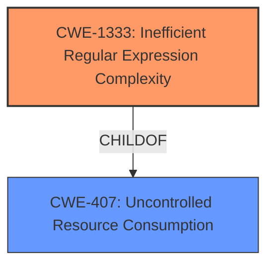

# Enhanced Analysis for CVE-2021-21267

# Summary
| CWE ID  | CWE Name  | Confidence | CWE Abstraction Level | CWE Vulnerability Mapping Label | CWE-Vulnerability Mapping Notes |
|------------------|--------------------------------------------------------------------------|---------------|--------------------------|------------------------------------|-------------------------------------------------------------------------------------------------------------------------------------------------------------------|
| CWE-1333 | Inefficient Regular Expression Complexity | 1.0 | Base | Allowed | The vulnerability is due to a regular expression that is inefficient, leading to a denial of service. |

## Evidence and Confidence

*   **Confidence Score:** 1.0
*   **Evidence Strength:** HIGH

## Relationship Analysis
The primary CWE identified is CWE-1333, which is a Base level CWE. It is related to CWE-407, which is excessive consumption of resources. The relationship shows the root cause of the denial-of-service vulnerability is due to the inefficient regular expression.



## Vulnerability Chain
The vulnerability chain starts with the **inefficient regular expression** (CWE-1333), which leads to excessive CPU consumption, resulting in a denial-of-service condition.

## Summary of Analysis
The analysis identified CWE-1333 as the most appropriate CWE for this vulnerability.

Evidence:
*   The vulnerability description states that the email address validation is vulnerable to a denial-of-service attack.
*   The **weakness** is a **regular expression denial of service**.
*   The CVE Reference Links Content Summary confirms that the root cause is a regular expression that exhibits poor performance characteristics under specific inputs, leading to potential denial of service.

The selection of CWE-1333 is at the optimal level of specificity because it directly addresses the root cause of the vulnerability, which is the inefficient regular expression.

Relevant CWE Information:
*   CWE-1333: Inefficient Regular Expression Complexity
    *   Abstraction: Base
    *   Description: The product uses a regular expression with an inefficient, possibly exponential worst-case computational complexity that consumes excessive CPU cycles.


## CWE Relationship Analysis

Current CWEs represent these abstraction levels: .


### Vulnerability Chain Analysis

**Chain starting from CWE-407:**
- 407 (Inefficient Algorithmic Complexity) - ROOT


**Chain starting from CWE-1333:**
- 1333 (Inefficient Regular Expression Complexity) - ROOT


### CWE Relationship Diagram

```mermaid
graph TD
    classDef primary fill:#f96,stroke:#333,stroke-width:2px
    classDef secondary fill:#69f,stroke:#333
    classDef tertiary fill:#9e9,stroke:#333
```