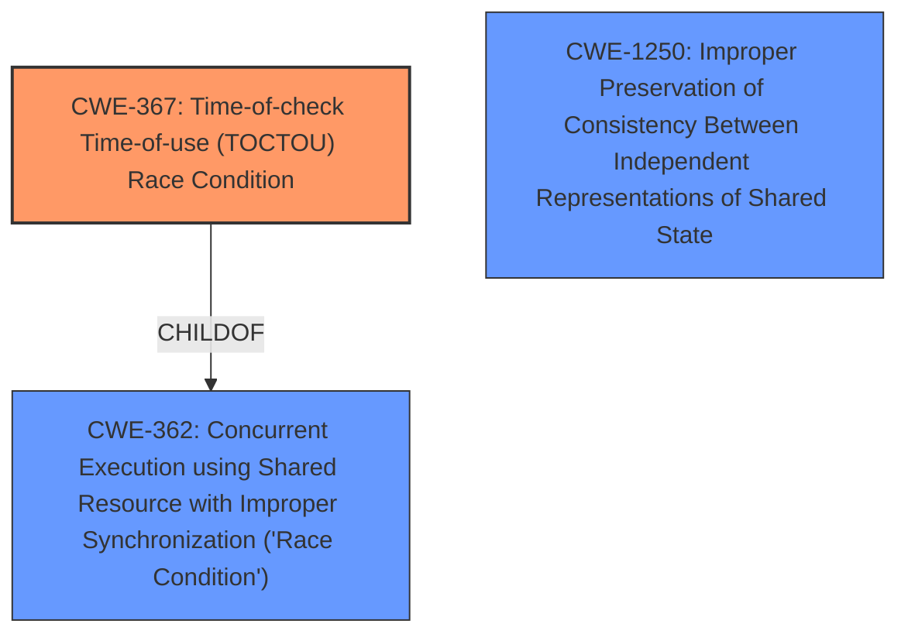

# Raw Analyzer Response for CVE-2021-21271

# Summary
| CWE ID | CWE Name | Confidence | CWE Abstraction Level | CWE Vulnerability Mapping Label | CWE-Vulnerability Mapping Notes |
|---|---|---|---|---|---|
| CWE-367 | Time-of-check Time-of-use (TOCTOU) Race Condition | 0.9 | Base | Allowed | Primary CWE |
| CWE-1250 | Improper Preservation of Consistency Between Independent Representations of Shared State | 0.7 | Base | Allowed | Secondary Candidate |

## Evidence and Confidence

*   **Confidence Score:** 0.8
*   **Evidence Strength:** HIGH

## Relationship Analysis
The primary CWE, CWE-367 (Time-of-check Time-of-use (TOCTOU) Race Condition), is a base-level CWE, which is preferred for vulnerability mapping. It is related to CWE-362 (Concurrent Execution using Shared Resource with Improper Synchronization ('Race Condition')), indicating that it is a specific type of race condition. The secondary CWE, CWE-1250 (Improper Preservation of Consistency Between Independent Representations of Shared State) is a base level CWE, which is preferred for vulnerability mapping.

## Vulnerability Chain
The vulnerability chain starts with the **incorrect** assignment of responsibility for forming `DuplicateVoteEvidence` to the consensus reactor. This reactor uses the 'last commit' of the current block to assign a timestamp. Because the block is still "in flight", the 'last commit' is inconsistent across different nodes, leading to the **weakness** of a TOCTOU race condition (CWE-367). This results in the creation of `DuplicateVoteEvidence` with differing timestamps, causing nodes to disconnect and leading to a denial-of-service (DoS). There is an issue of Improper Preservation of Consistency Between Independent Representations of Shared State (CWE-1250), because the different nodes do not have the same view of the `last commit`

## Summary of Analysis
The initial assessment identified CWE-367 as the primary weakness due to the **time of check time of use (TOCTTOU)** condition that occurs when nodes form `DuplicateVoteEvidence` with inconsistent timestamps based on the "last commit" data. The final decision is based on the vulnerability description, which states "different nodes in the network may observe **different last commits when assigning a timestamp to DuplicateVoteEvidence**". The "CVE Reference Links Content Summary" section also mentions that the root cause lies in the consensus reactor's responsibility for forming `DuplicateVoteEvidence` objects, which are assigned a timestamp using the 'last commit' of the current block, which is still 'in flight' and thus inconsistent across different nodes. This inconsistency creates the TOCTOU condition.

CWE-367 is at the optimal level of specificity (Base) as it directly addresses the race condition caused by the time difference between checking the state of the 'last commit' and using it to assign a timestamp.

CWE-1250 (Improper Preservation of Consistency Between Independent Representations of Shared State) was considered as a secondary CWE because of the distributed nature of the system where each node maintains its own version of the `last commit` information. The vulnerability arises because these independent representations are not consistent across all nodes. This leads to discrepancies in the timestamps assigned to `DuplicateVoteEvidence`, triggering the vulnerability.

Relevant CWE Information:

# Enhanced Context (25 CWEs)
The following CWEs were identified as potentially relevant to this vulnerability:

## CWE-404: Improper Resource Shutdown or Release
**Abstraction Level**: Class
**Similarity Score**: 0.78
**Source**: dense

**Description**:
The product does not release or incorrectly releases a resource before it is made available for re-use.

**Mapping Guidance**:
- Usage: Allowed-with-Review
- Rationale: This CWE entry is a Class and might have Base-level children that would be more appropriate

## CWE-226: Sensitive Information in Resource Not Removed Before Reuse
**Abstraction Level**: Base
**Similarity Score**: 0.77
**Source**: dense

**Description**:
The product releases a resource such as memory or a file so that it can be made available for reuse, but it does not clear or "zeroize" the information contained in the resource before the product performs a critical state transition or makes the resource available for reuse by other entities.

**Mapping Guidance**:
- Usage: Allowed
- Rationale: This CWE entry is at the Base level of abstraction, which is a preferred level of abstraction for mapping to the root causes of vulnerabilities.

## CWE-405: Asymmetric Resource Consumption (Amplification)
**Abstraction Level**: Class
**Similarity Score**: 0.76
**Source**: dense

**Description**:
The product does not properly control situations in which an adversary can cause the product to consume or produce excessive resources without requiring the adversary to invest equivalent work or otherwise prove authorization, i.e., the adversary's influence is "asymmetric."

**Mapping Guidance**:
- Usage: Allowed-with-Review
- Rationale: This CWE entry is a Class and might have Base-level children that would be more appropriate

## CWE-664: Improper Control of a Resource Through its Lifetime
**Abstraction Level**: Pillar
**Similarity Score**: 0.76
**Source**: dense

**Description**:
The product does not maintain or incorrectly maintains control over a resource throughout its lifetime of creation, use, and release.

**Mapping Guidance**:
- Usage: Discouraged
- Rationale: This CWE entry is high-level when lower-level children are available.

## CWE-668: Exposure of Resource to Wrong Sphere
**Abstraction Level**: Class
**Similarity Score**: 0.76
**Source**: dense

**Description**:
The product exposes a resource to the wrong control sphere, providing unintended actors with inappropriate access to the resource.

**Mapping Guidance**:
- Usage: Discouraged
- Rationale: CWE-668 is high-level and is often misused as a catch-all when lower-level CWE IDs might be applicable. It is sometimes used for low-information vulnerability reports [REF-1287]. It is a level-1 Class (i.e., a child of a Pillar). It is not useful for trend analysis.

## CWE-789: Memory Allocation with Excessive Size Value
**Abstraction Level**: Variant
**Similarity Score**: 0.76
**Source**: dense

**Description**:
The product allocates memory based on an untrusted, large size value, but it does not ensure that the size is within expected limits, allowing arbitrary amounts of memory to be allocated.

**Mapping Guidance**:
- Usage: Allowed
- Rationale: This CWE entry is at the Variant level of abstraction, which is a preferred level of abstraction for mapping to the root causes of vulnerabilities.

## CWE-667: Improper Locking
**Abstraction Level**: Class
**Similarity Score**: 0.75
**Source**: dense

**Description**:
The product does not properly acquire or release a lock on a resource, leading to unexpected resource state changes and behaviors.

**Mapping Guidance**:
- Usage: Allowed-with-Review
- Rationale: This CWE entry is a Class and might have Base-level children that would be more appropriate

## CWE-407: Inefficient Algorithmic Complexity
**Abstraction Level**: Class
**Similarity Score**: 0.75
**Source**: dense

**Description**:
An algorithm in a product has an inefficient worst-case computational complexity that may be detrimental to system performance and can be triggered by an attacker, typically using crafted manipulations that ensure that the worst case is being reached.

**Mapping Guidance**:
- Usage: Allowed-with-Review
- Rationale: This CWE entry is a Class and might have Base-level children that would be more appropriate

## CWE-212: Improper Removal of Sensitive Information Before Storage or Transfer
**Abstraction Level**: Base
**Similarity Score**: 0.75
**Source**: dense

**Description**:
The product stores, transfers, or shares a resource that contains sensitive information, but it does not properly remove that information before the product makes the resource available to unauthorized actors.

**Mapping Guidance**:
- Usage: Allowed
- Rationale: This CWE entry is at the Base level of abstraction, which is a preferred level of abstraction for mapping to the root causes of vulnerabilities.

## CWE-1289: Improper Validation of Unsafe Equivalence in Input
**Abstraction Level**: Base
**Similarity Score**: 0.75
**Source**: dense

**Description**:
The product receives an input value that is used as a resource identifier or other type of reference, but it does not validate or incorrectly validates that the input is equivalent