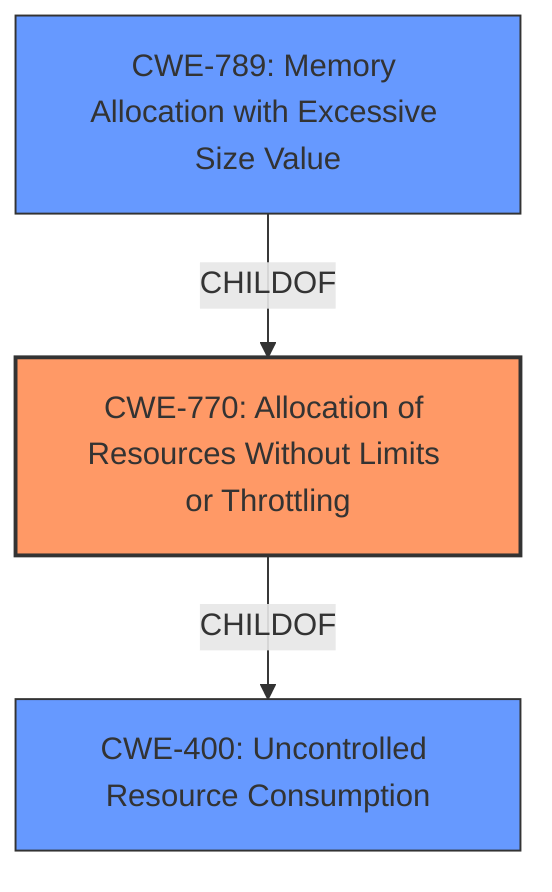

# Enhanced Analysis for CVE-2021-21274

# Summary
| CWE ID  | CWE Name                                                     | Confidence | CWE Abstraction Level | CWE Vulnerability Mapping Label | CWE-Vulnerability Mapping Notes |
|---------|--------------------------------------------------------------|------------|-----------------------|---------------------------------|-----------------------------------|
| CWE-770 | Allocation of Resources Without Limits or Throttling        | 0.9        | Base                  | Allowed                        | Primary CWE                       |
| CWE-400 | Uncontrolled Resource Consumption                           | 0.7        | Class                  | Discouraged                     | Secondary Candidate               |
| CWE-789 | Memory Allocation with Excessive Size Value                  | 0.6        | Variant                  | Allowed                     | Secondary Candidate              |

## Evidence and Confidence

*   **Confidence Score:** 0.8
*   **Evidence Strength:** HIGH

## Relationship Analysis
The primary CWE selected is CWE-770, which is a Base level CWE and a child of CWE-400. CWE-400 is a Class level CWE and is discouraged because more specific CWEs are available. CWE-789 is a variant of CWE-770 and could also be considered. The relationships influenced the decision to select CWE-770 as the primary as it's a more specific, base-level weakness.



## Vulnerability Chain
The chain of events is as follows:
1.  A malicious homeserver redirects requests to a large file.
2.  The vulnerable server allocates resources without limits.
3.  The server consumes excessive resources, leading to denial of service.

The **ROOT CAUSE** is the **allocation of resources without limits**, and the impact is the denial of service.

## Summary of Analysis
The initial analysis identified several candidate CWEs based on the vulnerability description and retriever results. The vulnerability description indicates that a malicious homeserver can redirect requests to a large file, leading to a denial-of-service attack. The **ROOT CAUSE** is the **lack of a maximum size limit when fetching the .well-known file**, which allows a malicious server to cause resource exhaustion.

The retriever results suggested CWE-770 (Allocation of Resources Without Limits or Throttling) as a top candidate. The description of CWE-770 aligns well with the vulnerability, as the product allocates resources without imposing any restrictions on the size. CWE-400 (Uncontrolled Resource Consumption) was also a candidate, but it's a Class-level CWE and is discouraged when more specific options are available. CWE-789 (Memory Allocation with Excessive Size Value) is also relevant, but CWE-770 is a more direct fit as the issue isn't solely about memory allocation but general resource allocation.

The relationship analysis supports the selection of CWE-770 as the primary CWE, as it is a more specific, base-level weakness than CWE-400. The evidence from the vulnerability description and CVE reference links content summary strongly supports this classification. "The vulnerability arises from the lack of a maximum size limit when fetching the .well-known file of a homeserver" directly indicates the **ALLOCATION OF RESOURCES WITHOUT LIMITS**.

The decision to use CWE-770 is based on the evidence provided, relationship analysis, and mapping guidance. The selected CWE is at the optimal level of specificity, providing a clear and accurate representation of the underlying weakness.

Relevant CWE Information:

# Enhanced Context (25 CWEs)

## CWE-770: Allocation of Resources Without Limits or Throttling
**Abstraction Level**: Base
**Similarity Score**: 0.76
**Source**: dense

**Description**:
The product allocates a reusable resource or group of resources on behalf of an actor without imposing any restrictions on the size or number of resources that can be allocated, in violation of the intended security policy for that actor.

**Mapping Guidance**:
- Usage: Allowed
- Rationale: This CWE entry is at the Base level of abstraction, which is a preferred level of abstraction for mapping to the root causes of vulnerabilities.

## CWE-400: Uncontrolled Resource Consumption
**Abstraction Level**: Class
**Similarity Score**: 0.190
**Source**: sparse

**Description**:
The product does not properly control the allocation and maintenance of a limited resource, thereby enabling an actor to influence the amount of resources consumed, eventually leading to the exhaustion of available resources.

**Mapping Guidance**:
- Usage: Discouraged
- Rationale: CWE-400 is intended for incorrect behaviors in which the product is expected to track and restrict how many resources it consumes, but CWE-400 is often misused because it is conflated with the "technical impact" of vulnerabilities in which resource consumption occurs. It is sometimes used for low-information vulnerability reports. It is a level-1 Class (i.e., a child of a Pillar).

## CWE-789: Memory Allocation with Excessive Size Value
**Abstraction Level**: Variant
**Similarity Score**: 0.174
**Source**: sparse

**Description**:
The product allocates memory based on an untrusted, large size value, but it does not ensure that the size is within expected limits, allowing arbitrary amounts of memory to be allocated.

**Mapping Guidance**:
- Usage: Allowed
- Rationale: This CWE entry is at the Variant level of abstraction, which is a preferred level of abstraction for mapping to the root causes of vulnerabilities.


## CWE Relationship Analysis

Current CWEs represent these abstraction levels: .


### Vulnerability Chain Analysis

**Chain starting from CWE-400:**
- 400 (Uncontrolled Resource Consumption) - ROOT


**Chain starting from CWE-770:**
- 770 (Allocation of Resources Without Limits or Throttling) - ROOT


### CWE Relationship Diagram

```mermaid
graph TD
    classDef primary fill:#f96,stroke:#333,stroke-width:2px
    classDef secondary fill:#69f,stroke:#333
    classDef tertiary fill:#9e9,stroke:#333
```