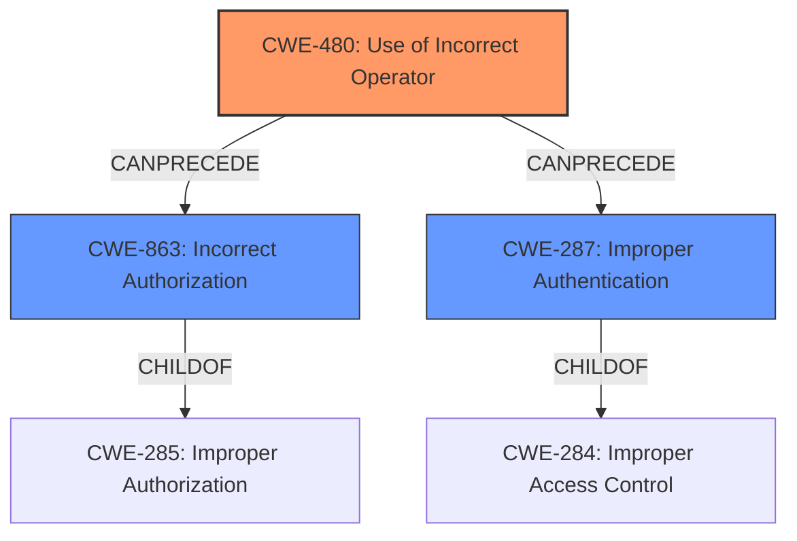

# Enhanced Analysis for CVE-2021-21276

# Summary
| CWE ID | CWE Name | Confidence | CWE Abstraction Level | CWE Vulnerability Mapping Label | CWE-Vulnerability Mapping Notes |
|---|---|---|---|---|---|
| CWE-480 | Use of Incorrect Operator | 1.0 | Base | Allowed | Primary CWE |
| CWE-863 | Incorrect Authorization | 0.5 | Class | Allowed-with-Review | Secondary Candidate |
| CWE-287 | Improper Authentication | 0.4 | Class | Discouraged | Secondary Candidate |

## Evidence and Confidence

*   **Confidence Score:** 0.8
*   **Evidence Strength:** HIGH

## Relationship Analysis
The primary CWE is CWE-480, a Base level weakness describing the **use of an incorrect operator**. This leads to **incorrect authorization** (CWE-863), a Class level weakness. **Improper Authentication** (CWE-287) is also a Class level weakness and a potential result of the incorrect operator. While CWE-863 and CWE-287 are related to authorization and authentication respectively, CWE-480 provides a more precise explanation of the **root cause** due to the **loose comparison**. Therefore, CWE-480 is chosen as the primary CWE with high confidence.



## Vulnerability Chain
The vulnerability chain starts with the **use of an incorrect operator** (CWE-480), specifically a **loose comparison (==)** instead of a strict comparison (===). This **leads to an incorrect authorization check** (CWE-863) in the setup process, allowing attackers to gain admin access. The **improper authentication** (CWE-287) during the setup process is bypassed due to the **incorrect operator**.

## Summary of Analysis
The primary weakness is the **use of an incorrect operator** (CWE-480), which directly **leads to the bypass of authentication and authorization checks**.
The vulnerability description clearly states that the **root cause** is a **"loose comparison (==) in SetupController"**. This aligns perfectly with the description of CWE-480: "The product accidentally uses the wrong operator, which changes the logic in security-relevant ways." The **impact** is that attackers can "gain admin access," indicating **incorrect authorization** (CWE-863) and **improper authentication** (CWE-287).

The selection of CWE-480 is based on the direct evidence of the **incorrect operator** and its **root cause** role in the vulnerability. CWE-863 and CWE-287 are considered secondary because they represent the impact of the **incorrect operator**, rather than the **root cause** itself. While CWE-863 and CWE-287 are more directly related to the impact (gaining admin access), CWE-480 explains *why* the access control was flawed.

The abstraction level of CWE-480 (Base) is optimal because it directly identifies the specific coding error that led to the vulnerability. Higher-level CWEs such as CWE-863 and CWE-287, while relevant, do not pinpoint the **root cause** as precisely.

The retriever results also list CWE-480 as the top candidate, further supporting its selection as the primary CWE.

Relevant CWE Information:

# Enhanced Context (25 CWEs)
The following CWEs were identified as potentially relevant to this vulnerability:

## CWE-472: External Control of Assumed-Immutable Web Parameter
This CWE was considered because the attacker is crafting a request with specific cookie headers to the /setup/finish endpoint. However, the **root cause** is the **loose comparison**, not the external control of parameters. Therefore, this CWE was not selected.

## CWE-639: Authorization Bypass Through User-Controlled Key
This CWE was considered because the attacker is crafting a request. However, the **root cause** is the **loose comparison**, not the user controlled key. Therefore, this CWE was not selected.

## CWE-807: Reliance on Untrusted Inputs in a Security Decision
This CWE was considered because the attacker is crafting a request. However, the **root cause** is the **loose comparison**, not the reliance on untrusted inputs. Therefore, this CWE was not selected.

## CWE-274: Improper Handling of Insufficient Privileges
This CWE was not selected because the problem is not about handling insufficient privileges, but rather the **incorrect operator** used.

## CWE-1220: Insufficient Granularity of Access Control
This CWE was not selected because the problem is not the granularity of access control, but the **incorrect operator** used.

## CWE-1289: Improper Validation of Unsafe Equivalence in Input
This CWE was considered because the attacker is crafting a request. However, the **root cause** is the **loose comparison**, not the improper validation of unsafe equivalence in input. Therefore, this CWE was not selected.

## CWE-280: Improper Handling of Insufficient Permissions or Privileges
This CWE was not selected because the problem is not about handling insufficient permissions, but rather the **incorrect operator** used.

## CWE-653: Improper Isolation or Compartmentalization
This CWE was not selected because the problem is not about isolation or compartmentalization, but rather the **incorrect operator** used.

## CWE-184: Incomplete List of Disallowed Inputs
This CWE was not selected because the problem is not about an incomplete list of disallowed inputs, but rather the **incorrect operator** used.

## CWE-74: Improper Neutralization of Special Elements in Output Used by a Downstream Component ('Injection')
This CWE was not selected because the vulnerability is not an injection issue, but rather the **incorrect operator** used.

## CWE-79: Improper Neutralization of Input During Web Page Generation ('Cross-site Scripting')
This CWE was not selected because the vulnerability is not related to cross-site scripting, but rather the **incorrect operator** used.

## CWE-1390: Weak Authentication
CWE-1390 was considered as a secondary CWE since the attacker bypasses authentication. However, the **root cause** is the **incorrect operator**, making CWE-480 a better primary fit.

## CWE-863: Incorrect Authorization
CWE-863 was considered as a secondary CWE since the attacker gains admin access due to the bypass. However, the **root cause** is the **incorrect operator**, making CWE-480 a better primary fit.

## CWE-287: Improper Authentication
CWE-287 was considered as a secondary CWE since the attacker bypasses authentication. However, the **root cause** is the **incorrect operator**, making CWE-480 a better primary fit.

## CWE-472: External Control of Assumed-Immutable Web Parameter
This CWE was considered because the attacker crafts a request to exploit the setup process. However, the **root cause** is the **loose comparison** (CWE-480) that allows the attacker to bypass the authorization check, not the external control of assumed-immutable parameters.

## CWE-79: Improper Neutralization of Input During Web Page Generation ('Cross-site Scripting')
This CWE was not selected because the vulnerability is not related to cross-site scripting, but rather the **incorrect operator** used.

## CWE-494: Download of Code Without Integrity Check
This CWE was not selected because the vulnerability does not involve downloading code without an integrity check.

## CWE-613: Insufficient Session Expiration
This CWE was not selected because the vulnerability does not relate to session expiration.

## CWE-178: Improper Handling of Case Sensitivity
This CWE was not selected because the vulnerability is not related to case sensitivity.

## CWE-202: Exposure of Sensitive Information Through Data Queries
This CWE was not selected because the vulnerability does not involve exposure of sensitive information through data queries.

## CWE-201: Insertion of Sensitive Information Into Sent Data
This CWE was not selected because the vulnerability does not involve inserting sensitive information into sent data.

## CWE-209: Generation of Error Message Containing Sensitive Information
This CWE was not selected because the vulnerability does not involve generation of error messages containing sensitive information.

## CWE-352: Cross-Site Request Forgery (CSRF)
This CWE was not selected because the vulnerability is not related to cross-site request forgery


## CWE Relationship Analysis

Current CWEs represent these abstraction levels: .


### Vulnerability Chain Analysis

**Chain starting from CWE-1220:**
- 1220 (Insufficient Granularity of Access Control) - ROOT


**Chain starting from CWE-184:**
- 184 (Incomplete List of Disallowed Inputs) - ROOT


### CWE Relationship Diagram

```mermaid
graph TD
    classDef primary fill:#f96,stroke:#333,stroke-width:2px
    classDef secondary fill:#69f,stroke:#333
    classDef tertiary fill:#9e9,stroke:#333
```