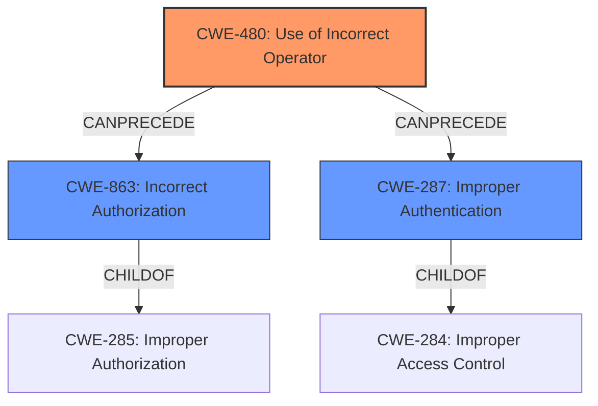

# Analysis for CVE-2021-21276

# Summary
| CWE ID | CWE Name | Confidence | CWE Abstraction Level | CWE Vulnerability Mapping Label | CWE-Vulnerability Mapping Notes |
|---|---|---|---|---|---|
| CWE-480 | Use of Incorrect Operator | 1.0 | Base | Allowed | Primary CWE |
| CWE-863 | Incorrect Authorization | 0.5 | Class | Allowed-with-Review | Secondary Candidate |
| CWE-287 | Improper Authentication | 0.4 | Class | Discouraged | Secondary Candidate |

## Evidence and Confidence

*   **Confidence Score:** 0.8
*   **Evidence Strength:** HIGH

## Relationship Analysis
The primary CWE is CWE-480, a Base level weakness describing the **use of an incorrect operator**. This leads to **incorrect authorization** (CWE-863), a Class level weakness. **Improper Authentication** (CWE-287) is also a Class level weakness and a potential result of the incorrect operator. While CWE-863 and CWE-287 are related to authorization and authentication respectively, CWE-480 provides a more precise explanation of the **root cause** due to the **loose comparison**. Therefore, CWE-480 is chosen as the primary CWE with high confidence.

## Vulnerability Chain
The vulnerability chain starts with the **use of an incorrect operator** (CWE-480), specifically a **loose comparison (==)** instead of a strict comparison (===). This **leads to an incorrect authorization check** (CWE-863) in the setup process, allowing attackers to gain admin access. The **improper authentication** (CWE-287) during the setup process is bypassed due to the **incorrect operator**.

## Summary of Analysis
The primary weakness is the **use of an incorrect operator** (CWE-480), which directly **leads to the bypass of authentication and authorization checks**.
The vulnerability description clearly states that the **root cause** is a **"loose comparison (==) in SetupController"**. This aligns perfectly with the description of CWE-480: "The product accidentally uses the wrong operator, which changes the logic in security-relevant ways." The **impact** is that attackers can "gain admin access," indicating **incorrect authorization** (CWE-863) and **improper authentication** (CWE-287).

The selection of CWE-480 is based on the direct evidence of the **incorrect operator** and its **root cause** role in the vulnerability. CWE-863 and CWE-287 are considered secondary because they represent the impact of the **incorrect operator**, rather than the **root cause** itself. While CWE-863 and CWE-287 are more directly related to the impact (gaining admin access), CWE-480 explains *why* the access control was flawed.

The abstraction level of CWE-480 (Base) is optimal because it directly identifies the specific coding error that led to the vulnerability. Higher-level CWEs such as CWE-863 and CWE-287, while relevant, do not pinpoint the **root cause** as precisely.

The retriever results also list CWE-480 as the top candidate, further supporting its selection as the primary CWE.

Relevant CWE Information:

# Enhanced Context (25 CWEs)
The following CWEs were identified as potentially relevant to this vulnerability:

## CWE-472: External Control of Assumed-Immutable Web Parameter
This CWE was considered because the attacker is crafting a request with specific cookie headers to the /setup/finish endpoint. However, the **root cause** is the **loose comparison**, not the external control of parameters. Therefore, this CWE was not selected.

## CWE-639: Authorization Bypass Through User-Controlled Key
This CWE was considered because the attacker is crafting a request. However, the **root cause** is the **loose comparison**, not the user controlled key. Therefore, this CWE was not selected.

## CWE-807: Reliance on Untrusted Inputs in a Security Decision
This CWE was considered because the attacker is crafting a request. However, the **root cause** is the **loose comparison**, not the reliance on untrusted inputs. Therefore, this CWE was not selected.

## CWE-274: Improper Handling of Insufficient Privileges
This CWE was not selected because the problem is not about handling insufficient privileges, but rather the **incorrect operator** used.

## CWE-1220: Insufficient Granularity of Access Control
This CWE was not selected because the problem is not the granularity of access control, but the **incorrect operator** used.

## CWE-1289: Improper Validation of Unsafe Equivalence in Input
This CWE was considered because the attacker is crafting a request. However, the **root cause** is the **loose comparison**, not the improper validation of unsafe equivalence in input. Therefore, this CWE was not selected.

## CWE-280: Improper Handling of Insufficient Permissions or Privileges
This CWE was not selected because the problem is not about handling insufficient permissions, but rather the **incorrect operator** used.

## CWE-653: Improper Isolation or Compartmentalization
This CWE was not selected because the problem is not about isolation or compartmentalization, but rather the **incorrect operator** used.

## CWE-184: Incomplete List of Disallowed Inputs
This CWE was not selected because the problem is not about an incomplete list of disallowed inputs, but rather the **incorrect operator** used.

## CWE-74: Improper Neutralization of Special Elements in Output Used by a Downstream Component ('Injection')
This CWE was not selected because the vulnerability is not an injection issue, but rather the **incorrect operator** used.

## CWE-79: Improper Neutralization of Input During Web Page Generation ('Cross-site Scripting')
This CWE was not selected because the vulnerability is not related to cross-site scripting, but rather the **incorrect operator** used.

## CWE-1390: Weak Authentication
CWE-1390 was considered as a secondary CWE since the attacker bypasses authentication. However, the **root cause** is the **incorrect operator**, making CWE-480 a better primary fit.

## CWE-863: Incorrect Authorization
CWE-863 was considered as a secondary CWE since the attacker gains admin access due to the bypass. However, the **root cause** is the **incorrect operator**, making CWE-480 a better primary fit.

## CWE-287: Improper Authentication
CWE-287 was considered as a secondary CWE since the attacker bypasses authentication. However, the **root cause** is the **incorrect operator**, making CWE-480 a better primary fit.

## CWE-472: External Control of Assumed-Immutable Web Parameter
This CWE was considered because the attacker crafts a request to exploit the setup process. However, the **root cause** is the **loose comparison** (CWE-480) that allows the attacker to bypass the authorization check, not the external control of assumed-immutable parameters.

## CWE-79: Improper Neutralization of Input During Web Page Generation ('Cross-site Scripting')
This CWE was not selected because the vulnerability is not related to cross-site scripting, but rather the **incorrect operator** used.

## CWE-494: Download of Code Without Integrity Check
This CWE was not selected because the vulnerability does not involve downloading code without an integrity check.

## CWE-613: Insufficient Session Expiration
This CWE was not selected because the vulnerability does not relate to session expiration.

## CWE-178: Improper Handling of Case Sensitivity
This CWE was not selected because the vulnerability is not related to case sensitivity.

## CWE-202: Exposure of Sensitive Information Through Data Queries
This CWE was not selected because the vulnerability does not involve exposure of sensitive information through data queries.

## CWE-201: Insertion of Sensitive Information Into Sent Data
This CWE was not selected because the vulnerability does not involve inserting sensitive information into sent data.

## CWE-209: Generation of Error Message Containing Sensitive Information
This CWE was not selected because the vulnerability does not involve generation of error messages containing sensitive information.

## CWE-352: Cross-Site Request Forgery (CSRF)
This CWE was not selected because the vulnerability is not related to cross-site request forgery

# Enhanced Query for CVE-2021-21276

## Vulnerability Description
Polr is an open source URL shortener. in Polr before version 2.3.0, a vulnerability in the setup process allows attackers to gain admin access to site instances, even if they do not possess an existing account. This vulnerability exists regardless of users settings. If an attacker crafts a request with specific cookie headers to the /setup/finish endpoint, they may be able to obtain admin privileges on the instance. This is caused by a **loose comparison (==) in SetupController** that is susceptible to attack. The project has been patched to ensure that a strict comparison (===) is used to verify the setup key, and that /setup/finish verifies that no users table exists before performing any migrations or provisioning any new accounts. This is fixed in version 2.3.0. Users can patch this vulnerability without upgrading by adding abort(404) to the very first line of finishSetup in SetupController.php.

### Vulnerability Description Key Phrases
- **rootcause:** **loose comparison (==) in SetupController**
- **impact:** gain admin access
- **vector:** request with specific cookie headers to /setup/finish endpoint
- **attacker:** attackers
- **product:** Polr
- **version:** before 2.3.0
- **component:** setup process

## CVE Reference Links Content Summary
Based on the provided content, here's a breakdown of the vulnerability:

**Root Cause:**
- The vulnerability lies in the `SetupController.php` file, specifically within the `finishSetup` function. The initial implementation used a loose comparison (`==`) to verify the setup key, which is vulnerable to type juggling. This allowed attackers to bypass the authorization check.

**Weaknesses/Vulnerabilities:**
- **Insecure Type Comparison:** Using `==` instead of `===` for comparing the setup authentication key allowed type juggling, enabling attackers to bypass the authorization check.
- **Missing Table Existence Check:**  The `finishSetup` function did not initially check if the `users` table existed before proceeding with setup. This allowed an attacker to re-run setup and create a new admin user, even if setup had been previously completed.

**Impact of Exploitation:**
- **Privilege Escalation:** Attackers could gain administrative access to Polr instances, even without existing accounts. This would enable them to control the application, including adding, modifying, or deleting user data, changing configurations, and potentially executing code on the server.

**Attack Vectors:**
- **Crafted HTTP Request:** The attacker must craft a malicious HTTP request with specific cookie headers to the `/setup/finish` endpoint. Specifically, they need to control the values of `setup_arguments` cookie.

**Required Attacker Capabilities/Position:**
- **Network Access:** The attacker needs to be able to send HTTP requests to the target Polr instance.
- **Knowledge of Setup Process:** The attacker needs knowledge of the Polr setup process and the structure of the `setup_arguments` cookie.

**Additional Notes:**
- The vulnerability was patched by changing the loose comparison (`==`) to a strict comparison (`===`) in `SetupController.php`. Additionally, a check was added to ensure that the `users` table does not already exist before proceeding with database migrations or creating new accounts.
- A workaround was provided for users unable to upgrade: adding `abort(404)` at the beginning of the `finishSetup` function in `SetupController.php` would prevent the vulnerable code path from being executed.
- The affected versions are below 2.3.0, and the patched version is 2.3.0.
- The CVE ID for this vulnerability is CVE-2021-21276.

## Retriever Results

### Top Combined Results

| Rank | CWE ID | Name | Abstraction | Usage  | Retrievers | Individual Scores |
|------|--------|------|-------------|-------|------------|-------------------|
| 1 | 480 | Use of Incorrect Operator | Base | Allowed | sparse | 1.696 |
| 2 | 1390 | Weak Authentication | Class | Allowed-with-Review | sparse | 0.856 |
| 3 | 306 | Missing Authentication for Critical Function | Base | Allowed | sparse | 0.846 |
| 4 | 863 | Incorrect Authorization | Class | Allowed-with-Review | sparse | 0.841 |
| 5 | 287 | Improper Authentication | Class | Discouraged | sparse | 0.839 |
| 6 | 472 | External Control of Assumed-Immutable Web Parameter | Base | Allowed | dense | 0.460 |
| 7 | 613 | Insufficient Session Expiration | Base | Allowed | graph | 0.002 |
| 8 | 201 | Insertion of Sensitive Information Into Sent Data | Base | Allowed | sparse | 0.825 |
| 9 | 79 | Improper Neutralization of Input During Web Page Generation ('Cross-site Scripting') | Base | Allowed | sparse | 0.818 |
| 10 | 285 | Improper Authorization | Class | Discouraged | sparse | 0.808 |

# Complete CWE Specifications

## CWE-480: Use of Incorrect Operator
**Abstraction:** Base
**Status:** Draft

### Description
The product accidentally uses the wrong operator, which changes the logic in security-relevant ways.

### Extended Description
These types of errors are generally the result of a typo by the programmer.

### Alternative Terms
None

### Relationships
ChildOf -> CWE-670

### Mapping Guidance
**Usage:** Allowed
**Rationale:** This CWE entry is at the Base level of abstraction, which is a preferred level of abstraction for mapping to the root causes of vulnerabilities.
**Comments:** Carefully read both the name and description to ensure that this mapping is an appropriate fit. Do not try to 'force' a mapping to a lower-level Base/Variant simply to comply with this preferred level of abstraction.
**Reasons:**
- Acceptable-Use

### Observed Examples
- **CVE-2022-3979:** Chain: data visualization program written in PHP uses the "!=" operator instead of the type-strict "!==" operator (CWE-480) when validating hash values, potentially leading to an incorrect type conversion (CWE-704)
- **CVE-2021-3116:** Chain: Python-based HTTP Proxy server uses the wrong boolean operators (CWE-480) causing an incorrect comparison (CWE-697) that identifies an authN failure if all three conditions are met instead of only one, allowing bypass of the proxy authentication (CWE-1390)

## CWE-1390: Weak Authentication
**Abstraction:** Class
**Status:** Incomplete

### Description
The product uses an authentication mechanism to restrict access to specific users or identities, but the mechanism does not sufficiently prove that the claimed identity is correct.

### Extended Description

Attackers may be able to bypass weak authentication faster and/or with less effort than expected.

### Alternative Terms
None

### Relationships
ChildOf -> CWE-287

### Mapping Guidance
**Usage:** Allowed-with-Review
**Rationale:** This CWE entry is a Class and might have Base-level children that would be more appropriate
**Comments:** Examine children of this entry to see if there is a better fit
**Reasons:**
- Abstraction

### Observed Examples
- **CVE-2022-30034:** Chain: Web UI for a Python RPC framework does not use regex anchors to validate user login emails (CWE-777), potentially allowing bypass of OAuth (CWE-1390).
- **CVE-2022-35248:** Chat application skips validation when Central Authentication Service (CAS) is enabled, effectively removing the second factor from two-factor authentication
- **CVE-2021-3116:** Chain: Python-based HTTP Proxy server uses the wrong boolean operators (CWE-480) causing an incorrect comparison (CWE-697) that identifies an authN failure if all three conditions are met instead of only one, allowing bypass of the proxy authentication (CWE-1390)

## CWE-306: Missing Authentication for Critical Function
**Abstraction:** Base
**Status:** Draft

### Description
The product does not perform any authentication for functionality that requires a provable user identity or consumes a significant amount of resources.

### Extended Description
Not provided

### Alternative Terms
None

### Relationships
ChildOf -> CWE-287
ChildOf -> CWE-287

### Mapping Guidance
**Usage:** Allowed
**Rationale:** This CWE entry is at the Base level of abstraction, which is a preferred level of abstraction for mapping to the root causes of vulnerabilities.
**Comments:** Carefully read both the name and description to ensure that this mapping is an appropriate fit. Do not try to 'force' a mapping to a lower-level Base/Variant simply to comply with this preferred level of abstraction.
**Reasons:**
- Acceptable-Use

### Observed Examples
- **CVE-2022-31260:** Chain: a digital asset management program has an undisclosed backdoor in the legacy version of a PHP script (CWE-912) that could allow an unauthenticated user to export metadata (CWE-306)
- **CVE-2022-29951:** TCP-based protocol in Programmable Logic Controller (PLC) has no authentication.
- **CVE-2022-29952:** Condition Monitor firmware uses a protocol that does not require authentication.

## CWE-863: Incorrect Authorization
**Abstraction:** Class
**Status:** Incomplete

### Description
The product performs an authorization check when an actor attempts to access a resource or perform an action, but it does not correctly perform the check.

### Extended Description
Not provided

### Alternative Terms
AuthZ: "AuthZ" is typically used as an abbreviation of "authorization" within the web application security community. It is distinct from "AuthN" (or, sometimes, "AuthC") which is an abbreviation of "authentication." The use of "Auth" as an abbreviation is discouraged, since it could be used for either authentication or authorization.

### Relationships
ChildOf -> CWE-285
ChildOf -> CWE-284

### Mapping Guidance
**Usage:** Allowed-with-Review
**Rationale:** This CWE entry is a Class and might have Base-level children that would be more appropriate
**Comments:** Examine children of this entry to see if there is a better fit
**Reasons:**
- Abstraction

### Additional Notes
**[Terminology]** 

Assuming a user with a given identity, authorization is the process of determining whether that user can access a given resource, based on the user's privileges and any permissions or other access-control specifications that apply to the resource.

### Observed Examples
- **CVE-2021-39155:** Chain: A microservice integration and management platform compares the hostname in the HTTP Host header in a case-sensitive way (CWE-178, CWE-1289), allowing bypass of the authorization policy (CWE-863) using a hostname with mixed case or other variations.
- **CVE-2019-15900:** Chain: sscanf() call is used to check if a username and group exists, but the return value of sscanf() call is not checked (CWE-252), causing an uninitialized variable to be checked (CWE-457), returning success to allow authorization bypass for executing a privileged (CWE-863).
- **CVE-2009-2213:** Gateway uses default "Allow" configuration for its authorization settings.

## CWE-287: Improper Authentication
**Abstraction:** Class
**Status:** Draft

### Description
When an actor claims to have a given identity, the product does not prove or insufficiently proves that the claim is correct.

### Extended Description
Not provided

### Alternative Terms
authentification: An alternate term is "authentification", which appears to be most commonly used by people from non-English-speaking countries.
AuthN: "AuthN" is typically used as an abbreviation of "authentication" within the web application security community. It is also distinct from "AuthZ," which is an abbreviation of "authorization." The use of "Auth" as an abbreviation is discouraged, since it could be used for either authentication or authorization.
AuthC: "AuthC" is used as an abbreviation of "authentication," but it appears to used less frequently than "AuthN."

### Relationships
ChildOf -> CWE-284
ChildOf -> CWE-284

### Mapping Guidance
**Usage:** Discouraged
**Rationale:** This CWE entry might be misused when lower-level CWE entries are likely to be applicable. It is a level-1 Class (i.e., a child of a Pillar).
**Comments:** Consider children or descendants, beginning with CWE-1390: Weak Authentication or CWE-306: Missing Authentication for Critical Function.
**Reasons:**
- Frequent Misuse
**Suggested Alternatives:**
- CWE-1390: Weak Authentication
- CWE-306: Missing Authentication for Critical Function

### Additional Notes
**[Relationship]** This can be resultant from SQL injection vulnerabilities and other issues.

**[Maintenance]** The Taxonomy_Mappings to ISA/IEC 62443 were added in CWE 4.10, but they are still under review and might change in future CWE versions. These draft mappings were performed by members of the "Mapping CWE to 62443" subgroup of the CWE-CAPEC ICS/OT Special Interest Group (SIG), and their work is incomplete as of CWE 4.10. The mappings are included to facilitate discussion and review by the broader ICS/OT community, and they are likely to change in future CWE versions.

### Observed Examples
- **CVE-2022-35248:** Chat application skips validation when Central Authentication Service (CAS) is enabled, effectively removing the second factor from two-factor authentication
- **CVE-2022-36436:** Python-based authentication proxy does not enforce password authentication during the initial handshake, allowing the client to bypass authentication by specifying a 'None' authentication type.
- **CVE-2022-30034:** Chain: Web UI for a Python RPC framework does not use regex anchors to validate user login emails (CWE-777), potentially allowing bypass of OAuth (CWE-1390).

## CWE-472: External Control of Assumed-Immutable Web Parameter
**Abstraction:** Base
**Status:** Draft

### Description
The web application does not sufficiently verify inputs that are assumed to be immutable but are actually externally controllable, such as hidden form fields.

### Extended Description

If a web product does not properly protect assumed-immutable values from modification in hidden form fields, parameters, cookies, or URLs, this can lead to modification of critical data. Web applications often mistakenly make the assumption that data passed to the client in hidden fields or cookies is not susceptible to tampering. Improper validation of data that are user-controllable can lead to the application processing incorrect, and often malicious, input.

For example, custom cookies commonly store session data or persistent data across sessions. This kind of session data is normally involved in security related decisions on the server side, such as user authentication and access control. Thus, the cookies might contain sensitive data such as user credentials and privileges. This is a dangerous practice, as it can often lead to improper reliance on the value of the client-provided cookie by the server side application.

### Alternative Terms
Assumed-Immutable Parameter Tampering

### Relationships
ChildOf -> CWE-642
ChildOf -> CWE-471

### Mapping Guidance
**Usage:** Allowed
**Rationale:** This CWE entry is at the Base level of abstraction, which is a preferred level of abstraction for mapping to the root causes of vulnerabilities.
**Comments:** Carefully read both the name and description to ensure that this mapping is an appropriate fit. Do not try to 'force' a mapping to a lower-level Base/Variant simply to comply with this preferred level of abstraction.
**Reasons:**
- Acceptable-Use

### Additional Notes
**[Relationship]** This is a primary weakness for many other weaknesses and functional consequences, including XSS, SQL injection, path disclosure, and file inclusion.

**[Theoretical]** This is a technology-specific MAID problem.

### Observed Examples
- **CVE-2002-0108:** Forum product allows spoofed messages of other users via hidden form fields for name and e-mail address.
- **CVE-2000-0253:** Shopping cart allows price modification via hidden form field.
- **CVE-2000-0254:** Shopping cart allows price modification via hidden form field.

## CWE-613: Insufficient Session Expiration
**Abstraction:** Base
**Status:** Incomplete

### Description
According to WASC, "Insufficient Session Expiration is when a web site permits an attacker to reuse old session credentials or session IDs for authorization."

### Extended Description
Not provided

### Alternative Terms
None

### Relationships
ChildOf -> CWE-672
ChildOf -> CWE-672
CanPrecede -> CWE-287

### Mapping Guidance
**Usage:** Allowed
**Rationale:** This CWE entry is at the Base level of abstraction, which is a preferred level of abstraction for mapping to the root causes of vulnerabilities.
**Comments:** Carefully read both the name and description to ensure that this mapping is an appropriate fit. Do not try to 'force' a mapping to a lower-level Base/Variant simply to comply with this preferred level of abstraction.
**Reasons:**
- Acceptable-Use

### Additional Notes
**[Other]** The lack of proper session expiration may improve the likely success of certain attacks. For example, an attacker may intercept a session ID, possibly via a network sniffer or Cross-site Scripting attack. Although short session expiration times do not help if a stolen token is immediately used, they will protect against ongoing replaying of the session ID. In another scenario, a user might access a web site from a shared computer (such as at a library, Internet cafe, or open work environment). Insufficient Session Expiration could allow an attacker to use the browser's back button to access web pages previously accessed by the victim.

## CWE-201: Insertion of Sensitive Information Into Sent Data
**Abstraction:** Base
**Status:** Draft

### Description
The code transmits data to another actor, but a portion of the data includes sensitive information that should not be accessible to that actor.

### Extended Description
Not provided

### Alternative Terms
None

### Relationships
ChildOf -> CWE-200
CanAlsoBe -> CWE-209
CanAlsoBe -> CWE-202

### Mapping Guidance
**Usage:** Allowed
**Rationale:** This CWE entry is at the Base level of abstraction, which is a preferred level of abstraction for mapping to the root causes of vulnerabilities.
**Comments:** Carefully read both the name and description to ensure that this mapping is an appropriate fit. Do not try to 'force' a mapping to a lower-level Base/Variant simply to comply with this preferred level of abstraction.
**Reasons:**
- Acceptable-Use

### Additional Notes
**[Other]** Sensitive information could include data that is sensitive in and of itself (such as credentials or private messages), or otherwise useful in the further exploitation of the system (such as internal file system structure).

### Observed Examples
- **CVE-2022-0708:** Collaboration platform does not clear team emails in a response, allowing leak of email addresses

## CWE-79: Improper Neutralization of Input During Web Page Generation ('Cross-site Scripting')
**Abstraction:** Base
**Status:** Stable

### Description
The product does not neutralize or incorrectly neutralizes user-controllable input before it is placed in output that is used as a web page that is served to other users.

### Extended Description

Cross-site scripting (XSS) vulnerabilities occur when:

  1. Untrusted data enters a web application, typically from a web request.

  1. The web application dynamically generates a web page that contains this untrusted data.

  1. During page generation, the application does not prevent the data from containing content that is executable by a web browser, such as JavaScript, HTML tags, HTML attributes, mouse events, Flash, ActiveX, etc.

  1. A victim visits the generated web page through a web browser, which contains malicious script that was injected using the untrusted data.

  1. Since the script comes from a web page that was sent by the web server, the victim's web browser executes the malicious script in the context of the web server's domain.

  1. This effectively violates the intention of the web browser's same-origin policy, which states that scripts in one domain should not be able to access resources or run code in a different domain.

There are three main kinds of XSS:

  -  **Type 1: Reflected XSS (or Non-Persistent)**  - The server reads data directly from the HTTP request and reflects it back in the HTTP response. Reflected XSS exploits occur when an attacker causes a victim to supply dangerous content to a vulnerable web application, which is then reflected back to the victim and executed by the web browser. The most common mechanism for delivering malicious content is to include it as a parameter in a URL that is posted publicly or e-mailed directly to the victim. URLs constructed in this manner constitute the core of many phishing schemes, whereby an attacker convinces a victim to visit a URL that refers to a vulnerable site. After the site reflects the attacker's content back to the victim, the content is executed by the victim's browser.

  -  **Type 2: Stored XSS (or Persistent)**  - The application stores dangerous data in a database, message forum, visitor log, or other trusted data store. At a later time, the dangerous data is subsequently read back into the application and included in dynamic content. From an attacker's perspective, the optimal place to inject malicious content is in an area that is displayed to either many users or particularly interesting users. Interesting users typically have elevated privileges in the application or interact with sensitive data that is valuable to the attacker. If one of these users executes malicious content, the attacker may be able to perform privileged operations on behalf of the user or gain access to sensitive data belonging to the user. For example, the attacker might inject XSS into a log message, which might not be handled properly when an administrator views the logs. 

  -  **Type 0: DOM-Based XSS**  - In DOM-based XSS, the client performs the injection of XSS into the page; in the other types, the server performs the injection. DOM-based XSS generally involves server-controlled, trusted script that is sent to the client, such as Javascript that performs sanity checks on a form before the user submits it. If the server-supplied script processes user-supplied data and then injects it back into the web page (such as with dynamic HTML), then DOM-based XSS is possible. 

Once the malicious script is injected, the attacker can perform a variety of malicious activities. The attacker could transfer private information, such as cookies that may include session information, from the victim's machine to the attacker. The attacker could send malicious requests to a web site on behalf of the victim, which could be especially dangerous to the site if the victim has administrator privileges to manage that site. Phishing attacks could be used to emulate trusted web sites and trick the victim into entering a password, allowing the attacker to compromise the victim's account on that web site. Finally, the script could exploit a vulnerability in the web browser itself possibly taking over the victim's machine, sometimes referred to as "drive-by hacking."

In many cases, the attack can be launched without the victim even being aware of it. Even with careful users, attackers frequently use a variety of methods to encode the malicious portion of the attack, such as URL encoding or Unicode, so the request looks less suspicious.

### Alternative Terms
XSS: A common abbreviation for Cross-Site Scripting.
HTML Injection: Used as a synonym of stored (Type 2) XSS.
CSS: In the early years after initial discovery of XSS, "CSS" was a commonly-used acronym. However, this would cause confusion with "Cascading Style Sheets," so usage of this acronym has declined significantly.

### Relationships
ChildOf -> CWE-74
ChildOf -> CWE-74
CanPrecede -> CWE-494
PeerOf -> CWE-352

### Mapping Guidance
**Usage:** Allowed
**Rationale:** This CWE entry is at the Base level of abstraction, which is a preferred level of abstraction for mapping to the root causes of vulnerabilities.
**Comments:** Carefully read both the name and description to ensure that this mapping is an appropriate fit. Do not try to 'force' a mapping to a lower-level Base/Variant simply to comply with this preferred level of abstraction.
**Reasons:**
- Acceptable-Use

### Additional Notes
**[Relationship]** 

There can be a close relationship between XSS and CSRF (CWE-352). An attacker might use CSRF in order to trick the victim into submitting requests to the server in which the requests contain an XSS payload. A well-known example of this was the Samy worm on MySpace [REF-956]. The worm used XSS to insert malicious HTML sequences into a user's profile and add the attacker as a MySpace friend. MySpace friends of that victim would then execute the payload to modify their own profiles, causing the worm to propagate exponentially. Since the victims did not intentionally insert the malicious script themselves, CSRF was a root cause.

**[Applicable Platform]** 

XSS flaws are very common in web applications, since they require a great deal of developer discipline to avoid them.

### Observed Examples
- **CVE-2021-25926:** Python Library Manager did not sufficiently neutralize a user-supplied search term, allowing reflected XSS.
- **CVE-2021-25963:** Python-based e-commerce platform did not escape returned content on error pages, allowing for reflected Cross-Site Scripting attacks.
- **CVE-2021-1879:** Universal XSS in mobile operating system, as exploited in the wild per CISA KEV.

## CWE-285: Improper Authorization
**Abstraction:** Class
**Status:** Draft

### Description
The product does not perform or incorrectly performs an authorization check when an actor attempts to access a resource or perform an action.

### Extended Description

Assuming a user with a given identity, authorization is the process of determining whether that user can access a given resource, based on the user's privileges and any permissions or other access-control specifications that apply to the resource.

When access control checks are not applied consistently - or not at all - users are able to access data or perform actions that they should not be allowed to perform. This can lead to a wide range of problems, including information exposures, denial of service, and arbitrary code execution.

### Alternative Terms
AuthZ: "AuthZ" is typically used as an abbreviation of "authorization" within the web application security community. It is distinct from "AuthN" (or, sometimes, "AuthC") which is an abbreviation of "authentication." The use of "Auth" as an abbreviation is discouraged, since it could be used for either authentication or authorization.

### Relationships
ChildOf -> CWE-284
ChildOf -> CWE-284

### Mapping Guidance
**Usage:** Discouraged
**Rationale:** CWE-285 is high-level and lower-level CWEs can frequently be used instead. It is a level-1 Class (i.e., a child of a Pillar).
**Comments:** Look at CWE-285's children and consider mapping to CWEs such as CWE-862: Missing Authorization, CWE-863: Incorrect Authorization, CWE-732: Incorrect Permission Assignment for Critical Resource, or others.
**Reasons:**
- Abstraction
**Suggested Alternatives:**
- CWE-862: Missing Authorization
- CWE-863: Incorrect Authorization
- CWE-732: Incorrect Permission Assignment for Critical Resource

### Observed Examples
- **CVE-2022-24730:** Go-based continuous deployment product does not check that a user has certain privileges to update or create an app, allowing adversaries to read sensitive repository information
- **CVE-2009-3168:** Web application does not restrict access to admin scripts, allowing authenticated users to reset administrative passwords.
- **CVE-2009-2960:** Web application does not restrict access to admin scripts, allowing authenticated users to modify passwords of other users.

