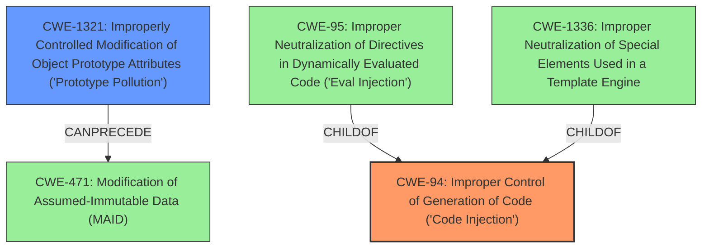

# Analysis Report for CVE-2021-21277

# Vulnerability Analysis Report: CVE-2021-21277

## Description


## Analysis (with Relationship Data)

# Summary
| CWE ID | CWE Name | Confidence | CWE Abstraction Level | CWE Vulnerability Mapping Label | CWE-Vulnerability Mapping Notes |
|---|---|---|---|---|---|
| CWE-94 | Improper Control of Generation of Code ('Code Injection') | 0.9 | Base | Allowed-with-Review | Primary CWE. The application constructs code from user-controlled input without proper sanitization. |
| CWE-1321 | Improperly Controlled Modification of Object Prototype Attributes ('Prototype Pollution') | 0.7 | Variant | Allowed | Secondary CWE. The vulnerability leverages prototype pollution to bypass security measures. |

## Evidence and Confidence

*   **Confidence Score:** 0.8
*   **Evidence Strength:** HIGH

## Relationship Analysis
The primary CWE is CWE-94, representing the root cause of the vulnerability, where code is generated unsafely from user input. CWE-1321 is a secondary weakness, showing how the prototype pollution is used to bypass security measures. CWE-94 is a base class of CWE-95 and CWE-1336, which are related to code injection and template injection, respectively. CWE-1321 can precede CWE-471 (Modification of Assumed-Immutable Data). The base level of abstraction is selected for CWE-94 due to it being the direct cause of the vulnerability. The variant level of abstraction is selected for CWE-1321 as it represents a more specific way to achieve the code injection.



## Vulnerability Chain
The vulnerability chain starts with **improper handling of user-controlled input**, leading to the construction of a code segment. This bypasses security measures using **prototype pollution**, ultimately resulting in **remote code execution**.

## Summary of Analysis
The initial assessment focused on identifying the root cause of the vulnerability, which is the **improper control of code generation** using user input. The vulnerability description clearly states that the `expressions.compile()` function is vulnerable to remote code execution due to a lack of proper input sanitization. The "CVE Reference Links Content Summary" confirms that the **root cause** is the **lack of input sanitization** and the ability to inject malicious code via `userControlledInput`. The use of `.constructor.constructor` technique further supports the choice of CWE-1321 as a secondary weakness.

The graph relationships highlight the hierarchical connections, with CWE-94 being a parent of more specific code injection types. The MITRE mapping guidance for CWE-94 suggests reviewing the entry due to frequent misuse, but in this case, the vulnerability clearly involves constructing a code segment from user input. The retriever results also support the selection of CWE-94, with a high relevance score.

CWE-1321 is chosen because the description says the vulnerability could be bypassed by using a `.constructor.constructor` technique, which is prototype pollution.

The selection of CWE-94 and CWE-1321 is at the optimal level of specificity because they directly represent the root cause and the bypass mechanism of the vulnerability, respectively.

Relevant CWE Information:

**CWE-94: Improper Control of Generation of Code ('Code Injection')**: The product constructs a code segment from user input without proper sanitization, allowing for arbitrary code execution. The security implication is that an attacker can inject malicious code that will be executed by the application.

**CWE-1321: Improperly Controlled Modification of Object Prototype Attributes ('Prototype Pollution')**: The vulnerability leverages prototype pollution to bypass security measures and inject malicious code. The security implication is that an attacker can modify object attributes to execute arbitrary code.


## CWE Relationship Analysis

Current CWEs represent these abstraction levels: .


### Vulnerability Chain Analysis

**Chain starting from CWE-1336:**
- 1336 (Improper Neutralization of Special Elements Used in a Template Engine) - ROOT


**Chain starting from CWE-95:**
- 95 (Improper Neutralization of Directives in Dynamically Evaluated Code ('Eval Injection')) - ROOT


### CWE Relationship Diagram

```mermaid
graph TD
    classDef primary fill:#f96,stroke:#333,stroke-width:2px
    classDef secondary fill:#69f,stroke:#333
    classDef tertiary fill:#9e9,stroke:#333
```


*Report generated on 2025-04-02 17:27:08*
