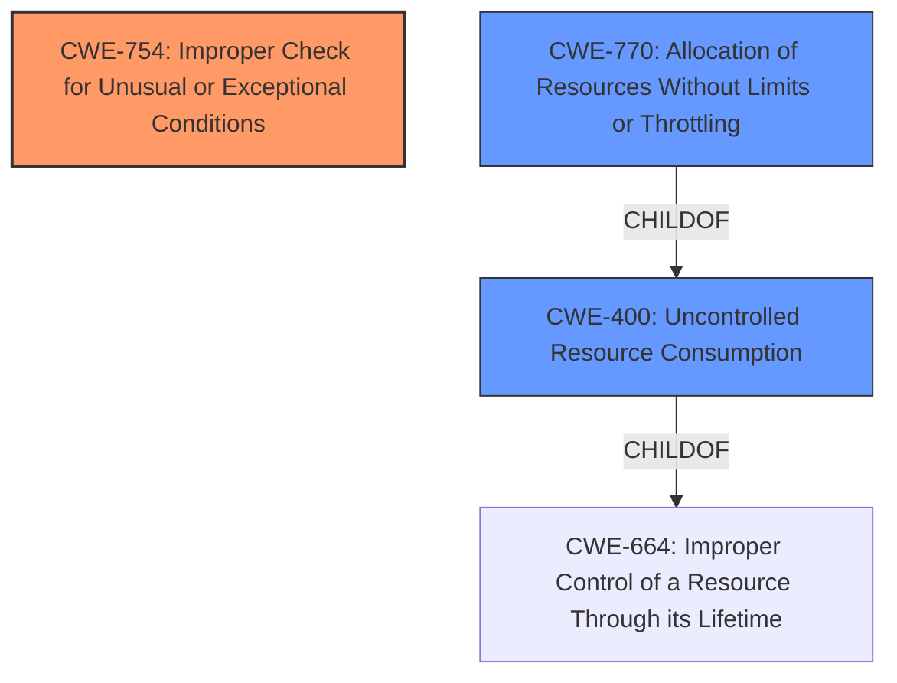

# Analysis for CVE-2021-21285

# Summary
| CWE ID  | CWE Name                                                                                           | Confidence | CWE Abstraction Level | CWE Vulnerability Mapping Label | CWE-Vulnerability Mapping Notes |
| :-------- | :-------------------------------------------------------------------------------------------------- | :---------- | :---------------------- | :------------------------------ | :------------------------------ |
| CWE-754 | Improper Check for Unusual or Exceptional Conditions                                                | 0.95      | Class                    | Primary CWE                     | Allowed-with-Review             |
| CWE-400 | Uncontrolled Resource Consumption                                                                  | 0.85      | Class                    | Secondary Candidate             | Discouraged                    |
| CWE-770 | Allocation of Resources Without Limits or Throttling                                                | 0.75      | Base                  | Secondary Candidate             | Allowed                   |

## Evidence and Confidence

*   **Confidence Score:** 0.90
*   **Evidence Strength:** HIGH

## Relationship Analysis
The primary CWE is CWE-754, representing the **improper check** for the unusual condition of a malformed Docker image manifest. CWE-400 and CWE-770 are related because the **lack of proper checks** leads to **uncontrolled resource consumption** and **allocation without limits**. CWE-754 is a more direct representation of the **root cause**, while CWE-400 and CWE-770 describe the impact of that **missing check**.

## Vulnerability Chain
The vulnerability chain starts with a **malformed Docker image manifest**. Due to an **improper check for unusual or exceptional conditions (CWE-754)**, the Docker daemon attempts to process this manifest, leading to **uncontrolled resource consumption (CWE-400)**. Ultimately, this results in the **crashing of the dockerd daemon**, a denial-of-service condition.

## Summary of Analysis
Initially, CWE-400 seemed like a strong candidate due to the denial-of-service impact. However, after closer review, the **root cause** is the **missing check for the malformed manifest**, which allows the resource consumption to occur in the first place. Therefore, CWE-754 is the more accurate primary classification. CWE-770 is a more specific Base level CWE related to resource allocation but it is the result of missing the check.

The vulnerability description states, "a vulnerability in which pulling an intentionally malformed Docker image manifest crashes the dockerd daemon." The CVE Reference Links Content Summary confirms this, stating, "The primary weakness is the **lack of proper validation** and error handling when parsing and processing image manifests during a pull request."

CWE-754 is chosen because the **root cause** is the **improper check for unusual or exceptional conditions**. The "Complete CWE Specifications" for CWE-754 says, "The product does not check or incorrectly checks for unusual or exceptional conditions that are not expected to occur frequently during day to day operation of the product."

The Retriever Results identified CWE-754 as the top match, and the analysis of the vulnerability and the surrounding evidence supports this finding. The relationship data and usage guidance also influenced the choice. The abstraction level of Class for CWE-754 is deemed appropriate because the weakness is a general lack of checking, and further specialization isn't readily available.

CWE-20 was considered, but it is too general and is discouraged by its Mapping Guidance. CWE-770 was considered as well because it refers to allocation of resources without limits, but CWE-754 is the more direct representation of the **root cause**.