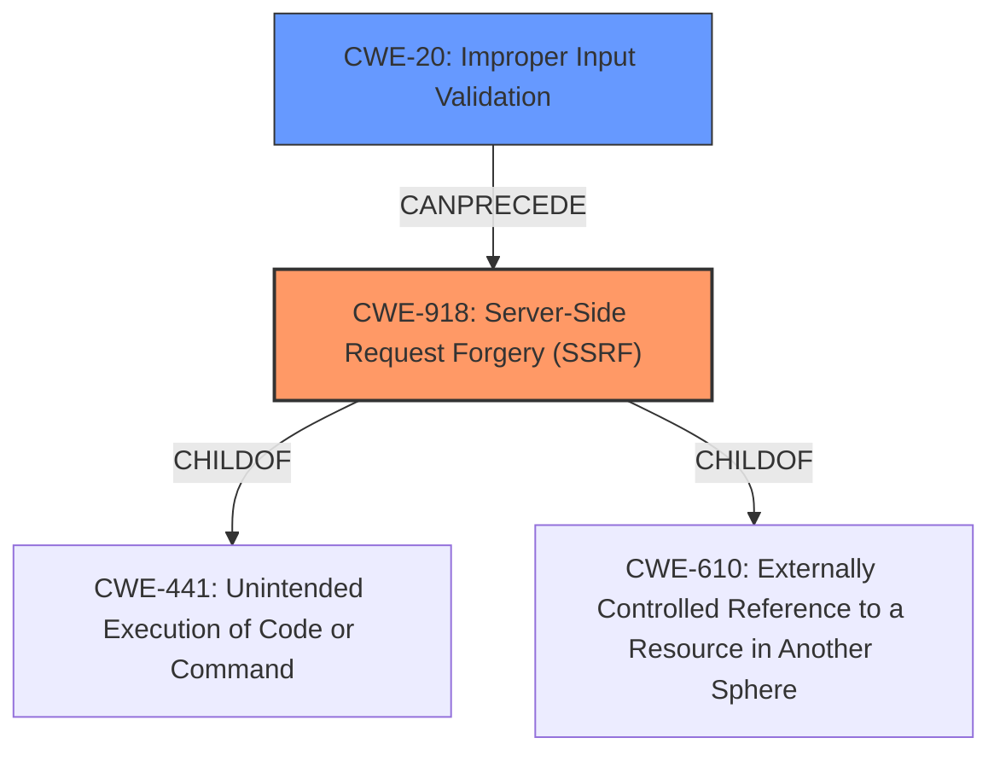

# Raw Analyzer Response for CVE-2021-21287

# Summary
| CWE ID  | CWE Name                                            | Confidence | CWE Abstraction Level | CWE Vulnerability Mapping Label | CWE-Vulnerability Mapping Notes |
| :-------- | :-------------------------------------------------- | :--------- | :---------------------- | :------------------------------ | :------------------------------ |
| CWE-918 | Server-Side Request Forgery (SSRF)                | 1          | Base                    | Primary                         | Allowed                       |
| CWE-20  | Improper Input Validation                         | 0.7        | Class                   | Secondary                       | Allowed                       |

## Evidence and Confidence

*   **Confidence Score:** 0.9
*   **Evidence Strength:** HIGH

## Relationship Analysis
The primary relationship that influenced my decision was the direct match of the **server-side request forgery** (**SSRF**) to CWE-918, which is a Base level CWE. Additionally, CWE-918 is a child of CWE-441 (Unintended Execution of Code or Command) and CWE-610 (Externally Controlled Reference to a Resource in Another Sphere). Input validation is often missing in SSRF vulnerabilities and it is a parent for many other CWEs, including CWE-1284 (Improper Validation of Specified Quantity in Input), CWE-1289 (Improper Validation of Unsafe Equivalence in Input), and CWE-190 (Integer Overflow or Wraparound).

## Vulnerability Chain
The chain of events in this vulnerability starts with a **lack of input validation** on the JWT token. This allows an attacker to craft a malicious request that leads to **Server-Side Request Forgery (SSRF)**, where the server makes requests to unintended destinations. The final impact includes access to internal resources and exposure of sensitive information.

## Summary of Analysis
The primary **weakness** identified in the vulnerability description and confirmed by the CVE Reference Links Content Summary is **server-side request forgery (SSRF)**. The `LoginSTS` function in MinIO makes a network request using the token before validating it. This allows a crafted request to potentially reach internal services without proper authentication and a **SSRF** vulnerability.

The selection of CWE-918 is based on the direct match to the **weakness** described in the vulnerability and its prevalence in similar CVE descriptions. The retriever results also list CWE-918 as the top match. The abstraction level is Base, which is preferred, and the usage is Allowed.

CWE-20 is selected as a secondary CWE because **lack of input validation** is the root cause that allows the server to make requests to arbitrary internal or external URLs.

Other CWEs Considered:
*   CWE-201: Insertion of Sensitive Information Into Sent Data - While sensitive information is exposed as a result of the SSRF, this CWE doesn't represent the core vulnerability.
*   CWE-306: Missing Authentication for Critical Function - Authentication is present, but bypassed due to the SSRF.
*   CWE-611: Improper Restriction of XML External Entity Reference - This is specific to XML, while the described vulnerability is more general.
*   CWE-863: Incorrect Authorization - Authorization is bypassed due to the SSRF.
*   CWE-770: Allocation of Resources Without Limits or Throttling - Not directly related to the SSRF vulnerability.
*   CWE-226: Sensitive Information in Resource Not Removed Before Reuse - This is not the primary issue.
*   CWE-668: Exposure of Resource to Wrong Sphere - Too general.
*   CWE-923: Improper Restriction of Communication Channel to Intended Endpoints - Not specific enough.

# Relevant CWE Information:

# Enhanced Context (25 CWEs)

## CWE-668: Exposure of Resource to Wrong Sphere
**Abstraction Level**: Class
**Similarity Score**: 0.78
**Source**: dense

**Description**:
The product exposes a resource to the wrong control sphere, providing unintended actors with inappropriate access to the resource.

**Mapping Guidance**:
- Usage: Discouraged
- Rationale: CWE-668 is high-level and is often misused as a catch-all when lower-level CWE IDs might be applicable. It is sometimes used for low-information vulnerability reports [REF-1287]. It is a level-1 Class (i.e., a child of a Pillar). It is not useful for trend analysis.

## CWE-404: Improper Resource Shutdown or Release
**Abstraction Level**: Class
**Similarity Score**: 0.77
**Source**: dense

**Description**:
The product does not release or incorrectly releases a resource before it is made available for re-use.

**Mapping Guidance**:
- Usage: Allowed-with-Review
- Rationale: This CWE entry is a Class and might have Base-level children that would be more appropriate

## CWE-226: Sensitive Information in Resource Not Removed Before Reuse
**Abstraction Level**: Base
**Similarity Score**: 0.77
**Source**: dense

**Description**:
The product releases a resource such as memory or a file so that it can be made available for reuse, but it does not clear or "zeroize" the information contained in the resource before the product performs a critical state transition or makes the resource available for reuse by other entities.

**Mapping Guidance**:
- Usage: Allowed
- Rationale: This CWE entry is at the Base level of abstraction, which is a preferred level of abstraction for mapping to the root causes of vulnerabilities.

## CWE-610: Externally Controlled Reference to a Resource in Another Sphere
**Abstraction Level**: Class
**Similarity Score**: 0.76
**Source**: dense

**Description**:
The product uses an externally controlled name or reference that resolves to a resource that is outside of the intended control sphere.

**Mapping Guidance**:
- Usage: Discouraged
- Rationale: This CWE entry is a level-1 Class (i.e., a child of a Pillar). It might have lower-level children that would be more appropriate

## CWE-653: Improper Isolation or Compartmentalization
**Abstraction Level**: Class
**Similarity Score**: 0.76
**Source**: dense

**Description**:
The product does not properly compartmentalize or isolate functionality, processes, or resources that require different privilege levels, rights, or permissions.

**Mapping Guidance**:
- Usage: Allowed
- Rationale: This CWE entry is at the Base level of abstraction, which is a preferred level of abstraction for mapping to the root causes of vulnerabilities.

## CWE-274: Improper Handling of Insufficient Privileges
**Abstraction Level**: Base
**Similarity Score**: 0.76
**Source**: dense

**Description**:
The product does not handle or incorrectly handles when it has insufficient privileges to perform an operation, leading to resultant weaknesses.

**Mapping Guidance**:
- Usage: Discouraged
- Rationale: This CWE entry could be deprecated in a future version of CWE.

## CWE-280: Improper Handling of Insufficient Permissions or Privileges
**Abstraction Level**: Base
**Similarity Score**: 0.76
**Source**: dense

**Description**:
The product does not handle or incorrectly handles when it has insufficient privileges to access resources or functionality as specified by their permissions. This may cause it to follow unexpected code paths that may leave the product in an invalid state.

**Mapping Guidance**:
- Usage: Allowed
- Rationale: This CWE entry is at the Base level of abstraction, which is a preferred level of abstraction for mapping to the root causes of vulnerabilities.

## CWE-639: Authorization Bypass Through User-Controlled Key
**Abstraction Level**: Base
**Similarity Score**: 0.76
**Source**: dense

**Description**:
The system's authorization functionality does not prevent one user from gaining access to another user's data or record by modifying the key value identifying the data.

**Mapping Guidance**:
- Usage: Allowed
- Rationale: This CWE entry is at the Base level of abstraction, which is a preferred level of abstraction for mapping to the root causes of vulnerabilities.

## CWE-405: Asymmetric Resource Consumption (Amplification)
**Abstraction Level**: Class
**Similarity Score**: 0.76
**Source**: dense

**Description**:
The product does not properly control situations in which an adversary can cause the product to consume or produce excessive resources without requiring the adversary to invest equivalent work or otherwise prove authorization, i.e., the adversary's influence is "asymmetric."

**Mapping Guidance