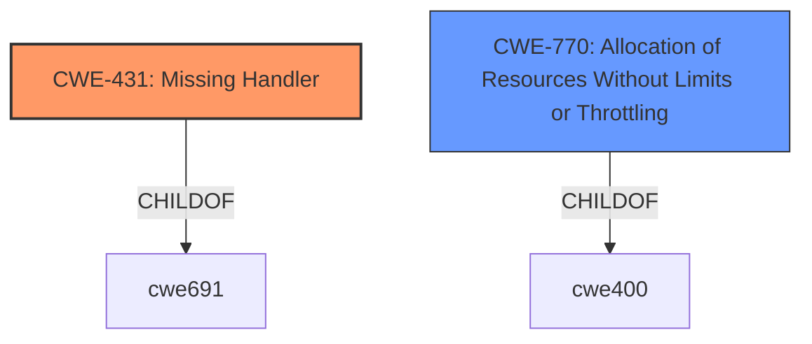

# Raw Analyzer Response for CVE-2021-21296

# Summary
| CWE ID  | CWE Name                                    | Confidence | CWE Abstraction Level | CWE Vulnerability Mapping Label | CWE-Vulnerability Mapping Notes |
| :-------- | :------------------------------------------ | :--------- | :-------------------- | :------------------------------ | :------------------------------ |
| CWE-431   | Missing Handler                             | 0.9        | Base                  | Primary CWE                     | Allowed                       |
| CWE-770   | Allocation of Resources Without Limits or Throttling | 0.5       | Base                  | Secondary Candidate           | Allowed                       |

## Evidence and Confidence

*   **Confidence Score:** 0.7
*   **Evidence Strength:** MEDIUM

## Relationship Analysis
The primary CWE is CWE-431, which indicates a **missing handler** for a particular condition, leading to a crash. This aligns with the vulnerability description where a badly formatted request causes the server to exit due to a panic. The secondary CWE is CWE-770, Allocation of Resources Without Limits or Throttling, which could be a related factor if the malformed request leads to excessive resource allocation that triggers the panic.

## Vulnerability Chain
The vulnerability chain begins with a malicious actor sending a badly formatted request. This request is then processed by the Fleet server's websocket handler. The **lack of proper error handling** (CWE-431) results in a panic, causing the server to exit and leading to denial of service.

## Summary of Analysis
The initial analysis focused on the vulnerability description which indicated that a **badly formatted request** leads to a denial-of-service. The retriever results suggested several potential CWEs, including CWE-431 (Missing Handler), CWE-1390 (Weak Authentication), and CWE-1284 (Improper Validation of Specified Quantity in Input).

The CVE Reference Links Content Summary provided additional insight, highlighting the **root cause** as insufficient error handling in the websocket handler, which leads to a panic and server exit. This evidence strongly supports the selection of CWE-431 (Missing Handler) as the primary CWE.

CWE-431 directly addresses the **lack of a handler** for the malformed request, which causes the server to crash. The vulnerability description and CVE summary both emphasize this missing error handling as the **root cause** of the issue.

While CWE-1390 (Weak Authentication) and CWE-1284 (Improper Validation of Specified Quantity in Input) were considered, they are less directly relevant. The vulnerability isn't primarily about authentication or quantity validation, but rather the server's failure to handle a specific type of malformed request gracefully.

CWE-770 (Allocation of Resources Without Limits or Throttling) was considered as a secondary factor, as a malformed request could potentially lead to excessive resource allocation. However, the primary issue is the **missing handler** for the error condition, making CWE-431 the more accurate classification.

The final decision is based on direct evidence from the vulnerability description and CVE summary, which points to the **missing handler** as the primary weakness. The selection of CWE-431 aligns with the CWE's description and the provided mapping guidance, which allows its usage at the Base level of abstraction.

Relevant CWE Information:

# Enhanced Context (25 CWEs)
The following CWEs were identified as potentially relevant to this vulnerability:

## CWE-431: Missing Handler
**Abstraction Level**: Base
**Similarity Score**: 0.312
**Source**: sparse

**Description**:
A handler is not available or implemented.

**Mapping Guidance**:
- Usage: Allowed
- Rationale: This CWE entry is at the Base level of abstraction, which is a preferred level of abstraction for mapping to the root causes of vulnerabilities.

## CWE-770: Allocation of Resources Without Limits or Throttling
**Abstraction Level**: Base
**Similarity Score**: 4.33
**Source**: graph

**Description**:
CWE-770: Allocation of Resources Without Limits or Throttling

**Mapping Guidance**:
- Usage: Allowed
- Rationale: This CWE entry is at the Base level of abstraction, which is a preferred level of abstraction for mapping to the root causes of vulnerabilities.

CWE-431 is selected because the **root cause** is the **lack of a handler** for the malformed request, causing a server crash.

CWE-770 is considered as a secondary factor if a malformed request could lead to excessive resource allocation.

Other CWEs considered but not used:

*   CWE-1390 (Weak Authentication): Not directly relevant as the vulnerability is not about authentication issues.
*   CWE-1284 (Improper Validation of Specified Quantity in Input): Not directly relevant as the vulnerability is not about quantity validation.

The selected CWEs are at the optimal level of specificity as they directly address the **root cause** of the vulnerability based on the provided evidence.