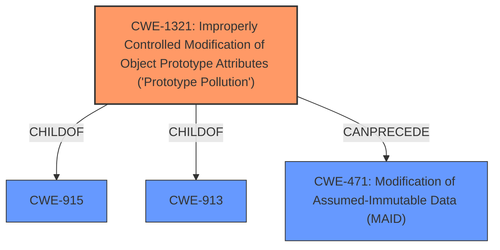

# Analysis Report for CVE-2021-21297

# Vulnerability Analysis Report: CVE-2021-21297

## Description


## Analysis (with Relationship Data)

# Summary
| CWE ID | CWE Name | Confidence | CWE Abstraction Level | CWE Vulnerability Mapping Label | CWE-Vulnerability Mapping Notes |
|---|---|---|---|---|---|
| CWE-1321 | Improperly Controlled Modification of Object Prototype Attributes ('Prototype Pollution') | 1.0 | Variant | Allowed | Primary CWE |

## Evidence and Confidence

*   **Confidence Score:** 1.0
*   **Evidence Strength:** HIGH

## Relationship Analysis
The primary CWE is CWE-1321 (Improperly Controlled Modification of Object Prototype Attributes ('Prototype Pollution')), which is a Variant-level CWE. It's a child of CWE-915 and CWE-913, and it can precede CWE-471. The Variant level is appropriate as it is the most specific match.



## Vulnerability Chain
The vulnerability chain starts with a **badly formed request** leading to **Prototype Pollution**, which can then **affect the default behavior of the Node-RED runtime**.

## Summary of Analysis
The initial analysis and final conclusion both strongly support the selection of CWE-1321.

The vulnerability description explicitly mentions "**Prototype Pollution**" in the admin API, which aligns perfectly with CWE-1321, "Improperly Controlled Modification of Object Prototype Attributes ('Prototype Pollution')." The description states that "A **badly formed request can modify the prototype** of the default JavaScript Object with the potential to **affect the default behaviour of the Node-RED runtime**."

The CVE Reference Links Content Summary confirms the root cause as a **Prototype Pollution** issue where a badly formed request can modify the prototype of the default JavaScript Object.

The retriever results also strongly support CWE-1321 as the top match, with a score of 0.702.

Therefore, CWE-1321 is the most appropriate and specific CWE for this vulnerability.

CWE-918, CWE-201, CWE-863, CWE-1333, CWE-79, CWE-471, CWE-1188, CWE-335, and CWE-285 were considered but not selected. These CWEs did not directly match the vulnerability description's emphasis on **prototype pollution** caused by **badly formed requests**, or they were at too high of an abstraction level.


## CWE Relationship Analysis

Current CWEs represent these abstraction levels: .


### Vulnerability Chain Analysis

**Chain starting from CWE-79:**
- 79 (Improper Neutralization of Input During Web Page Generation ('Cross-site Scripting')) - ROOT


**Chain starting from CWE-201:**
- 201 (Insertion of Sensitive Information Into Sent Data) - ROOT


### CWE Relationship Diagram

```mermaid
graph TD
    classDef primary fill:#f96,stroke:#333,stroke-width:2px
    classDef secondary fill:#69f,stroke:#333
    classDef tertiary fill:#9e9,stroke:#333
```


*Report generated on 2025-04-01 19:53:48*
