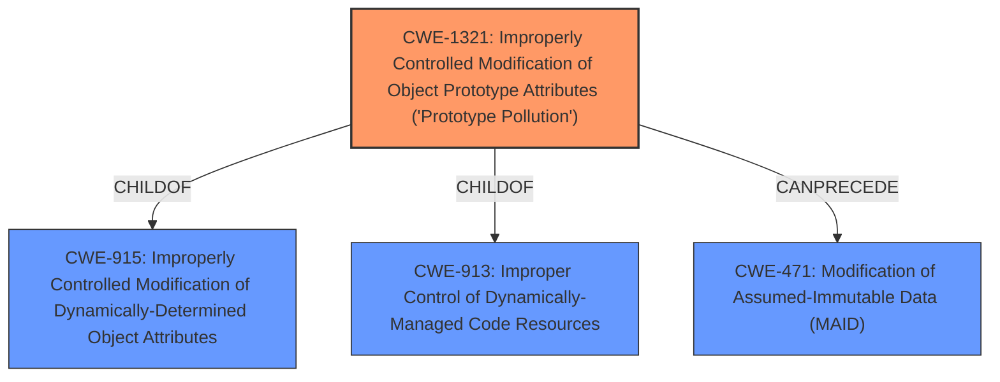

# Raw Analyzer Response for CVE-2021-21304

# Summary
| CWE ID | CWE Name | Confidence | CWE Abstraction Level | CWE Vulnerability Mapping Label | CWE-Vulnerability Mapping Notes |
|---|---|---|---|---|---|
| CWE-1321 | Improperly Controlled Modification of Object Prototype Attributes ('Prototype Pollution') | 1.0 | Variant | Allowed | Primary CWE |

## Evidence and Confidence

*   **Confidence Score:** 1.0
*   **Evidence Strength:** HIGH

## Relationship Analysis
The primary CWE is CWE-1321, which is a Variant-level CWE. CWE-1321 is child of CWE-915 and CWE-913. CWE-1321 can precede CWE-471.

## Vulnerability Chain
The vulnerability chain starts with the **improper handling of input** which leads to **prototype pollution**, finally resulting in potential **Denial of Service, Data Manipulation, and Arbitrary Code Execution**.
  - **Root Cause:** The `set.ts` method did not validate or sanitize the input keys before setting values on the target object.
  - **Weakness:** Crafted input with keys like `__proto__` or `constructor` pollutes the prototype.
  - **Impact:** Application-wide impact leading to Denial of Service, Data Manipulation, or Arbitrary Code Execution.

## Summary of Analysis
The analysis is based on the provided evidence, which clearly indicates a **prototype pollution** vulnerability in the Dynamoose library. The `lib/utils/object/set.ts` method **does not properly sanitize input keys**, allowing attackers to modify the prototype of an object. The **root cause** is the **lack of input validation** and the **weakness** is the **prototype pollution** itself, as evidenced by:

*   **Vulnerability Description Key Phrases:** **rootcause: prototype pollution**
*   **CVE Reference Links Content Summary:** "The vulnerability stems from a prototype pollution issue in the `lib/utils/object/set.ts` utility method within the `dynamoose` library... By crafting a malicious key (e.g. `__proto__`), an attacker could inject properties into the prototype of `Object`, which would then affect all objects in the application."

Based on the description and the retriever results, CWE-1321 is the most specific and appropriate match.

Other CWEs Considered:

*   CWE-201, CWE-1333, CWE-918, CWE-347, CWE-409, CWE-226, CWE-863, CWE-1284, CWE-95: While these CWEs share some similarities, they do not accurately represent the specific weakness of prototype pollution. For example, CWE-201 is about insertion of sensitive information, which is not the case here. CWE-1333 is about inefficient regular expressions.

Relevant CWE Information:

# Enhanced Context (25 CWEs)

## CWE-1321: Improperly Controlled Modification of Object Prototype Attributes ('Prototype Pollution')
**Abstraction:** Variant
**Status:** Incomplete

### Description
The product receives input from an upstream component that specifies attributes that are to be initialized or updated in an object, but it does not properly control modifications of attributes of the object prototype.

### Extended Description
By adding or modifying attributes of an object prototype, it is possible to create attributes that exist on every object, or replace critical attributes with malicious ones. This can be problematic if the product depends on existence or non-existence of certain attributes, or uses pre-defined attributes of object prototype (such as hasOwnProperty, toString or valueOf).

This weakness is usually exploited by using a special attribute of objects called proto, constructor or prototype. Such attributes give access to the object prototype. This weakness is often found in code that assigns object attributes based on user input, or merges or clones objects recursively.

### Alternative Terms
None

### Relationships
ChildOf -> CWE-915
ChildOf -> CWE-913
CanPrecede -> CWE-471

### Mapping Guidance
**Usage:** Allowed
**Rationale:** This CWE entry is at the Variant level of abstraction, which is a preferred level of abstraction for mapping to the root causes of vulnerabilities.
**Comments:** Carefully read both the name and description to ensure that this mapping is an appropriate fit. Do not try to 'force' a mapping to a lower-level Base/Variant simply to comply with this preferred level of abstraction.
**Reasons:**
- Acceptable-Use

### Observed Examples
- **CVE-2018-3721:** Prototype pollution by merging objects.
- **CVE-2019-10744:** Prototype pollution by setting default values to object attributes recursively.
- **CVE-2019-11358:** Prototype pollution by merging objects recursively.