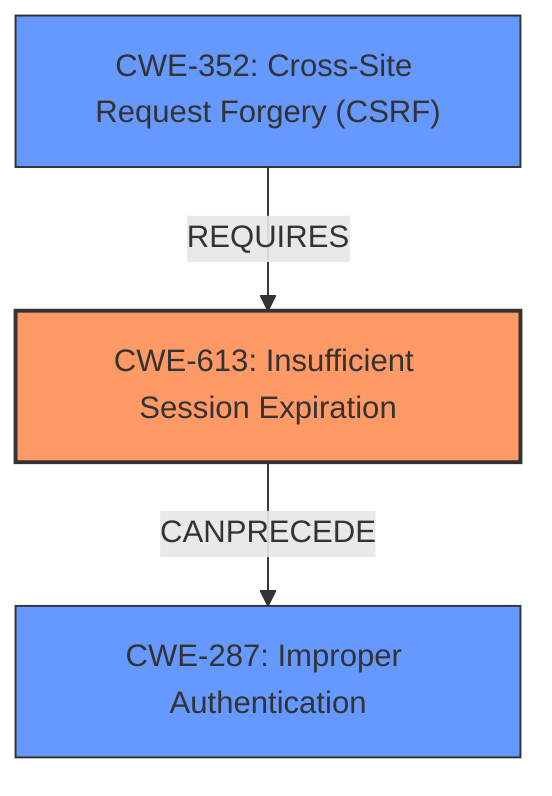

# Analysis for CVE-2021-21308

# Summary
| CWE ID    | CWE Name                                                                                             | Confidence | CWE Abstraction Level | CWE Vulnerability Mapping Label | CWE-Vulnerability Mapping Notes |
| :-------- | :--------------------------------------------------------------------------------------------------- | :--------- | :---------------------- | :------------------------------ | :------------------------------ |
| CWE-613   | Insufficient Session Expiration                                                                      | 0.9        | Base                    | Primary                         | Allowed                       |
| CWE-352   | Cross-Site Request Forgery (CSRF)                                                                    | 0.7        | Compound                | Secondary                       | Allowed                       |
| CWE-287   | Improper Authentication                                                                              | 0.6        | Class                   | Secondary                       | Discouraged                    |

## Evidence and Confidence

*   **Confidence Score:** 0.8
*   **Evidence Strength:** HIGH

## Relationship Analysis
The primary weakness is CWE-613 [Insufficient Session Expiration], a Base level CWE. CWE-613 can precede CWE-287 [Improper Authentication], suggesting that the insufficient session expiration could lead to authentication bypass. CWE-352 [Cross-Site Request Forgery (CSRF)] is a compound CWE that requires other weaknesses to be present, which aligns with the vulnerability description indicating an attacker can make unauthorized requests.

## Vulnerability Chain
The vulnerability chain starts with the **incomplete soft logout system** (**rootcause**). This leads to **insufficient session expiration** (CWE-613), which in turn enables an attacker to perform **foreign request and execute customer commands**, potentially leading to **Cross-Site Request Forgery (CSRF)** (CWE-352) and ultimately an **Improper Authentication** (CWE-287).

## Summary of Analysis
The primary CWE is CWE-613 [Insufficient Session Expiration] because the **rootcause** is an **incomplete soft logout system**, which is described as improper session management where session identifiers and tokens are not being properly cleared. The CVE Reference Links Content Summary states: "The core issue is that the session is not fully invalidated during a soft logout. The session identifiers and tokens are not being properly cleared." This insufficient expiration of the session allows an attacker to potentially reuse old session credentials.

CWE-352 [Cross-Site Request Forgery (CSRF)] is a secondary CWE because the vulnerability description mentions that an attacker can make foreign requests and execute customer commands. This aligns with the characteristics of a CSRF attack where an attacker tricks a user into performing actions on a web application without their knowledge.

CWE-287 [Improper Authentication] is a secondary CWE because the insufficient session expiration could potentially lead to an authentication bypass. The CVE reference summary mentions that the fix includes session clearing and checks for both session ID and session token.

The retriever results suggested CWE-1336 [Improper Neutralization of Special Elements Used in a Template Engine], CWE-79 [Improper Neutralization of Input During Web Page Generation ('Cross-site Scripting')], CWE-94 [Improper Control of Generation of Code ('Code Injection')], and CWE-201 [Insertion of Sensitive Information Into Sent Data], but these are not directly related to the **rootcause** of the vulnerability, which is the **incomplete soft logout system** leading to insufficient session expiration. These are more related to attack vectors or impacts, not the weakness itself.

Relevant CWE Information:

# Enhanced Context (25 CWEs)

## CWE-74: Improper Neutralization of Special Elements in Output Used by a Downstream Component ('Injection')
**Abstraction Level**: Class
**Similarity Score**: 0.76
**Source**: dense

**Description**:
The product constructs all or part of a command, data structure, or record using externally-influenced input from an upstream component, but it does not neutralize or incorrectly neutralizes special elements that could modify how it is parsed or interpreted when it is sent to a downstream component.

**Mapping Guidance**:
- Usage: Discouraged
- Rationale: CWE-74 is high-level and often misused when lower-level weaknesses are more appropriate.

## CWE-226: Sensitive Information in Resource Not Removed Before Reuse
**Abstraction Level**: Base
**Similarity Score**: 0.75
**Source**: dense

**Description**:
The product releases a resource such as memory or a file so that it can be made available for reuse, but it does not clear or "zeroize" the information contained in the resource before the product performs a critical state transition or makes the resource available for reuse by other entities.

**Mapping Guidance**:
- Usage: Allowed
- Rationale: This CWE entry is at the Base level of abstraction, which is a preferred level of abstraction for mapping to the root causes of vulnerabilities.

## CWE-472: External Control of Assumed-Immutable Web Parameter
**Abstraction Level**: Base
**Similarity Score**: 0.75
**Source**: dense

**Description**:
The web application does not sufficiently verify inputs that are assumed to be immutable but are actually externally controllable, such as hidden form fields.

**Mapping Guidance**:
- Usage: Allowed
- Rationale: This CWE entry is at the Base level of abstraction, which is a preferred level of abstraction for mapping to the root causes of vulnerabilities.

## CWE-665: Improper Initialization
**Abstraction Level**: Class
**Similarity Score**: 0.74
**Source**: dense

**Description**:
The product does not initialize or incorrectly initializes a resource, which might leave the resource in an unexpected state when it is accessed or used.

**Mapping Guidance**:
- Usage: Discouraged
- Rationale: This CWE entry is a level-1 Class (i.e., a child of a Pillar). It might have lower-level children that would be more appropriate

## CWE-807: Reliance on Untrusted Inputs in a Security Decision
**Abstraction Level**: Base
**Similarity Score**: 0.74
**Source**: dense

**Description**:
The product uses a protection mechanism that relies on the existence or values of an input, but the input can be modified by an untrusted actor in a way that bypasses the protection mechanism.

**Mapping Guidance**:
- Usage: Allowed
- Rationale: This CWE entry is at the Base level of abstraction, which is a preferred level of abstraction for mapping to the root causes of vulnerabilities.

## CWE-41: Improper Resolution of Path Equivalence
**Abstraction Level**: Base
**Similarity Score**: 0.74
**Source**: dense

**Description**:
The product is vulnerable to file system contents disclosure through path equivalence. Path equivalence involves the use of special characters in file and directory names. The associated manipulations are intended to generate multiple names for the same object.

**Mapping Guidance**:
- Usage: Allowed
- Rationale: This CWE entry is at the Base level of abstraction, which is a preferred level of abstraction for mapping to the root causes of vulnerabilities.

## CWE-404: Improper Resource Shutdown or Release
**Abstraction Level**: Class
**Similarity Score**: 0.74
**Source**: dense

**Description**:
The product does not release or incorrectly releases a resource before it is made available for re-use.

**Mapping Guidance**:
- Usage: Allowed-with-Review
- Rationale: This CWE entry is a Class and might have Base-level children that would be more appropriate

## CWE-639: Authorization Bypass Through User-Controlled Key
**Abstraction Level**: Base
**Similarity Score**: 0.74
**Source**: dense

**Description**:
The system's authorization functionality does not prevent one user from gaining access to another user's data or record by modifying the key value identifying the data.

**Mapping Guidance**:
- Usage: Allowed
- Rationale: This CWE entry is at the Base level of abstraction, which is a preferred level of abstraction for mapping to the root causes of vulnerabilities.

## CWE-1289: Improper Validation of Unsafe Equivalence in Input
**Abstraction Level**: Base
**Similarity Score**: 0.74
**Source**: dense

**Description**:
The product receives an input value that is used as a resource identifier or other type of reference, but it does not validate or incorrectly validates that the input is equivalent to a potentially-unsafe value.

**Mapping Guidance**:
- Usage: Allowed
- Rationale: This CWE entry is at the Base level of abstraction, which is a preferred level of abstraction for mapping to the root causes of vulnerabilities.

## CWE-99: Improper Control of Resource Identifiers ('Resource Injection')
**Abstraction Level**: Class
**Similarity Score**: 0.74