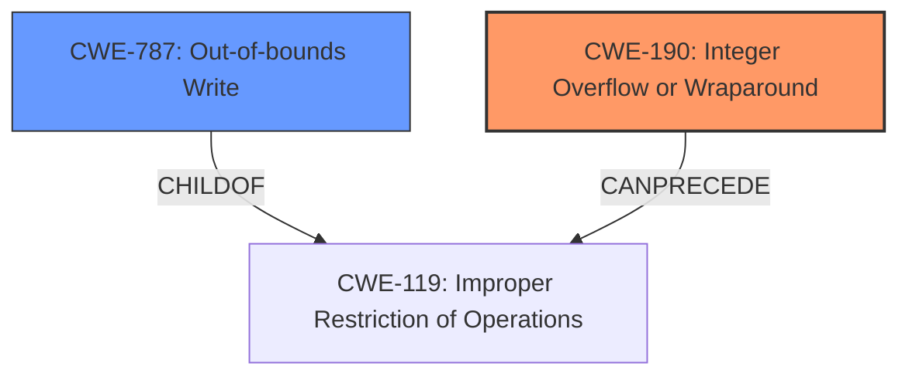

# Enhanced Analysis for CVE-2021-21309

# Summary
| CWE ID | CWE Name | Confidence | CWE Abstraction Level | CWE Vulnerability Mapping Label | CWE-Vulnerability Mapping Notes |
|---|---|---|---|---|---|
| CWE-190 | Integer Overflow or Wraparound | 1.0 | Base | Primary | Allowed |
| CWE-787 | Out-of-bounds Write | 0.8 | Base | Secondary | Allowed |

## Evidence and Confidence

*   **Confidence Score:** 0.9
*   **Evidence Strength:** HIGH

## Relationship Analysis
The primary CWE is CWE-190, which is a **rootcause** that leads to **heap corruption**, which can be represented by CWE-787. CWE-190 can **precede** CWE-119 (Improper Restriction of Operations within the Bounds of a Memory Buffer), which is a parent of CWE-787.



## Vulnerability Chain
The vulnerability chain starts with an **integer overflow** (CWE-190) due to an **improper** configuration. This leads to **heap corruption** (CWE-787), which can lead to remote code execution.

## Summary of Analysis
The primary weakness is clearly an **integer overflow** (CWE-190) in 32-bit Redis versions, which is triggered when the `proto-max-bulk-len` configuration is set to a high value. The **integer overflow** can lead to an undersized memory allocation, which then results in **heap corruption** (CWE-787).

The vulnerability description clearly states: "Redis is an open-source, in-memory database that persists on disk. In affected versions of Redis an **integer overflow** bug in 32-bit Redis version 4.0 or newer could be exploited to corrupt the heap and potentially result with remote code execution."

The "CVE Reference Links Content Summary" also states: "Integer overflow in the handling of the `proto-max-bulk-len` configuration parameter on 32-bit systems... The integer overflow results in an undersized memory allocation that allows a subsequent heap overflow when parsing a large input bulk from a client."

Based on the evidence, the primary CWE is CWE-190 (Integer Overflow or Wraparound). The resulting **heap corruption** is best represented by CWE-787 (Out-of-bounds Write).

Other CWEs Considered:

*   CWE-125 (Out-of-bounds Read): While out-of-bounds access is possible, the primary issue is with the write, not the read.
*   CWE-789 (Memory Allocation with Excessive Size Value): This is not the primary issue because the overflow leads to *less* memory being allocated, not more.
*   CWE-1284 (Improper Validation of Specified Quantity in Input): While there is a **lack of validation**, it is the resulting **integer overflow** that causes the vulnerability.

The selected CWEs are at the optimal level of specificity because they directly represent the **root cause** (CWE-190) and the immediate consequence (CWE-787) of the vulnerability.


## CWE Relationship Analysis

Current CWEs represent these abstraction levels: .


### Vulnerability Chain Analysis

**Chain starting from CWE-787:**
- 787 (Out-of-bounds Write) - ROOT


**Chain starting from CWE-125:**
- 125 (Out-of-bounds Read) - ROOT


### CWE Relationship Diagram

```mermaid
graph TD
    classDef primary fill:#f96,stroke:#333,stroke-width:2px
    classDef secondary fill:#69f,stroke:#333
    classDef tertiary fill:#9e9,stroke:#333
```