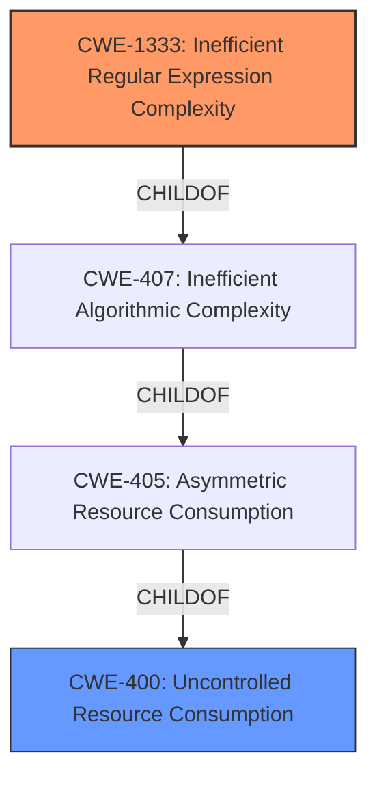

# Analysis for CVE-2021-21317

# Summary
| CWE ID  | CWE Name                                     | Confidence | CWE Abstraction Level | CWE Vulnerability Mapping Label | CWE-Vulnerability Mapping Notes |
| ------- | -------------------------------------------- | ---------- | ----------------------- | ------------------------------- | ------------------------------- |
| CWE-1333 | Inefficient Regular Expression Complexity    | 1          | Base                    | Primary                         | Allowed                       |
| CWE-400 | Uncontrolled Resource Consumption            | 0.7        | Class                   | Secondary                         | Allowed-with-Review          |

## Evidence and Confidence

*   **Confidence Score:** 0.85
*   **Evidence Strength:** HIGH

## Relationship Analysis
The primary CWE is CWE-1333, a **Base** level CWE that is a child of CWE-407 (Inefficient Algorithmic Complexity), which in turn is a child of CWE-405 (Asymmetric Resource Consumption), and finally CWE-400 (Uncontrolled Resource Consumption). The relationships show a progression from a specific regular expression issue to broader resource consumption problems. The abstraction levels guide the selection of the most specific applicable CWE.

## Vulnerability Chain
The vulnerability chain starts with **overlapping capture groups in regexes** within the uap-core library. This leads to **regular expression denial of service** (ReDoS) when processing maliciously crafted long strings in the User-Agent header. The excessive CPU consumption results in a denial of service.

`Overlapping Capture Groups (in Regexes) -> Regular Expression Denial of Service (ReDoS) -> Uncontrolled Resource Consumption (CPU) -> Denial of Service`

## Summary of Analysis
The analysis concludes that the primary CWE for this vulnerability is CWE-1333 (Inefficient Regular Expression Complexity) because the **root cause** is related to inefficient regular expressions. This is supported by the vulnerability description, which mentions "some regexes are vulnerable to **regular expression denial of service** (REDoS) due to **overlapping capture groups**" and the CVE Reference Links Content Summary which states "The vulnerability stems from the presence of **overlapping capture groups** within certain regular expressions used by the `uap-core` library. These problematic regexes are used to parse user-agent strings".
CWE-1333 is a **Base** level CWE, which is preferred. It accurately describes the **root cause**. The Retriever Results also list CWE-1333 as the top result.

CWE-400 (Uncontrolled Resource Consumption) was considered as a secondary CWE because the ReDoS leads to excessive CPU consumption. While CWE-400 is a valid consequence, CWE-1333 captures the **root cause** more precisely. CWE-400 is a **Class** level CWE, and while applicable, it is less specific than CWE-1333.
CWE-407 (Inefficient Algorithmic Complexity) was also considered but deemed less precise than CWE-1333, as the inefficiency stems specifically from the regular expression.

The final selection of CWE-1333 is based on its direct relevance to the **root cause**, its **Base** level abstraction, and its alignment with the vulnerability description and CVE details. The other CWEs were considered but ultimately deemed less specific or representative of the **root cause**.

Relevant CWE Information:

# Enhanced Context (25 CWEs)

## CWE-405: Asymmetric Resource Consumption (Amplification)
**Abstraction Level**: Class
**Similarity Score**: 0.78
**Source**: dense

**Description**:
The product does not properly control situations in which an adversary can cause the product to consume or produce excessive resources without requiring the adversary to invest equivalent work or otherwise prove authorization, i.e., the adversary's influence is "asymmetric."

**Mapping Guidance**:
- Usage: Allowed-with-Review
- Rationale: This CWE entry is a Class and might have Base-level children that would be more appropriate

## CWE-789: Memory Allocation with Excessive Size Value
**Abstraction Level**: Variant
**Similarity Score**: 0.77
**Source**: dense

**Description**:
The product allocates memory based on an untrusted, large size value, but it does not ensure that the size is within expected limits, allowing arbitrary amounts of memory to be allocated.

**Mapping Guidance**:
- Usage: Allowed
- Rationale: This CWE entry is at the Variant level of abstraction, which is a preferred level of abstraction for mapping to the root causes of vulnerabilities.

## CWE-407: Inefficient Algorithmic Complexity
**Abstraction Level**: Class
**Similarity Score**: 0.76
**Source**: dense

**Description**:
An algorithm in a product has an inefficient worst-case computational complexity that may be detrimental to system performance and can be triggered by an attacker, typically using crafted manipulations that ensure that the worst case is being reached.

**Mapping Guidance**:
- Usage: Allowed-with-Review
- Rationale: This CWE entry is a Class and might have Base-level children that would be more appropriate

## CWE-404: Improper Resource Shutdown or Release
**Abstraction Level**: Class
**Similarity Score**: 0.76
**Source**: dense

**Description**:
The product does not release or incorrectly releases a resource before it is made available for re-use.

**Mapping Guidance**:
- Usage: Allowed-with-Review
- Rationale: This CWE entry is a Class and might have Base-level children that would be more appropriate

## CWE-1325: Improperly Controlled Sequential Memory Allocation
**Abstraction Level**: Base
**Similarity Score**: 0.76
**Source**: dense

**Description**:
The product manages a group of objects or resources and performs a separate memory allocation for each object, but it does not properly limit the total amount of memory that is consumed by all of the combined objects.

**Mapping Guidance**:
- Usage: Allowed
- Rationale: This CWE entry is at the Base level of abstraction, which is a preferred level of abstraction for mapping to the root causes of vulnerabilities.

## CWE-226: Sensitive Information in Resource Not Removed Before Reuse
**Abstraction Level**: Base
**Similarity Score**: 0.75
**Source**: dense

**Description**:
The product releases a resource such as memory or a file so that it can be made available for reuse, but it does not clear or "zeroize" the information contained in the resource before the product performs a critical state transition or makes the resource available for reuse by other entities.

**Mapping Guidance**:
- Usage: Allowed
- Rationale: This CWE entry is at the Base level of abstraction, which is a preferred level of abstraction for mapping to the root causes of vulnerabilities.

## CWE-799: Improper Control of Interaction Frequency
**Abstraction Level**: Class
**Similarity Score**: 0.75
**Source**: dense

**Description**:
The product does not properly limit the number or frequency of interactions that it has with an actor, such as the number of incoming requests.

**Mapping Guidance**:
- Usage: Allowed-with-Review
- Rationale: This CWE entry is a Class and might have Base-level children that would be more appropriate

## CWE-664: Improper Control of a Resource Through its Lifetime
**Abstraction Level**: Pillar
**Similarity Score**: 0.75
**Source**: dense

**Description**:
The product does not maintain or incorrectly maintains control over a resource throughout its lifetime of creation, use, and release.

**Mapping Guidance**:
- Usage: Discouraged
- Rationale: This CWE entry is high-level when lower-level children are available.

## CWE-668: Exposure of Resource to Wrong Sphere
**Abstraction Level**: Class
**Similarity Score**: 0.75
**Source**: dense

**Description**:
The product exposes a resource to the wrong control sphere, providing unintended actors with inappropriate access to the resource.

**Mapping Guidance**:
- Usage: Discouraged
- Rationale: CWE-668 is high-level and is often misused as a catch-all when lower-level CWE IDs might be applicable. It is sometimes used for low-information vulnerability reports [REF-1287]. It is a level-1 Class (i.e., a child of a Pillar). It is not useful for trend analysis.

## CWE-131: Incorrect Calculation of Buffer Size
**Abstraction Level**: Base
**Similarity Score**: 0.74
**Source**: dense

**Description**: