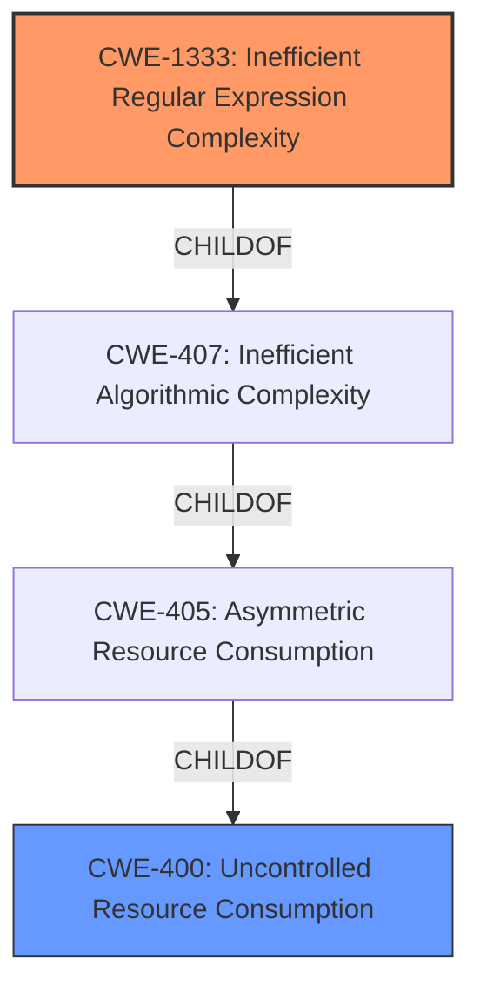

# Analysis for CVE-2021-21317

# Summary
| CWE ID  | CWE Name                                     | Confidence | CWE Abstraction Level | CWE Vulnerability Mapping Label | CWE-Vulnerability Mapping Notes |
| ------- | -------------------------------------------- | ---------- | ----------------------- | ------------------------------- | ------------------------------- |
| CWE-1333 | Inefficient Regular Expression Complexity    | 1          | Base                    | Primary                         | Allowed                       |
| CWE-400 | Uncontrolled Resource Consumption            | 0.7        | Class                   | Secondary                         | Allowed-with-Review          |

## Evidence and Confidence

*   **Confidence Score:** 0.85
*   **Evidence Strength:** HIGH

## Relationship Analysis
The primary CWE is CWE-1333, a **Base** level CWE that is a child of CWE-407 (Inefficient Algorithmic Complexity), which in turn is a child of CWE-405 (Asymmetric Resource Consumption), and finally CWE-400 (Uncontrolled Resource Consumption). The relationships show a progression from a specific regular expression issue to broader resource consumption problems. The abstraction levels guide the selection of the most specific applicable CWE.

## Vulnerability Chain
The vulnerability chain starts with **overlapping capture groups in regexes** within the uap-core library. This leads to **regular expression denial of service** (ReDoS) when processing maliciously crafted long strings in the User-Agent header. The excessive CPU consumption results in a denial of service.

`Overlapping Capture Groups (in Regexes) -> Regular Expression Denial of Service (ReDoS) -> Uncontrolled Resource Consumption (CPU) -> Denial of Service`

## Summary of Analysis
The analysis concludes that the primary CWE for this vulnerability is CWE-1333 (Inefficient Regular Expression Complexity) because the **root cause** is related to inefficient regular expressions. This is supported by the vulnerability description, which mentions "some regexes are vulnerable to **regular expression denial of service** (REDoS) due to **overlapping capture groups**" and the CVE Reference Links Content Summary which states "The vulnerability stems from the presence of **overlapping capture groups** within certain regular expressions used by the `uap-core` library. These problematic regexes are used to parse user-agent strings".
CWE-1333 is a **Base** level CWE, which is preferred. It accurately describes the **root cause**. The Retriever Results also list CWE-1333 as the top result.

CWE-400 (Uncontrolled Resource Consumption) was considered as a secondary CWE because the ReDoS leads to excessive CPU consumption. While CWE-400 is a valid consequence, CWE-1333 captures the **root cause** more precisely. CWE-400 is a **Class** level CWE, and while applicable, it is less specific than CWE-1333.
CWE-407 (Inefficient Algorithmic Complexity) was also considered but deemed less precise than CWE-1333, as the inefficiency stems specifically from the regular expression.

The final selection of CWE-1333 is based on its direct relevance to the **root cause**, its **Base** level abstraction, and its alignment with the vulnerability description and CVE details. The other CWEs were considered but ultimately deemed less specific or representative of the **root cause**.

Relevant CWE Information:

# Enhanced Context (25 CWEs)

## CWE-405: Asymmetric Resource Consumption (Amplification)
**Abstraction Level**: Class
**Similarity Score**: 0.78
**Source**: dense

**Description**:
The product does not properly control situations in which an adversary can cause the product to consume or produce excessive resources without requiring the adversary to invest equivalent work or otherwise prove authorization, i.e., the adversary's influence is "asymmetric."

**Mapping Guidance**:
- Usage: Allowed-with-Review
- Rationale: This CWE entry is a Class and might have Base-level children that would be more appropriate

## CWE-789: Memory Allocation with Excessive Size Value
**Abstraction Level**: Variant
**Similarity Score**: 0.77
**Source**: dense

**Description**:
The product allocates memory based on an untrusted, large size value, but it does not ensure that the size is within expected limits, allowing arbitrary amounts of memory to be allocated.

**Mapping Guidance**:
- Usage: Allowed
- Rationale: This CWE entry is at the Variant level of abstraction, which is a preferred level of abstraction for mapping to the root causes of vulnerabilities.

## CWE-407: Inefficient Algorithmic Complexity
**Abstraction Level**: Class
**Similarity Score**: 0.76
**Source**: dense

**Description**:
An algorithm in a product has an inefficient worst-case computational complexity that may be detrimental to system performance and can be triggered by an attacker, typically using crafted manipulations that ensure that the worst case is being reached.

**Mapping Guidance**:
- Usage: Allowed-with-Review
- Rationale: This CWE entry is a Class and might have Base-level children that would be more appropriate

## CWE-404: Improper Resource Shutdown or Release
**Abstraction Level**: Class
**Similarity Score**: 0.76
**Source**: dense

**Description**:
The product does not release or incorrectly releases a resource before it is made available for re-use.

**Mapping Guidance**:
- Usage: Allowed-with-Review
- Rationale: This CWE entry is a Class and might have Base-level children that would be more appropriate

## CWE-1325: Improperly Controlled Sequential Memory Allocation
**Abstraction Level**: Base
**Similarity Score**: 0.76
**Source**: dense

**Description**:
The product manages a group of objects or resources and performs a separate memory allocation for each object, but it does not properly limit the total amount of memory that is consumed by all of the combined objects.

**Mapping Guidance**:
- Usage: Allowed
- Rationale: This CWE entry is at the Base level of abstraction, which is a preferred level of abstraction for mapping to the root causes of vulnerabilities.

## CWE-226: Sensitive Information in Resource Not Removed Before Reuse
**Abstraction Level**: Base
**Similarity Score**: 0.75
**Source**: dense

**Description**:
The product releases a resource such as memory or a file so that it can be made available for reuse, but it does not clear or "zeroize" the information contained in the resource before the product performs a critical state transition or makes the resource available for reuse by other entities.

**Mapping Guidance**:
- Usage: Allowed
- Rationale: This CWE entry is at the Base level of abstraction, which is a preferred level of abstraction for mapping to the root causes of vulnerabilities.

## CWE-799: Improper Control of Interaction Frequency
**Abstraction Level**: Class
**Similarity Score**: 0.75
**Source**: dense

**Description**:
The product does not properly limit the number or frequency of interactions that it has with an actor, such as the number of incoming requests.

**Mapping Guidance**:
- Usage: Allowed-with-Review
- Rationale: This CWE entry is a Class and might have Base-level children that would be more appropriate

## CWE-664: Improper Control of a Resource Through its Lifetime
**Abstraction Level**: Pillar
**Similarity Score**: 0.75
**Source**: dense

**Description**:
The product does not maintain or incorrectly maintains control over a resource throughout its lifetime of creation, use, and release.

**Mapping Guidance**:
- Usage: Discouraged
- Rationale: This CWE entry is high-level when lower-level children are available.

## CWE-668: Exposure of Resource to Wrong Sphere
**Abstraction Level**: Class
**Similarity Score**: 0.75
**Source**: dense

**Description**:
The product exposes a resource to the wrong control sphere, providing unintended actors with inappropriate access to the resource.

**Mapping Guidance**:
- Usage: Discouraged
- Rationale: CWE-668 is high-level and is often misused as a catch-all when lower-level CWE IDs might be applicable. It is sometimes used for low-information vulnerability reports [REF-1287]. It is a level-1 Class (i.e., a child of a Pillar). It is not useful for trend analysis.

## CWE-131: Incorrect Calculation of Buffer Size
**Abstraction Level**: Base
**Similarity Score**: 0.74
**Source**: dense

**Description**:

# Enhanced Query for CVE-2021-21317

## Vulnerability Description
uap-core in an open-source npm package which contains the core of BrowserScopes original user agent string parser. In uap-core before version 0.11.0, some regexes are vulnerable to **regular expression denial of service** (REDoS) due to overlapping capture groups. This allows remote attackers to overload a server by setting the User-Agent header in an HTTP(S) request to maliciously crafted long strings. This is fixed in version 0.11.0. Downstream packages such as uap-python, uap-ruby etc which depend upon uap-core follow different version schemes.

### Vulnerability Description Key Phrases
- **rootcause:** **overlapping capture groups in regexes**
- **weakness:** **regular expression denial of service**
- **vector:** maliciously crafted long strings
- **attacker:** remote attackers
- **product:** uap-core
- **version:** before 0.11.0

## CVE Reference Links Content Summary
Based on the provided content, here's an analysis of CVE-2021-21317:

**Root Cause of Vulnerability:**
The vulnerability stems from the presence of overlapping capture groups within certain regular expressions used by the `uap-core` library. These problematic regexes are used to parse user-agent strings.

**Weaknesses/Vulnerabilities Present:**
- **Regular Expression Denial of Service (ReDoS):** The overlapping capture groups in the regexes can lead to catastrophic backtracking when processing specially crafted, long user-agent strings. This can cause the regex matching process to take an extremely long time, effectively causing a denial of service.

**Impact of Exploitation:**
- **Denial of Service (DoS):** By sending HTTP(S) requests with malicious user-agent strings, an attacker can cause the server to become overloaded due to the excessive processing time required by the vulnerable regexes. This can lead to the server becoming unresponsive and unavailable to legitimate users.

**Attack Vectors:**
- **HTTP(S) User-Agent Header:** The primary attack vector is the `User-Agent` header in HTTP(S) requests. An attacker can manipulate this header to include a long, specially crafted string that triggers the vulnerable regular expressions.

**Required Attacker Capabilities/Position:**
- **Remote Attacker:** The attacker does not need to have any special privileges or access to the server. They can initiate the attack from any location on the network.
- **Ability to Send HTTP(S) Requests:** The attacker must be able to send HTTP(S) requests to the server, allowing them to include a crafted User-Agent header.

**Additional Notes:**
- The vulnerability affects `uap-core` versions `<= 0.10.0`.
- The fix for the vulnerability was implemented in version `0.11.0` of `uap-core` and is described in the commit message "fix: redos".
- Downstream packages like uap-python and uap-ruby may also be affected, but follow their own versioning schemes, so they may need to be patched separately based on their dependencies.
- The commit fixing the vulnerability includes modifications to the `regexes.yaml`, `tests/regexes.js` and `tests/test_ua.yaml` files.

## Retriever Results

### Top Combined Results

| Rank | CWE ID | Name | Abstraction | Usage  | Retrievers | Individual Scores |
|------|--------|------|-------------|-------|------------|-------------------|
| 1 | 1333 | Inefficient Regular Expression Complexity | Base | Allowed | alternate_terms | 1.000 |
| 2 | 407 | Inefficient Algorithmic Complexity | Class | Allowed-with-Review | sparse | 0.476 |
| 3 | 405 | Asymmetric Resource Consumption (Amplification) | Class | Allowed-with-Review | sparse | 0.464 |
| 4 | 863 | Incorrect Authorization | Class | Allowed-with-Review | sparse | 0.430 |
| 5 | 1284 | Improper Validation of Specified Quantity in Input | Base | Allowed | sparse | 0.429 |
| 6 | 185 | Incorrect Regular Expression | Class | Allowed-with-Review | dense | 0.416 |
| 7 | 187 | Partial String Comparison | Variant | Allowed | graph | 0.003 |
| 8 | 674 | Uncontrolled Recursion | Class | Allowed-with-Review | sparse | 0.422 |
| 9 | 789 | Memory Allocation with Excessive Size Value | Variant | Allowed | sparse | 0.413 |
| 10 | 770 | Allocation of Resources Without Limits or Throttling | Base | Allowed | sparse | 0.412 |

# Complete CWE Specifications

## CWE-1333: Inefficient Regular Expression Complexity
**Abstraction:** Base
**Status:** Draft

### Description
The product uses a regular expression with an inefficient, possibly exponential worst-case computational complexity that consumes excessive CPU cycles.

### Extended Description
Some regular expression engines have a feature called "backtracking". If the token cannot match, the engine "backtracks" to a position that may result in a different token that can match.
 Backtracking becomes a weakness if all of these conditions are met:

  - The number of possible backtracking attempts are exponential relative to the length of the input.

  - The input can fail to match the regular expression.

  - The input can be long enough.

 Attackers can create crafted inputs that intentionally cause the regular expression to use excessive backtracking in a way that causes the CPU consumption to spike. 

### Alternative Terms
ReDoS: ReDoS is an abbreviation of "Regular expression Denial of Service".
Regular Expression Denial of Service: While this term is attack-focused, this is commonly used to describe the weakness.
Catastrophic backtracking: This term is used to describe the behavior of the regular expression as a negative technical impact.

### Relationships
ChildOf -> CWE-407
ChildOf -> CWE-407

### Mapping Guidance
**Usage:** Allowed
**Rationale:** This CWE entry is at the Base level of abstraction, which is a preferred level of abstraction for mapping to the root causes of vulnerabilities.
**Comments:** Carefully read both the name and description to ensure that this mapping is an appropriate fit. Do not try to 'force' a mapping to a lower-level Base/Variant simply to comply with this preferred level of abstraction.
**Reasons:**
- Acceptable-Use

### Observed Examples
- **CVE-2020-5243:** server allows ReDOS with crafted User-Agent strings, due to overlapping capture groups that cause excessive backtracking.
- **CVE-2021-21317:** npm package for user-agent parser prone to ReDoS due to overlapping capture groups
- **CVE-2019-16215:** Markdown parser uses inefficient regex when processing a message, allowing users to cause CPU consumption and delay preventing processing of other messages.

## CWE-407: Inefficient Algorithmic Complexity
**Abstraction:** Class
**Status:** Incomplete

### Description
An algorithm in a product has an inefficient worst-case computational complexity that may be detrimental to system performance and can be triggered by an attacker, typically using crafted manipulations that ensure that the worst case is being reached.

### Extended Description
Not provided

### Alternative Terms
Quadratic Complexity: Used when the algorithmic complexity is related to the square of the number of inputs (N^2)

### Relationships
ChildOf -> CWE-405

### Mapping Guidance
**Usage:** Allowed-with-Review
**Rationale:** This CWE entry is a Class and might have Base-level children that would be more appropriate
**Comments:** Examine children of this entry to see if there is a better fit
**Reasons:**
- Abstraction

### Observed Examples
- **CVE-2021-32617:** C++ library for image metadata has "quadratic complexity" issue with unnecessarily repetitive parsing each time an invalid character is encountered
- **CVE-2020-10735:** Python has "quadratic complexity" issue when converting string to int with many digits in unexpected bases
- **CVE-2020-5243:** server allows ReDOS with crafted User-Agent strings, due to overlapping capture groups that cause excessive backtracking.

## CWE-405: Asymmetric Resource Consumption (Amplification)
**Abstraction:** Class
**Status:** Incomplete

### Description
The product does not properly control situations in which an adversary can cause the product to consume or produce excessive resources without requiring the adversary to invest equivalent work or otherwise prove authorization, i.e., the adversary's influence is "asymmetric."

### Extended Description
This can lead to poor performance due to "amplification" of resource consumption, typically in a non-linear fashion. This situation is worsened if the product allows malicious users or attackers to consume more resources than their access level permits.

### Alternative Terms
None

### Relationships
ChildOf -> CWE-400

### Mapping Guidance
**Usage:** Allowed-with-Review
**Rationale:** This CWE entry is a Class and might have Base-level children that would be more appropriate
**Comments:** Examine children of this entry to see if there is a better fit
**Reasons:**
- Abstraction

### Observed Examples
- **CVE-1999-0513:** Classic "Smurf" attack, using spoofed ICMP packets to broadcast addresses.
- **CVE-2003-1564:** Parsing library allows XML bomb
- **CVE-2004-2458:** Tool creates directories before authenticating user.

## CWE-863: Incorrect Authorization
**Abstraction:** Class
**Status:** Incomplete

### Description
The product performs an authorization check when an actor attempts to access a resource or perform an action, but it does not correctly perform the check.

### Extended Description
Not provided

### Alternative Terms
AuthZ: "AuthZ" is typically used as an abbreviation of "authorization" within the web application security community. It is distinct from "AuthN" (or, sometimes, "AuthC") which is an abbreviation of "authentication." The use of "Auth" as an abbreviation is discouraged, since it could be used for either authentication or authorization.

### Relationships
ChildOf -> CWE-285
ChildOf -> CWE-284

### Mapping Guidance
**Usage:** Allowed-with-Review
**Rationale:** This CWE entry is a Class and might have Base-level children that would be more appropriate
**Comments:** Examine children of this entry to see if there is a better fit
**Reasons:**
- Abstraction

### Additional Notes
**[Terminology]** 

Assuming a user with a given identity, authorization is the process of determining whether that user can access a given resource, based on the user's privileges and any permissions or other access-control specifications that apply to the resource.

### Observed Examples
- **CVE-2021-39155:** Chain: A microservice integration and management platform compares the hostname in the HTTP Host header in a case-sensitive way (CWE-178, CWE-1289), allowing bypass of the authorization policy (CWE-863) using a hostname with mixed case or other variations.
- **CVE-2019-15900:** Chain: sscanf() call is used to check if a username and group exists, but the return value of sscanf() call is not checked (CWE-252), causing an uninitialized variable to be checked (CWE-457), returning success to allow authorization bypass for executing a privileged (CWE-863).
- **CVE-2009-2213:** Gateway uses default "Allow" configuration for its authorization settings.

## CWE-1284: Improper Validation of Specified Quantity in Input
**Abstraction:** Base
**Status:** Incomplete

### Description
The product receives input that is expected to specify a quantity (such as size or length), but it does not validate or incorrectly validates that the quantity has the required properties.

### Extended Description

Specified quantities include size, length, frequency, price, rate, number of operations, time, and others. Code may rely on specified quantities to allocate resources, perform calculations, control iteration, etc. When the quantity is not properly validated, then attackers can specify malicious quantities to cause excessive resource allocation, trigger unexpected failures, enable buffer overflows, etc.

### Alternative Terms
None

### Relationships
ChildOf -> CWE-20
ChildOf -> CWE-20
CanPrecede -> CWE-789

### Mapping Guidance
**Usage:** Allowed
**Rationale:** This CWE entry is at the Base level of abstraction, which is a preferred level of abstraction for mapping to the root causes of vulnerabilities.
**Comments:** Carefully read both the name and description to ensure that this mapping is an appropriate fit. Do not try to 'force' a mapping to a lower-level Base/Variant simply to comply with this preferred level of abstraction.
**Reasons:**
- Acceptable-Use

### Additional Notes
**[Maintenance]** This entry is still under development and will continue to see updates and content improvements.

### Observed Examples
- **CVE-2022-21668:** Chain: Python library does not limit the resources used to process images that specify a very large number of bands (CWE-1284), leading to excessive memory consumption (CWE-789) or an integer overflow (CWE-190).
- **CVE-2008-1440:** lack of validation of length field leads to infinite loop
- **CVE-2008-2374:** lack of validation of string length fields allows memory consumption or buffer over-read

## CWE-185: Incorrect Regular Expression
**Abstraction:** Class
**Status:** Draft

### Description
The product specifies a regular expression in a way that causes data to be improperly matched or compared.

### Extended Description
When the regular expression is used in protection mechanisms such as filtering or validation, this may allow an attacker to bypass the intended restrictions on the incoming data.

### Alternative Terms
None

### Relationships
ChildOf -> CWE-697
CanPrecede -> CWE-187
CanPrecede -> CWE-182

### Mapping Guidance
**Usage:** Allowed-with-Review
**Rationale:** This CWE entry is a Class and might have Base-level children that would be more appropriate
**Comments:** Examine children of this entry to see if there is a better fit
**Reasons:**
- Abstraction

### Additional Notes
**[Relationship]** While there is some overlap with allowlist/denylist problems, this entry is intended to deal with incorrectly written regular expressions, regardless of their intended use. Not every regular expression is intended for use as an allowlist or denylist. In addition, allowlists and denylists can be implemented using other mechanisms besides regular expressions.

**[Research Gap]** Regexp errors are likely a primary factor in many MFVs, especially those that require multiple manipulations to exploit. However, they are rarely diagnosed at this level of detail.

### Observed Examples
- **CVE-2002-2109:** Regexp isn't "anchored" to the beginning or end, which allows spoofed values that have trusted values as substrings.
- **CVE-2005-1949:** Regexp for IP address isn't anchored at the end, allowing appending of shell metacharacters.
- **CVE-2001-1072:** Bypass access restrictions via multiple leading slash, which causes a regular expression to fail.

## CWE-187: Partial String Comparison
**Abstraction:** Variant
**Status:** Incomplete

### Description
The product performs a comparison that only examines a portion of a factor before determining whether there is a match, such as a substring, leading to resultant weaknesses.

### Extended Description
For example, an attacker might succeed in authentication by providing a small password that matches the associated portion of the larger, correct password.

### Alternative Terms
None

### Relationships
ChildOf -> CWE-1023

### Mapping Guidance
**Usage:** Allowed
**Rationale:** This CWE entry is at the Variant level of abstraction, which is a preferred level of abstraction for mapping to the root causes of vulnerabilities.
**Comments:** Carefully read both the name and description to ensure that this mapping is an appropriate fit. Do not try to 'force' a mapping to a lower-level Base/Variant simply to comply with this preferred level of abstraction.
**Reasons:**
- Acceptable-Use

### Additional Notes
**[Relationship]** This is conceptually similar to other weaknesses, such as insufficient verification and regular expression errors. It is primary to some weaknesses.

### Observed Examples
- **CVE-2014-6394:** Product does not prevent access to restricted directories due to partial string comparison with a public directory
- **CVE-2004-1012:** Argument parser of an IMAP server treats a partial command "body[p" as if it is "body.peek", leading to index error and out-of-bounds corruption.
- **CVE-2004-0765:** Web browser only checks the hostname portion of a certificate when the hostname portion of the URI is not a fully qualified domain name (FQDN), which allows remote attackers to spoof trusted certificates.

## CWE-674: Uncontrolled Recursion
**Abstraction:** Class
**Status:** Draft

### Description
The product does not properly control the amount of recursion that takes place,  consuming excessive resources, such as allocated memory or the program stack.

### Extended Description
Not provided

### Alternative Terms
Stack Exhaustion

### Relationships
ChildOf -> CWE-834

### Mapping Guidance
**Usage:** Allowed-with-Review
**Rationale:** This CWE entry is a Class and might have Base-level children that would be more appropriate
**Comments:** Examine children of this entry to see if there is a better fit
**Reasons:**
- Abstraction

### Observed Examples
- **CVE-2007-1285:** Deeply nested arrays trigger stack exhaustion.
- **CVE-2007-3409:** Self-referencing pointers create infinite loop and resultant stack exhaustion.
- **CVE-2016-10707:** Javascript application accidentally changes input in a way that prevents a recursive call from detecting an exit condition.

## CWE-789: Memory Allocation with Excessive Size Value
**Abstraction:** Variant
**Status:** Draft

### Description
The product allocates memory based on an untrusted, large size value, but it does not ensure that the size is within expected limits, allowing arbitrary amounts of memory to be allocated.

### Extended Description
Not provided

### Alternative Terms
Stack Exhaustion: When a weakness allocates excessive memory on the stack, it is often described as "stack exhaustion," which is a technical impact of the weakness. This technical impact is often encountered as a consequence of CWE-789 and/or CWE-1325.

### Relationships
ChildOf -> CWE-770
CanPrecede -> CWE-476

### Mapping Guidance
**Usage:** Allowed
**Rationale:** This CWE entry is at the Variant level of abstraction, which is a preferred level of abstraction for mapping to the root causes of vulnerabilities.
**Comments:** Carefully read both the name and description to ensure that this mapping is an appropriate fit. Do not try to 'force' a mapping to a lower-level Base/Variant simply to comply with this preferred level of abstraction.
**Reasons:**
- Acceptable-Use

### Additional Notes
**[Relationship]** This weakness can be closely associated with integer overflows (CWE-190). Integer overflow attacks would concentrate on providing an extremely large number that triggers an overflow that causes less memory to be allocated than expected. By providing a large value that does not trigger an integer overflow, the attacker could still cause excessive amounts of memory to be allocated.

**[Applicable Platform]** 

Uncontrolled memory allocation is possible in many languages, such as dynamic array allocation in perl or initial size parameters in Collections in Java. However, languages like C and C++ where programmers have the power to more directly control memory management will be more susceptible.

### Observed Examples
- **CVE-2022-21668:** Chain: Python library does not limit the resources used to process images that specify a very large number of bands (CWE-1284), leading to excessive memory consumption (CWE-789) or an integer overflow (CWE-190).
- **CVE-2010-3701:** program uses ::alloca() for encoding messages, but large messages trigger segfault
- **CVE-2008-1708:** memory consumption and daemon exit by specifying a large value in a length field

## CWE-770: Allocation of Resources Without Limits or Throttling
**Abstraction:** Base
**Status:** Incomplete

### Description
The product allocates a reusable resource or group of resources on behalf of an actor without imposing any restrictions on the size or number of resources that can be allocated, in violation of the intended security policy for that actor.

### Extended Description

Code frequently has to work with limited resources, so programmers must be careful to ensure that resources are not consumed too quickly, or too easily. Without use of quotas, resource limits, or other protection mechanisms, it can be easy for an attacker to consume many resources by rapidly making many requests, or causing larger resources to be used than is needed. When too many resources are allocated, or if a single resource is too large, then it can prevent the code from working correctly, possibly leading to a denial of service.

### Alternative Terms
None

### Relationships
ChildOf -> CWE-400
ChildOf -> CWE-665
ChildOf -> CWE-400

### Mapping Guidance
**Usage:** Allowed
**Rationale:** This CWE entry is at the Base level of abstraction, which is a preferred level of abstraction for mapping to the root causes of vulnerabilities.
**Comments:** Carefully read both the name and description to ensure that this mapping is an appropriate fit. Do not try to 'force' a mapping to a lower-level Base/Variant simply to comply with this preferred level of abstraction.
**Reasons:**
- Acceptable-Use

### Additional Notes
**[Relationship]** This entry is different from uncontrolled resource consumption (CWE-400) in that there are other weaknesses that are related to inability to control resource consumption, such as holding on to a resource too long after use, or not correctly keeping track of active resources so that they can be managed and released when they are finished (CWE-771).

**[Theoretical]** Vulnerability theory is largely about how behaviors and resources interact. "Resource exhaustion" can be regarded as either a consequence or an attack, depending on the perspective. This entry is an attempt to reflect one of the underlying weaknesses that enable these attacks (or consequences) to take place.

### Observed Examples
- **CVE-2022-21668:** Chain: Python library does not limit the resources used to process images that specify a very large number of bands (CWE-1284), leading to excessive memory consumption (CWE-789) or an integer overflow (CWE-190).
- **CVE-2009-4017:** Language interpreter does not restrict the number of temporary files being created when handling a MIME request with a large number of parts..
- **CVE-2009-2726:** Driver does not use a maximum width when invoking sscanf style functions, causing stack consumption.

