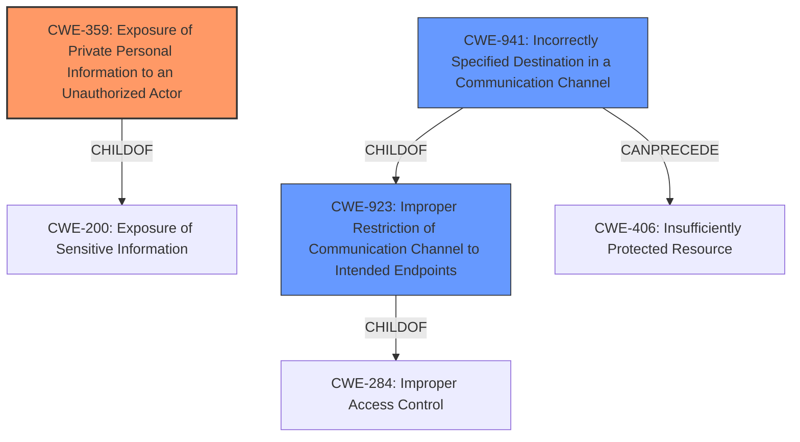

# Raw Analyzer Response for CVE-2021-21323

# Summary
| CWE ID | CWE Name | Confidence | CWE Abstraction Level | CWE Vulnerability Mapping Label | CWE-Vulnerability Mapping Notes |
|---|---|---|---|---|---|
| CWE-359 | Exposure of Private Personal Information to an Unauthorized Actor | 0.9 | Base | Allowed | Primary CWE |
| CWE-941 | Incorrectly Specified Destination in a Communication Channel | 0.7 | Base | Allowed | Secondary Candidate |
| CWE-923 | Improper Restriction of Communication Channel to Intended Endpoints | 0.6 | Class | Allowed-with-Review | Secondary Candidate |

## Evidence and Confidence

*   **Confidence Score:** 0.8
*   **Evidence Strength:** HIGH

## Relationship Analysis
The primary relationship influencing the selection was the hierarchical nature of the CWEs, favoring the most specific **Base** level CWE where possible.

-   CWE-359 is a base CWE that is a child of CWE-200.
-   CWE-941 is a base CWE that is a child of CWE-923.
-   CWE-923 is a Class CWE that is a child of CWE-284.
-   CWE-941 can precede CWE-406.

## Vulnerability Chain
The vulnerability chain begins with the **CNAME adblocking feature accidentally initiating DNS requests that bypassed the Brave Tor proxy**. This leads to **leak DNS requests from Tor windows to their DNS provider**, resulting in **Exposure of Private Personal Information to an Unauthorized Actor (CWE-359)**.

## Summary of Analysis
Initially, the analysis focused on the **rootcause** identified: "CNAME adblocking feature accidentally initiated DNS requests that bypassed the Brave Tor proxy."

The primary CWE selected is CWE-359 (Exposure of Private Personal Information to an Unauthorized Actor) because the vulnerability description explicitly states that the **impact** was a "leak DNS requests from Tor windows to their DNS provider", which constitutes an exposure of private information. The CVE Reference Links Content Summary reinforces this by stating "The most significant impact was a privacy breach for users relying on Tor for anonymity. The DNS leak exposed the user's browsing activity to their DNS provider, deanonymizing their Tor browsing."

CWE-941 (Incorrectly Specified Destination in a Communication Channel) was considered because the DNS requests were being sent to the user's regular DNS provider instead of the Tor proxy. The description of CWE-941 states: "The product creates a communication channel to initiate an outgoing request to an actor, but it does not correctly specify the intended destination for that actor." This fits the scenario where the intended destination was the Tor proxy, but the requests were incorrectly routed.

CWE-923 (Improper Restriction of Communication Channel to Intended Endpoints) was also considered, as it is a broader class that encompasses issues where communication channels are not properly restricted to the correct endpoints. The vulnerability involved DNS requests bypassing the Tor proxy, which is a failure to restrict the communication channel to the intended endpoint.

The selection of CWE-359 as the primary CWE is based on the direct evidence of private information exposure. The other CWEs are secondary as they represent contributing factors or broader classifications. The chosen CWEs are at the optimal level of specificity, with CWE-359 being a **Base** level CWE and the most direct representation of the vulnerability's impact.