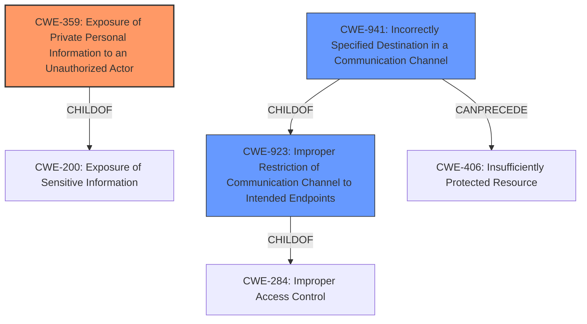

# Analysis for CVE-2021-21323

# Summary
| CWE ID | CWE Name | Confidence | CWE Abstraction Level | CWE Vulnerability Mapping Label | CWE-Vulnerability Mapping Notes |
|---|---|---|---|---|---|
| CWE-359 | Exposure of Private Personal Information to an Unauthorized Actor | 0.9 | Base | Allowed | Primary CWE |
| CWE-941 | Incorrectly Specified Destination in a Communication Channel | 0.7 | Base | Allowed | Secondary Candidate |
| CWE-923 | Improper Restriction of Communication Channel to Intended Endpoints | 0.6 | Class | Allowed-with-Review | Secondary Candidate |

## Evidence and Confidence

*   **Confidence Score:** 0.8
*   **Evidence Strength:** HIGH

## Relationship Analysis
The primary relationship influencing the selection was the hierarchical nature of the CWEs, favoring the most specific **Base** level CWE where possible.

-   CWE-359 is a base CWE that is a child of CWE-200.
-   CWE-941 is a base CWE that is a child of CWE-923.
-   CWE-923 is a Class CWE that is a child of CWE-284.
-   CWE-941 can precede CWE-406.

## Vulnerability Chain
The vulnerability chain begins with the **CNAME adblocking feature accidentally initiating DNS requests that bypassed the Brave Tor proxy**. This leads to **leak DNS requests from Tor windows to their DNS provider**, resulting in **Exposure of Private Personal Information to an Unauthorized Actor (CWE-359)**.

## Summary of Analysis
Initially, the analysis focused on the **rootcause** identified: "CNAME adblocking feature accidentally initiated DNS requests that bypassed the Brave Tor proxy."

The primary CWE selected is CWE-359 (Exposure of Private Personal Information to an Unauthorized Actor) because the vulnerability description explicitly states that the **impact** was a "leak DNS requests from Tor windows to their DNS provider", which constitutes an exposure of private information. The CVE Reference Links Content Summary reinforces this by stating "The most significant impact was a privacy breach for users relying on Tor for anonymity. The DNS leak exposed the user's browsing activity to their DNS provider, deanonymizing their Tor browsing."

CWE-941 (Incorrectly Specified Destination in a Communication Channel) was considered because the DNS requests were being sent to the user's regular DNS provider instead of the Tor proxy. The description of CWE-941 states: "The product creates a communication channel to initiate an outgoing request to an actor, but it does not correctly specify the intended destination for that actor." This fits the scenario where the intended destination was the Tor proxy, but the requests were incorrectly routed.

CWE-923 (Improper Restriction of Communication Channel to Intended Endpoints) was also considered, as it is a broader class that encompasses issues where communication channels are not properly restricted to the correct endpoints. The vulnerability involved DNS requests bypassing the Tor proxy, which is a failure to restrict the communication channel to the intended endpoint.

The selection of CWE-359 as the primary CWE is based on the direct evidence of private information exposure. The other CWEs are secondary as they represent contributing factors or broader classifications. The chosen CWEs are at the optimal level of specificity, with CWE-359 being a **Base** level CWE and the most direct representation of the vulnerability's impact.

# Enhanced Query for CVE-2021-21323

## Vulnerability Description
Brave is an open source web browser with a focus on privacy and security. In Brave versions 1.17.73-1.20.103, the CNAME adblocking feature added in Brave 1.17.73 accidentally initiated DNS requests that bypassed the Brave Tor proxy. Users with adblocking enabled would leak DNS requests from Tor windows to their DNS provider. (DNS requests that were not initiated by CNAME adblocking would go through Tor as expected.) This is fixed in Brave version 1.20.108

### Vulnerability Description Key Phrases
- **rootcause:** **CNAME adblocking feature accidentally initiated DNS requests that bypassed the Brave Tor proxy**
- **impact:** leak DNS requests from Tor windows to their DNS provider
- **product:** Brave
- **version:** 1.17.73-1.20.103
- **component:** CNAME adblocking feature

## CVE Reference Links Content Summary
Based on the provided content, here's an analysis of CVE-2021-21323:

**Root Cause of Vulnerability:**
The vulnerability was a regression introduced by the CNAME adblocking feature in Brave browser. This feature inadvertently initiated DNS requests that bypassed the Tor proxy when a user had adblocking enabled within a Tor window.

**Weaknesses/Vulnerabilities Present:**
- **DNS Leakage:** The primary vulnerability was a DNS leak when using Tor. DNS queries, meant to be routed through the Tor network, were instead being sent to the user's regular DNS provider. This was due to the CNAME adblocking feature's DNS resolution process not respecting the Tor proxy settings.
- **Improper Handling of DNS Resolution within Tor:** Specifically, the CNAME adblocking logic was making DNS queries outside of the Tor proxy.

**Impact of Exploitation:**
- **Privacy Violation:** The most significant impact was a privacy breach for users relying on Tor for anonymity. The DNS leak exposed the user's browsing activity to their DNS provider, deanonymizing their Tor browsing.
- **Circumvention of Tor's Purpose:**  The vulnerability undermined the fundamental purpose of using Tor, which is to obfuscate the user's network traffic and location.

**Attack Vectors:**
- **Enabled CNAME Adblocking:** The attack vector was automatic, triggered by the user having CNAME adblocking enabled within the Brave browser's Tor windows.

**Required Attacker Capabilities/Position:**
- **No direct attacker interaction required.** The vulnerability was triggered automatically based on a user's configuration (using Tor with CNAME adblocking enabled). There was no need for an active attacker to exploit it beyond the user visiting a website which triggered the CNAME lookup.

**Additional Details:**
- The vulnerability was present in Brave Browser Desktop versions 1.17.73 to 1.20.103.
- It was fixed in version 1.20.108.
- The fix involved disabling CNAME adblocking for Tor, after initial attempts to route DoH through Tor proved problematic.
- The vulnerability was reported through HackerOne and tracked as issue #13527 on the Brave browser's GitHub repository.
- The issue was addressed in `brave-core` pull request #7769.

The provided information gives a good overview of the vulnerability, its cause, impact, and how it was addressed.

## Retriever Results

### Top Combined Results

| Rank | CWE ID | Name | Abstraction | Usage  | Retrievers | Individual Scores |
|------|--------|------|-------------|-------|------------|-------------------|
| 1 | 359 | Exposure of Private Personal Information to an Unauthorized Actor | Base | Allowed | sparse | 1.218 |
| 2 | 923 | Improper Restriction of Communication Channel to Intended Endpoints | Class | Allowed-with-Review | sparse | 0.774 |
| 3 | 941 | Incorrectly Specified Destination in a Communication Channel | Base | Allowed | sparse | 0.637 |
| 4 | 201 | Insertion of Sensitive Information Into Sent Data | Base | Allowed | sparse | 0.617 |
| 5 | 346 | Origin Validation Error | Class | Allowed-with-Review | sparse | 0.428 |
| 6 | 350 | Reliance on Reverse DNS Resolution for a Security-Critical Action | Variant | Allowed | dense | 0.416 |
| 7 | 1275 | Sensitive Cookie with Improper SameSite Attribute | Variant | Allowed | graph | 0.002 |
| 8 | 290 | Authentication Bypass by Spoofing | Base | Allowed | sparse | 0.414 |
| 9 | 400 | Uncontrolled Resource Consumption | Class | Discouraged | sparse | 0.414 |
| 10 | 940 | Improper Verification of Source of a Communication Channel | Base | Allowed | sparse | 0.403 |

# Complete CWE Specifications

## CWE-359: Exposure of Private Personal Information to an Unauthorized Actor
**Abstraction:** Base
**Status:** Incomplete

### Description
The product does not properly prevent a person's private, personal information from being accessed by actors who either (1) are not explicitly authorized to access the information or (2) do not have the implicit consent of the person about whom the information is collected.

### Extended Description
Not provided

### Alternative Terms
Privacy violation
Privacy leak
Privacy leakage

### Relationships
ChildOf -> CWE-200

### Mapping Guidance
**Usage:** Allowed
**Rationale:** This CWE entry is at the Base level of abstraction, which is a preferred level of abstraction for mapping to the root causes of vulnerabilities.
**Comments:** Carefully read both the name and description to ensure that this mapping is an appropriate fit. Do not try to 'force' a mapping to a lower-level Base/Variant simply to comply with this preferred level of abstraction.
**Reasons:**
- Acceptable-Use

### Additional Notes
**[Maintenance]** This entry overlaps many other entries that are not organized around the kind of sensitive information that is exposed. However, because privacy is treated with such importance due to regulations and other factors, and it may be useful for weakness-finding tools to highlight capabilities that detect personal private information instead of system information, it is not clear whether - and how - this entry should be deprecated.

**[Other]** 

There are many types of sensitive information that products must protect from attackers, including system data, communications, configuration, business secrets, intellectual property, and an individual's personal (private) information. Private personal information may include a password, phone number, geographic location, personal messages, credit card number, etc. Private information is important to consider whether the person is a user of the product, or part of a data set that is processed by the product. An exposure of private information does not necessarily prevent the product from working properly, and in fact the exposure might be intended by the developer, e.g. as part of data sharing with other organizations. However, the exposure of personal private information can still be undesirable or explicitly prohibited by law or regulation.

Some types of private information include:

  - Government identifiers, such as Social Security Numbers

  - Contact information, such as home addresses and telephone numbers

  - Geographic location - where the user is (or was)

  - Employment history

  - Financial data - such as credit card numbers, salary, bank accounts, and debts

  - Pictures, video, or audio

  - Behavioral patterns - such as web surfing history, when certain activities are performed, etc.

  - Relationships (and types of relationships) with others - family, friends, contacts, etc.

  - Communications - e-mail addresses, private messages, text messages, chat logs, etc.

  - Health - medical conditions, insurance status, prescription records

  - Account passwords and other credentials

Some of this information may be characterized as PII (Personally Identifiable Information), Protected Health Information (PHI), etc. Categories of private information may overlap or vary based on the intended usage or the policies and practices of a particular industry.

Sometimes data that is not labeled as private can have a privacy implication in a different context. For example, student identification numbers are usually not considered private because there is no explicit and publicly-available mapping to an individual student's personal information. However, if a school generates identification numbers based on student social security numbers, then the identification numbers should be considered private.

## CWE-923: Improper Restriction of Communication Channel to Intended Endpoints
**Abstraction:** Class
**Status:** Incomplete

### Description
The product establishes a communication channel to (or from) an endpoint for privileged or protected operations, but it does not properly ensure that it is communicating with the correct endpoint.

### Extended Description

Attackers might be able to spoof the intended endpoint from a different system or process, thus gaining the same level of access as the intended endpoint.

While this issue frequently involves authentication between network-based clients and servers, other types of communication channels and endpoints can have this weakness.

### Alternative Terms
None

### Relationships
ChildOf -> CWE-284

### Mapping Guidance
**Usage:** Allowed-with-Review
**Rationale:** This CWE entry is a Class and might have Base-level children that would be more appropriate
**Comments:** Examine children of this entry to see if there is a better fit
**Reasons:**
- Abstraction

### Observed Examples
- **CVE-2022-30319:** S-bus functionality in a home automation product performs access control using an IP allowlist, which can be bypassed by a forged IP address.
- **CVE-2022-22547:** A troubleshooting tool exposes a web server on a random port between 9000-65535 that could be used for information gathering
- **CVE-2022-4390:** A WAN interface on a router has firewall restrictions enabled for IPv4, but it does not for IPv6, which is enabled by default

## CWE-941: Incorrectly Specified Destination in a Communication Channel
**Abstraction:** Base
**Status:** Incomplete

### Description
The product creates a communication channel to initiate an outgoing request to an actor, but it does not correctly specify the intended destination for that actor.

### Extended Description

Attackers at the destination may be able to spoof trusted servers to steal data or cause a denial of service.

There are at least two distinct weaknesses that can cause the product to communicate with an unintended destination:

  - If the product allows an attacker to control which destination is specified, then the attacker can cause it to connect to an untrusted or malicious destination. For example, because UDP is a connectionless protocol, UDP packets can be spoofed by specifying a false source address in the packet; when the server receives the packet and sends a reply, it will specify a destination by using the source of the incoming packet - i.e., the false source. The server can then be tricked into sending traffic to the wrong host, which is effective for hiding the real source of an attack and for conducting a distributed denial of service (DDoS). As another example, server-side request forgery (SSRF) and XML External Entity (XXE) can be used to trick a server into making outgoing requests to hosts that cannot be directly accessed by the attacker due to firewall restrictions.

  - If the product incorrectly specifies the destination, then an attacker who can control this destination might be able to spoof trusted servers. While the most common occurrence is likely due to misconfiguration by an administrator, this can be resultant from other weaknesses. For example, the product might incorrectly parse an e-mail or IP address and send sensitive data to an unintended destination. As another example, an Android application may use a "sticky broadcast" to communicate with a receiver for a particular application, but since sticky broadcasts can be processed by *any* receiver, this can allow a malicious application to access restricted data that was only intended for a different application.

### Alternative Terms
None

### Relationships
ChildOf -> CWE-923
CanPrecede -> CWE-406

### Mapping Guidance
**Usage:** Allowed
**Rationale:** This CWE entry is at the Base level of abstraction, which is a preferred level of abstraction for mapping to the root causes of vulnerabilities.
**Comments:** Carefully read both the name and description to ensure that this mapping is an appropriate fit. Do not try to 'force' a mapping to a lower-level Base/Variant simply to comply with this preferred level of abstraction.
**Reasons:**
- Acceptable-Use

### Observed Examples
- **CVE-2013-5211:** composite: NTP feature generates large responses (high amplification factor) with spoofed UDP source addresses.
- **CVE-1999-0513:** Classic "Smurf" attack, using spoofed ICMP packets to broadcast addresses.
- **CVE-1999-1379:** DNS query with spoofed source address causes more traffic to be returned to spoofed address than was sent by the attacker.

## CWE-201: Insertion of Sensitive Information Into Sent Data
**Abstraction:** Base
**Status:** Draft

### Description
The code transmits data to another actor, but a portion of the data includes sensitive information that should not be accessible to that actor.

### Extended Description
Not provided

### Alternative Terms
None

### Relationships
ChildOf -> CWE-200
CanAlsoBe -> CWE-209
CanAlsoBe -> CWE-202

### Mapping Guidance
**Usage:** Allowed
**Rationale:** This CWE entry is at the Base level of abstraction, which is a preferred level of abstraction for mapping to the root causes of vulnerabilities.
**Comments:** Carefully read both the name and description to ensure that this mapping is an appropriate fit. Do not try to 'force' a mapping to a lower-level Base/Variant simply to comply with this preferred level of abstraction.
**Reasons:**
- Acceptable-Use

### Additional Notes
**[Other]** Sensitive information could include data that is sensitive in and of itself (such as credentials or private messages), or otherwise useful in the further exploitation of the system (such as internal file system structure).

### Observed Examples
- **CVE-2022-0708:** Collaboration platform does not clear team emails in a response, allowing leak of email addresses

## CWE-346: Origin Validation Error
**Abstraction:** Class
**Status:** Draft

### Description
The product does not properly verify that the source of data or communication is valid.

### Extended Description
Not provided

### Alternative Terms
None

### Relationships
ChildOf -> CWE-345
ChildOf -> CWE-345
ChildOf -> CWE-284

### Mapping Guidance
**Usage:** Allowed-with-Review
**Rationale:** This CWE entry is a Class and might have Base-level children that would be more appropriate
**Comments:** Examine children of this entry to see if there is a better fit
**Reasons:**
- Abstraction

### Additional Notes
**[Maintenance]** This entry has some significant overlap with other CWE entries and may need some clarification. See terminology notes.

**[Terminology]** The "Origin Validation Error" term was originally used in a 1995 thesis [REF-324]. Although not formally defined, an issue is considered to be an origin validation error if either (1) "an object [accepts] input from an unauthorized subject," or (2) "the system [fails] to properly or completely authenticate a subject." A later section says that an origin validation error can occur when the system (1) "does not properly authenticate a user or process" or (2) "does not properly authenticate the shared data or libraries." The only example provided in the thesis (covered by OSVDB:57615) involves a setuid program running command-line arguments without dropping privileges. So, this definition (and its examples in the thesis) effectively cover other weaknesses such as CWE-287 (Improper Authentication), CWE-285 (Improper Authorization), and CWE-250 (Execution with Unnecessary Privileges). There appears to be little usage of this term today, except in the SecurityFocus vulnerability database, where the term is used for a variety of issues, including web-browser problems that allow violation of the Same Origin Policy and improper validation of the source of an incoming message.

### Observed Examples
- **CVE-2000-1218:** DNS server can accept DNS updates from hosts that it did not query, leading to cache poisoning
- **CVE-2005-0877:** DNS server can accept DNS updates from hosts that it did not query, leading to cache poisoning
- **CVE-2001-1452:** DNS server caches glue records received from non-delegated name servers

## CWE-350: Reliance on Reverse DNS Resolution for a Security-Critical Action
**Abstraction:** Variant
**Status:** Draft

### Description
The product performs reverse DNS resolution on an IP address to obtain the hostname and make a security decision, but it does not properly ensure that the IP address is truly associated with the hostname.

### Extended Description

Since DNS names can be easily spoofed or misreported, and it may be difficult for the product to detect if a trusted DNS server has been compromised, DNS names do not constitute a valid authentication mechanism.

When the product performs a reverse DNS resolution for an IP address, if an attacker controls the DNS server for that IP address, then the attacker can cause the server to return an arbitrary hostname. As a result, the attacker may be able to bypass authentication, cause the wrong hostname to be recorded in log files to hide activities, or perform other attacks.

Attackers can spoof DNS names by either (1) compromising a DNS server and modifying its records (sometimes called DNS cache poisoning), or (2) having legitimate control over a DNS server associated with their IP address.

### Alternative Terms
None

### Relationships
ChildOf -> CWE-290
ChildOf -> CWE-807
CanPrecede -> CWE-923

### Mapping Guidance
**Usage:** Allowed
**Rationale:** This CWE entry is at the Variant level of abstraction, which is a preferred level of abstraction for mapping to the root causes of vulnerabilities.
**Comments:** Carefully read both the name and description to ensure that this mapping is an appropriate fit. Do not try to 'force' a mapping to a lower-level Base/Variant simply to comply with this preferred level of abstraction.
**Reasons:**
- Acceptable-Use

### Additional Notes
**[Maintenance]** CWE-350, CWE-247, and CWE-292 were merged into CWE-350 in CWE 2.5. CWE-247 was originally derived from Seven Pernicious Kingdoms, CWE-350 from PLOVER, and CWE-292 from CLASP. All taxonomies focused closely on the use of reverse DNS for authentication of incoming requests.

### Observed Examples
- **CVE-2001-1488:** Does not do double-reverse lookup to prevent DNS spoofing.
- **CVE-2001-1500:** Does not verify reverse-resolved hostnames in DNS.
- **CVE-2000-1221:** Authentication bypass using spoofed reverse-resolved DNS hostnames.

## CWE-1275: Sensitive Cookie with Improper SameSite Attribute
**Abstraction:** Variant
**Status:** Incomplete

### Description
The SameSite attribute for sensitive cookies is not set, or an insecure value is used.

### Extended Description
The SameSite attribute controls how cookies are sent for cross-domain requests. This attribute may have three values: 'Lax', 'Strict', or 'None'. If the 'None' value is used, a website may create a cross-domain POST HTTP request to another website, and the browser automatically adds cookies to this request. This may lead to Cross-Site-Request-Forgery (CSRF) attacks if there are no additional protections in place (such as Anti-CSRF tokens).

### Alternative Terms
None

### Relationships
ChildOf -> CWE-923
CanPrecede -> CWE-352

### Mapping Guidance
**Usage:** Allowed
**Rationale:** This CWE entry is at the Variant level of abstraction, which is a preferred level of abstraction for mapping to the root causes of vulnerabilities.
**Comments:** Carefully read both the name and description to ensure that this mapping is an appropriate fit. Do not try to 'force' a mapping to a lower-level Base/Variant simply to comply with this preferred level of abstraction.
**Reasons:**
- Acceptable-Use

### Observed Examples
- **CVE-2022-24045:** Web application for a room automation system has client-side JavaScript that sets a sensitive cookie without the SameSite security attribute, allowing the cookie to be sniffed

## CWE-290: Authentication Bypass by Spoofing
**Abstraction:** Base
**Status:** Incomplete

### Description
This attack-focused weakness is caused by incorrectly implemented authentication schemes that are subject to spoofing attacks.

### Extended Description
Not provided

### Alternative Terms
None

### Relationships
ChildOf -> CWE-1390
ChildOf -> CWE-287

### Mapping Guidance
**Usage:** Allowed
**Rationale:** This CWE entry is at the Base level of abstraction, which is a preferred level of abstraction for mapping to the root causes of vulnerabilities.
**Comments:** Carefully read both the name and description to ensure that this mapping is an appropriate fit. Do not try to 'force' a mapping to a lower-level Base/Variant simply to comply with this preferred level of abstraction.
**Reasons:**
- Acceptable-Use

### Additional Notes
**[Relationship]** This can be resultant from insufficient verification.

### Observed Examples
- **CVE-2022-30319:** S-bus functionality in a home automation product performs access control using an IP allowlist, which can be bypassed by a forged IP address.
- **CVE-2009-1048:** VOIP product allows authentication bypass using 127.0.0.1 in the Host header.

## CWE-400: Uncontrolled Resource Consumption
**Abstraction:** Class
**Status:** Draft

### Description
The product does not properly control the allocation and maintenance of a limited resource, thereby enabling an actor to influence the amount of resources consumed, eventually leading to the exhaustion of available resources.

### Extended Description

Limited resources include memory, file system storage, database connection pool entries, and CPU. If an attacker can trigger the allocation of these limited resources, but the number or size of the resources is not controlled, then the attacker could cause a denial of service that consumes all available resources. This would prevent valid users from accessing the product, and it could potentially have an impact on the surrounding environment. For example, a memory exhaustion attack against an application could slow down the application as well as its host operating system.

There are at least three distinct scenarios which can commonly lead to resource exhaustion:

  - Lack of throttling for the number of allocated resources

  - Losing all references to a resource before reaching the shutdown stage

  - Not closing/returning a resource after processing

Resource exhaustion problems are often result due to an incorrect implementation of the following situations:

  - Error conditions and other exceptional circumstances.

  - Confusion over which part of the program is responsible for releasing the resource.

### Alternative Terms
Resource Exhaustion

### Relationships
ChildOf -> CWE-664

### Mapping Guidance
**Usage:** Discouraged
**Rationale:** CWE-400 is intended for incorrect behaviors in which the product is expected to track and restrict how many resources it consumes, but CWE-400 is often misused because it is conflated with the "technical impact" of vulnerabilities in which resource consumption occurs. It is sometimes used for low-information vulnerability reports. It is a level-1 Class (i.e., a child of a Pillar).
**Comments:** Closely analyze the specific mistake that is causing resource consumption, and perform a CWE mapping for that mistake. Consider children/descendants such as CWE-770: Allocation of Resources Without Limits or Throttling, CWE-771: Missing Reference to Active Allocated Resource, CWE-410: Insufficient Resource Pool, CWE-772: Missing Release of Resource after Effective Lifetime, CWE-834: Excessive Iteration, CWE-405: Asymmetric Resource Consumption (Amplification), and others.
**Reasons:**
- Frequent Misuse

### Additional Notes
**[Maintenance]** "Resource consumption" could be interpreted as a consequence instead of an insecure behavior, so this entry is being considered for modification. It appears to be referenced too frequently when more precise mappings are available. Some of its children, such as CWE-771, might be better considered as a chain.

**[Theoretical]** Vulnerability theory is largely about how behaviors and resources interact. "Resource exhaustion" can be regarded as either a consequence or an attack, depending on the perspective. This entry is an attempt to reflect the underlying weaknesses that enable these attacks (or consequences) to take place.

**[Other]** 

Database queries that take a long time to process are good DoS targets. An attacker would have to write a few lines of Perl code to generate enough traffic to exceed the site's ability to keep up. This would effectively prevent authorized users from using the site at all. Resources can be exploited simply by ensuring that the target machine must do much more work and consume more resources in order to service a request than the attacker must do to initiate a request.

A prime example of this can be found in old switches that were vulnerable to "macof" attacks (so named for a tool developed by Dugsong). These attacks flooded a switch with random IP and MAC address combinations, therefore exhausting the switch's cache, which held the information of which port corresponded to which MAC addresses. Once this cache was exhausted, the switch would fail in an insecure way and would begin to act simply as a hub, broadcasting all traffic on all ports and allowing for basic sniffing attacks.

**[Maintenance]** The Taxonomy_Mappings to ISA/IEC 62443 were added in CWE 4.10, but they are still under review and might change in future CWE versions. These draft mappings were performed by members of the "Mapping CWE to 62443" subgroup of the CWE-CAPEC ICS/OT Special Interest Group (SIG), and their work is incomplete as of CWE 4.10. The mappings are included to facilitate discussion and review by the broader ICS/OT community, and they are likely to change in future CWE versions.

### Observed Examples
- **CVE-2022-21668:** Chain: Python library does not limit the resources used to process images that specify a very large number of bands (CWE-1284), leading to excessive memory consumption (CWE-789) or an integer overflow (CWE-190).
- **CVE-2020-7218:** Go-based workload orchestrator does not limit resource usage with unauthenticated connections, allowing a DoS by flooding the service
- **CVE-2020-3566:** Resource exhaustion in distributed OS because of "insufficient" IGMP queue management, as exploited in the wild per CISA KEV.

## CWE-940: Improper Verification of Source of a Communication Channel
**Abstraction:** Base
**Status:** Incomplete

### Description
The product establishes a communication channel to handle an incoming request that has been initiated by an actor, but it does not properly verify that the request is coming from the expected origin.

### Extended Description
When an attacker can successfully establish a communication channel from an untrusted origin, the attacker may be able to gain privileges and access unexpected functionality.

### Alternative Terms
None

### Relationships
ChildOf -> CWE-923
ChildOf -> CWE-346

### Mapping Guidance
**Usage:** Allowed
**Rationale:** This CWE entry is at the Base level of abstraction, which is a preferred level of abstraction for mapping to the root causes of vulnerabilities.
**Comments:** Carefully read both the name and description to ensure that this mapping is an appropriate fit. Do not try to 'force' a mapping to a lower-level Base/Variant simply to comply with this preferred level of abstraction.
**Reasons:**
- Acceptable-Use

### Additional Notes
**[Relationship]** While many access control issues involve authenticating the user, this weakness is more about authenticating the actual source of the communication channel itself; there might not be any "user" in such cases.

### Observed Examples
- **CVE-2000-1218:** DNS server can accept DNS updates from hosts that it did not query, leading to cache poisoning
- **CVE-2005-0877:** DNS server can accept DNS updates from hosts that it did not query, leading to cache poisoning
- **CVE-2001-1452:** DNS server caches glue records received from non-delegated name servers

