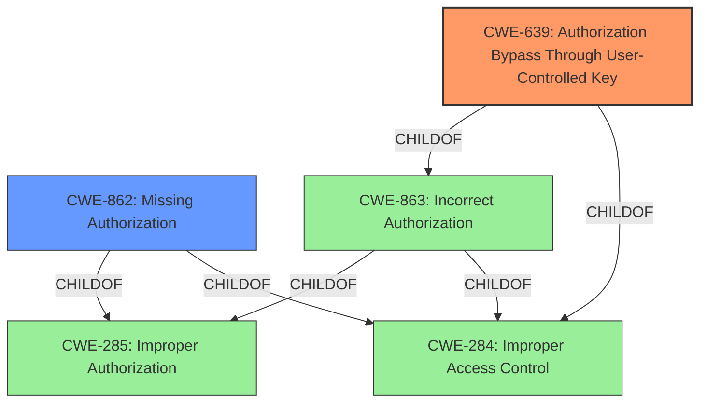

# Raw Analyzer Response for CVE-2021-21326

# Summary
| CWE ID | CWE Name | Confidence | CWE Abstraction Level | CWE Vulnerability Mapping Label | CWE-Vulnerability Mapping Notes |
|---|---|---|---|---|---|
| CWE-639 | Authorization Bypass Through User-Controlled Key | 0.9 | Base | Allowed | Primary CWE: The application allows a user to create tickets on behalf of another user by modifying the key value, thus bypassing authorization. |
| CWE-862 | Missing Authorization | 0.7 | Class | Allowed-with-Review | Secondary CWE: The application **fails to perform authorization checks** when a user attempts to create a ticket for another user. |

## Evidence and Confidence

*   **Confidence Score:** 0.8
*   **Evidence Strength:** HIGH

## Relationship Analysis
The primary CWE is CWE-639, which is a Base level CWE and a child of CWE-863. CWE-862 is also considered because the application **fails to perform authorization checks**.

## Vulnerability Chain
The vulnerability chain starts with the **lack of proper authorization checks** (CWE-862), which leads to the ability to **bypass authorization by manipulating user-controlled keys** (CWE-639), resulting in the impact of being able to create tickets for other users.

## Summary of Analysis
The initial assessment identified that a user can create tickets for another user due to the **lack of authorization** on the self-service interface. The Retriever Results suggested several CWEs, including CWE-639, CWE-862, and CWE-863.

The primary focus is on CWE-639 because the vulnerability allows a user to **gain access to another user's data or record by modifying the key value identifying the data**. This aligns perfectly with the CWE description: "The system's authorization functionality does not prevent one user from gaining access to another user's data or record by modifying the key value identifying the data." The CVE Reference Links Content Summary confirms this, stating that the vulnerability allows a user to create tickets on behalf of another user through the self-service interface.

CWE-862, Missing Authorization, is a Class level CWE, and according to the mapping guidance, it is better to use a Base level CWE if available. While CWE-862 could apply, CWE-639 provides a more specific description of the vulnerability.

The final decision is to select CWE-639 as the primary CWE because it accurately reflects the root cause of the vulnerability, which is the ability to **bypass authorization through user-controlled keys**. The supporting evidence from the vulnerability description and CVE Reference Links Content Summary confirms this assessment.

Relevant CWE Information:

# Enhanced Context (25 CWEs)
The following CWEs were identified as potentially relevant to this vulnerability:

## CWE-639: Authorization Bypass Through User-Controlled Key
**Abstraction Level**: Base
**Similarity Score**: 0.78
**Source**: dense

**Description**:
The system's authorization functionality does not prevent one user from gaining access to another user's data or record by modifying the key value identifying the data.

**Mapping Guidance**:
- Usage: Allowed
- Rationale: This CWE entry is at the Base level of abstraction, which is a preferred level of abstraction for mapping to the root causes of vulnerabilities.

## CWE-862: Missing Authorization
**Abstraction Level**: Class
**Similarity Score**: 0.089

**Description**:
The product does not perform an authorization check when an actor attempts to access a resource or perform an action.

**Mapping Guidance**:
- Usage: Allowed-with-Review
- Rationale: This CWE entry is a Class and might have Base-level children that would be more appropriate

## CWE-863: Incorrect Authorization
**Abstraction Level**: Class
**Similarity Score**: 0.089

**Description**:
The product performs an authorization check when an actor attempts to access a resource or perform an action, but it does not correctly perform the check.

**Mapping Guidance**:
- Usage: Allowed-with-Review
- Rationale: This CWE entry is a Class and might have Base-level children that would be more appropriate