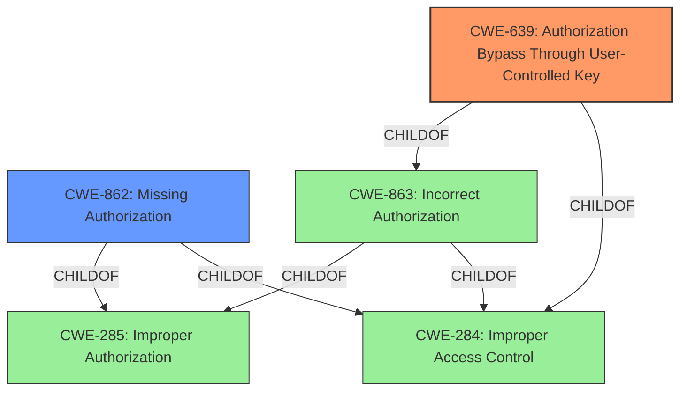

# Analysis for CVE-2021-21326

# Summary
| CWE ID | CWE Name | Confidence | CWE Abstraction Level | CWE Vulnerability Mapping Label | CWE-Vulnerability Mapping Notes |
|---|---|---|---|---|---|
| CWE-639 | Authorization Bypass Through User-Controlled Key | 0.9 | Base | Allowed | Primary CWE: The application allows a user to create tickets on behalf of another user by modifying the key value, thus bypassing authorization. |
| CWE-862 | Missing Authorization | 0.7 | Class | Allowed-with-Review | Secondary CWE: The application **fails to perform authorization checks** when a user attempts to create a ticket for another user. |

## Evidence and Confidence

*   **Confidence Score:** 0.8
*   **Evidence Strength:** HIGH

## Relationship Analysis
The primary CWE is CWE-639, which is a Base level CWE and a child of CWE-863. CWE-862 is also considered because the application **fails to perform authorization checks**.

## Vulnerability Chain
The vulnerability chain starts with the **lack of proper authorization checks** (CWE-862), which leads to the ability to **bypass authorization by manipulating user-controlled keys** (CWE-639), resulting in the impact of being able to create tickets for other users.

## Summary of Analysis
The initial assessment identified that a user can create tickets for another user due to the **lack of authorization** on the self-service interface. The Retriever Results suggested several CWEs, including CWE-639, CWE-862, and CWE-863.

The primary focus is on CWE-639 because the vulnerability allows a user to **gain access to another user's data or record by modifying the key value identifying the data**. This aligns perfectly with the CWE description: "The system's authorization functionality does not prevent one user from gaining access to another user's data or record by modifying the key value identifying the data." The CVE Reference Links Content Summary confirms this, stating that the vulnerability allows a user to create tickets on behalf of another user through the self-service interface.

CWE-862, Missing Authorization, is a Class level CWE, and according to the mapping guidance, it is better to use a Base level CWE if available. While CWE-862 could apply, CWE-639 provides a more specific description of the vulnerability.

The final decision is to select CWE-639 as the primary CWE because it accurately reflects the root cause of the vulnerability, which is the ability to **bypass authorization through user-controlled keys**. The supporting evidence from the vulnerability description and CVE Reference Links Content Summary confirms this assessment.

Relevant CWE Information:

# Enhanced Context (25 CWEs)
The following CWEs were identified as potentially relevant to this vulnerability:

## CWE-639: Authorization Bypass Through User-Controlled Key
**Abstraction Level**: Base
**Similarity Score**: 0.78
**Source**: dense

**Description**:
The system's authorization functionality does not prevent one user from gaining access to another user's data or record by modifying the key value identifying the data.

**Mapping Guidance**:
- Usage: Allowed
- Rationale: This CWE entry is at the Base level of abstraction, which is a preferred level of abstraction for mapping to the root causes of vulnerabilities.

## CWE-862: Missing Authorization
**Abstraction Level**: Class
**Similarity Score**: 0.089

**Description**:
The product does not perform an authorization check when an actor attempts to access a resource or perform an action.

**Mapping Guidance**:
- Usage: Allowed-with-Review
- Rationale: This CWE entry is a Class and might have Base-level children that would be more appropriate

## CWE-863: Incorrect Authorization
**Abstraction Level**: Class
**Similarity Score**: 0.089

**Description**:
The product performs an authorization check when an actor attempts to access a resource or perform an action, but it does not correctly perform the check.

**Mapping Guidance**:
- Usage: Allowed-with-Review
- Rationale: This CWE entry is a Class and might have Base-level children that would be more appropriate

# Enhanced Query for CVE-2021-21326

## Vulnerability Description
GLPI is an open-source asset and IT management software package that provides ITIL Service Desk features, licenses tracking and software auditing. In GLPI before version 9.5.4 it is possible to create tickets for another user with self-service interface without delegatee systems enabled. This is fixed in version 9.5.4.

### Vulnerability Description Key Phrases
- **impact:** create tickets for another user
- **vector:** self-service interface
- **product:** GLPI
- **version:** before version 9.5.4

## CVE Reference Links Content Summary
Based on the provided information, here's an analysis of CVE-2021-21326:

**Root Cause of Vulnerability:**
The vulnerability allows a user to create tickets on behalf of another user through the self-service interface, even when delegatee systems are not enabled.

**Weaknesses/Vulnerabilities Present:**
- Horizontal Privilege Escalation: The vulnerability allows a user to perform actions they are not authorized to do, specifically creating tickets as another user.
- Inadequate access control: The application fails to properly restrict ticket creation, allowing users to bypass intended limitations.

**Impact of Exploitation:**
- An attacker can create tickets as another user in the system, leading to potential manipulation of support workflows and possibly causing confusion or disruption. This can be used to impersonate a legitimate user and potentially trigger actions under the context of the impersonated user.

**Attack Vectors:**
- Self-service interface: The attack is performed through the self-service interface of the application.

**Required Attacker Capabilities/Position:**
- The attacker needs to be a valid user of the application with access to the self-service interface. No specific elevated privileges are required other than access to the self-service portal.

**Additional Notes**

- The vulnerability is considered to be of moderate severity.
- The vulnerability is patched in version 9.5.4 of the GLPI application.
- The GitHub advisory indicates that there is no CWE classification provided for the vulnerability.

## Retriever Results

### Top Combined Results

| Rank | CWE ID | Name | Abstraction | Usage  | Retrievers | Individual Scores |
|------|--------|------|-------------|-------|------------|-------------------|
| 1 | 470 | Use of Externally-Controlled Input to Select Classes or Code ('Unsafe Reflection') | Base | Allowed | sparse | 0.130 |
| 2 | 540 | Inclusion of Sensitive Information in Source Code | Base | Allowed | sparse | 0.121 |
| 3 | 1286 | Improper Validation of Syntactic Correctness of Input | Base | Allowed | sparse | 0.111 |
| 4 | 639 | Authorization Bypass Through User-Controlled Key | Base | Allowed | sparse | 0.104 |
| 5 | 862 | Missing Authorization | Class | Allowed-with-Review | sparse | 0.089 |
| 6 | 1249 | Application-Level Admin Tool with Inconsistent View of Underlying Operating System | Base | Allowed | dense | 0.308 |
| 7 | 939 | Improper Authorization in Handler for Custom URL Scheme | Base | Allowed | graph | 0.001 |
| 8 | 863 | Incorrect Authorization | Class | Allowed-with-Review | sparse | 0.089 |
| 9 | 306 | Missing Authentication for Critical Function | Base | Allowed | sparse | 0.089 |
| 10 | 285 | Improper Authorization | Class | Discouraged | sparse | 0.088 |

# Complete CWE Specifications

## CWE-470: Use of Externally-Controlled Input to Select Classes or Code ('Unsafe Reflection')
**Abstraction:** Base
**Status:** Draft

### Description
The product uses external input with reflection to select which classes or code to use, but it does not sufficiently prevent the input from selecting improper classes or code.

### Extended Description
If the product uses external inputs to determine which class to instantiate or which method to invoke, then an attacker could supply values to select unexpected classes or methods. If this occurs, then the attacker could create control flow paths that were not intended by the developer. These paths could bypass authentication or access control checks, or otherwise cause the product to behave in an unexpected manner. This situation becomes a doomsday scenario if the attacker can upload files into a location that appears on the product's classpath (CWE-427) or add new entries to the product's classpath (CWE-426). Under either of these conditions, the attacker can use reflection to introduce new, malicious behavior into the product.

### Alternative Terms
Reflection Injection

### Relationships
ChildOf -> CWE-913
ChildOf -> CWE-913
ChildOf -> CWE-610
ChildOf -> CWE-20

### Mapping Guidance
**Usage:** Allowed
**Rationale:** This CWE entry is at the Base level of abstraction, which is a preferred level of abstraction for mapping to the root causes of vulnerabilities.
**Comments:** Carefully read both the name and description to ensure that this mapping is an appropriate fit. Do not try to 'force' a mapping to a lower-level Base/Variant simply to comply with this preferred level of abstraction.
**Reasons:**
- Acceptable-Use

### Observed Examples
- **CVE-2018-1000613:** Cryptography API uses unsafe reflection when deserializing a private key
- **CVE-2004-2331:** Database system allows attackers to bypass sandbox restrictions by using the Reflection API.

## CWE-540: Inclusion of Sensitive Information in Source Code
**Abstraction:** Base
**Status:** Incomplete

### Description
Source code on a web server or repository often contains sensitive information and should generally not be accessible to users.

### Extended Description
There are situations where it is critical to remove source code from an area or server. For example, obtaining Perl source code on a system allows an attacker to understand the logic of the script and extract extremely useful information such as code bugs or logins and passwords.

### Alternative Terms
None

### Relationships
ChildOf -> CWE-538

### Mapping Guidance
**Usage:** Allowed
**Rationale:** This CWE entry is at the Base level of abstraction, which is a preferred level of abstraction for mapping to the root causes of vulnerabilities.
**Comments:** Carefully read both the name and description to ensure that this mapping is an appropriate fit. Do not try to 'force' a mapping to a lower-level Base/Variant simply to comply with this preferred level of abstraction.
**Reasons:**
- Acceptable-Use

### Observed Examples
- **CVE-2022-25512:** Server for Team Awareness Kit (TAK) application includes sensitive tokens in the JavaScript source code.
- **CVE-2022-24867:** The LDAP password might be visible in the html code of a rendered page in an IT Asset Management tool.
- **CVE-2007-6197:** Version numbers and internal hostnames leaked in HTML comments.

## CWE-1286: Improper Validation of Syntactic Correctness of Input
**Abstraction:** Base
**Status:** Incomplete

### Description
The product receives input that is expected to be well-formed - i.e., to comply with a certain syntax - but it does not validate or incorrectly validates that the input complies with the syntax.

### Extended Description

Often, complex inputs are expected to follow a particular syntax, which is either assumed by the input itself, or declared within metadata such as headers. The syntax could be for data exchange formats, markup languages, or even programming languages. When untrusted input is not properly validated for the expected syntax, attackers could cause parsing failures, trigger unexpected errors, or expose latent vulnerabilities that might not be directly exploitable if the input had conformed to the syntax.

### Alternative Terms
None

### Relationships
ChildOf -> CWE-20

### Mapping Guidance
**Usage:** Allowed
**Rationale:** This CWE entry is at the Base level of abstraction, which is a preferred level of abstraction for mapping to the root causes of vulnerabilities.
**Comments:** Carefully read both the name and description to ensure that this mapping is an appropriate fit. Do not try to 'force' a mapping to a lower-level Base/Variant simply to comply with this preferred level of abstraction.
**Reasons:**
- Acceptable-Use

### Additional Notes
**[Maintenance]** This entry is still under development and will continue to see updates and content improvements.

### Observed Examples
- **CVE-2016-4029:** Chain: incorrect validation of intended decimal-based IP address format (CWE-1286) enables parsing of octal or hexadecimal formats (CWE-1389), allowing bypass of an SSRF protection mechanism (CWE-918).
- **CVE-2007-5893:** HTTP request with missing protocol version number leads to crash

## CWE-639: Authorization Bypass Through User-Controlled Key
**Abstraction:** Base
**Status:** Incomplete

### Description
The system's authorization functionality does not prevent one user from gaining access to another user's data or record by modifying the key value identifying the data.

### Extended Description

Retrieval of a user record occurs in the system based on some key value that is under user control. The key would typically identify a user-related record stored in the system and would be used to lookup that record for presentation to the user. It is likely that an attacker would have to be an authenticated user in the system. However, the authorization process would not properly check the data access operation to ensure that the authenticated user performing the operation has sufficient entitlements to perform the requested data access, hence bypassing any other authorization checks present in the system.

For example, attackers can look at places where user specific data is retrieved (e.g. search screens) and determine whether the key for the item being looked up is controllable externally. The key may be a hidden field in the HTML form field, might be passed as a URL parameter or as an unencrypted cookie variable, then in each of these cases it will be possible to tamper with the key value.

One manifestation of this weakness is when a system uses sequential or otherwise easily-guessable session IDs that would allow one user to easily switch to another user's session and read/modify their data.

### Alternative Terms
Insecure Direct Object Reference / IDOR: The "Insecure Direct Object Reference" term, as described in the OWASP Top Ten, is broader than this CWE because it also covers path traversal (CWE-22). Within the context of vulnerability theory, there is a similarity between the OWASP concept and CWE-706: Use of Incorrectly-Resolved Name or Reference.
Broken Object Level Authorization / BOLA: BOLA is used in the 2019 OWASP API Security Top 10 and is said to be the same as IDOR.
Horizontal Authorization: "Horizontal Authorization" is used to describe situations in which two users have the same privilege level, but must be prevented from accessing each other's resources. This is fairly common when using key-based access to resources in a multi-user context.

### Relationships
ChildOf -> CWE-863
ChildOf -> CWE-863
ChildOf -> CWE-284

### Mapping Guidance
**Usage:** Allowed
**Rationale:** This CWE entry is at the Base level of abstraction, which is a preferred level of abstraction for mapping to the root causes of vulnerabilities.
**Comments:** Carefully read both the name and description to ensure that this mapping is an appropriate fit. Do not try to 'force' a mapping to a lower-level Base/Variant simply to comply with this preferred level of abstraction.
**Reasons:**
- Acceptable-Use

### Observed Examples
- **CVE-2021-36539:** An educational application does not appropriately restrict file IDs to a particular user. The attacker can brute-force guess IDs, indicating IDOR.

## CWE-862: Missing Authorization
**Abstraction:** Class
**Status:** Incomplete

### Description
The product does not perform an authorization check when an actor attempts to access a resource or perform an action.

### Extended Description
Not provided

### Alternative Terms
AuthZ: "AuthZ" is typically used as an abbreviation of "authorization" within the web application security community. It is distinct from "AuthN" (or, sometimes, "AuthC") which is an abbreviation of "authentication." The use of "Auth" as an abbreviation is discouraged, since it could be used for either authentication or authorization.

### Relationships
ChildOf -> CWE-285
ChildOf -> CWE-284

### Mapping Guidance
**Usage:** Allowed-with-Review
**Rationale:** This CWE entry is a Class and might have Base-level children that would be more appropriate
**Comments:** Examine children of this entry to see if there is a better fit
**Reasons:**
- Abstraction

### Additional Notes
**[Terminology]** Assuming a user with a given identity, authorization is the process of determining whether that user can access a given resource, based on the user's privileges and any permissions or other access-control specifications that apply to the resource.

### Observed Examples
- **CVE-2022-24730:** Go-based continuous deployment product does not check that a user has certain privileges to update or create an app, allowing adversaries to read sensitive repository information
- **CVE-2009-3168:** Web application does not restrict access to admin scripts, allowing authenticated users to reset administrative passwords.
- **CVE-2009-3597:** Web application stores database file under the web root with insufficient access control (CWE-219), allowing direct request.

## CWE-1249: Application-Level Admin Tool with Inconsistent View of Underlying Operating System
**Abstraction:** Base
**Status:** Incomplete

### Description
The product provides an application for administrators to manage parts of the underlying operating system, but the application does not accurately identify all of the relevant entities or resources that exist in the OS; that is, the application's model of the OS's state is inconsistent with the OS's actual state.

### Extended Description

Many products provide web-based applications or other interfaces for managing the underlying operating system. This is common with cloud, network access devices, home networking, and other systems. When the management tool does not accurately represent what is in the OS - such as user accounts - then the administrator might not see suspicious activities that would be noticed otherwise.

For example, numerous systems utilize a web front-end for administrative control. They also offer the ability to add, alter, and drop users with various privileges as it relates to the functionality of the system. A potential architectural weakness may exist where the user information reflected in the web interface does not mirror the users in the underlying operating system. Many web UI or REST APIs use the underlying operating system for authentication; the system's logic may also track an additional set of user capabilities within configuration files and datasets for authorization capabilities. When there is a discrepancy between the user information in the UI or REST API's interface system and the underlying operating system's user listing, this may introduce a weakness into the system. For example, if an attacker compromises the OS and adds a new user account - a "ghost" account - then the attacker could escape detection if the management tool does not list the newly-added account.

This discrepancy could be exploited in several ways:

  - A rogue admin could insert a new account into a system that will persist if they are terminated or wish to take action on a system that cannot be directly associated with them.

  - An attacker can leverage a separate command injection attack available through the web interface to insert a ghost account with shell privileges such as ssh.

  - An attacker can leverage existing web interface APIs, manipulated in such a way that a new user is inserted into the operating system, and the user web account is either partially created or not at all.

  - An attacker could create an admin account which is viewable by an administrator, use this account to create the ghost account, delete logs and delete the first created admin account.

Many of these attacker scenarios can be realized by leveraging separate vulnerabilities related to XSS, command injection, authentication bypass, or logic flaws on the various systems. 

### Alternative Terms
Ghost in the Shell

### Relationships
ChildOf -> CWE-1250

### Mapping Guidance
**Usage:** Allowed
**Rationale:** This CWE entry is at the Base level of abstraction, which is a preferred level of abstraction for mapping to the root causes of vulnerabilities.
**Comments:** Carefully read both the name and description to ensure that this mapping is an appropriate fit. Do not try to 'force' a mapping to a lower-level Base/Variant simply to comply with this preferred level of abstraction.
**Reasons:**
- Acceptable-Use

## CWE-939: Improper Authorization in Handler for Custom URL Scheme
**Abstraction:** Base
**Status:** Incomplete

### Description
The product uses a handler for a custom URL scheme, but it does not properly restrict which actors can invoke the handler using the scheme.

### Extended Description
Mobile platforms and other architectures allow the use of custom URL schemes to facilitate communication between applications. In the case of iOS, this is the only method to do inter-application communication. The implementation is at the developer's discretion which may open security flaws in the application. An example could be potentially dangerous functionality such as modifying files through a custom URL scheme.

### Alternative Terms
None

### Relationships
ChildOf -> CWE-862

### Mapping Guidance
**Usage:** Allowed
**Rationale:** This CWE entry is at the Base level of abstraction, which is a preferred level of abstraction for mapping to the root causes of vulnerabilities.
**Comments:** Carefully read both the name and description to ensure that this mapping is an appropriate fit. Do not try to 'force' a mapping to a lower-level Base/Variant simply to comply with this preferred level of abstraction.
**Reasons:**
- Acceptable-Use

### Observed Examples
- **CVE-2013-5725:** URL scheme has action replace which requires no user prompt and allows remote attackers to perform undesired actions.
- **CVE-2013-5726:** URL scheme has action follow and favorite which allows remote attackers to force user to perform undesired actions.

## CWE-863: Incorrect Authorization
**Abstraction:** Class
**Status:** Incomplete

### Description
The product performs an authorization check when an actor attempts to access a resource or perform an action, but it does not correctly perform the check.

### Extended Description
Not provided

### Alternative Terms
AuthZ: "AuthZ" is typically used as an abbreviation of "authorization" within the web application security community. It is distinct from "AuthN" (or, sometimes, "AuthC") which is an abbreviation of "authentication." The use of "Auth" as an abbreviation is discouraged, since it could be used for either authentication or authorization.

### Relationships
ChildOf -> CWE-285
ChildOf -> CWE-284

### Mapping Guidance
**Usage:** Allowed-with-Review
**Rationale:** This CWE entry is a Class and might have Base-level children that would be more appropriate
**Comments:** Examine children of this entry to see if there is a better fit
**Reasons:**
- Abstraction

### Additional Notes
**[Terminology]** 

Assuming a user with a given identity, authorization is the process of determining whether that user can access a given resource, based on the user's privileges and any permissions or other access-control specifications that apply to the resource.

### Observed Examples
- **CVE-2021-39155:** Chain: A microservice integration and management platform compares the hostname in the HTTP Host header in a case-sensitive way (CWE-178, CWE-1289), allowing bypass of the authorization policy (CWE-863) using a hostname with mixed case or other variations.
- **CVE-2019-15900:** Chain: sscanf() call is used to check if a username and group exists, but the return value of sscanf() call is not checked (CWE-252), causing an uninitialized variable to be checked (CWE-457), returning success to allow authorization bypass for executing a privileged (CWE-863).
- **CVE-2009-2213:** Gateway uses default "Allow" configuration for its authorization settings.

## CWE-306: Missing Authentication for Critical Function
**Abstraction:** Base
**Status:** Draft

### Description
The product does not perform any authentication for functionality that requires a provable user identity or consumes a significant amount of resources.

### Extended Description
Not provided

### Alternative Terms
None

### Relationships
ChildOf -> CWE-287
ChildOf -> CWE-287

### Mapping Guidance
**Usage:** Allowed
**Rationale:** This CWE entry is at the Base level of abstraction, which is a preferred level of abstraction for mapping to the root causes of vulnerabilities.
**Comments:** Carefully read both the name and description to ensure that this mapping is an appropriate fit. Do not try to 'force' a mapping to a lower-level Base/Variant simply to comply with this preferred level of abstraction.
**Reasons:**
- Acceptable-Use

### Observed Examples
- **CVE-2022-31260:** Chain: a digital asset management program has an undisclosed backdoor in the legacy version of a PHP script (CWE-912) that could allow an unauthenticated user to export metadata (CWE-306)
- **CVE-2022-29951:** TCP-based protocol in Programmable Logic Controller (PLC) has no authentication.
- **CVE-2022-29952:** Condition Monitor firmware uses a protocol that does not require authentication.

## CWE-285: Improper Authorization
**Abstraction:** Class
**Status:** Draft

### Description
The product does not perform or incorrectly performs an authorization check when an actor attempts to access a resource or perform an action.

### Extended Description

Assuming a user with a given identity, authorization is the process of determining whether that user can access a given resource, based on the user's privileges and any permissions or other access-control specifications that apply to the resource.

When access control checks are not applied consistently - or not at all - users are able to access data or perform actions that they should not be allowed to perform. This can lead to a wide range of problems, including information exposures, denial of service, and arbitrary code execution.

### Alternative Terms
AuthZ: "AuthZ" is typically used as an abbreviation of "authorization" within the web application security community. It is distinct from "AuthN" (or, sometimes, "AuthC") which is an abbreviation of "authentication." The use of "Auth" as an abbreviation is discouraged, since it could be used for either authentication or authorization.

### Relationships
ChildOf -> CWE-284
ChildOf -> CWE-284

### Mapping Guidance
**Usage:** Discouraged
**Rationale:** CWE-285 is high-level and lower-level CWEs can frequently be used instead. It is a level-1 Class (i.e., a child of a Pillar).
**Comments:** Look at CWE-285's children and consider mapping to CWEs such as CWE-862: Missing Authorization, CWE-863: Incorrect Authorization, CWE-732: Incorrect Permission Assignment for Critical Resource, or others.
**Reasons:**
- Abstraction
**Suggested Alternatives:**
- CWE-862: Missing Authorization
- CWE-863: Incorrect Authorization
- CWE-732: Incorrect Permission Assignment for Critical Resource

### Observed Examples
- **CVE-2022-24730:** Go-based continuous deployment product does not check that a user has certain privileges to update or create an app, allowing adversaries to read sensitive repository information
- **CVE-2009-3168:** Web application does not restrict access to admin scripts, allowing authenticated users to reset administrative passwords.
- **CVE-2009-2960:** Web application does not restrict access to admin scripts, allowing authenticated users to modify passwords of other users.

