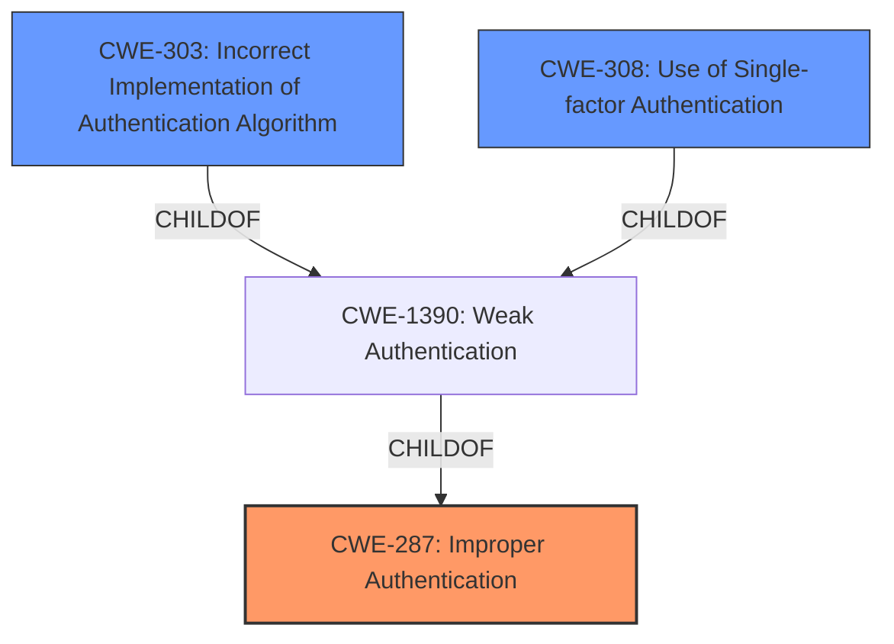

# Enhanced Analysis for CVE-2021-21329

# Summary
| CWE ID  | CWE Name                                                        | Confidence | CWE Abstraction Level | CWE Vulnerability Mapping Label | CWE-Vulnerability Mapping Notes |
| :-------- | :-------------------------------------------------------------- | :--------- | :---------------------- | :------------------------------ | :------------------------------ |
| CWE-287   | Improper Authentication                                         | 0.9        | Class                   | Primary                         | Discouraged                   |
| CWE-303   | Incorrect Implementation of Authentication Algorithm | 0.7        | Base                    | Secondary                       | Allowed                       |
| CWE-308   | Use of Single-factor Authentication | 0.6        | Base                    | Secondary                       | Allowed                       |

## Evidence and Confidence

*   **Confidence Score:** 0.8
*   **Evidence Strength:** HIGH

## Relationship Analysis
The primary CWE is CWE-287, which is a Class-level CWE. CWE-303 and CWE-308 are both children of CWE-1390 which is a child of CWE-287.
The vulnerability involves a bypass of multi-factor authentication, which falls under the umbrella of improper authentication. The relationships indicate a hierarchical structure where specific implementation flaws (CWE-303) lead to a broader authentication failure (CWE-287).


## Vulnerability Chain
The vulnerability chain begins with the **incorrect implementation** of the MFA validation in `src/authentication/views.py`. This leads to the **bypass of MFA**, resulting in **unauthorized access** to user accounts and potential **compromise of sensitive data**.

## Summary of Analysis
The analysis indicates that the primary weakness is CWE-287 (**Improper Authentication**) because the system **fails to properly authenticate** users with multi-factor authentication enabled. The root cause is the **incorrect implementation** of the MFA validation logic, as detailed in the CVE Reference Links Content Summary: "the code logic in `src/authentication/views.py` within the `LoginTwoFactorView` class incorrectly returned a successful login even when no valid 2FA token was provided."
The retriever results also lists CWE-287 as the top candidate.
CWE-303 (**Incorrect Implementation of Authentication Algorithm**) is a secondary CWE, as the **improper authentication** stems from the **incorrect implementation** of the MFA algorithm.
CWE-308 (**Use of Single-factor Authentication**) is also a secondary CWE, since the vulnerability allows users to log in without providing a valid 2FA token, effectively reducing the authentication to a single factor (username/password).

The selection of CWE-287 is made despite the discouraged usage recommendation, because the evidence points to a general **failure to properly authenticate** users with MFA enabled. The additional CWEs provide further context and specificity.

Relevant CWE Information:

# Enhanced Context (25 CWEs)

## CWE-303: Incorrect Implementation of Authentication Algorithm
**Abstraction Level**: Base
**Similarity Score**: 0.77
**Source**: dense

**Description**:
The requirements for the product dictate the use of an established authentication algorithm, but the **implementation of the algorithm is incorrect**.

**Mapping Guidance**:
- Usage: Allowed
- Rationale: This CWE entry is at the Base level of abstraction, which is a preferred level of abstraction for mapping to the root causes of vulnerabilities.

## CWE-287: Improper Authentication
**Abstraction:** Class
**Status:** Draft

### Description
When an actor claims to have a given identity, the product **does not prove or insufficiently proves that the claim is correct.**

### Mapping Guidance
**Usage:** Discouraged
**Rationale:** This CWE entry might be misused when lower-level CWE entries are likely to be applicable. It is a level-1 Class (i.e., a child of a Pillar).
**Comments:** Consider children or descendants, beginning with CWE-1390: Weak Authentication or CWE-306: Missing Authentication for Critical Function.

## CWE-308: Use of Single-factor Authentication
**Abstraction:** Base
**Status:** Draft

### Description
The use of single-factor authentication can lead to unnecessary risk of compromise when compared with the benefits of a dual-factor authentication scheme.

### Mapping Guidance
**Usage:** Allowed
- Rationale: This CWE entry is at the Base level of abstraction, which is a preferred level of abstraction for mapping to the root causes of vulnerabilities.

## CWE-1390: Weak Authentication
**Abstraction:** Class
**Status:** Incomplete

### Description
The product uses an authentication mechanism to restrict access to specific users or identities, but the mechanism **does not sufficiently prove that the claimed identity is correct.**


## CWE Relationship Analysis

Current CWEs represent these abstraction levels: .


### Vulnerability Chain Analysis

**Chain starting from CWE-308:**
- 308 (Use of Single-factor Authentication) - ROOT


**Chain starting from CWE-306:**
- 306 (Missing Authentication for Critical Function) - ROOT


### CWE Relationship Diagram

```mermaid
graph TD
    classDef primary fill:#f96,stroke:#333,stroke-width:2px
    classDef secondary fill:#69f,stroke:#333
    classDef tertiary fill:#9e9,stroke:#333
```