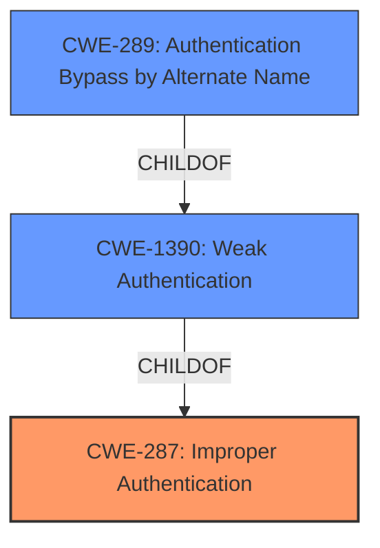

# Enhanced Analysis for CVE-2021-21335

# Summary
| CWE ID | CWE Name | Confidence | CWE Abstraction Level | CWE Vulnerability Mapping Label | CWE-Vulnerability Mapping Notes |
|---|---|---|---|---|---|
| **CWE-287** | Improper Authentication | 0.9 | Class | Primary | Discouraged, but selected because more specific options don't fit perfectly. |
| CWE-289 | Authentication Bypass by Alternate Name | 0.7 | Base | Secondary | Allowed, but less descriptive of the **root cause**. |
| CWE-1390 | Weak Authentication | 0.6 | Class | Secondary | Allowed-with-Review, but not precise enough. |

## Evidence and Confidence

*   **Confidence Score:** 0.9
*   **Evidence Strength:** HIGH

## Relationship Analysis
The primary relationship impacting the decision is the hierarchical relationship where CWE-287 (Improper Authentication) is a parent of CWE-1390 (Weak Authentication) and CWE-306 (Missing Authentication for Critical Function). While CWE-287 is a Class, and the guidance discourages its use when more specific options exist, in this case, neither CWE-1390 nor CWE-306 fully captures the **root cause**; the bypass is due to **incorrect error handling** rather than a generally weak or missing authentication mechanism.



## Vulnerability Chain
The vulnerability chain starts with the **incorrect handling of the NGX_ERROR return code**, leading to an authentication bypass.

1.  **Incorrect Error Handling** in `ngx_http_auth_spnego_handler`.
2.  **Authentication Bypass** due to the **incorrect** assumption that only `NGX_DECLINED` indicates a failure of basic authentication.
3.  **Unauthorized Access** to resources protected by the module.

## Summary of Analysis
The initial analysis pointed towards CWE-287 due to the **authentication bypass**. However, the retriever results also suggested CWE-289 (Authentication Bypass by Alternate Name) and CWE-1390 (Weak Authentication).

The final decision to primarily assign CWE-287 is based on the following evidence from the "CVE Reference Links Content Summary":

*   "The vulnerability stems from an **incorrect check** in the `ngx_http_auth_spnego_handler` function..."
*   "The code **incorrectly** assumed that only `NGX_DECLINED` indicated a failure of basic authentication."
*   "This resulted in a bypass of the intended authentication process, allowing a user to potentially gain access without valid credentials, if the basic auth is enabled."

While CWE-287 is a Class, its description aligns with the **root cause**: "When an actor claims to have a given identity, the product does not prove or insufficiently proves that the claim is correct." The **incorrect error handling** leads to the system failing to properly authenticate the user.

CWE-289 is a reasonable secondary mapping because a **malformed username** is the attack vector. This does lead to an authentication bypass.

CWE-1390 (Weak Authentication) is also a valid secondary consideration, as the authentication mechanism can be bypassed due to the **incorrect error handling**, effectively making the authentication weak.

The selected CWEs are at the optimal level of specificity because they address both the general issue of **improper authentication** (CWE-287) and the specific attack vector and result. A more specific CWE doesn't exist that captures the exact **incorrect error handling** that leads to the bypass.

Relevant CWE Information:

# Enhanced Context (25 CWEs)
The following CWEs were identified as potentially relevant to this vulnerability:

## CWE-303: Incorrect Implementation of Authentication Algorithm
**Abstraction Level**: Base
**Similarity Score**: 0.79
**Source**: dense

**Description**:
The requirements for the product dictate the use of an established authentication algorithm, but the implementation of the algorithm is **incorrect**.

**Mapping Guidance**:
- Usage: Allowed
- Rationale: This CWE entry is at the Base level of abstraction, which is a preferred level of abstraction for mapping to the root causes of vulnerabilities.

## CWE-1390: Weak Authentication
**Abstraction Level**: Class
**Similarity Score**: 0.78
**Source**: dense

**Description**:
The product uses an authentication mechanism to restrict access to specific users or identities, but the mechanism does not sufficiently prove that the claimed identity is correct.

**Mapping Guidance**:
- Usage: Allowed-with-Review
- Rationale: This CWE entry is a Class and might have Base-level children that would be more appropriate

## CWE-1391: Use of Weak Credentials
**Abstraction Level**: Class
**Similarity Score**: 0.78
**Source**: dense

**Description**:
The product uses weak credentials (such as a default key or hard-coded password) that can be calculated, derived, reused, or guessed by an attacker.

**Mapping Guidance**:
- Usage: Allowed-with-Review
- Rationale: This CWE entry is a Class and might have Base-level children that would be more appropriate

## CWE-807: Reliance on Untrusted Inputs in a Security Decision
**Abstraction Level**: Base
**Similarity Score**: 0.78
**Source**: dense

**Description**:
The product uses a protection mechanism that relies on the existence or values of an input, but the input can be modified by an untrusted actor in a way that bypasses the protection mechanism.

**Mapping Guidance**:
- Usage: Allowed
- Rationale: This CWE entry is at the Base level of abstraction, which is a preferred level of abstraction for mapping to the root causes of vulnerabilities.

## CWE-288: Authentication Bypass Using an Alternate Path or Channel
**Abstraction Level**: Base
**Similarity Score**: 0.77
**Source**: dense

**Description**:
The product requires authentication, but the product has an alternate path or channel that does not require authentication.

**Mapping Guidance**:
- Usage: Allowed
- Rationale: This CWE entry is at the Base level of abstraction, which is a preferred level of abstraction for mapping to the root causes of vulnerabilities.

## CWE-1289: Improper Validation of Unsafe Equivalence in Input
**Abstraction Level**: Base
**Similarity Score**: 0.77
**Source**: dense

**Description**:
The product receives an input value that is used as a resource identifier or other type of reference, but it does not validate or **incorrectly** validates that the input is equivalent to a potentially-unsafe value.

**Mapping Guidance**:
- Usage: Allowed
- Rationale: This CWE entry is at the Base level of abstraction, which is a preferred level of abstraction for mapping to the root causes of vulnerabilities.

## CWE-212: Improper Removal of Sensitive Information Before Storage or Transfer
**Abstraction Level**: Base
**Similarity Score**: 0.77
**Source**: dense

**Description**:
The product stores, transfers, or shares a resource that contains sensitive information, but it does not properly remove that information before the product makes the resource available to unauthorized actors.

**Mapping Guidance**:
- Usage: Allowed
- Rationale: This CWE entry is at the Base level of abstraction, which is a preferred level of abstraction for mapping to the root causes of vulnerabilities.

## CWE-74: Improper Neutralization of Special Elements in Output Used by a Downstream Component ('Injection')
**Abstraction Level**: Class
**Similarity Score**: 0.77
**Source**: dense

**Description**:
The product constructs all or part of a command, data structure, or record using externally-influenced input from an upstream component, but it does not neutralize or **incorrectly** neutralizes special elements that could modify how it is parsed or interpreted when it is sent to a downstream component.

**Mapping Guidance**:
- Usage: Discouraged
- Rationale: CWE-74 is high-level and often misused when lower-level weaknesses are more appropriate.

## CWE-345: Insufficient Verification of Data Authenticity
**Abstraction Level**: Class
**Similarity Score**: 0.77
**Source**: dense

**Description**:
The product does not sufficiently verify the origin or authenticity of data, in a way that causes it to accept invalid data.

**Mapping Guidance**:
- Usage: Discouraged
- Rationale: This CWE entry is a level-1 Class (i.e., a child of a Pillar). It might have lower-level children that would be more appropriate

## CWE-319: Cleartext Transmission of Sensitive Information
**Abstraction Level**: Base
**Similarity Score**: 0.


## CWE Relationship Analysis

Current CWEs represent these abstraction levels: .


### Vulnerability Chain Analysis

**Chain starting from CWE-288:**
- 288 (Authentication Bypass Using an Alternate Path or Channel) - ROOT


**Chain starting from CWE-303:**
- 303 (Incorrect Implementation of Authentication Algorithm) - ROOT


### CWE Relationship Diagram

```mermaid
graph TD
    classDef primary fill:#f96,stroke:#333,stroke-width:2px
    classDef secondary fill:#69f,stroke:#333
    classDef tertiary fill:#9e9,stroke:#333
```