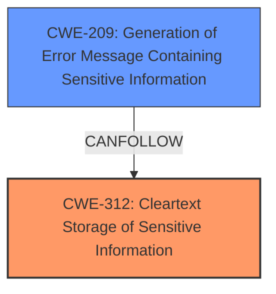

# Enhanced Analysis for CVE-2021-21339

# Summary
| CWE ID | CWE Name | Confidence | CWE Abstraction Level | CWE Vulnerability Mapping Label | CWE-Vulnerability Mapping Notes |
|---|---|---|---|---|---|
| CWE-312 | Cleartext Storage of Sensitive Information | 1.0 | Base | Allowed | Primary CWE: The vulnerability involves storing user session identifiers in cleartext without cryptographic hashing. |
| CWE-209 | Generation of Error Message Containing Sensitive Information | 0.6 | Base | Allowed | Secondary CWE: Although not the primary issue, the cleartext storage could lead to sensitive information being exposed in error messages, especially when combined with other vulnerabilities. |

## Evidence and Confidence

*   **Confidence Score:** 1.0
*   **Evidence Strength:** HIGH

## Relationship Analysis
The primary relationship is that CWE-312 [Cleartext Storage of Sensitive Information] is a specific type of sensitive information exposure. CWE-209 [Generation of Error Message Containing Sensitive Information] is a potential consequence or related weakness that could arise from the cleartext storage, especially in combination with other vulnerabilities like SQL injection. This creates a chain where the initial flaw (cleartext storage) can lead to sensitive data exposure in error messages.



## Vulnerability Chain
The vulnerability chain starts with the **weakness** of storing user session identifiers in **cleartext**. This **cleartext storage** (CWE-312) doesn't directly cause harm, but it becomes a critical vulnerability when combined with other issues like SQL injection. If an attacker exploits another vulnerability and gains access to the stored session identifiers, they can potentially hijack user sessions. Furthermore, if the system generates error messages, the **cleartext session identifiers** might be exposed in those messages (CWE-209), further aiding an attacker.

## Summary of Analysis
The initial analysis and resulting conclusion are based on the clear description of the vulnerability, which explicitly states that user session identifiers are stored in **cleartext**. This aligns directly with the definition of CWE-312 [Cleartext Storage of Sensitive Information]. The CVE Reference Links Content Summary confirms this: "The primary **weakness** is the **sensitive data exposure** due to the lack of cryptographic protection for session identifiers. This corresponds to **CWE-312**." The relationship analysis highlights that the **cleartext storage** can lead to other issues, such as exposing sensitive information in error messages (CWE-209) if other vulnerabilities are present. CWE-312 is chosen because it directly addresses the root cause, which is the **insecure storage** of sensitive data. The evidence strongly supports this classification, and the CWE is at the optimal level of specificity (Base). CWE-209 is a secondary concern, as it's a potential consequence rather than the primary **weakness**.

Relevant CWE Information:

# Enhanced Context (25 CWEs)
The following CWEs were identified as potentially relevant to this vulnerability:

## CWE-303: Incorrect Implementation of Authentication Algorithm
**Abstraction Level**: Base
**Similarity Score**: 0.78
**Source**: dense

**Description**:
The requirements for the product dictate the use of an established authentication algorithm, but the implementation of the algorithm is incorrect.
- **Not Used:** This CWE is not relevant because the issue is not about the *implementation* of an authentication algorithm, but the complete lack of encryption for session identifiers.

## CWE-1390: Weak Authentication
**Abstraction Level**: Class
**Similarity Score**: 0.77
**Source**: dense

**Description**:
The product uses an authentication mechanism to restrict access to specific users or identities, but the mechanism does not sufficiently prove that the claimed identity is correct.
- **Not Used:** While related to security, this CWE is too high-level. The core issue is not a **weak authentication** mechanism, but the **storage of session identifiers in cleartext**, which is a more specific flaw.

## CWE-1391: Use of Weak Credentials
**Abstraction Level**: Class
**Similarity Score**: 0.77
**Source**: dense

**Description**:
The product uses weak credentials (such as a default key or hard-coded password) that can be calculated, derived, reused, or guessed by an attacker.
- **Not Used:** This CWE is not applicable because the vulnerability doesn't involve weak credentials but rather the **storage of session identifiers in an unencrypted format.**

## CWE-807: Reliance on Untrusted Inputs in a Security Decision
**Abstraction Level**: Base
**Similarity Score**: 0.77
**Source**: dense

**Description**:
The product uses a protection mechanism that relies on the existence or values of an input, but the input can be modified by an untrusted actor in a way that bypasses the protection mechanism.
- **Not Used:** This CWE doesn't fit the vulnerability description as it focuses on reliance on untrusted inputs for security decisions, not the **storage of sensitive data in cleartext.**

## CWE-345: Insufficient Verification of Data Authenticity
**Abstraction Level**: Class
**Similarity Score**: 0.76
**Source**: dense

**Description**:
The product does not sufficiently verify the origin or authenticity of data, in a way that causes it to accept invalid data.
- **Not Used:** The vulnerability isn't related to verifying the authenticity of data, but rather the **lack of encryption** for session identifiers.

## CWE-639: Authorization Bypass Through User-Controlled Key
**Abstraction Level**: Base
**Similarity Score**: 0.76
**Source**: dense

**Description**:
The system's authorization functionality does not prevent one user from gaining access to another user's data or record by modifying the key value identifying the data.
- **Not Used:** This CWE focuses on authorization bypass through user-controlled keys, which is not directly related to the **cleartext storage of session identifiers.**

## CWE-74: Improper Neutralization of Special Elements in Output Used by a Downstream Component ('Injection')
**Abstraction Level**: Class
**Similarity Score**: 0.76
**Source**: dense

**Description**:
The product constructs all or part of a command, data structure, or record using externally-influenced input from an upstream component, but it does not neutralize or incorrectly neutralizes special elements that could modify how it is parsed or interpreted when it is sent to a downstream component.
- **Not Used:** This CWE is related to injection vulnerabilities, which is not the primary issue in this case. The **cleartext storage of session identifiers** is a separate concern.

## CWE-319: Cleartext Transmission of Sensitive Information
**Abstraction Level**: Base
**Similarity Score**: 0.76
**Source**: dense

**Description**:
The product transmits sensitive or security-critical data in cleartext in a communication channel that can be sniffed by unauthorized actors.
- **Not Used:** While the storage is in cleartext, the vulnerability description doesn't explicitly mention transmission in cleartext. CWE-312 [Cleartext Storage of Sensitive Information] is a better fit for the given information.

## CWE-472: External Control of Assumed-Immutable Web Parameter
**Abstraction Level**: Base
**Similarity Score**: 0.75
**Source**: dense

**Description**:
The web application does not sufficiently verify inputs that are assumed to be immutable but are actually externally controllable, such as hidden form fields.
- **Not Used:** This CWE is about external control of parameters, not the **storage of session identifiers in cleartext.**

## CWE-613: Insufficient Session Expiration
**Abstraction Level**: Base
**Similarity Score**: 0.75
**Source**: dense

**Description**:
According to WASC, "Insufficient Session Expiration is when a web site permits an attacker to reuse old session credentials or session IDs for authorization."
- **Not Used:** While session management is relevant, the core issue is the **cleartext storage**, not the expiration time.

## CWE-79: Improper Neutralization of Input During Web Page Generation ('Cross-site Scripting')
**Abstraction Level**: Base
**Similarity Score**: 7100.76
**Source**: sparse

**Description**:
The product does not neutralize or incorrectly neutralizes user-controllable input before it is placed in output that is used as a web page that is served to other users.
- **Not Used:** This CWE focuses on Cross-Site Scripting (XSS), which isn't directly related to the **cleartext storage of session identifiers.**

## CWE-312: Cleartext Storage of Sensitive Information
**Abstraction Level**: Base
**Similarity Score**: 6727.98
**Source**: sparse

**Description**:
The product stores sensitive information in cleartext within a resource that might be accessible to another control sphere.
- **Used:** This CWE directly matches the vulnerability description. The user session identifiers are stored in **cleartext** without cryptographic hashing.


## CWE Relationship Analysis

Current CWEs represent these abstraction levels: .


### Vulnerability Chain Analysis

**Chain starting from CWE-303:**
- 303 (Incorrect Implementation of Authentication Algorithm) - ROOT


**Chain starting from CWE-79:**
- 79 (Improper Neutralization of Input During Web Page Generation ('Cross-site Scripting')) - ROOT


### CWE Relationship Diagram

```mermaid
graph TD
    classDef primary fill:#f96,stroke:#333,stroke-width:2px
    classDef secondary fill:#69f,stroke:#333
    classDef tertiary fill:#9e9,stroke:#333
```