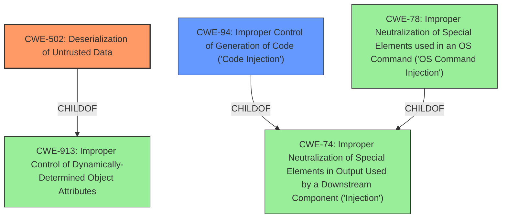

# Analysis for CVE-2021-21345

# Summary

| CWE ID  | CWE Name                                                                        | Confidence | CWE Abstraction Level | CWE Vulnerability Mapping Label | CWE-Vulnerability Mapping Notes |
| :-------- | :------------------------------------------------------------------------------ | :--------- | :---------------------- | :------------------------------ | :------------------------------ |
| CWE-502 | Deserialization of Untrusted Data | 0.95       | Base                    | Allowed                       | Primary CWE                     |
| CWE-94  | Improper Control of Generation of Code ('Code Injection') | 0.75       | Base                    | Allowed-with-Review             | Secondary Candidate              |

## Evidence and Confidence

*   **Confidence Score:** 0.85
*   **Evidence Strength:** HIGH

## Relationship Analysis

The primary relationship that influenced the decision was the ChildOf relationship between CWE-502 and CWE-913 (Improper Control of Dynamically-Determined Object Attributes). Additionally, CWE-94 is related to CWE-74 (Improper Neutralization of Special Elements in Output Used by a Downstream Component ('Injection')), which is a parent of CWE-78 (Improper Neutralization of Special Elements used in an OS Command ('OS Command Injection')). This hierarchy helped refine the selection to the most relevant and specific CWEs.

## Vulnerability Chain

The vulnerability chain starts with the **deserialization of untrusted data** (CWE-502), which allows an attacker to **manipulate the processed input stream**. This can lead to the **improper control of generation of code** (CWE-94), ultimately resulting in the ability to **execute commands** on the host.

## Summary of Analysis

The initial assessment, supported by both the vulnerability description and the CVE reference, clearly points to CWE-502 as the primary weakness. The CVE-2021-21345 description states, "XStream is vulnerable to a Remote Command Execution attack." The **Root Cause** is explained as: "The XStream library deserializes XML/JSON data into Java objects. The vulnerability arises because the library blindly recreates objects based on type information embedded in the serialized data, allowing an attacker to manipulate this data to inject malicious objects that execute commands on the server." This aligns directly with the description of CWE-502: "The product deserializes untrusted data without sufficiently ensuring that the resulting data will be valid."

The **impact** of the vulnerability, "execute commands," suggests a potential secondary weakness related to code injection, specifically CWE-94. This is further supported by the CVE reference, which lists CWE-94 as a related CWE. While the primary issue is deserialization, the ability to inject and execute commands through this deserialization process warrants the inclusion of CWE-94 as a secondary, related weakness.

The selection of CWE-502 and CWE-94 is at the optimal level of specificity, as they directly address the root cause (deserialization) and the immediate consequence (code injection/command execution) of the vulnerability. The retriever results also list CWE-502 and CWE-94.
Relevant CWE Information:

# Enhanced Context (25 CWEs)
The following CWEs were identified as potentially relevant to this vulnerability:

## CWE-74: Improper Neutralization of Special Elements in Output Used by a Downstream Component ('Injection')
**Abstraction Level**: Class
**Similarity Score**: 0.76
**Source**: dense

**Description**:
The product constructs all or part of a command, data structure, or record using externally-influenced input from an upstream component, but it does not neutralize or incorrectly neutralizes special elements that could modify how it is parsed or interpreted when it is sent to a downstream component.

**Mapping Guidance**:
- Usage: Discouraged
- Rationale: CWE-74 is high-level and often misused when lower-level weaknesses are more appropriate.

## CWE-1289: Improper Validation of Unsafe Equivalence in Input
**Abstraction Level**: Base
**Similarity Score**: 0.76
**Source**: dense

**Description**:
The product receives an input value that is used as a resource identifier or other type of reference, but it does not validate or incorrectly validates that the input is equivalent to a potentially-unsafe value.

**Mapping Guidance**:
- Usage: Allowed
- Rationale: This CWE entry is at the Base level of abstraction, which is a preferred level of abstraction for mapping to the root causes of vulnerabilities.

## CWE-807: Reliance on Untrusted Inputs in a Security Decision
**Abstraction Level**: Base
**Similarity Score**: 0.75
**Source**: dense

**Description**:
The product uses a protection mechanism that relies on the existence or values of an input, but the input can be modified by an untrusted actor in a way that bypasses the protection mechanism.

**Mapping Guidance**:
- Usage: Allowed
- Rationale: This CWE entry is at the Base level of abstraction, which is a preferred level of abstraction for mapping to the root causes of vulnerabilities.

## CWE-184: Incomplete List of Disallowed Inputs
**Abstraction Level**: Base
**Similarity Score**: 0.75
**Source**: dense

**Description**:
The product implements a protection mechanism that relies on a list of inputs (or properties of inputs) that are not allowed by policy or otherwise require other action to neutralize before additional processing takes place, but the list is incomplete.

**Mapping Guidance**:
- Usage: Allowed
- Rationale: This CWE entry is at the Base level of abstraction, which is a preferred level of abstraction for mapping to the root causes of vulnerabilities.

## CWE-668: Exposure of Resource to Wrong Sphere
**Abstraction Level**: Class
**Similarity Score**: 0.75
**Source**: dense

**Description**:
The product exposes a resource to the wrong control sphere, providing unintended actors with inappropriate access to the resource.

**Mapping Guidance**:
- Usage: Discouraged
- Rationale: CWE-668 is high-level and is often misused as a catch-all when lower-level CWE IDs might be applicable. It is sometimes used for low-information vulnerability reports [REF-1287]. It is a level-1 Class (i.e., a child of a Pillar). It is not useful for trend analysis.

## CWE-653: Improper Isolation or Compartmentalization
**Abstraction Level**: Class
**Similarity Score**: 0.75
**Source**: dense

**Description**:
The product does not properly compartmentalize or isolate functionality, processes, or resources that require different privilege levels, rights, or permissions.

**Mapping Guidance**:
- Usage: Allowed
- Rationale: This CWE entry is at the Base level of abstraction, which is a preferred level of abstraction for mapping to the root causes of vulnerabilities.

## CWE-138: Improper Neutralization of Special Elements
**Abstraction Level**: Class
**Similarity Score**: 0.75
**Source**: dense

**Description**:
The product receives input from an upstream component, but it does not neutralize or incorrectly neutralizes special elements that could be interpreted as control elements or syntactic markers when they are sent to a downstream component.

**Mapping Guidance**:
- Usage: Discouraged
- Rationale: This CWE entry is a level-1 Class (i.e., a child of a Pillar). It might have lower-level children that would be more appropriate

## CWE-639: Authorization Bypass Through User-Controlled Key
**Abstraction Level**: Base
**Similarity Score**: 0.75
**Source**: dense

**Description**:
The system's authorization functionality does not prevent one user from gaining access to another user's data or record by modifying the key value identifying the data.

**Mapping Guidance**:
- Usage: Allowed
- Rationale: This CWE entry is at the Base level of abstraction, which is a preferred level of abstraction for mapping to the root causes of vulnerabilities.

## CWE-799: Improper Control of Interaction Frequency
**Abstraction Level**: Class
**Similarity Score**: 0.75
**Source**: dense

**Description**:
The product does not properly limit the number or frequency of interactions that it has with an actor, such as the number of