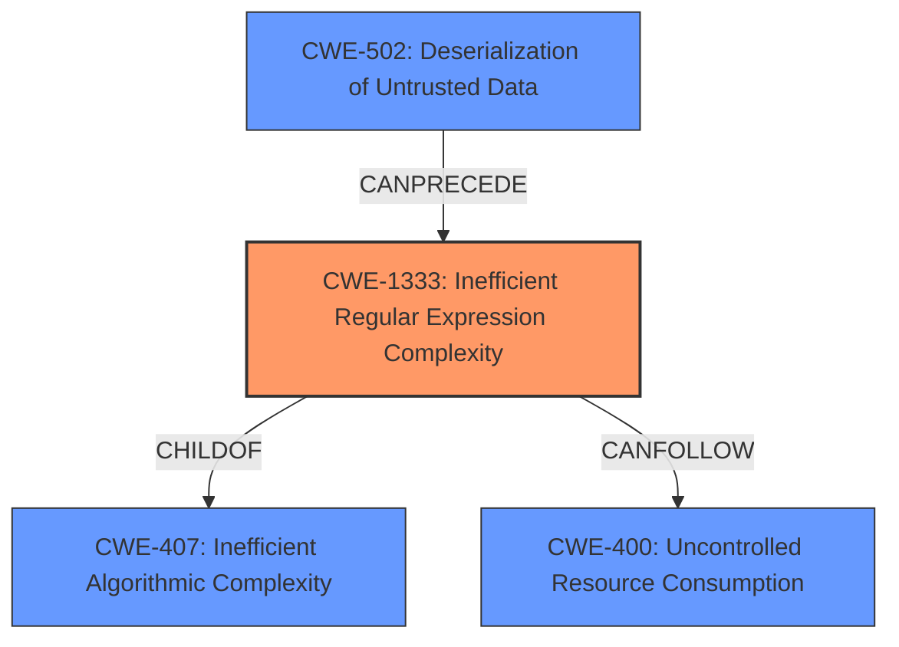

# Enhanced Analysis for CVE-2021-21348

# Summary
| CWE ID | CWE Name | Confidence | CWE Abstraction Level | CWE Vulnerability Mapping Label | CWE-Vulnerability Mapping Notes |
|---|---|---|---|---|---|
| CWE-1333 | Inefficient Regular Expression Complexity | 0.9 | Base | Allowed | Primary CWE |
| CWE-502 | Deserialization of Untrusted Data | 0.7 | Base | Allowed | Secondary Candidate |
| CWE-400 | Uncontrolled Resource Consumption | 0.6 | Class | Discouraged | Secondary Candidate |

## Evidence and Confidence

*   **Confidence Score:** 0.8
*   **Evidence Strength:** HIGH

## Relationship Analysis
The primary relationship impacting the decision is that CWE-1333 is a specific type of CWE-407 (Inefficient Algorithmic Complexity), indicating a more precise classification. Additionally, CWE-1333 can lead to CWE-400 (Uncontrolled Resource Consumption) as a consequence. The fact that CWE-502 (Deserialization of Untrusted Data) can be a prerequisite for the execution of the regular expression strengthens the case for considering it as a contributing factor.



## Vulnerability Chain
The vulnerability chain starts with the deserialization of untrusted data (CWE-502), which allows an attacker to inject a malicious regular expression. The inefficient regular expression (CWE-1333) then consumes excessive CPU cycles, leading to uncontrolled resource consumption (CWE-400) and ultimately a denial-of-service.

## Summary of Analysis
Initially, the description points to a denial-of-service vulnerability due to a **ClassCastException**. However, the CVE reference links content summary provides more detailed information and points to a ReDoS vulnerability.

The key evidence from the CVE Reference Links Content Summary is:
*   "The vulnerability stems from XStream's processing of an input stream containing type information used to recreate objects. An attacker can manipulate this input stream by injecting objects that lead to the execution of a malicious regular expression. This regex evaluation then causes a denial-of-service condition."
*   "The core weakness lies in XStream's ability to dynamically create instances based on provided type information, which is not inherently safe, and a failure to properly sanitize user-provided data before using it in regular expressions."

Based on this, CWE-1333 (Inefficient Regular Expression Complexity) is the most accurate primary mapping because it specifically addresses the root cause of the denial-of-service.

CWE-502 (Deserialization of Untrusted Data) is included as a secondary candidate because the vulnerability arises from processing untrusted data during deserialization. The XStream library deserializes data without proper validation, allowing the injection of malicious objects.

CWE-400 (Uncontrolled Resource Consumption) is also considered, as the exploitation of the ReDoS vulnerability leads to excessive CPU consumption and a denial-of-service. However, it is a more general consequence of the primary weakness (CWE-1333). The MITRE guidance discourages direct mapping to CWE-400, encouraging identification of the underlying cause.

Therefore, CWE-1333 is selected as the primary CWE due to its direct relevance to the root cause (inefficient regular expression), while CWE-502 and CWE-400 are considered contributing factors or consequences.

Relevant CWE Information:

# Enhanced Context (25 CWEs)
The following CWEs were identified as potentially relevant to this vulnerability:

## CWE-405: Asymmetric Resource Consumption (Amplification)
**Abstraction Level**: Class
**Similarity Score**: 0.77
**Source**: dense

**Description**:
The product does not properly control situations in which an adversary can cause the product to consume or produce excessive resources without requiring the adversary to invest equivalent work or otherwise prove authorization, i.e., the adversary's influence is "asymmetric."

**Mapping Guidance**:
- Usage: Allowed-with-Review
- Rationale: This CWE entry is a Class and might have Base-level children that would be more appropriate

## CWE-668: Exposure of Resource to Wrong Sphere
**Abstraction Level**: Class
**Similarity Score**: 0.76
**Source**: dense

**Description**:
The product exposes a resource to the wrong control sphere, providing unintended actors with inappropriate access to the resource.

**Mapping Guidance**:
- Usage: Discouraged
- Rationale: CWE-668 is high-level and is often misused as a catch-all when lower-level CWE IDs might be applicable. It is sometimes used for low-information vulnerability reports [REF-1287]. It is a level-1 Class (i.e., a child of a Pillar). It is not useful for trend analysis.

## CWE-404: Improper Resource Shutdown or Release
**Abstraction Level**: Class
**Similarity Score**: 0.76
**Source**: dense

**Description**:
The product does not release or incorrectly releases a resource before it is made available for re-use.

**Mapping Guidance**:
- Usage: Allowed-with-Review
- Rationale: This CWE entry is a Class and might have Base-level children that would be more appropriate

## CWE-226: Sensitive Information in Resource Not Removed Before Reuse
**Abstraction Level**: Base
**Similarity Score**: 0.75
**Source**: dense

**Description**:
The product releases a resource such as memory or a file so that it can be made available for reuse, but it does not clear or "zeroize" the information contained in the resource before the product performs a critical state transition or makes the resource available for reuse by other entities.

**Mapping Guidance**:
- Usage: Allowed
- Rationale: This CWE entry is at the Base level of abstraction, which is a preferred level of abstraction for mapping to the root causes of vulnerabilities.

## CWE-1289: Improper Validation of Unsafe Equivalence in Input
**Abstraction Level**: Base
**Similarity Score**: 0.75
**Source**: dense

**Description**:
The product receives an input value that is used as a resource identifier or other type of reference, but it does not validate or incorrectly validates that the input is equivalent to a potentially-unsafe value.

**Mapping Guidance**:
- Usage: Allowed
- Rationale: This CWE entry is at the Base level of abstraction, which is a preferred level of abstraction for mapping to the root causes of vulnerabilities.

## CWE-807: Reliance on Untrusted Inputs in a Security Decision
**Abstraction Level**: Base
**Similarity Score**: 0.75
**Source**: dense

**Description**:
The product uses a protection mechanism that relies on the existence or values of an input, but the input can be modified by an untrusted actor in a way that bypasses the protection mechanism.

**Mapping Guidance**:
- Usage: Allowed
- Rationale: This CWE entry is at the Base level of abstraction, which is a preferred level of abstraction for mapping to the root causes of vulnerabilities.

## CWE-345: Insufficient Verification of Data Authenticity
**Abstraction Level**: Class
**Similarity Score**: 0.75
**Source**: dense

**Description**:
The product does not sufficiently verify the origin or authenticity of data, in a way that causes it to accept invalid data.

**Mapping Guidance**:
- Usage: Discouraged
- Rationale: This CWE entry is a level-1 Class (i.e., a child of a Pillar). It might have lower-level children that would be more appropriate

## CWE-799: Improper Control of Interaction Frequency
**Abstraction Level**: Class
**Similarity Score**: 0.75
**Source**: dense

**Description**:
The product does not properly limit the number or frequency of interactions that it has with an actor, such as the number of incoming requests.

**Mapping Guidance**:
- Usage: Allowed-with-Review
- Rationale: This CWE entry is a Class and might have Base-level children that would be more appropriate

## CWE-664: Improper Control of a Resource Through its Lifetime
**Abstraction Level**: Pillar
**Similarity Score**: 0.75
**Source**: dense

**Description**:
The product does not maintain or incorrectly maintains control over a resource throughout its lifetime of creation, use, and release.

**Mapping Guidance**:
- Usage: Discouraged
- Rationale: This CWE entry


## CWE Relationship Analysis

Current CWEs represent these abstraction levels: .


### Vulnerability Chain Analysis

**Chain starting from CWE-502:**
- 502 (Deserialization of Untrusted Data) - ROOT


**Chain starting from CWE-664:**
- 664 (Improper Control of a Resource Through its Lifetime) - ROOT


### CWE Relationship Diagram

```mermaid
graph TD
    classDef primary fill:#f96,stroke:#333,stroke-width:2px
    classDef secondary fill:#69f,stroke:#333
    classDef tertiary fill:#9e9,stroke:#333
```