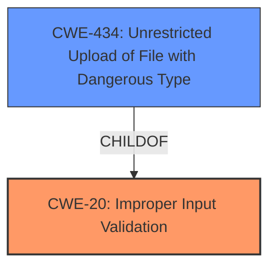

# Analysis for CVE-2021-21357

# Summary
| CWE ID | CWE Name | Confidence | CWE Abstraction Level | CWE Vulnerability Mapping Label | CWE-Vulnerability Mapping Notes |
|---|---|---|---|---|---|
| CWE-20 (Primary) | Improper Input Validation | 0.9 | Class | Discouraged | Examine children of this entry to see if there is a better fit |
| CWE-434 (Secondary) | Unrestricted Upload of File with Dangerous Type | 0.8 | Base | Allowed | This CWE entry is at the Base level of abstraction, which is a preferred level of abstraction for mapping to the root causes of vulnerabilities. |

## Evidence and Confidence

*   **Confidence Score:** 0.85
*   **Evidence Strength:** HIGH

## Relationship Analysis
The primary relationship influencing the CWE selection is the parent-child relationship. CWE-20 is a Class-level CWE, and while it is the initial classification based on the description of **improper input validation**, the analysis considers more specific child CWEs for a better fit. CWE-434 is a more specific Base-level CWE that directly addresses the unrestricted upload of dangerous file types, making it a stronger candidate despite the more general nature of the identified root cause.

## Vulnerability Chain
The vulnerability chain starts with the **improper input validation** (CWE-20). This leads to bypassing restrictions on file uploads, allowing attackers to upload files with arbitrary mime types, which is described by CWE-434. The final impact could be remote code execution if a malicious file is uploaded and executed.

## Summary of Analysis
Initially, the vulnerability description points to **improper input validation** which aligns with CWE-20. However, CWE-20 is a broad class. The CVE Reference Links Content Summary provides more specific details, stating that attackers can upload files with arbitrary mime types. This aligns directly with CWE-434, Unrestricted Upload of File with Dangerous Type.

The evidence supporting the selection of CWE-20 includes the "Vulnerability Description Key Phrases" which identifies "**improper input validation**" as the root cause.

The evidence supporting the selection of CWE-434 is the following excerpt from the "CVE Reference Links Content Summary":
*   "Attackers can upload arbitrary files with any mime type."

While the root cause is the **improper input validation** (CWE-20), the specific weakness that is exploited is the unrestricted file upload (CWE-434). Since CWE-434 is more specific and accurately describes the vulnerability, it is included as a secondary candidate.

The final decision to include CWE-434 is based on the additional information provided in the CVE Reference Links Content Summary which provides more details on the impact of the **improper input validation**. The selected CWEs are at the optimal level of specificity because they accurately represent the root cause and the specific weakness exploited.

Relevant CWE Information:

# Enhanced Context (25 CWEs)

## CWE-1289: Improper Validation of Unsafe Equivalence in Input
**Abstraction Level**: Base
**Similarity Score**: 0.78
**Source**: dense

**Description**:
The product receives an input value that is used as a resource identifier or other type of reference, but it does not validate or incorrectly validates that the input is equivalent to a potentially-unsafe value.
**Why Not Used**: This CWE is too specific to the vulnerability description.

## CWE-807: Reliance on Untrusted Inputs in a Security Decision
**Abstraction Level**: Base
**Similarity Score**: 0.78
**Source**: dense

**Description**:
The product uses a protection mechanism that relies on the existence or values of an input, but the input can be modified by an untrusted actor in a way that bypasses the protection mechanism.
**Why Not Used**: This CWE is too specific to the vulnerability description.

## CWE-303: Incorrect Implementation of Authentication Algorithm
**Abstraction Level**: Base
**Similarity Score**: 0.76
**Source**: dense

**Description**:
The requirements for the product dictate the use of an established authentication algorithm, but the implementation of the algorithm is incorrect.
**Why Not Used**: This CWE does not apply to the described vulnerability.

## CWE-472: External Control of Assumed-Immutable Web Parameter
**Abstraction Level**: Base
**Similarity Score**: 0.76
**Source**: dense

**Description**:
The web application does not sufficiently verify inputs that are assumed to be immutable but are actually externally controllable, such as hidden form fields.
**Why Not Used**: This CWE is too specific to the vulnerability description.

## CWE-639: Authorization Bypass Through User-Controlled Key
**Abstraction Level**: Base
**Similarity Score**: 0.76
**Source**: dense

**Description**:
The system's authorization functionality does not prevent one user from gaining access to another user's data or record by modifying the key value identifying the data.
**Why Not Used**: This CWE does not apply to the described vulnerability.

## CWE-274: Improper Handling of Insufficient Privileges
**Abstraction Level**: Base
**Similarity Score**: 0.76
**Source**: dense

**Description**:
The product does not handle or incorrectly handles when it has insufficient privileges to perform an operation, leading to resultant weaknesses.
**Why Not Used**: This CWE does not apply to the described vulnerability.

## CWE-184: Incomplete List of Disallowed Inputs
**Abstraction Level**: Base
**Similarity Score**: 0.76
**Source**: dense

**Description**:
The product implements a protection mechanism that relies on a list of inputs (or properties of inputs) that are not allowed by policy or otherwise require other action to neutralize before additional processing takes place, but the list is incomplete.
**Why Not Used**: This CWE is related to file uploads but not the primary issue.

## CWE-1390: Weak Authentication
**Abstraction Level**: Class
**Similarity Score**: 0.76
**Source**: dense

**Description**:
The product uses an authentication mechanism to restrict access to specific users or identities, but the mechanism does not sufficiently prove that the claimed identity is correct.
**Why Not Used**: This CWE does not apply to the described vulnerability.

## CWE-653: Improper Isolation or Compartmentalization
**Abstraction Level**: Class
**Similarity Score**: 0.75
**Source**: dense

**Description**:
The product does not properly compartmentalize or isolate functionality, processes, or resources that require different privilege levels, rights, or permissions.
**Why Not Used**: This CWE does not apply to the described vulnerability.

## CWE-41: Improper Resolution of Path Equivalence
**Abstraction Level**: Base
**Similarity Score**: 0.75
**Source**: dense

**Description**:
The product is vulnerable to file system contents disclosure through path equivalence. Path equivalence involves the use of special characters in file and directory names. The associated manipulations are intended to generate multiple names for the same object.
**Why Not Used**: This CWE does not apply to the described vulnerability.

## CWE-22: Improper Limitation of a Pathname to a Restricted Directory ('Path Traversal')
**Abstraction Level**: Base
**Similarity Score**: 7649.58
**Source**: sparse

**Description**:
The product uses external input to construct a pathname that is intended to identify a file or directory that is located underneath a restricted parent directory, but the product does not properly neutralize special elements within the pathname that can cause the pathname to resolve to a location that is outside of the restricted directory.
**Why Not Used**: Although path traversal can be an impact of unrestricted file uploads, it's not the core weakness.

## CWE-23: Relative Path Traversal
**Abstraction Level**: Base
**Similarity Score**: 7295.93
**Source**: sparse

**Description**:
The product uses external input to construct a pathname that should be within a restricted directory, but it does not properly neutralize sequences such as ".." that can resolve to a location that is outside of that directory.
**Why Not Used**: Although path traversal can be an impact of unrestricted file uploads, it's not the core weakness.

## CWE-863: Incorrect Authorization
**Abstraction Level**: Class
**Similarity Score**: 7212.21
**Source**: sparse

**Description**:
The product performs an authorization check when an actor attempts to access a resource or perform an action, but it does not correctly perform the check.
**Why Not Used**: This CWE does not apply to the described vulnerability.

## CWE-430: Deployment of Wrong Handler
**Abstraction Level**: base
**Similarity Score**: 4.51
**Source**: graph

**Description**:
CWE-430: Deployment of Wrong Handler
**Why Not Used**: This CWE does not apply to the described vulnerability.

## CWE-178: Improper Handling of Case Sensitivity
**Abstraction Level**: base
**