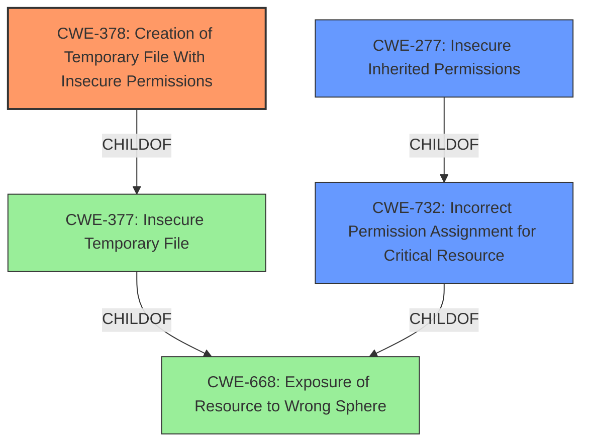

# Analysis for CVE-2021-21364

# Summary
| CWE ID | CWE Name | Confidence | CWE Abstraction Level | CWE Vulnerability Mapping Label | CWE-Vulnerability Mapping Notes |
|---|---|---|---|---|---|
| CWE-378 | Creation of Temporary File With Insecure Permissions | 0.9 | Base | Allowed | Primary CWE |
| CWE-732 | Incorrect Permission Assignment for Critical Resource | 0.7 | Class | Allowed-with-Review | Secondary Candidate |
| CWE-277 | Insecure Inherited Permissions | 0.6 | Variant | Allowed | Secondary Candidate |

## Evidence and Confidence

*   **Confidence Score:** 0.9
*   **Evidence Strength:** HIGH

## Relationship Analysis
The primary CWE, CWE-378, is a child of CWE-377 (Insecure Temporary File), which in turn is a child of CWE-668 (Exposure of Resource to Wrong Sphere). CWE-732 (Incorrect Permission Assignment for Critical Resource) is a child of both CWE-285 and CWE-668. CWE-277 (Insecure Inherited Permissions) is a child of CWE-732. These relationships suggest a hierarchy where a general issue of exposing resources with incorrect permissions leads to the specific problem of creating temporary files with insecure permissions due to incorrect inheritance or assignment. The selection of CWE-378 as the primary CWE is due to its direct relevance to the vulnerability description, which focuses on the insecure creation of temporary files.

## Vulnerability Chain
The vulnerability chain starts with the **insecure file permissions** assigned to temporary files created by `java.io.File.createTempFile()`. This leads to local information disclosure because other local users can read these files. The root cause is the **weakness** in how the temporary files are created and the permissions assigned by default.

## Summary of Analysis
The analysis is primarily based on the provided vulnerability description and the CVE Reference Links Content Summary, which explicitly mentions "CWE-378: Creation of Temporary File With Insecure Permissions" as a relevant weakness. The description states, "the vulnerability stems from the use of `java.io.File.createTempFile()` in the generated code by Swagger Codegen. This method creates temporary files in the system's temporary directory with insecure default permissions (`-rw-r--r--`)." The retriever results also list CWE-378 as a strong candidate.

CWE-378 is chosen because it directly addresses the creation of temporary files with insecure permissions. While CWE-732 (Incorrect Permission Assignment for Critical Resource) is also relevant, it's a more general class of weakness, and CWE-378 provides a more specific description of the vulnerability. CWE-277 (Insecure Inherited Permissions) is also relevant since the issue involves permissions being inherited, but it is less directly related than CWE-378.

The selected CWE is at the Base level of abstraction, which is the preferred level for mapping root causes. The evidence strongly supports the selection of CWE-378 as the primary CWE.

Relevant CWE Information:

# Enhanced Context (25 CWEs)
The following CWEs were identified as potentially relevant to this vulnerability:

## CWE-404: Improper Resource Shutdown or Release
**Abstraction Level**: Class
**Similarity Score**: 0.79
**Source**: dense

**Description**:
The product does not release or incorrectly releases a resource before it is made available for re-use.
*Not Selected*: This CWE does not fit, as the vulnerability isn't about releasing resources, but about the insecure creation of temporary files.

## CWE-668: Exposure of Resource to Wrong Sphere
**Abstraction Level**: Class
**Similarity Score**: 0.78
**Source**: dense

**Description**:
The product exposes a resource to the wrong control sphere, providing unintended actors with inappropriate access to the resource.
*Not Selected*: While this is indirectly true as insecure temporary files expose information, it is too high level.

## CWE-789: Memory Allocation with Excessive Size Value
**Abstraction Level**: Variant
**Similarity Score**: 0.77
**Source**: dense

**Description**:
The product allocates memory based on an untrusted, large size value, but it does not ensure that the size is within expected limits, allowing arbitrary amounts of memory to be allocated.
*Not Selected*: This CWE is not applicable as the vulnerability doesn't involve memory allocation issues.

## CWE-59: Improper Link Resolution Before File Access ('Link Following')
**Abstraction Level**: Base
**Similarity Score**: 0.77
**Source**: dense

**Description**:
The product attempts to access a file based on the filename, but it does not properly prevent that filename from identifying a link or shortcut that resolves to an unintended resource.
*Not Selected*: This vulnerability is not about link resolution.

## CWE-41: Improper Resolution of Path Equivalence
**Abstraction Level**: Base
**Similarity Score**: 0.77
**Source**: dense

**Description**:
The product is vulnerable to file system contents disclosure through path equivalence. Path equivalence involves the use of special characters in file and directory names. The associated manipulations are intended to generate multiple names for the same object.
*Not Selected*: This vulnerability is not about path equivalence.

## CWE-226: Sensitive Information in Resource Not Removed Before Reuse
**Abstraction Level**: Base
**Similarity Score**: 0.77
**Source**: dense

**Description**:
The product releases a resource such as memory or a file so that it can be made available for reuse, but it does not clear or "zeroize" the information contained in the resource before the product performs a critical state transition or makes the resource available for reuse by other entities.
*Not Selected*: This is not about the re-use of a resource.

## CWE-667: Improper Locking
**Abstraction Level**: Class
**Similarity Score**: 0.77
**Source**: dense

**Description**:
The product does not properly acquire or release a lock on a resource, leading to unexpected resource state changes and behaviors.
*Not Selected*: This is not about improper locking.

## CWE-212: Improper Removal of Sensitive Information Before Storage or Transfer
**Abstraction Level**: Base
**Similarity Score**: 0.76
**Source**: dense

**Description**:
The product stores, transfers, or shares a resource that contains sensitive information, but it does not properly remove that information before the product makes the resource available to unauthorized actors.
*Not Selected*: This CWE is not a good fit as the issue is with the creation of the temporary file, not the storage or transfer.

## CWE-405: Asymmetric Resource Consumption (Amplification)
**Abstraction Level**: Class
**Similarity Score**: 0.76
**Source**: dense

**Description**:
The product does not properly control situations in which an adversary can cause the product to consume or produce excessive resources without requiring the adversary to invest equivalent work or otherwise prove authorization, i.e., the adversary's influence is "asymmetric."
*Not Selected*: This CWE doesn't fit the vulnerability description.

## CWE-754: Improper Check for Unusual or Exceptional Conditions
**Abstraction Level**: Class
**Similarity Score**: 0.76
**Source**: dense

**Description**:
The product does not check or incorrectly checks for unusual or exceptional conditions that are not expected to occur frequently during day to day operation of the product.
*Not Selected*: This CWE doesn't fit the vulnerability description.

## CWE-379: Creation of Temporary File in Directory with Insecure Permissions
**Abstraction Level**: Base
**Similarity Score**: 6533.79
**Source**: sparse

**Description**:
The product creates a temporary file in a directory whose permissions allow unintended actors to determine the file's existence or otherwise access that file.
*Not Selected*: While highly related, the vulnerability description does not indicate that the directory has insecure permissions.

## CWE-732: Incorrect Permission Assignment for Critical Resource
**Abstraction Level**: Class
**Similarity Score**: 6326.61
**Source**: sparse

**Description**:
The product specifies permissions for a security-critical

# Enhanced Query for CVE-2021-21364

## Vulnerability Description
swagger-codegen is an open-source project which contains a template-driven engine to generate documentation, API clients and server stubs in different languages by parsing your OpenAPI / Swagger definition. In swagger-codegen before version 2.4.19, on Unix-Like systems, the system temporary directory is shared between all local users. When files/directories are created, the default `umask` settings for the process are respected. As a result, by default, most processes/apis will create files/directories with the permissions `-rw-r--r--` and `drwxr-xr-x` respectively, unless an API that explicitly sets safe file permissions is used. Because this vulnerability impacts generated code, the generated code will remain vulnerable until fixed manually! This vulnerability is fixed in version 2.4.19. Note this is a distinct vulnerability from CVE-2021-21363.

### Vulnerability Description Key Phrases
- **weakness:** **insecure file permissions**
- **product:** swagger-codegen
- **version:** before version 2.4.19

## CVE Reference Links Content Summary
Based on the provided content, here's an analysis of CVE-2021-21364:

**Root Cause of Vulnerability:**
The vulnerability stems from the use of `java.io.File.createTempFile()` in the generated code by Swagger Codegen. This method creates temporary files in the system's temporary directory with insecure default permissions (`-rw-r--r--`). On Unix-like systems where the temporary directory is shared, these permissions allow other local users to read the contents of these temporary files, leading to local information disclosure.

**Weaknesses/Vulnerabilities Present:**
- **CWE-378:** Creation of Temporary File With Insecure Permissions.
- **CWE-200:** Exposure of Sensitive Information to an Unauthorized Actor
- **CWE-732:** Incorrect Permission Assignment for Critical Resource

**Impact of Exploitation:**
- **Local Information Disclosure:**  An attacker can potentially read the contents of the temporary files created by the vulnerable code. The temporary files may contain sensitive information handled by the application.

**Attack Vectors:**
- **Local Access:** An attacker must have local access to the same system where the vulnerable code is running.
- **Shared System:** The system must be a Unix-like system where the temporary directory is shared among users.

**Required Attacker Capabilities/Position:**
- **Local User Account:** An attacker needs a valid user account on the target system.
- **No Elevated Privileges:** No special or elevated privileges are required to exploit the vulnerability.

**Additional Details:**
- The vulnerability exists within the code generated by Swagger Codegen, meaning that applications using the vulnerable versions of generated code are susceptible.
- The vulnerability is specific to how temporary files are created and the default permissions assigned by the `java.io.File.createTempFile` method.
- The fix involves replacing calls to `java.io.File.createTempFile` with `java.nio.file.Files.createTempFile` which creates files with more restrictive and secure permissions.
- The fix was implemented in commit `35adbd552d5f99b3ff1e0e59da228becc85190f2` and released in version 2.4.19 of swagger-codegen.
- Workarounds exist for users on non-patched versions which consists on manually updating generated source code.

This vulnerability affects generated code.

## Retriever Results

### Top Combined Results

| Rank | CWE ID | Name | Abstraction | Usage  | Retrievers | Individual Scores |
|------|--------|------|-------------|-------|------------|-------------------|
| 1 | 277 | Insecure Inherited Permissions | Variant | Allowed | sparse | 1.135 |
| 2 | 379 | Creation of Temporary File in Directory with Insecure Permissions | Base | Allowed | sparse | 0.723 |
| 3 | 378 | Creation of Temporary File With Insecure Permissions | Base | Allowed | sparse | 0.705 |
| 4 | 377 | Insecure Temporary File | Class | Allowed-with-Review | sparse | 0.695 |
| 5 | 732 | Incorrect Permission Assignment for Critical Resource | Class | Allowed-with-Review | sparse | 0.610 |
| 6 | 1270 | Generation of Incorrect Security Tokens | Base | Allowed | dense | 0.456 |
| 7 | 98 | Improper Control of Filename for Include/Require Statement in PHP Program ('PHP Remote File Inclusion') | Variant | Allowed | graph | 0.002 |
| 8 | 276 | Incorrect Default Permissions | Base | Allowed | sparse | 0.608 |
| 9 | 863 | Incorrect Authorization | Class | Allowed-with-Review | sparse | 0.590 |
| 10 | 770 | Allocation of Resources Without Limits or Throttling | Base | Allowed | sparse | 0.582 |

# Complete CWE Specifications

## CWE-277: Insecure Inherited Permissions
**Abstraction:** Variant
**Status:** Draft

### Description
A product defines a set of insecure permissions that are inherited by objects that are created by the program.

### Extended Description
Not provided

### Alternative Terms
None

### Relationships
ChildOf -> CWE-732

### Mapping Guidance
**Usage:** Allowed
**Rationale:** This CWE entry is at the Variant level of abstraction, which is a preferred level of abstraction for mapping to the root causes of vulnerabilities.
**Comments:** Carefully read both the name and description to ensure that this mapping is an appropriate fit. Do not try to 'force' a mapping to a lower-level Base/Variant simply to comply with this preferred level of abstraction.
**Reasons:**
- Acceptable-Use

### Observed Examples
- **CVE-2005-1841:** User's umask is used when creating temp files.
- **CVE-2002-1786:** Insecure umask for core dumps [is the umask preserved or assigned?].

## CWE-379: Creation of Temporary File in Directory with Insecure Permissions
**Abstraction:** Base
**Status:** Incomplete

### Description
The product creates a temporary file in a directory whose permissions allow unintended actors to determine the file's existence or otherwise access that file.

### Extended Description
On some operating systems, the fact that the temporary file exists may be apparent to any user with sufficient privileges to access that directory. Since the file is visible, the application that is using the temporary file could be known. If one has access to list the processes on the system, the attacker has gained information about what the user is doing at that time. By correlating this with the applications the user is running, an attacker could potentially discover what a user's actions are. From this, higher levels of security could be breached.

### Alternative Terms
None

### Relationships
ChildOf -> CWE-377

### Mapping Guidance
**Usage:** Allowed
**Rationale:** This CWE entry is at the Base level of abstraction, which is a preferred level of abstraction for mapping to the root causes of vulnerabilities.
**Comments:** Carefully read both the name and description to ensure that this mapping is an appropriate fit. Do not try to 'force' a mapping to a lower-level Base/Variant simply to comply with this preferred level of abstraction.
**Reasons:**
- Acceptable-Use

### Observed Examples
- **CVE-2022-27818:** A hotkey daemon written in Rust creates a domain socket file underneath /tmp, which is accessible by any user.
- **CVE-2021-21290:** A Java-based application for a rapid-development framework uses File.createTempFile() to create a random temporary file with insecure default permissions.

## CWE-378: Creation of Temporary File With Insecure Permissions
**Abstraction:** Base
**Status:** Draft

### Description
Opening temporary files without appropriate measures or controls can leave the file, its contents and any function that it impacts vulnerable to attack.

### Extended Description
Not provided

### Alternative Terms
None

### Relationships
ChildOf -> CWE-377

### Mapping Guidance
**Usage:** Allowed
**Rationale:** This CWE entry is at the Base level of abstraction, which is a preferred level of abstraction for mapping to the root causes of vulnerabilities.
**Comments:** Carefully read both the name and description to ensure that this mapping is an appropriate fit. Do not try to 'force' a mapping to a lower-level Base/Variant simply to comply with this preferred level of abstraction.
**Reasons:**
- Acceptable-Use

### Observed Examples
- **CVE-2022-24823:** A network application framework uses the Java function createTempFile(), which will create a file that is readable by other local users of the system

## CWE-377: Insecure Temporary File
**Abstraction:** Class
**Status:** Incomplete

### Description
Creating and using insecure temporary files can leave application and system data vulnerable to attack.

### Extended Description
Not provided

### Alternative Terms
None

### Relationships
ChildOf -> CWE-668

### Mapping Guidance
**Usage:** Allowed-with-Review
**Rationale:** This CWE entry is a Class and might have Base-level children that would be more appropriate
**Comments:** Examine children of this entry to see if there is a better fit
**Reasons:**
- Abstraction

### Additional Notes
**[Other]** 

Applications require temporary files so frequently that many different mechanisms exist for creating them in the C Library and Windows(R) API. Most of these functions are vulnerable to various forms of attacks.

The functions designed to aid in the creation of temporary files can be broken into two groups based whether they simply provide a filename or actually open a new file. - Group 1: "Unique" Filenames: The first group of C Library and WinAPI functions designed to help with the process of creating temporary files do so by generating a unique file name for a new temporary file, which the program is then supposed to open. This group includes C Library functions like tmpnam(), tempnam(), mktemp() and their C++ equivalents prefaced with an _ (underscore) as well as the GetTempFileName() function from the Windows API. This group of functions suffers from an underlying race condition on the filename chosen. Although the functions guarantee that the filename is unique at the time it is selected, there is no mechanism to prevent another process or an attacker from creating a file with the same name after it is selected but before the application attempts to open the file. Beyond the risk of a legitimate collision caused by another call to the same function, there is a high probability that an attacker will be able to create a malicious collision because the filenames generated by these functions are not sufficiently randomized to make them difficult to guess. If a file with the selected name is created, then depending on how the file is opened the existing contents or access permissions of the file may remain intact. If the existing contents of the file are malicious in nature, an attacker may be able to inject dangerous data into the application when it reads data back from the temporary file. If an attacker pre-creates the file with relaxed access permissions, then data stored in the temporary file by the application may be accessed, modified or corrupted by an attacker. On Unix based systems an even more insidious attack is possible if the attacker pre-creates the file as a link to another important file. Then, if the application truncates or writes data to the file, it may unwittingly perform damaging operations for the attacker. This is an especially serious threat if the program operates with elevated permissions. Finally, in the best case the file will be opened with the a call to open() using the O_CREAT and O_EXCL flags or to CreateFile() using the CREATE_NEW attribute, which will fail if the file already exists and therefore prevent the types of attacks described above. However, if an attacker is able to accurately predict a sequence of temporary file names, then the application may be prevented from opening necessary temporary storage causing a denial of service (DoS) attack. This type of attack would not be difficult to mount given the small amount of randomness used in the selection of the filenames generated by these functions. - Group 2: "Unique" Files: The second group of C Library functions attempts to resolve some of the security problems related to temporary files by not only generating a unique file name, but also opening the file. This group includes C Library functions like tmpfile() and its C++ equivalents prefaced with an _ (underscore), as well as the slightly better-behaved C Library function mkstemp(). The tmpfile() style functions construct a unique filename and open it in the same way that fopen() would if passed the flags "wb+", that is, as a binary file in read/write mode. If the file already exists, tmpfile() will truncate it to size zero, possibly in an attempt to assuage the security concerns mentioned earlier regarding the race condition that exists between the selection of a supposedly unique filename and the subsequent opening of the selected file. However, this behavior clearly does not solve the function's security problems. First, an attacker can pre-create the file with relaxed access-permissions that will likely be retained by the file opened by tmpfile(). Furthermore, on Unix based systems if the attacker pre-creates the file as a link to another important file, the application may use its possibly elevated permissions to truncate that file, thereby doing damage on behalf of the attacker. Finally, if tmpfile() does create a new file, the access permissions applied to that file will vary from one operating system to another, which can leave application data vulnerable even if an attacker is unable to predict the filename to be used in advance. Finally, mkstemp() is a reasonably safe way create temporary files. It will attempt to create and open a unique file based on a filename template provided by the user combined with a series of randomly generated characters. If it is unable to create such a file, it will fail and return -1. On modern systems the file is opened using mode 0600, which means the file will be secure from tampering unless the user explicitly changes its access permissions. However, mkstemp() still suffers from the use of predictable file names and can leave an application vulnerable to denial of service attacks if an attacker causes mkstemp() to fail by predicting and pre-creating the filenames to be used.

### Observed Examples
- **CVE-2022-41954:** A library uses the Java File.createTempFile() method which creates a file with "-rw-r--r--" default permissions on Unix-like operating systems

## CWE-732: Incorrect Permission Assignment for Critical Resource
**Abstraction:** Class
**Status:** Draft

### Description
The product specifies permissions for a security-critical resource in a way that allows that resource to be read or modified by unintended actors.

### Extended Description
When a resource is given a permission setting that provides access to a wider range of actors than required, it could lead to the exposure of sensitive information, or the modification of that resource by unintended parties. This is especially dangerous when the resource is related to program configuration, execution, or sensitive user data. For example, consider a misconfigured storage account for the cloud that can be read or written by a public or anonymous user.

### Alternative Terms
None

### Relationships
ChildOf -> CWE-285
ChildOf -> CWE-668

### Mapping Guidance
**Usage:** Allowed-with-Review
**Rationale:** While the name itself indicates an assignment of permissions for resources, this is often misused for vulnerabilities in which "permissions" are not checked, which is an "authorization" weakness (CWE-285 or descendants) within CWE's model [REF-1287].
**Comments:** Closely analyze the specific mistake that is allowing the resource to be exposed, and perform a CWE mapping for that mistake.
**Reasons:**
- Frequent Misuse

### Additional Notes
**[Maintenance]** The relationships between privileges, permissions, and actors (e.g. users and groups) need further refinement within the Research view. One complication is that these concepts apply to two different pillars, related to control of resources (CWE-664) and protection mechanism failures (CWE-693).

### Observed Examples
- **CVE-2022-29527:** Go application for cloud management creates a world-writable sudoers file that allows local attackers to inject sudo rules and escalate privileges to root by winning a race condition.
- **CVE-2009-3482:** Anti-virus product sets insecure "Everyone: Full Control" permissions for files under the "Program Files" folder, allowing attackers to replace executables with Trojan horses.
- **CVE-2009-3897:** Product creates directories with 0777 permissions at installation, allowing users to gain privileges and access a socket used for authentication.

## CWE-1270: Generation of Incorrect Security Tokens
**Abstraction:** Base
**Status:** Incomplete

### Description
The product implements a Security Token mechanism to differentiate what actions are allowed or disallowed when a transaction originates from an entity. However, the Security Tokens generated in the system are incorrect.

### Extended Description

Systems-On-a-Chip (SoC) (Integrated circuits and hardware engines) implement Security Tokens to differentiate and identify actions originated from various agents. These actions could be "read", "write", "program", "reset", "fetch", "compute", etc. Security Tokens are generated and assigned to every agent on the SoC that is either capable of generating an action or receiving an action from another agent. Every agent could be assigned a unique, Security Token based on its trust level or privileges. Incorrectly generated Security Tokens could result in the same token used for multiple agents or multiple tokens being used for the same agent. This condition could result in a Denial-of-Service (DoS) or the execution of an action that in turn could result in privilege escalation or unintended access.

### Alternative Terms
None

### Relationships
ChildOf -> CWE-284
ChildOf -> CWE-1294

### Mapping Guidance
**Usage:** Allowed
**Rationale:** This CWE entry is at the Base level of abstraction, which is a preferred level of abstraction for mapping to the root causes of vulnerabilities.
**Comments:** Carefully read both the name and description to ensure that this mapping is an appropriate fit. Do not try to 'force' a mapping to a lower-level Base/Variant simply to comply with this preferred level of abstraction.
**Reasons:**
- Acceptable-Use

## CWE-98: Improper Control of Filename for Include/Require Statement in PHP Program ('PHP Remote File Inclusion')
**Abstraction:** Variant
**Status:** Draft

### Description
The PHP application receives input from an upstream component, but it does not restrict or incorrectly restricts the input before its usage in "require," "include," or similar functions.

### Extended Description
In certain versions and configurations of PHP, this can allow an attacker to specify a URL to a remote location from which the product will obtain the code to execute. In other cases in association with path traversal, the attacker can specify a local file that may contain executable statements that can be parsed by PHP.

### Alternative Terms
Remote file include
RFI: The Remote File Inclusion (RFI) acronym is often used by vulnerability researchers.
Local file inclusion: This term is frequently used in cases in which remote download is disabled, or when the first part of the filename is not under the attacker's control, which forces use of relative path traversal (CWE-23) attack techniques to access files that may contain previously-injected PHP code, such as web access logs.

### Relationships
ChildOf -> CWE-706
ChildOf -> CWE-829
CanPrecede -> CWE-94
CanAlsoBe -> CWE-426

### Mapping Guidance
**Usage:** Allowed
**Rationale:** This CWE entry is at the Variant level of abstraction, which is a preferred level of abstraction for mapping to the root causes of vulnerabilities.
**Comments:** Carefully read both the name and description to ensure that this mapping is an appropriate fit. Do not try to 'force' a mapping to a lower-level Base/Variant simply to comply with this preferred level of abstraction.
**Reasons:**
- Acceptable-Use

### Additional Notes
**[Relationship]** 

This is frequently a functional consequence of other weaknesses. It is usually multi-factor with other factors (e.g. MAID), although not all inclusion bugs involve assumed-immutable data. Direct request weaknesses frequently play a role.

Can overlap directory traversal in local inclusion problems.

### Observed Examples
- **CVE-2004-0285:** Modification of assumed-immutable configuration variable in include file allows file inclusion via direct request.
- **CVE-2004-0030:** Modification of assumed-immutable configuration variable in include file allows file inclusion via direct request.
- **CVE-2004-0068:** Modification of assumed-immutable configuration variable in include file allows file inclusion via direct request.

## CWE-276: Incorrect Default Permissions
**Abstraction:** Base
**Status:** Draft

### Description
During installation, installed file permissions are set to allow anyone to modify those files.

### Extended Description
Not provided

### Alternative Terms
None

### Relationships
ChildOf -> CWE-732
ChildOf -> CWE-732

### Mapping Guidance
**Usage:** Allowed
**Rationale:** This CWE entry is at the Base level of abstraction, which is a preferred level of abstraction for mapping to the root causes of vulnerabilities.
**Comments:** Carefully read both the name and description to ensure that this mapping is an appropriate fit. Do not try to 'force' a mapping to a lower-level Base/Variant simply to comply with this preferred level of abstraction.
**Reasons:**
- Acceptable-Use

### Observed Examples
- **CVE-2005-1941:** Executables installed world-writable.
- **CVE-2002-1713:** Home directories installed world-readable.
- **CVE-2001-1550:** World-writable log files allow information loss; world-readable file has cleartext passwords.

## CWE-863: Incorrect Authorization
**Abstraction:** Class
**Status:** Incomplete

### Description
The product performs an authorization check when an actor attempts to access a resource or perform an action, but it does not correctly perform the check.

### Extended Description
Not provided

### Alternative Terms
AuthZ: "AuthZ" is typically used as an abbreviation of "authorization" within the web application security community. It is distinct from "AuthN" (or, sometimes, "AuthC") which is an abbreviation of "authentication." The use of "Auth" as an abbreviation is discouraged, since it could be used for either authentication or authorization.

### Relationships
ChildOf -> CWE-285
ChildOf -> CWE-284

### Mapping Guidance
**Usage:** Allowed-with-Review
**Rationale:** This CWE entry is a Class and might have Base-level children that would be more appropriate
**Comments:** Examine children of this entry to see if there is a better fit
**Reasons:**
- Abstraction

### Additional Notes
**[Terminology]** 

Assuming a user with a given identity, authorization is the process of determining whether that user can access a given resource, based on the user's privileges and any permissions or other access-control specifications that apply to the resource.

### Observed Examples
- **CVE-2021-39155:** Chain: A microservice integration and management platform compares the hostname in the HTTP Host header in a case-sensitive way (CWE-178, CWE-1289), allowing bypass of the authorization policy (CWE-863) using a hostname with mixed case or other variations.
- **CVE-2019-15900:** Chain: sscanf() call is used to check if a username and group exists, but the return value of sscanf() call is not checked (CWE-252), causing an uninitialized variable to be checked (CWE-457), returning success to allow authorization bypass for executing a privileged (CWE-863).
- **CVE-2009-2213:** Gateway uses default "Allow" configuration for its authorization settings.

## CWE-770: Allocation of Resources Without Limits or Throttling
**Abstraction:** Base
**Status:** Incomplete

### Description
The product allocates a reusable resource or group of resources on behalf of an actor without imposing any restrictions on the size or number of resources that can be allocated, in violation of the intended security policy for that actor.

### Extended Description

Code frequently has to work with limited resources, so programmers must be careful to ensure that resources are not consumed too quickly, or too easily. Without use of quotas, resource limits, or other protection mechanisms, it can be easy for an attacker to consume many resources by rapidly making many requests, or causing larger resources to be used than is needed. When too many resources are allocated, or if a single resource is too large, then it can prevent the code from working correctly, possibly leading to a denial of service.

### Alternative Terms
None

### Relationships
ChildOf -> CWE-400
ChildOf -> CWE-665
ChildOf -> CWE-400

### Mapping Guidance
**Usage:** Allowed
**Rationale:** This CWE entry is at the Base level of abstraction, which is a preferred level of abstraction for mapping to the root causes of vulnerabilities.
**Comments:** Carefully read both the name and description to ensure that this mapping is an appropriate fit. Do not try to 'force' a mapping to a lower-level Base/Variant simply to comply with this preferred level of abstraction.
**Reasons:**
- Acceptable-Use

### Additional Notes
**[Relationship]** This entry is different from uncontrolled resource consumption (CWE-400) in that there are other weaknesses that are related to inability to control resource consumption, such as holding on to a resource too long after use, or not correctly keeping track of active resources so that they can be managed and released when they are finished (CWE-771).

**[Theoretical]** Vulnerability theory is largely about how behaviors and resources interact. "Resource exhaustion" can be regarded as either a consequence or an attack, depending on the perspective. This entry is an attempt to reflect one of the underlying weaknesses that enable these attacks (or consequences) to take place.

### Observed Examples
- **CVE-2022-21668:** Chain: Python library does not limit the resources used to process images that specify a very large number of bands (CWE-1284), leading to excessive memory consumption (CWE-789) or an integer overflow (CWE-190).
- **CVE-2009-4017:** Language interpreter does not restrict the number of temporary files being created when handling a MIME request with a large number of parts..
- **CVE-2009-2726:** Driver does not use a maximum width when invoking sscanf style functions, causing stack consumption.

