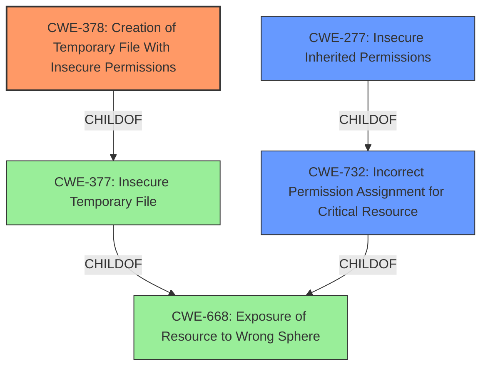

# Analysis Report for CVE-2021-21364

# Vulnerability Analysis Report: CVE-2021-21364

## Description


## Analysis (with Relationship Data)

# Summary
| CWE ID | CWE Name | Confidence | CWE Abstraction Level | CWE Vulnerability Mapping Label | CWE-Vulnerability Mapping Notes |
|---|---|---|---|---|---|
| CWE-378 | Creation of Temporary File With Insecure Permissions | 0.9 | Base | Allowed | Primary CWE |
| CWE-732 | Incorrect Permission Assignment for Critical Resource | 0.7 | Class | Allowed-with-Review | Secondary Candidate |
| CWE-277 | Insecure Inherited Permissions | 0.6 | Variant | Allowed | Secondary Candidate |

## Evidence and Confidence

*   **Confidence Score:** 0.9
*   **Evidence Strength:** HIGH

## Relationship Analysis
The primary CWE, CWE-378, is a child of CWE-377 (Insecure Temporary File), which in turn is a child of CWE-668 (Exposure of Resource to Wrong Sphere). CWE-732 (Incorrect Permission Assignment for Critical Resource) is a child of both CWE-285 and CWE-668. CWE-277 (Insecure Inherited Permissions) is a child of CWE-732. These relationships suggest a hierarchy where a general issue of exposing resources with incorrect permissions leads to the specific problem of creating temporary files with insecure permissions due to incorrect inheritance or assignment. The selection of CWE-378 as the primary CWE is due to its direct relevance to the vulnerability description, which focuses on the insecure creation of temporary files.



## Vulnerability Chain
The vulnerability chain starts with the **insecure file permissions** assigned to temporary files created by `java.io.File.createTempFile()`. This leads to local information disclosure because other local users can read these files. The root cause is the **weakness** in how the temporary files are created and the permissions assigned by default.

## Summary of Analysis
The analysis is primarily based on the provided vulnerability description and the CVE Reference Links Content Summary, which explicitly mentions "CWE-378: Creation of Temporary File With Insecure Permissions" as a relevant weakness. The description states, "the vulnerability stems from the use of `java.io.File.createTempFile()` in the generated code by Swagger Codegen. This method creates temporary files in the system's temporary directory with insecure default permissions (`-rw-r--r--`)." The retriever results also list CWE-378 as a strong candidate.

CWE-378 is chosen because it directly addresses the creation of temporary files with insecure permissions. While CWE-732 (Incorrect Permission Assignment for Critical Resource) is also relevant, it's a more general class of weakness, and CWE-378 provides a more specific description of the vulnerability. CWE-277 (Insecure Inherited Permissions) is also relevant since the issue involves permissions being inherited, but it is less directly related than CWE-378.

The selected CWE is at the Base level of abstraction, which is the preferred level for mapping root causes. The evidence strongly supports the selection of CWE-378 as the primary CWE.

Relevant CWE Information:

# Enhanced Context (25 CWEs)
The following CWEs were identified as potentially relevant to this vulnerability:

## CWE-404: Improper Resource Shutdown or Release
**Abstraction Level**: Class
**Similarity Score**: 0.79
**Source**: dense

**Description**:
The product does not release or incorrectly releases a resource before it is made available for re-use.
*Not Selected*: This CWE does not fit, as the vulnerability isn't about releasing resources, but about the insecure creation of temporary files.

## CWE-668: Exposure of Resource to Wrong Sphere
**Abstraction Level**: Class
**Similarity Score**: 0.78
**Source**: dense

**Description**:
The product exposes a resource to the wrong control sphere, providing unintended actors with inappropriate access to the resource.
*Not Selected*: While this is indirectly true as insecure temporary files expose information, it is too high level.

## CWE-789: Memory Allocation with Excessive Size Value
**Abstraction Level**: Variant
**Similarity Score**: 0.77
**Source**: dense

**Description**:
The product allocates memory based on an untrusted, large size value, but it does not ensure that the size is within expected limits, allowing arbitrary amounts of memory to be allocated.
*Not Selected*: This CWE is not applicable as the vulnerability doesn't involve memory allocation issues.

## CWE-59: Improper Link Resolution Before File Access ('Link Following')
**Abstraction Level**: Base
**Similarity Score**: 0.77
**Source**: dense

**Description**:
The product attempts to access a file based on the filename, but it does not properly prevent that filename from identifying a link or shortcut that resolves to an unintended resource.
*Not Selected*: This vulnerability is not about link resolution.

## CWE-41: Improper Resolution of Path Equivalence
**Abstraction Level**: Base
**Similarity Score**: 0.77
**Source**: dense

**Description**:
The product is vulnerable to file system contents disclosure through path equivalence. Path equivalence involves the use of special characters in file and directory names. The associated manipulations are intended to generate multiple names for the same object.
*Not Selected*: This vulnerability is not about path equivalence.

## CWE-226: Sensitive Information in Resource Not Removed Before Reuse
**Abstraction Level**: Base
**Similarity Score**: 0.77
**Source**: dense

**Description**:
The product releases a resource such as memory or a file so that it can be made available for reuse, but it does not clear or "zeroize" the information contained in the resource before the product performs a critical state transition or makes the resource available for reuse by other entities.
*Not Selected*: This is not about the re-use of a resource.

## CWE-667: Improper Locking
**Abstraction Level**: Class
**Similarity Score**: 0.77
**Source**: dense

**Description**:
The product does not properly acquire or release a lock on a resource, leading to unexpected resource state changes and behaviors.
*Not Selected*: This is not about improper locking.

## CWE-212: Improper Removal of Sensitive Information Before Storage or Transfer
**Abstraction Level**: Base
**Similarity Score**: 0.76
**Source**: dense

**Description**:
The product stores, transfers, or shares a resource that contains sensitive information, but it does not properly remove that information before the product makes the resource available to unauthorized actors.
*Not Selected*: This CWE is not a good fit as the issue is with the creation of the temporary file, not the storage or transfer.

## CWE-405: Asymmetric Resource Consumption (Amplification)
**Abstraction Level**: Class
**Similarity Score**: 0.76
**Source**: dense

**Description**:
The product does not properly control situations in which an adversary can cause the product to consume or produce excessive resources without requiring the adversary to invest equivalent work or otherwise prove authorization, i.e., the adversary's influence is "asymmetric."
*Not Selected*: This CWE doesn't fit the vulnerability description.

## CWE-754: Improper Check for Unusual or Exceptional Conditions
**Abstraction Level**: Class
**Similarity Score**: 0.76
**Source**: dense

**Description**:
The product does not check or incorrectly checks for unusual or exceptional conditions that are not expected to occur frequently during day to day operation of the product.
*Not Selected*: This CWE doesn't fit the vulnerability description.

## CWE-379: Creation of Temporary File in Directory with Insecure Permissions
**Abstraction Level**: Base
**Similarity Score**: 6533.79
**Source**: sparse

**Description**:
The product creates a temporary file in a directory whose permissions allow unintended actors to determine the file's existence or otherwise access that file.
*Not Selected*: While highly related, the vulnerability description does not indicate that the directory has insecure permissions.

## CWE-732: Incorrect Permission Assignment for Critical Resource
**Abstraction Level**: Class
**Similarity Score**: 6326.61
**Source**: sparse

**Description**:
The product specifies permissions for a security-critical


## CWE Relationship Analysis

Current CWEs represent these abstraction levels: .


### Vulnerability Chain Analysis

**Chain starting from CWE-732:**
- 732 (Incorrect Permission Assignment for Critical Resource) - ROOT


**Chain starting from CWE-667:**
- 667 (Improper Locking) - ROOT


### CWE Relationship Diagram

```mermaid
graph TD
    classDef primary fill:#f96,stroke:#333,stroke-width:2px
    classDef secondary fill:#69f,stroke:#333
    classDef tertiary fill:#9e9,stroke:#333
```


*Report generated on 2025-04-02 05:55:48*
