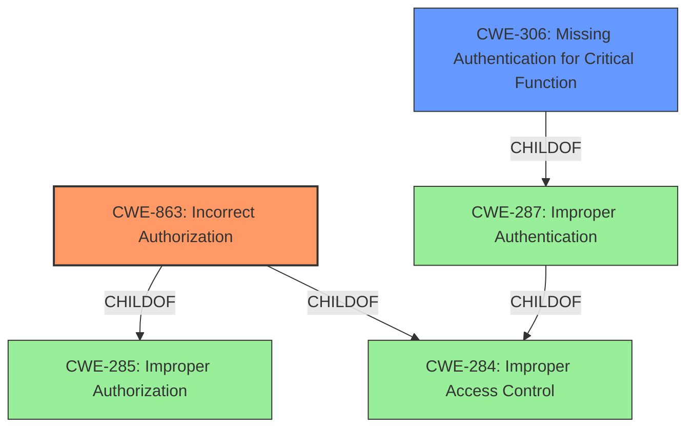

# Analysis for CVE-2021-21367

# Summary
| CWE ID | CWE Name | Confidence | CWE Abstraction Level | CWE Vulnerability Mapping Label | CWE-Vulnerability Mapping Notes |
|---|---|---|---|---|---|
| CWE-863 | Incorrect Authorization | 1.0 | Class | Primary | Allowed-with-Review |
| CWE-306 | Missing Authentication for Critical Function | 0.8 | Base | Secondary | Allowed |

## Evidence and Confidence

*   **Confidence Score:** 0.9
*   **Evidence Strength:** HIGH

## Relationship Analysis
The primary CWE is CWE-863 (**Incorrect Authorization**), a Class-level CWE. It is a child of both CWE-285 (**Improper Authorization**) and CWE-284 (**Improper Access Control**), both of which are higher-level abstractions. CWE-306 (**Missing Authentication for Critical Function**) is a Base-level CWE and a child of CWE-287 (**Improper Authentication**). The vulnerability can be seen as a case of **incorrect authorization**, but also as a case of **missing authentication** for a critical function (pairing).

## Vulnerability Chain
The vulnerability chain starts with the **incorrect authorization** or **missing authentication** in the Bluetooth plug, leading to unauthorized pairing and potential data extraction or control over the device.

## Summary of Analysis
The initial analysis focused on the **incorrect authorization** highlighted in the description. The retriever results also emphasized authorization-related CWEs. The CVE Reference Links Content Summary confirms that the Bluez agent methods were not waiting for dialog interaction before accepting pairing requests, indicating a flaw in the authorization process. The **root cause** is the **incorrect authorization**, but a critical function (**pairing**) lacks proper authentication.

The selection of CWE-863 is based on the **incorrect authorization** in the Bluetooth plug, which allows unauthorized pairing. The CVE description confirms that the authorization check is performed, but **incorrectly**, leading to the vulnerability. CWE-306 is included as a secondary CWE because the pairing process, a critical function, lacks proper authentication, as the system does not properly validate the user's consent before pairing.

The final decision is based on the provided evidence and the retriever results, focusing on the **root cause** and the specific function affected.

Relevant CWE Information:

# Enhanced Context (25 CWEs)
The following CWEs were identified as potentially relevant to this vulnerability:

## CWE-274: Improper Handling of Insufficient Privileges
**Abstraction Level**: Base
**Similarity Score**: 0.75

## CWE-266: Incorrect Privilege Assignment
**Abstraction Level**: Base
**Similarity Score**: 0.75

## CWE-653: Improper Isolation or Compartmentalization
**Abstraction Level**: Class
**Similarity Score**: 0.74

## CWE-280: Improper Handling of Insufficient Permissions or Privileges 
**Abstraction Level**: Base
**Similarity Score**: 0.74

## CWE-267: Privilege Defined With Unsafe Actions
**Abstraction Level**: Base
**Similarity Score**: 0.74

## CWE-668: Exposure of Resource to Wrong Sphere
**Abstraction Level**: Class
**Similarity Score**: 0.73

## CWE-639: Authorization Bypass Through User-Controlled Key
**Abstraction Level**: Base
**Similarity Score**: 0.73

## CWE-1390: Weak Authentication
**Abstraction Level**: Class
**Similarity Score**: 0.73

## CWE-807: Reliance on Untrusted Inputs in a Security Decision
**Abstraction Level**: Base
**Similarity Score**: 0.73

## CWE-1220: Insufficient Granularity of Access Control
**Abstraction Level**: Base
**Similarity Score**: 0.73

## CWE-863: Incorrect Authorization
**Abstraction Level**: Class
**Similarity Score**: 6000.11

## CWE-285: Improper Authorization
**Abstraction Level**: Class
**Similarity Score**: 5866.83

## CWE-287: Improper Authentication
**Abstraction Level**: Class
**Similarity Score**: 5675.71

## CWE-639: Authorization Bypass Through User-Controlled Key
**Abstraction Level**: Base
**Similarity Score**: 5561.66

## CWE-306: Missing Authentication for Critical Function
**Abstraction Level**: Base
**Similarity Score**: 5558.40

## CWE-613: Insufficient Session Expiration
**Abstraction Level**: base
**Similarity Score**: 4.33

## CWE-178: Improper Handling of Case Sensitivity
**Abstraction Level**: base
**Similarity Score**: 3.76

## CWE-202: Exposure of Sensitive Information Through Data Queries
**Abstraction Level**: base
**Similarity Score**: 3.64

## CWE-1289: Improper Validation of Unsafe Equivalence in Input
**Abstraction Level**: base
**Similarity Score**: 3.64

## CWE-201: Insertion of Sensitive Information Into Sent Data
**Abstraction Level**: base
**Similarity Score**: 3.64

## CWE-209: Generation of Error Message Containing Sensitive Information
**Abstraction Level**: base
**Similarity Score**: 3.64

## CWE-322: Key Exchange without Entity Authentication
**Abstraction Level**: base
**Similarity Score**: 2.87

## CWE-289: Authentication Bypass by Alternate Name
**Abstraction Level**: base
**Similarity Score**: 2.87

## CWE-911: Improper Update of Reference Count
**Abstraction Level**: base
**Similarity Score**: 2.87

## CWE-826: Premature Release of Resource During Expected Lifetime
**Abstraction Level**: base
**Similarity Score**: 2.73

**CWE-863: Incorrect Authorization**
The product performs an authorization check when an actor attempts to access a resource or perform an action, but it does not correctly perform the check. The Bluetooth plug attempts to authorize pairing requests, but it does so incorrectly. The security implication is that attackers can pair with the device without user consent.
*   Confidence: 1.0

**CWE-306: Missing Authentication for Critical Function**
The product does not perform any authentication for functionality that requires a provable user identity or consumes a significant amount of resources. The pairing process is a critical function that lacks proper authentication. The security implication is that attackers can pair with the device without user consent.
*   Confidence: 0.8

**CWE-284: Improper Access Control**
This is a very general, high-level CWE (Pillar) that is discouraged. While technically applicable, it doesn't provide enough specific information about the vulnerability.
*   Confidence: N/A

**CWE-285: Improper Authorization**
This is a Class-level CWE. While applicable, it is less specific than CWE-863 (**Incorrect Authorization**).
*   Confidence: N/A

**CWE-287: Improper Authentication**
This is a Class-level CWE. While applicable, it is less specific than CWE-306 (**Missing Authentication for Critical Function**).
*   Confidence: N/A

**CWE-290: Authentication Bypass by Spoofing**
This CWE relates to spoofing attacks which are not evident in the vulnerability description.
*   Confidence: N/A

**CWE-613: Insufficient Session Expiration**
This CWE relates to session expiration which is not evident in the vulnerability description.
*   Confidence: N/A

# Enhanced Query for CVE-2021-21367

## Vulnerability Description
Switchboard Bluetooth Plug for elementary OS from version 2.3.0 and before version version 2.3.5 has an **incorrect authorization** vulnerability. When the Bluetooth plug is running (in discoverable mode), Bluetooth service requests and pairing requests are automatically accepted, allowing physically proximate attackers to pair with a device running an affected version of switchboard-plug-bluetooth without the active consent of the user. By default, elementary OS doesnt expose any services via Bluetooth that allow information to be extracted by paired Bluetooth devices. However, if such services (i.e. contact list sharing software) have been installed, its possible that attackers have been able to extract data from such services without authorization. If no such services have been installed, attackers are only able to pair with a device running an affected version without authorization and then play audio out of the device or possibly present a HID device (keyboard, mouse, etc...) to control the device. As such, users should check the list of trusted/paired devices and remove any that are not 100% confirmed to be genuine. This is fixed in version 2.3.5. To reduce the likelihood of this vulnerability on an unpatched version, only open the Bluetooth plug for short intervals when absolutely necessary and preferably not in crowded public areas. To mitigate the risk entirely with unpatched versions, do not open the Bluetooth plug within switchboard at all, and use a different method for pairing devices if necessary (e.g. `bluetoothctl` CLI).

### Vulnerability Description Key Phrases
- **rootcause:** **incorrect authorization**
- **impact:** pair with device without user consent
- **attacker:** physically proximate attackers
- **product:** Switchboard Bluetooth Plug for elementary OS
- **version:** from version 2.3.0 and before version 2.3.5

## CVE Reference Links Content Summary
Based on the provided information, here's an analysis of CVE-2021-21367:

**Root cause of vulnerability:**
The vulnerability lies in the way the `switchboard-plug-bluetooth` application handles Bluetooth pairing requests. Specifically, the methods exposed by the Bluez agent implementation would accept pairing if they return without throwing an explicit error before user interaction/response on the dialog, leading to pairing acceptance without explicit user authorization. The dialog's response and the user's interaction were not properly checked/awaited before returning from the Bluez agent methods, which caused the pairing to be accepted regardless of the dialog response. The dialog is also destroyed once the pairing succeeds, which meant that a quick pairing request would be authorized and completed even before the dialog could be interacted with.

**Weaknesses/vulnerabilities present:**
- Improper authorization/access control
- Missing check of dialog response before accepting the pairing.
- Bluez agent methods were not waiting for the dialog interaction, leading to a race condition where pairing could complete before any user interaction.

**Impact of exploitation:**
- **Unauthorized pairing:** A physically proximate attacker can pair with a device running an affected version of `switchboard-plug-bluetooth` without the user's explicit consent.
- **Potential data extraction:** If the device has other services installed that expose sensitive data via Bluetooth, the attacker may be able to extract that data after unauthorized pairing.
- **Control over the device:** Attackers could potentially play audio through the device, or present HID (Human Interface Device) devices (such as a keyboard or mouse) to control the device.

**Attack vectors:**
- **Physical proximity:** The attacker must be physically close to the vulnerable device to establish a Bluetooth connection.
- **Bluetooth:** The attack is performed over Bluetooth.

**Required attacker capabilities/position:**
- The attacker needs to be within Bluetooth range of the target device.
- The attacker does not require any prior authentication or privileges.
- The vulnerable `switchboard-plug-bluetooth` application needs to be running in discoverable mode on the target device.

**Additional details from the content:**

- The vulnerability was present in versions 2.3.0 through 2.3.4 of `switchboard-plug-bluetooth`.
- Version 2.3.5 contains the fix for this vulnerability.
- A patch was implemented to address the vulnerability
- Workarounds were suggested, which included only enabling the Bluetooth plug for short intervals when needed and avoiding using the plug at all by using command-line tools instead
- The CVSS score for this vulnerability is 6.1, which is considered a moderate severity.
- The vulnerability was reported by davidmhewitt.

## Retriever Results

### Top Combined Results

| Rank | CWE ID | Name | Abstraction | Usage  | Retrievers | Individual Scores |
|------|--------|------|-------------|-------|------------|-------------------|
| 1 | 284 | Improper Access Control | Pillar | Discouraged | alternate_terms | 0.800 |
| 2 | 863 | Incorrect Authorization | Class | Allowed-with-Review | sparse | 1.424 |
| 3 | 306 | Missing Authentication for Critical Function | Base | Allowed | sparse | 1.221 |
| 4 | 285 | Improper Authorization | Class | Discouraged | sparse | 1.202 |
| 5 | 862 | Missing Authorization | Class | Allowed-with-Review | sparse | 1.199 |
| 6 | 290 | Authentication Bypass by Spoofing | Base | Allowed | dense | 0.490 |
| 7 | 613 | Insufficient Session Expiration | Base | Allowed | graph | 0.002 |
| 8 | 287 | Improper Authentication | Class | Discouraged | sparse | 1.195 |
| 9 | 201 | Insertion of Sensitive Information Into Sent Data | Base | Allowed | sparse | 1.184 |
| 10 | 269 | Improper Privilege Management | Class | Discouraged | sparse | 1.168 |

# Complete CWE Specifications

## CWE-284: Improper Access Control
**Abstraction:** Pillar
**Status:** Incomplete

### Description
The product does not restrict or incorrectly restricts access to a resource from an unauthorized actor.

### Extended Description

Access control involves the use of several protection mechanisms such as:

  - Authentication (proving the identity of an actor)

  - Authorization (ensuring that a given actor can access a resource), and

  - Accountability (tracking of activities that were performed)

When any mechanism is not applied or otherwise fails, attackers can compromise the security of the product by gaining privileges, reading sensitive information, executing commands, evading detection, etc.

There are two distinct behaviors that can introduce access control weaknesses:

  - Specification: incorrect privileges, permissions, ownership, etc. are explicitly specified for either the user or the resource (for example, setting a password file to be world-writable, or giving administrator capabilities to a guest user). This action could be performed by the program or the administrator.

  - Enforcement: the mechanism contains errors that prevent it from properly enforcing the specified access control requirements (e.g., allowing the user to specify their own privileges, or allowing a syntactically-incorrect ACL to produce insecure settings). This problem occurs within the program itself, in that it does not actually enforce the intended security policy that the administrator specifies.

### Alternative Terms
Authorization: The terms "access control" and "authorization" are often used interchangeably, although many people have distinct definitions. The CWE usage of "access control" is intended as a general term for the various mechanisms that restrict which users can access which resources, and "authorization" is more narrowly defined. It is unlikely that there will be community consensus on the use of these terms.

### Relationships
None

### Mapping Guidance
**Usage:** Discouraged
**Rationale:** CWE-284 is extremely high-level, a Pillar. Its name, "Improper Access Control," is often misused in low-information vulnerability reports [REF-1287] or by active use of the OWASP Top Ten, such as "A01:2021-Broken Access Control". It is not useful for trend analysis.
**Comments:** Consider using descendants of CWE-284 that are more specific to the kind of access control involved, such as those involving authorization (Missing Authorization (CWE-862), Incorrect Authorization (CWE-863), Incorrect Permission Assignment for Critical Resource (CWE-732), etc.); authentication (Missing Authentication (CWE-306) or Weak Authentication (CWE-1390)); Incorrect User Management (CWE-286); Improper Restriction of Communication Channel to Intended Endpoints (CWE-923); etc.
**Reasons:**
- Frequent Misuse
- Abstraction
**Suggested Alternatives:**
- CWE-862: Missing Authorization
- CWE-863: Incorrect Authorization
- CWE-732: Incorrect Permission Assignment for Critical Resource
- CWE-306: Missing Authentication
- CWE-1390: Weak Authentication
- CWE-923: Improper Restriction of Communication Channel to Intended Endpoints

### Additional Notes
**[Maintenance]** 

This entry needs more work. Possible sub-categories include:

  - Trusted group includes undesired entities (partially covered by CWE-286)

  - Group can perform undesired actions

  - ACL parse error does not fail closed

### Observed Examples
- **CVE-2022-24985:** A form hosting website only checks the session authentication status for a single form, making it possible to bypass authentication when there are multiple forms
- **CVE-2022-29238:** Access-control setting in web-based document collaboration tool is not properly implemented by the code, which prevents listing hidden directories but does not prevent direct requests to files in those directories.
- **CVE-2022-23607:** Python-based HTTP library did not scope cookies to a particular domain such that "supercookies" could be sent to any domain on redirect

## CWE-863: Incorrect Authorization
**Abstraction:** Class
**Status:** Incomplete

### Description
The product performs an authorization check when an actor attempts to access a resource or perform an action, but it does not correctly perform the check.

### Extended Description
Not provided

### Alternative Terms
AuthZ: "AuthZ" is typically used as an abbreviation of "authorization" within the web application security community. It is distinct from "AuthN" (or, sometimes, "AuthC") which is an abbreviation of "authentication." The use of "Auth" as an abbreviation is discouraged, since it could be used for either authentication or authorization.

### Relationships
ChildOf -> CWE-285
ChildOf -> CWE-284

### Mapping Guidance
**Usage:** Allowed-with-Review
**Rationale:** This CWE entry is a Class and might have Base-level children that would be more appropriate
**Comments:** Examine children of this entry to see if there is a better fit
**Reasons:**
- Abstraction

### Additional Notes
**[Terminology]** 

Assuming a user with a given identity, authorization is the process of determining whether that user can access a given resource, based on the user's privileges and any permissions or other access-control specifications that apply to the resource.

### Observed Examples
- **CVE-2021-39155:** Chain: A microservice integration and management platform compares the hostname in the HTTP Host header in a case-sensitive way (CWE-178, CWE-1289), allowing bypass of the authorization policy (CWE-863) using a hostname with mixed case or other variations.
- **CVE-2019-15900:** Chain: sscanf() call is used to check if a username and group exists, but the return value of sscanf() call is not checked (CWE-252), causing an uninitialized variable to be checked (CWE-457), returning success to allow authorization bypass for executing a privileged (CWE-863).
- **CVE-2009-2213:** Gateway uses default "Allow" configuration for its authorization settings.

## CWE-306: Missing Authentication for Critical Function
**Abstraction:** Base
**Status:** Draft

### Description
The product does not perform any authentication for functionality that requires a provable user identity or consumes a significant amount of resources.

### Extended Description
Not provided

### Alternative Terms
None

### Relationships
ChildOf -> CWE-287
ChildOf -> CWE-287

### Mapping Guidance
**Usage:** Allowed
**Rationale:** This CWE entry is at the Base level of abstraction, which is a preferred level of abstraction for mapping to the root causes of vulnerabilities.
**Comments:** Carefully read both the name and description to ensure that this mapping is an appropriate fit. Do not try to 'force' a mapping to a lower-level Base/Variant simply to comply with this preferred level of abstraction.
**Reasons:**
- Acceptable-Use

### Observed Examples
- **CVE-2022-31260:** Chain: a digital asset management program has an undisclosed backdoor in the legacy version of a PHP script (CWE-912) that could allow an unauthenticated user to export metadata (CWE-306)
- **CVE-2022-29951:** TCP-based protocol in Programmable Logic Controller (PLC) has no authentication.
- **CVE-2022-29952:** Condition Monitor firmware uses a protocol that does not require authentication.

## CWE-285: Improper Authorization
**Abstraction:** Class
**Status:** Draft

### Description
The product does not perform or incorrectly performs an authorization check when an actor attempts to access a resource or perform an action.

### Extended Description

Assuming a user with a given identity, authorization is the process of determining whether that user can access a given resource, based on the user's privileges and any permissions or other access-control specifications that apply to the resource.

When access control checks are not applied consistently - or not at all - users are able to access data or perform actions that they should not be allowed to perform. This can lead to a wide range of problems, including information exposures, denial of service, and arbitrary code execution.

### Alternative Terms
AuthZ: "AuthZ" is typically used as an abbreviation of "authorization" within the web application security community. It is distinct from "AuthN" (or, sometimes, "AuthC") which is an abbreviation of "authentication." The use of "Auth" as an abbreviation is discouraged, since it could be used for either authentication or authorization.

### Relationships
ChildOf -> CWE-284
ChildOf -> CWE-284

### Mapping Guidance
**Usage:** Discouraged
**Rationale:** CWE-285 is high-level and lower-level CWEs can frequently be used instead. It is a level-1 Class (i.e., a child of a Pillar).
**Comments:** Look at CWE-285's children and consider mapping to CWEs such as CWE-862: Missing Authorization, CWE-863: Incorrect Authorization, CWE-732: Incorrect Permission Assignment for Critical Resource, or others.
**Reasons:**
- Abstraction
**Suggested Alternatives:**
- CWE-862: Missing Authorization
- CWE-863: Incorrect Authorization
- CWE-732: Incorrect Permission Assignment for Critical Resource

### Observed Examples
- **CVE-2022-24730:** Go-based continuous deployment product does not check that a user has certain privileges to update or create an app, allowing adversaries to read sensitive repository information
- **CVE-2009-3168:** Web application does not restrict access to admin scripts, allowing authenticated users to reset administrative passwords.
- **CVE-2009-2960:** Web application does not restrict access to admin scripts, allowing authenticated users to modify passwords of other users.

## CWE-862: Missing Authorization
**Abstraction:** Class
**Status:** Incomplete

### Description
The product does not perform an authorization check when an actor attempts to access a resource or perform an action.

### Extended Description
Not provided

### Alternative Terms
AuthZ: "AuthZ" is typically used as an abbreviation of "authorization" within the web application security community. It is distinct from "AuthN" (or, sometimes, "AuthC") which is an abbreviation of "authentication." The use of "Auth" as an abbreviation is discouraged, since it could be used for either authentication or authorization.

### Relationships
ChildOf -> CWE-285
ChildOf -> CWE-284

### Mapping Guidance
**Usage:** Allowed-with-Review
**Rationale:** This CWE entry is a Class and might have Base-level children that would be more appropriate
**Comments:** Examine children of this entry to see if there is a better fit
**Reasons:**
- Abstraction

### Additional Notes
**[Terminology]** Assuming a user with a given identity, authorization is the process of determining whether that user can access a given resource, based on the user's privileges and any permissions or other access-control specifications that apply to the resource.

### Observed Examples
- **CVE-2022-24730:** Go-based continuous deployment product does not check that a user has certain privileges to update or create an app, allowing adversaries to read sensitive repository information
- **CVE-2009-3168:** Web application does not restrict access to admin scripts, allowing authenticated users to reset administrative passwords.
- **CVE-2009-3597:** Web application stores database file under the web root with insufficient access control (CWE-219), allowing direct request.

## CWE-290: Authentication Bypass by Spoofing
**Abstraction:** Base
**Status:** Incomplete

### Description
This attack-focused weakness is caused by incorrectly implemented authentication schemes that are subject to spoofing attacks.

### Extended Description
Not provided

### Alternative Terms
None

### Relationships
ChildOf -> CWE-1390
ChildOf -> CWE-287

### Mapping Guidance
**Usage:** Allowed
**Rationale:** This CWE entry is at the Base level of abstraction, which is a preferred level of abstraction for mapping to the root causes of vulnerabilities.
**Comments:** Carefully read both the name and description to ensure that this mapping is an appropriate fit. Do not try to 'force' a mapping to a lower-level Base/Variant simply to comply with this preferred level of abstraction.
**Reasons:**
- Acceptable-Use

### Additional Notes
**[Relationship]** This can be resultant from insufficient verification.

### Observed Examples
- **CVE-2022-30319:** S-bus functionality in a home automation product performs access control using an IP allowlist, which can be bypassed by a forged IP address.
- **CVE-2009-1048:** VOIP product allows authentication bypass using 127.0.0.1 in the Host header.

## CWE-613: Insufficient Session Expiration
**Abstraction:** Base
**Status:** Incomplete

### Description
According to WASC, "Insufficient Session Expiration is when a web site permits an attacker to reuse old session credentials or session IDs for authorization."

### Extended Description
Not provided

### Alternative Terms
None

### Relationships
ChildOf -> CWE-672
ChildOf -> CWE-672
CanPrecede -> CWE-287

### Mapping Guidance
**Usage:** Allowed
**Rationale:** This CWE entry is at the Base level of abstraction, which is a preferred level of abstraction for mapping to the root causes of vulnerabilities.
**Comments:** Carefully read both the name and description to ensure that this mapping is an appropriate fit. Do not try to 'force' a mapping to a lower-level Base/Variant simply to comply with this preferred level of abstraction.
**Reasons:**
- Acceptable-Use

### Additional Notes
**[Other]** The lack of proper session expiration may improve the likely success of certain attacks. For example, an attacker may intercept a session ID, possibly via a network sniffer or Cross-site Scripting attack. Although short session expiration times do not help if a stolen token is immediately used, they will protect against ongoing replaying of the session ID. In another scenario, a user might access a web site from a shared computer (such as at a library, Internet cafe, or open work environment). Insufficient Session Expiration could allow an attacker to use the browser's back button to access web pages previously accessed by the victim.

## CWE-287: Improper Authentication
**Abstraction:** Class
**Status:** Draft

### Description
When an actor claims to have a given identity, the product does not prove or insufficiently proves that the claim is correct.

### Extended Description
Not provided

### Alternative Terms
authentification: An alternate term is "authentification", which appears to be most commonly used by people from non-English-speaking countries.
AuthN: "AuthN" is typically used as an abbreviation of "authentication" within the web application security community. It is also distinct from "AuthZ," which is an abbreviation of "authorization." The use of "Auth" as an abbreviation is discouraged, since it could be used for either authentication or authorization.
AuthC: "AuthC" is used as an abbreviation of "authentication," but it appears to used less frequently than "AuthN."

### Relationships
ChildOf -> CWE-284
ChildOf -> CWE-284

### Mapping Guidance
**Usage:** Discouraged
**Rationale:** This CWE entry might be misused when lower-level CWE entries are likely to be applicable. It is a level-1 Class (i.e., a child of a Pillar).
**Comments:** Consider children or descendants, beginning with CWE-1390: Weak Authentication or CWE-306: Missing Authentication for Critical Function.
**Reasons:**
- Frequent Misuse
**Suggested Alternatives:**
- CWE-1390: Weak Authentication
- CWE-306: Missing Authentication for Critical Function

### Additional Notes
**[Relationship]** This can be resultant from SQL injection vulnerabilities and other issues.

**[Maintenance]** The Taxonomy_Mappings to ISA/IEC 62443 were added in CWE 4.10, but they are still under review and might change in future CWE versions. These draft mappings were performed by members of the "Mapping CWE to 62443" subgroup of the CWE-CAPEC ICS/OT Special Interest Group (SIG), and their work is incomplete as of CWE 4.10. The mappings are included to facilitate discussion and review by the broader ICS/OT community, and they are likely to change in future CWE versions.

### Observed Examples
- **CVE-2022-35248:** Chat application skips validation when Central Authentication Service (CAS) is enabled, effectively removing the second factor from two-factor authentication
- **CVE-2022-36436:** Python-based authentication proxy does not enforce password authentication during the initial handshake, allowing the client to bypass authentication by specifying a 'None' authentication type.
- **CVE-2022-30034:** Chain: Web UI for a Python RPC framework does not use regex anchors to validate user login emails (CWE-777), potentially allowing bypass of OAuth (CWE-1390).

## CWE-201: Insertion of Sensitive Information Into Sent Data
**Abstraction:** Base
**Status:** Draft

### Description
The code transmits data to another actor, but a portion of the data includes sensitive information that should not be accessible to that actor.

### Extended Description
Not provided

### Alternative Terms
None

### Relationships
ChildOf -> CWE-200
CanAlsoBe -> CWE-209
CanAlsoBe -> CWE-202

### Mapping Guidance
**Usage:** Allowed
**Rationale:** This CWE entry is at the Base level of abstraction, which is a preferred level of abstraction for mapping to the root causes of vulnerabilities.
**Comments:** Carefully read both the name and description to ensure that this mapping is an appropriate fit. Do not try to 'force' a mapping to a lower-level Base/Variant simply to comply with this preferred level of abstraction.
**Reasons:**
- Acceptable-Use

### Additional Notes
**[Other]** Sensitive information could include data that is sensitive in and of itself (such as credentials or private messages), or otherwise useful in the further exploitation of the system (such as internal file system structure).

### Observed Examples
- **CVE-2022-0708:** Collaboration platform does not clear team emails in a response, allowing leak of email addresses

## CWE-269: Improper Privilege Management
**Abstraction:** Class
**Status:** Draft

### Description
The product does not properly assign, modify, track, or check privileges for an actor, creating an unintended sphere of control for that actor.

### Extended Description
Not provided

### Alternative Terms
None

### Relationships
ChildOf -> CWE-284

### Mapping Guidance
**Usage:** Discouraged
**Rationale:** CWE-269 is commonly misused. It can be conflated with "privilege escalation," which is a technical impact that is listed in many low-information vulnerability reports [REF-1287]. It is not useful for trend analysis.
**Comments:** If an error or mistake allows privilege escalation, then use the CWE ID for that mistake. Avoid using CWE-269 when only phrases such as "privilege escalation" or "gain privileges" are available, as these indicate technical impact of the vulnerability - not the root cause weakness. If the root cause seems to be directly related to privileges, then examine the children of CWE-269 for additional hints, such as Execution with Unnecessary Privileges (CWE-250) or Incorrect Privilege Assignment (CWE-266).
**Reasons:**
- Frequent Misuse

### Additional Notes
**[Maintenance]** The relationships between privileges, permissions, and actors (e.g. users and groups) need further refinement within the Research view. One complication is that these concepts apply to two different pillars, related to control of resources (CWE-664) and protection mechanism failures (CWE-693).

### Observed Examples
- **CVE-2001-1555:** Terminal privileges are not reset when a user logs out.
- **CVE-2001-1514:** Does not properly pass security context to child processes in certain cases, allows privilege escalation.
- **CVE-2001-0128:** Does not properly compute roles.

