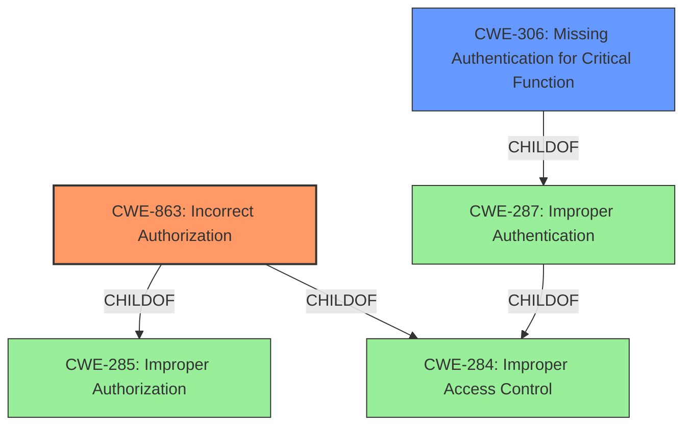

# Analysis Report for CVE-2021-21367

# Vulnerability Analysis Report: CVE-2021-21367

## Description


## Analysis (with Relationship Data)

# Summary
| CWE ID | CWE Name | Confidence | CWE Abstraction Level | CWE Vulnerability Mapping Label | CWE-Vulnerability Mapping Notes |
|---|---|---|---|---|---|
| CWE-863 | Incorrect Authorization | 1.0 | Class | Primary | Allowed-with-Review |
| CWE-306 | Missing Authentication for Critical Function | 0.8 | Base | Secondary | Allowed |

## Evidence and Confidence

*   **Confidence Score:** 0.9
*   **Evidence Strength:** HIGH

## Relationship Analysis
The primary CWE is CWE-863 (**Incorrect Authorization**), a Class-level CWE. It is a child of both CWE-285 (**Improper Authorization**) and CWE-284 (**Improper Access Control**), both of which are higher-level abstractions. CWE-306 (**Missing Authentication for Critical Function**) is a Base-level CWE and a child of CWE-287 (**Improper Authentication**). The vulnerability can be seen as a case of **incorrect authorization**, but also as a case of **missing authentication** for a critical function (pairing).



## Vulnerability Chain
The vulnerability chain starts with the **incorrect authorization** or **missing authentication** in the Bluetooth plug, leading to unauthorized pairing and potential data extraction or control over the device.

## Summary of Analysis
The initial analysis focused on the **incorrect authorization** highlighted in the description. The retriever results also emphasized authorization-related CWEs. The CVE Reference Links Content Summary confirms that the Bluez agent methods were not waiting for dialog interaction before accepting pairing requests, indicating a flaw in the authorization process. The **root cause** is the **incorrect authorization**, but a critical function (**pairing**) lacks proper authentication.

The selection of CWE-863 is based on the **incorrect authorization** in the Bluetooth plug, which allows unauthorized pairing. The CVE description confirms that the authorization check is performed, but **incorrectly**, leading to the vulnerability. CWE-306 is included as a secondary CWE because the pairing process, a critical function, lacks proper authentication, as the system does not properly validate the user's consent before pairing.

The final decision is based on the provided evidence and the retriever results, focusing on the **root cause** and the specific function affected.

Relevant CWE Information:

# Enhanced Context (25 CWEs)
The following CWEs were identified as potentially relevant to this vulnerability:

## CWE-274: Improper Handling of Insufficient Privileges
**Abstraction Level**: Base
**Similarity Score**: 0.75

## CWE-266: Incorrect Privilege Assignment
**Abstraction Level**: Base
**Similarity Score**: 0.75

## CWE-653: Improper Isolation or Compartmentalization
**Abstraction Level**: Class
**Similarity Score**: 0.74

## CWE-280: Improper Handling of Insufficient Permissions or Privileges 
**Abstraction Level**: Base
**Similarity Score**: 0.74

## CWE-267: Privilege Defined With Unsafe Actions
**Abstraction Level**: Base
**Similarity Score**: 0.74

## CWE-668: Exposure of Resource to Wrong Sphere
**Abstraction Level**: Class
**Similarity Score**: 0.73

## CWE-639: Authorization Bypass Through User-Controlled Key
**Abstraction Level**: Base
**Similarity Score**: 0.73

## CWE-1390: Weak Authentication
**Abstraction Level**: Class
**Similarity Score**: 0.73

## CWE-807: Reliance on Untrusted Inputs in a Security Decision
**Abstraction Level**: Base
**Similarity Score**: 0.73

## CWE-1220: Insufficient Granularity of Access Control
**Abstraction Level**: Base
**Similarity Score**: 0.73

## CWE-863: Incorrect Authorization
**Abstraction Level**: Class
**Similarity Score**: 6000.11

## CWE-285: Improper Authorization
**Abstraction Level**: Class
**Similarity Score**: 5866.83

## CWE-287: Improper Authentication
**Abstraction Level**: Class
**Similarity Score**: 5675.71

## CWE-639: Authorization Bypass Through User-Controlled Key
**Abstraction Level**: Base
**Similarity Score**: 5561.66

## CWE-306: Missing Authentication for Critical Function
**Abstraction Level**: Base
**Similarity Score**: 5558.40

## CWE-613: Insufficient Session Expiration
**Abstraction Level**: base
**Similarity Score**: 4.33

## CWE-178: Improper Handling of Case Sensitivity
**Abstraction Level**: base
**Similarity Score**: 3.76

## CWE-202: Exposure of Sensitive Information Through Data Queries
**Abstraction Level**: base
**Similarity Score**: 3.64

## CWE-1289: Improper Validation of Unsafe Equivalence in Input
**Abstraction Level**: base
**Similarity Score**: 3.64

## CWE-201: Insertion of Sensitive Information Into Sent Data
**Abstraction Level**: base
**Similarity Score**: 3.64

## CWE-209: Generation of Error Message Containing Sensitive Information
**Abstraction Level**: base
**Similarity Score**: 3.64

## CWE-322: Key Exchange without Entity Authentication
**Abstraction Level**: base
**Similarity Score**: 2.87

## CWE-289: Authentication Bypass by Alternate Name
**Abstraction Level**: base
**Similarity Score**: 2.87

## CWE-911: Improper Update of Reference Count
**Abstraction Level**: base
**Similarity Score**: 2.87

## CWE-826: Premature Release of Resource During Expected Lifetime
**Abstraction Level**: base
**Similarity Score**: 2.73

**CWE-863: Incorrect Authorization**
The product performs an authorization check when an actor attempts to access a resource or perform an action, but it does not correctly perform the check. The Bluetooth plug attempts to authorize pairing requests, but it does so incorrectly. The security implication is that attackers can pair with the device without user consent.
*   Confidence: 1.0

**CWE-306: Missing Authentication for Critical Function**
The product does not perform any authentication for functionality that requires a provable user identity or consumes a significant amount of resources. The pairing process is a critical function that lacks proper authentication. The security implication is that attackers can pair with the device without user consent.
*   Confidence: 0.8

**CWE-284: Improper Access Control**
This is a very general, high-level CWE (Pillar) that is discouraged. While technically applicable, it doesn't provide enough specific information about the vulnerability.
*   Confidence: N/A

**CWE-285: Improper Authorization**
This is a Class-level CWE. While applicable, it is less specific than CWE-863 (**Incorrect Authorization**).
*   Confidence: N/A

**CWE-287: Improper Authentication**
This is a Class-level CWE. While applicable, it is less specific than CWE-306 (**Missing Authentication for Critical Function**).
*   Confidence: N/A

**CWE-290: Authentication Bypass by Spoofing**
This CWE relates to spoofing attacks which are not evident in the vulnerability description.
*   Confidence: N/A

**CWE-613: Insufficient Session Expiration**
This CWE relates to session expiration which is not evident in the vulnerability description.
*   Confidence: N/A


## CWE Relationship Analysis

Current CWEs represent these abstraction levels: .


### Vulnerability Chain Analysis

**Chain starting from CWE-266:**
- 266 (Incorrect Privilege Assignment) - ROOT


**Chain starting from CWE-1220:**
- 1220 (Insufficient Granularity of Access Control) - ROOT


### CWE Relationship Diagram

```mermaid
graph TD
    classDef primary fill:#f96,stroke:#333,stroke-width:2px
    classDef secondary fill:#69f,stroke:#333
    classDef tertiary fill:#9e9,stroke:#333
```


*Report generated on 2025-04-02 16:19:19*
