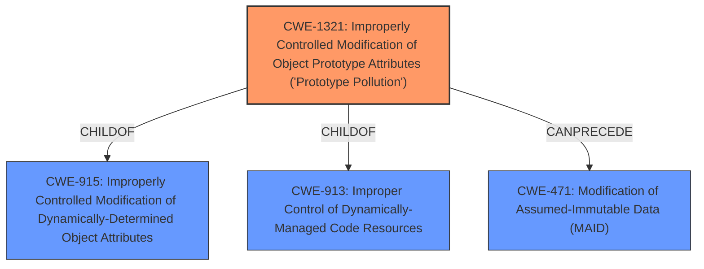

# Analysis for CVE-2021-21368

# Summary
| CWE ID  | CWE Name       | Confidence | CWE Abstraction Level | CWE Vulnerability Mapping Label | CWE-Vulnerability Mapping Notes |
|-----------------|-----------------------------------------------------------------------------------------|--------------------|-------------------------|-----------------------------------|---------------------------------------------------------------------------------|
| CWE-1321 | Improperly Controlled Modification of Object Prototype Attributes ('Prototype Pollution') | 1 | Variant | Primary | Allowed |

## Evidence and Confidence

*   **Confidence Score:** 1
*   **Evidence Strength:** HIGH

## Relationship Analysis
The primary CWE selected is CWE-1321, which is a Variant level CWE. It is a child of CWE-915 (Improperly Controlled Modification of Dynamically-Determined Object Attributes) and CWE-913 (Improper Control of Dynamically-Managed Code Resources). The relationship indicates that prototype pollution is a specific case of a more general class of vulnerabilities related to improper control of object attributes. This helps confirm that CWE-1321 is a specific and appropriate choice for this case.

## Vulnerability Chain
The vulnerability chain starts with the **improper __proto__ handling**, leading to **prototype poisoning**, which results in unexpected prototype properties and methods. The root cause is the lack of proper control over modifications to object prototype attributes when handling the `__proto__` key in a map.

## Summary of Analysis
The initial assessment focused on identifying the root cause and weakness described in the vulnerability. The description explicitly mentions "**prototype poisoning**" and "**improper __proto__ handling**." The CVE Reference Links Content Summary confirms the **prototype poisoning** vulnerability and highlights that the `msgpack5` library does not properly handle the `__proto__` key, which can lead to modification of object prototypes.

The retriever results indicated CWE-1321 (Improperly Controlled Modification of Object Prototype Attributes ('Prototype Pollution')) as the top candidate. The description of CWE-1321 aligns directly with the vulnerability description: "The product receives input from an upstream component that specifies attributes that are to be initialized or updated in an object, but it does not properly control modifications of attributes of the object prototype."

The relationship analysis reinforces the selection of CWE-1321, as it is a specific variant of more general weaknesses related to improper control of object attributes. The mapping guidance for CWE-1321 also supports its use, stating that it is at the Variant level of abstraction, which is preferred.

The evidence from the vulnerability description and the retriever results, combined with relationship analysis and mapping guidance, strongly supports the selection of CWE-1321 as the primary CWE for this vulnerability.

Relevant CWE Information:
- **CWE-1321**: The description directly matches the vulnerability where the product does not properly control modifications of the object prototype attributes. The vulnerability occurs because the msgpack5 library doesn't properly handle the __proto__ key, allowing modification of decoded objects' prototypes.
- **CWE-915**: Considered but not selected because CWE-1321 is a more specific Variant of this Base CWE, providing a more precise description of the vulnerability.
- **CWE-502**: Considered but not selected because while deserialization is involved, the core issue is the improper handling of the `__proto__` attribute, leading to prototype pollution, rather than a general deserialization flaw.

# Enhanced Query for CVE-2021-21368

## Vulnerability Description
msgpack5 is a msgpack v5 implementation for node.js and the browser. In msgpack5 before versions 3.6.1, 4.5.1, and 5.2.1 there is a Prototype Poisoning vulnerability. When msgpack5 decodes a map containing a key __proto__, it assigns the decoded value to __proto__. Object.prototype.__proto__ is an accessor property for the receivers prototype. If the value corresponding to the key __proto__ decodes to an object or null, msgpack5 sets the decoded objects prototype to that value. An attacker who can submit crafted MessagePack data to a service can use this to produce values that appear to be of other types may have unexpected prototype properties and methods (for example length, numeric properties, and push et al if __proto__s value decodes to an Array) and/or may throw unexpected exceptions when used (for example if the __proto__ value decodes to a Map or Date). Other unexpected behavior might be produced for other types. There is no effect on the global prototype. This **prototype poisoning** is sort of a very limited inversion of a prototype pollution attack. Only the decoded values prototype is affected, and it can only be set to msgpack5 values (though if the victim makes use of custom codecs, anything could be a msgpack5 value). We have not found a way to escalate this to true prototype pollution (absent other bugs in the consumers code). This has been fixed in msgpack5 version 3.6.1, 4.5.1, and 5.2.1. See the referenced GitHub Security Advisory for an example and more details.

### Vulnerability Description Key Phrases
- **rootcause:** **improper __proto__ handling**
- **weakness:** **prototype poisoning**
- **impact:** unexpected prototype properties and methods
- **vector:** crafted MessagePack data
- **attacker:** attacker
- **product:** msgpack5
- **version:** before versions 3.6.1, 4.5.1, and 5.2.1

## CVE Reference Links Content Summary
Based on the provided content, here's an analysis of CVE-2021-21368:

**Root cause of vulnerability:**
- The `msgpack5` library, when decoding a map, doesn't properly handle the `__proto__` key. It directly assigns the decoded value associated with the `__proto__` key to the object's prototype, which can lead to unexpected behavior.

**Weaknesses/vulnerabilities present:**
- **Prototype poisoning:** The vulnerability allows an attacker to modify the prototype of a decoded object by including the `__proto__` key in the encoded data. This can result in the decoded object having unexpected properties, methods, or throwing errors when used.
- The vulnerability is present in all versions of the `msgpack5` library before the patched versions.

**Impact of exploitation:**
- **Type confusion:** Exploitation can cause an object to appear as a different type (e.g., a regular object behaving like a Map).
- **Unexpected behavior:** The modified prototype can cause unexpected behavior such as errors when attempting to access properties or methods that do not exist or that are not expected.
- **Limited prototype pollution:**  While it is not a complete prototype pollution, it modifies the prototype of a decoded object and not the global prototype.

**Attack vectors:**
- Network: An attacker can send a crafted message pack payload to a vulnerable service.

**Required attacker capabilities/position:**
- The attacker needs to be able to send a crafted message pack payload that includes the `__proto__` key and a malicious value to be assigned as the prototype.
- The attacker must have access to a service that uses `msgpack5` to decode data.
- User interaction is required in that a service that uses msgpack5 must decode the malicious payload.
- The attack complexity is rated as high

**Mitigation:**
- The vulnerability was fixed in versions 5.2.1, 4.5.1, and 3.6.1 of `msgpack5`. Users should upgrade to these versions or later.
- A mitigation strategy provided is to always validate data after parsing before any processing

**Additional Details:**
- The fix introduces a `protoAction` option with values: `error` (default, throws an error), `remove` (removes the property), and `ignore` (allows the property which causes the prototype poisoning).
- The advisory provides a detailed example of how the vulnerability can be exploited, including the crafted payload and the resulting unexpected behavior.

This content provides more detail than the description given in the original CVE description, specifically the options available to handle the `__proto__` property during decoding and how to mitigate the issue in code.

## Retriever Results

### Top Combined Results

| Rank | CWE ID | Name | Abstraction | Usage  | Retrievers | Individual Scores |
|------|--------|------|-------------|-------|------------|-------------------|
| 1 | 1321 | Improperly Controlled Modification of Object Prototype Attributes ('Prototype Pollution') | Variant | Allowed | sparse | 2.653 |
| 2 | 1188 | Initialization of a Resource with an Insecure Default | Base | Allowed | sparse | 1.418 |
| 3 | 335 | Incorrect Usage of Seeds in Pseudo-Random Number Generator (PRNG) | Base | Allowed | sparse | 1.343 |
| 4 | 1333 | Inefficient Regular Expression Complexity | Base | Allowed | sparse | 1.340 |
| 5 | 1284 | Improper Validation of Specified Quantity in Input | Base | Allowed | sparse | 1.282 |
| 6 | 409 | Improper Handling of Highly Compressed Data (Data Amplification) | Base | Allowed | dense | 0.433 |
| 7 | 471 | Modification of Assumed-Immutable Data (MAID) | Base | Allowed | graph | 0.002 |
| 8 | 125 | Out-of-bounds Read | Base | Allowed | sparse | 1.251 |
| 9 | 843 | Access of Resource Using Incompatible Type ('Type Confusion') | Base | Allowed | sparse | 1.245 |
| 10 | 502 | Deserialization of Untrusted Data | Base | Allowed | sparse | 1.239 |

# Complete CWE Specifications

## CWE-1321: Improperly Controlled Modification of Object Prototype Attributes ('Prototype Pollution')
**Abstraction:** Variant
**Status:** Incomplete

### Description
The product receives input from an upstream component that specifies attributes that are to be initialized or updated in an object, but it does not properly control modifications of attributes of the object prototype.

### Extended Description

By adding or modifying attributes of an object prototype, it is possible to create attributes that exist on every object, or replace critical attributes with malicious ones. This can be problematic if the product depends on existence or non-existence of certain attributes, or uses pre-defined attributes of object prototype (such as hasOwnProperty, toString or valueOf).

This weakness is usually exploited by using a special attribute of objects called proto, constructor or prototype. Such attributes give access to the object prototype. This weakness is often found in code that assigns object attributes based on user input, or merges or clones objects recursively.

### Alternative Terms
None

### Relationships
ChildOf -> CWE-915
ChildOf -> CWE-913
CanPrecede -> CWE-471

### Mapping Guidance
**Usage:** Allowed
**Rationale:** This CWE entry is at the Variant level of abstraction, which is a preferred level of abstraction for mapping to the root causes of vulnerabilities.
**Comments:** Carefully read both the name and description to ensure that this mapping is an appropriate fit. Do not try to 'force' a mapping to a lower-level Base/Variant simply to comply with this preferred level of abstraction.
**Reasons:**
- Acceptable-Use

### Observed Examples
- **CVE-2018-3721:** Prototype pollution by merging objects.
- **CVE-2019-10744:** Prototype pollution by setting default values to object attributes recursively.
- **CVE-2019-11358:** Prototype pollution by merging objects recursively.

## CWE-1188: Initialization of a Resource with an Insecure Default
**Abstraction:** Base
**Status:** Incomplete

### Description
The product initializes or sets a resource with a default that is intended to be changed by the administrator, but the default is not secure.

### Extended Description

Developers often choose default values that leave the product as open and easy to use as possible out-of-the-box, under the assumption that the administrator can (or should) change the default value. However, this ease-of-use comes at a cost when the default is insecure and the administrator does not change it.

### Alternative Terms
None

### Relationships
ChildOf -> CWE-1419
ChildOf -> CWE-665

### Mapping Guidance
**Usage:** Allowed
**Rationale:** This CWE entry is at the Base level of abstraction, which is a preferred level of abstraction for mapping to the root causes of vulnerabilities.
**Comments:** Carefully read both the name and description to ensure that this mapping is an appropriate fit. Do not try to 'force' a mapping to a lower-level Base/Variant simply to comply with this preferred level of abstraction.
**Reasons:**
- Acceptable-Use

### Additional Notes
**[Maintenance]** This entry improves organization of concepts under initialization. The typical CWE model is to cover "Missing" and "Incorrect" behaviors. Arguably, this entry could be named as "Incorrect" instead of "Insecure." This might be changed in the near future.

### Observed Examples
- **CVE-2022-36349:** insecure default variable initialization in BIOS firmware for a hardware board allows DoS
- **CVE-2022-42467:** A generic database browser interface has a default mode that exposes a web server to the network, allowing queries to the database.

## CWE-335: Incorrect Usage of Seeds in Pseudo-Random Number Generator (PRNG)
**Abstraction:** Base
**Status:** Draft

### Description
The product uses a Pseudo-Random Number Generator (PRNG) but does not correctly manage seeds.

### Extended Description

 PRNGs are deterministic and, while their output appears random, they cannot actually create entropy. They rely on cryptographically secure and unique seeds for entropy so proper seeding is critical to the secure operation of the PRNG.

 Management of seeds could be broken down into two main areas: 

  -  (1) protecting seeds as cryptographic material (such as a cryptographic key); 

  -  (2) whenever possible, using a uniquely generated seed from a cryptographically secure source 

 PRNGs require a seed as input to generate a stream of numbers that are functionally indistinguishable from random numbers. While the output is, in many cases, sufficient for cryptographic uses, the output of any PRNG is directly determined by the seed provided as input. If the seed can be ascertained by a third party, the entire output of the PRNG can be made known to them. As such, the seed should be kept secret and should ideally not be able to be guessed. For example, the current time may be a poor seed. Knowing the approximate time the PRNG was seeded greatly reduces the possible key space. 

 Seeds do not necessarily need to be unique, but reusing seeds may open up attacks if the seed is discovered. 

### Alternative Terms
None

### Relationships
ChildOf -> CWE-330
ChildOf -> CWE-330

### Mapping Guidance
**Usage:** Allowed
**Rationale:** This CWE entry is at the Base level of abstraction, which is a preferred level of abstraction for mapping to the root causes of vulnerabilities.
**Comments:** Carefully read both the name and description to ensure that this mapping is an appropriate fit. Do not try to 'force' a mapping to a lower-level Base/Variant simply to comply with this preferred level of abstraction.
**Reasons:**
- Acceptable-Use

### Additional Notes
**[Maintenance]** As of CWE 4.5, terminology related to randomness, entropy, and predictability can vary widely. Within the developer and other communities, "randomness" is used heavily. However, within cryptography, "entropy" is distinct, typically implied as a measurement. There are no commonly-used definitions, even within standards documents and cryptography papers. Future versions of CWE will attempt to define these terms and, if necessary, distinguish between them in ways that are appropriate for different communities but do not reduce the usability of CWE for mapping, understanding, or other scenarios.

### Observed Examples
- **CVE-2020-7010:** Cloud application on Kubernetes generates passwords using a weak random number generator based on deployment time.
- **CVE-2019-11495:** server uses erlang:now() to seed the PRNG, which results in a small search space for potential random seeds
- **CVE-2018-12520:** Product's PRNG is not seeded for the generation of session IDs

## CWE-1333: Inefficient Regular Expression Complexity
**Abstraction:** Base
**Status:** Draft

### Description
The product uses a regular expression with an inefficient, possibly exponential worst-case computational complexity that consumes excessive CPU cycles.

### Extended Description
Some regular expression engines have a feature called "backtracking". If the token cannot match, the engine "backtracks" to a position that may result in a different token that can match.
 Backtracking becomes a weakness if all of these conditions are met:

  - The number of possible backtracking attempts are exponential relative to the length of the input.

  - The input can fail to match the regular expression.

  - The input can be long enough.

 Attackers can create crafted inputs that intentionally cause the regular expression to use excessive backtracking in a way that causes the CPU consumption to spike. 

### Alternative Terms
ReDoS: ReDoS is an abbreviation of "Regular expression Denial of Service".
Regular Expression Denial of Service: While this term is attack-focused, this is commonly used to describe the weakness.
Catastrophic backtracking: This term is used to describe the behavior of the regular expression as a negative technical impact.

### Relationships
ChildOf -> CWE-407
ChildOf -> CWE-407

### Mapping Guidance
**Usage:** Allowed
**Rationale:** This CWE entry is at the Base level of abstraction, which is a preferred level of abstraction for mapping to the root causes of vulnerabilities.
**Comments:** Carefully read both the name and description to ensure that this mapping is an appropriate fit. Do not try to 'force' a mapping to a lower-level Base/Variant simply to comply with this preferred level of abstraction.
**Reasons:**
- Acceptable-Use

### Observed Examples
- **CVE-2020-5243:** server allows ReDOS with crafted User-Agent strings, due to overlapping capture groups that cause excessive backtracking.
- **CVE-2021-21317:** npm package for user-agent parser prone to ReDoS due to overlapping capture groups
- **CVE-2019-16215:** Markdown parser uses inefficient regex when processing a message, allowing users to cause CPU consumption and delay preventing processing of other messages.

## CWE-1284: Improper Validation of Specified Quantity in Input
**Abstraction:** Base
**Status:** Incomplete

### Description
The product receives input that is expected to specify a quantity (such as size or length), but it does not validate or incorrectly validates that the quantity has the required properties.

### Extended Description

Specified quantities include size, length, frequency, price, rate, number of operations, time, and others. Code may rely on specified quantities to allocate resources, perform calculations, control iteration, etc. When the quantity is not properly validated, then attackers can specify malicious quantities to cause excessive resource allocation, trigger unexpected failures, enable buffer overflows, etc.

### Alternative Terms
None

### Relationships
ChildOf -> CWE-20
ChildOf -> CWE-20
CanPrecede -> CWE-789

### Mapping Guidance
**Usage:** Allowed
**Rationale:** This CWE entry is at the Base level of abstraction, which is a preferred level of abstraction for mapping to the root causes of vulnerabilities.
**Comments:** Carefully read both the name and description to ensure that this mapping is an appropriate fit. Do not try to 'force' a mapping to a lower-level Base/Variant simply to comply with this preferred level of abstraction.
**Reasons:**
- Acceptable-Use

### Additional Notes
**[Maintenance]** This entry is still under development and will continue to see updates and content improvements.

### Observed Examples
- **CVE-2022-21668:** Chain: Python library does not limit the resources used to process images that specify a very large number of bands (CWE-1284), leading to excessive memory consumption (CWE-789) or an integer overflow (CWE-190).
- **CVE-2008-1440:** lack of validation of length field leads to infinite loop
- **CVE-2008-2374:** lack of validation of string length fields allows memory consumption or buffer over-read

## CWE-409: Improper Handling of Highly Compressed Data (Data Amplification)
**Abstraction:** Base
**Status:** Incomplete

### Description
The product does not handle or incorrectly handles a compressed input with a very high compression ratio that produces a large output.

### Extended Description
An example of data amplification is a "decompression bomb," a small ZIP file that can produce a large amount of data when it is decompressed.

### Alternative Terms
None

### Relationships
ChildOf -> CWE-405

### Mapping Guidance
**Usage:** Allowed
**Rationale:** This CWE entry is at the Base level of abstraction, which is a preferred level of abstraction for mapping to the root causes of vulnerabilities.
**Comments:** Carefully read both the name and description to ensure that this mapping is an appropriate fit. Do not try to 'force' a mapping to a lower-level Base/Variant simply to comply with this preferred level of abstraction.
**Reasons:**
- Acceptable-Use

### Observed Examples
- **CVE-2009-1955:** XML bomb in web server module
- **CVE-2003-1564:** Parsing library allows XML bomb

## CWE-471: Modification of Assumed-Immutable Data (MAID)
**Abstraction:** Base
**Status:** Draft

### Description
The product does not properly protect an assumed-immutable element from being modified by an attacker.

### Extended Description
This occurs when a particular input is critical enough to the functioning of the application that it should not be modifiable at all, but it is. Certain resources are often assumed to be immutable when they are not, such as hidden form fields in web applications, cookies, and reverse DNS lookups.

### Alternative Terms
None

### Relationships
ChildOf -> CWE-664

### Mapping Guidance
**Usage:** Allowed
**Rationale:** This CWE entry is at the Base level of abstraction, which is a preferred level of abstraction for mapping to the root causes of vulnerabilities.
**Comments:** Carefully read both the name and description to ensure that this mapping is an appropriate fit. Do not try to 'force' a mapping to a lower-level Base/Variant simply to comply with this preferred level of abstraction.
**Reasons:**
- Acceptable-Use

### Additional Notes
**[Relationship]** MAID issues can be primary to many other weaknesses, and they are a major factor in languages that provide easy access to internal program constructs, such as PHP's register_globals and similar features. However, MAID issues can also be resultant from weaknesses that modify internal state; for example, a program might validate some data and store it in memory, but a buffer overflow could overwrite that validated data, leading to a change in program logic.

**[Theoretical]** There are many examples where the MUTABILITY property is a major factor in a vulnerability.

### Observed Examples
- **CVE-2002-1757:** Relies on $PHP_SELF variable for authentication.
- **CVE-2005-1905:** Gain privileges by modifying assumed-immutable code addresses that are accessed by a driver.

## CWE-125: Out-of-bounds Read
**Abstraction:** Base
**Status:** Draft

### Description
The product reads data past the end, or before the beginning, of the intended buffer.

### Extended Description
Not provided

### Alternative Terms
OOB read: Shorthand for "Out of bounds" read

### Relationships
ChildOf -> CWE-119
ChildOf -> CWE-119
ChildOf -> CWE-119
ChildOf -> CWE-119

### Mapping Guidance
**Usage:** Allowed
**Rationale:** This CWE entry is at the Base level of abstraction, which is a preferred level of abstraction for mapping to the root causes of vulnerabilities.
**Comments:** Carefully read both the name and description to ensure that this mapping is an appropriate fit. Do not try to 'force' a mapping to a lower-level Base/Variant simply to comply with this preferred level of abstraction.
**Reasons:**
- Acceptable-Use

### Observed Examples
- **CVE-2023-1018:** The reference implementation code for a Trusted Platform Module does not implement length checks on data, allowing for an attacker to read 2 bytes past the end of a buffer.
- **CVE-2020-11899:** Out-of-bounds read in IP stack used in embedded systems, as exploited in the wild per CISA KEV.
- **CVE-2014-0160:** Chain: "Heartbleed" bug receives an inconsistent length parameter (CWE-130) enabling an out-of-bounds read (CWE-126), returning memory that could include private cryptographic keys and other sensitive data.

## CWE-843: Access of Resource Using Incompatible Type ('Type Confusion')
**Abstraction:** Base
**Status:** Incomplete

### Description
The product allocates or initializes a resource such as a pointer, object, or variable using one type, but it later accesses that resource using a type that is incompatible with the original type.

### Extended Description

When the product accesses the resource using an incompatible type, this could trigger logical errors because the resource does not have expected properties. In languages without memory safety, such as C and C++, type confusion can lead to out-of-bounds memory access.

While this weakness is frequently associated with unions when parsing data with many different embedded object types in C, it can be present in any application that can interpret the same variable or memory location in multiple ways.

This weakness is not unique to C and C++. For example, errors in PHP applications can be triggered by providing array parameters when scalars are expected, or vice versa. Languages such as Perl, which perform automatic conversion of a variable of one type when it is accessed as if it were another type, can also contain these issues.

### Alternative Terms
Object Type Confusion

### Relationships
ChildOf -> CWE-704
ChildOf -> CWE-704
CanPrecede -> CWE-119

### Mapping Guidance
**Usage:** Allowed
**Rationale:** This CWE entry is at the Base level of abstraction, which is a preferred level of abstraction for mapping to the root causes of vulnerabilities.
**Comments:** Carefully read both the name and description to ensure that this mapping is an appropriate fit. Do not try to 'force' a mapping to a lower-level Base/Variant simply to comply with this preferred level of abstraction.
**Reasons:**
- Acceptable-Use

### Additional Notes
**[Applicable Platform]** 

This weakness is possible in any type-unsafe programming language.

**[Research Gap]** 

Type confusion weaknesses have received some attention by applied researchers and major software vendors for C and C++ code. Some publicly-reported vulnerabilities probably have type confusion as a root-cause weakness, but these may be described as "memory corruption" instead.

For other languages, there are very few public reports of type confusion weaknesses. These are probably under-studied. Since many programs rely directly or indirectly on loose typing, a potential "type confusion" behavior might be intentional, possibly requiring more manual analysis.

### Observed Examples
- **CVE-2010-4577:** Type confusion in CSS sequence leads to out-of-bounds read.
- **CVE-2011-0611:** Size inconsistency allows code execution, first discovered when it was actively exploited in-the-wild.
- **CVE-2010-0258:** Improperly-parsed file containing records of different types leads to code execution when a memory location is interpreted as a different object than intended.

## CWE-502: Deserialization of Untrusted Data
**Abstraction:** Base
**Status:** Draft

### Description
The product deserializes untrusted data without sufficiently ensuring that the resulting data will be valid.

### Extended Description
Not provided

### Alternative Terms
Marshaling, Unmarshaling: Marshaling and unmarshaling are effectively synonyms for serialization and deserialization, respectively.
Pickling, Unpickling: In Python, the "pickle" functionality is used to perform serialization and deserialization.
PHP Object Injection: Some PHP application researchers use this term when attacking unsafe use of the unserialize() function; but it is also used for CWE-915.

### Relationships
ChildOf -> CWE-913
ChildOf -> CWE-913
PeerOf -> CWE-915

### Mapping Guidance
**Usage:** Allowed
**Rationale:** This CWE entry is at the Base level of abstraction, which is a preferred level of abstraction for mapping to the root causes of vulnerabilities.
**Comments:** Carefully read both the name and description to ensure that this mapping is an appropriate fit. Do not try to 'force' a mapping to a lower-level Base/Variant simply to comply with this preferred level of abstraction.
**Reasons:**
- Acceptable-Use

### Additional Notes
**[Maintenance]** The relationships between CWE-502 and CWE-915 need further exploration. CWE-915 is more narrowly scoped to object modification, and is not necessarily used for deserialization.

### Observed Examples
- **CVE-2019-12799:** chain: bypass of untrusted deserialization issue (CWE-502) by using an assumed-trusted class (CWE-183)
- **CVE-2015-8103:** Deserialization issue in commonly-used Java library allows remote execution.
- **CVE-2015-4852:** Deserialization issue in commonly-used Java library allows remote execution.

