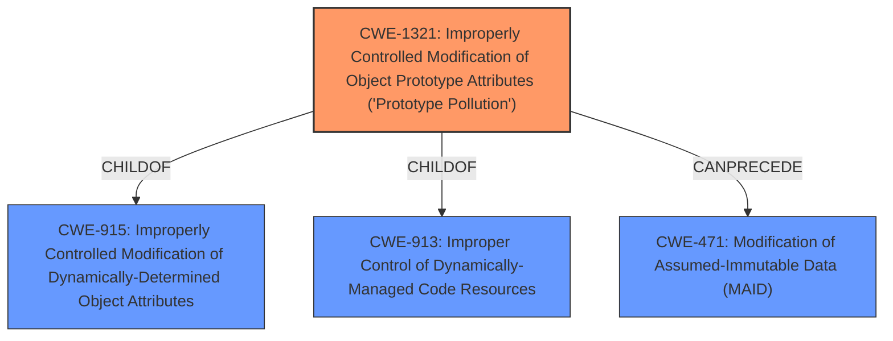

# Analysis Report for CVE-2021-21368

# Vulnerability Analysis Report: CVE-2021-21368

## Description


## Analysis (with Relationship Data)

# Summary
| CWE ID  | CWE Name       | Confidence | CWE Abstraction Level | CWE Vulnerability Mapping Label | CWE-Vulnerability Mapping Notes |
|-----------------|-----------------------------------------------------------------------------------------|--------------------|-------------------------|-----------------------------------|---------------------------------------------------------------------------------|
| CWE-1321 | Improperly Controlled Modification of Object Prototype Attributes ('Prototype Pollution') | 1 | Variant | Primary | Allowed |

## Evidence and Confidence

*   **Confidence Score:** 1
*   **Evidence Strength:** HIGH

## Relationship Analysis
The primary CWE selected is CWE-1321, which is a Variant level CWE. It is a child of CWE-915 (Improperly Controlled Modification of Dynamically-Determined Object Attributes) and CWE-913 (Improper Control of Dynamically-Managed Code Resources). The relationship indicates that prototype pollution is a specific case of a more general class of vulnerabilities related to improper control of object attributes. This helps confirm that CWE-1321 is a specific and appropriate choice for this case.



## Vulnerability Chain
The vulnerability chain starts with the **improper __proto__ handling**, leading to **prototype poisoning**, which results in unexpected prototype properties and methods. The root cause is the lack of proper control over modifications to object prototype attributes when handling the `__proto__` key in a map.

## Summary of Analysis
The initial assessment focused on identifying the root cause and weakness described in the vulnerability. The description explicitly mentions "**prototype poisoning**" and "**improper __proto__ handling**." The CVE Reference Links Content Summary confirms the **prototype poisoning** vulnerability and highlights that the `msgpack5` library does not properly handle the `__proto__` key, which can lead to modification of object prototypes.

The retriever results indicated CWE-1321 (Improperly Controlled Modification of Object Prototype Attributes ('Prototype Pollution')) as the top candidate. The description of CWE-1321 aligns directly with the vulnerability description: "The product receives input from an upstream component that specifies attributes that are to be initialized or updated in an object, but it does not properly control modifications of attributes of the object prototype."

The relationship analysis reinforces the selection of CWE-1321, as it is a specific variant of more general weaknesses related to improper control of object attributes. The mapping guidance for CWE-1321 also supports its use, stating that it is at the Variant level of abstraction, which is preferred.

The evidence from the vulnerability description and the retriever results, combined with relationship analysis and mapping guidance, strongly supports the selection of CWE-1321 as the primary CWE for this vulnerability.

Relevant CWE Information:
- **CWE-1321**: The description directly matches the vulnerability where the product does not properly control modifications of the object prototype attributes. The vulnerability occurs because the msgpack5 library doesn't properly handle the __proto__ key, allowing modification of decoded objects' prototypes.
- **CWE-915**: Considered but not selected because CWE-1321 is a more specific Variant of this Base CWE, providing a more precise description of the vulnerability.
- **CWE-502**: Considered but not selected because while deserialization is involved, the core issue is the improper handling of the `__proto__` attribute, leading to prototype pollution, rather than a general deserialization flaw.


## CWE Relationship Analysis

Current CWEs represent these abstraction levels: .


### Vulnerability Chain Analysis

**Chain starting from CWE-502:**
- 502 (Deserialization of Untrusted Data) - ROOT


**Chain starting from CWE-915:**
- 915 (Improperly Controlled Modification of Dynamically-Determined Object Attributes) - ROOT


### CWE Relationship Diagram

```mermaid
graph TD
    classDef primary fill:#f96,stroke:#333,stroke-width:2px
    classDef secondary fill:#69f,stroke:#333
    classDef tertiary fill:#9e9,stroke:#333
```


*Report generated on 2025-04-02 02:04:20*
