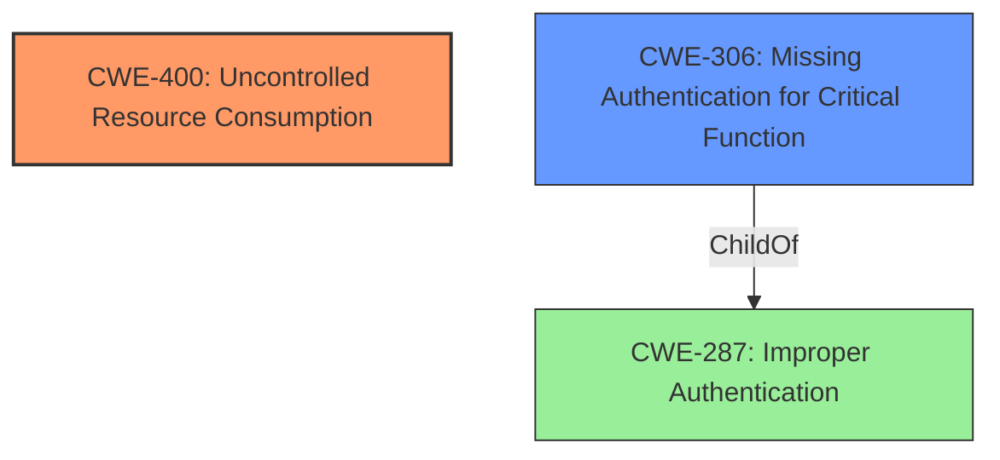

# Raw Analyzer Response for CVE-2021-21369

# Summary
| CWE ID    | CWE Name                                                      | Confidence | CWE Abstraction Level | CWE Vulnerability Mapping Label | CWE-Vulnerability Mapping Notes |
| --------- | ------------------------------------------------------------- | ---------- | --------------------- | ------------------------------- | ----------------------------- |
| CWE-400   | Uncontrolled Resource Consumption                             | 0.9        | Class                 | Allowed-with-Review             | Primary CWE                    |
| CWE-306   | Missing Authentication for Critical Function                  | 0.6        | Base                  | Allowed                         | Secondary CWE                  |

## Evidence and Confidence

*   **Confidence Score:** 0.9
*   **Evidence Strength:** HIGH

## Relationship Analysis
The primary CWE is CWE-400 **(Uncontrolled Resource Consumption)**, which is a Class-level CWE. The vulnerability involves a single user overloading the login endpoint with invalid requests. Since the password validity check is performed on the main vertx event loop and takes a relatively long time, this can cause the processing of other valid requests to fail, leading to a denial of service. This aligns with the description of CWE-400, where the product does not properly control the allocation and maintenance of a limited resource, enabling an actor to influence the amount of resources consumed, eventually leading to the exhaustion of available resources.

A secondary CWE is CWE-306 **(Missing Authentication for Critical Function)** because the described scenario requires a valid username, implying that authentication is present but is not sufficient to prevent resource exhaustion. The weakness lies in the **lack of rate limiting** or other protective measures on the login endpoint. CWE-306 is a child of CWE-287 **(Improper Authentication)**, but the specific issue is the **uncontrolled resource consumption** during the authentication process rather than the complete absence of authentication.

## Vulnerability Chain
The vulnerability chain starts with the **lack of rate limiting or protection** on the login endpoint, which leads to **inefficient password checking** on the main event loop, ultimately resulting in **denial of service** due to **uncontrolled resource consumption**.

## Summary of Analysis
The initial assessment considered CWE-400 as the primary weakness due to the **uncontrolled consumption of resources** leading to a denial-of-service condition. The evidence supporting this assessment is strong, as the vulnerability description clearly states that a single user can overload the login endpoint with invalid requests, blocking the processing of other valid requests.

CWE-306 was considered as a secondary weakness because the vulnerability requires a valid username, indicating that some form of authentication is present. However, the main issue is not the complete absence of authentication but rather the **lack of proper resource management** during the authentication process. The "CVE Reference Links Content Summary" explicitly mentions the **lack of rate limiting/protection** on the login endpoint as a weakness.

The selection of CWE-400 as the primary CWE is justified by its direct relevance to the root cause of the vulnerability, which is the **uncontrolled resource consumption**. While other CWEs like CWE-287 **(Improper Authentication)** and CWE-306 **(Missing Authentication for Critical Function)** were considered, they do not accurately capture the core issue of resource exhaustion. CWE-400 is at an appropriate level of specificity, as it directly addresses the **uncontrolled consumption of resources**, and more specific children of CWE-400 like CWE-770 **(Allocation of Resources Without Limits or Throttling)** may be applicable but would require more detailed analysis of the code.

Relevant CWE Information:

# Enhanced Context (25 CWEs)
The following CWEs were identified as potentially relevant to this vulnerability:

## CWE-1390: Weak Authentication
**Abstraction Level**: Class
**Similarity Score**: 0.76
**Source**: dense

**Description**:
The product uses an authentication mechanism to restrict access to specific users or identities, but the mechanism does not sufficiently prove that the claimed identity is correct.

**Mapping Guidance**:
- Usage: Allowed-with-Review
- Rationale: This CWE entry is a Class and might have Base-level children that would be more appropriate

## CWE-639: Authorization Bypass Through User-Controlled Key
**Abstraction Level**: Base
**Similarity Score**: 0.76
**Source**: dense

**Description**:
The system's authorization functionality does not prevent one user from gaining access to another user's data or record by modifying the key value identifying the data.

**Mapping Guidance**:
- Usage: Allowed
- Rationale: This CWE entry is at the Base level of abstraction, which is a preferred level of abstraction for mapping to the root causes of vulnerabilities.

## CWE-668: Exposure of Resource to Wrong Sphere
**Abstraction Level**: Class
**Similarity Score**: 0.75
**Source**: dense

**Description**:
The product exposes a resource to the wrong control sphere, providing unintended actors with inappropriate access to the resource.

**Mapping Guidance**:
- Usage: Discouraged
- Rationale: CWE-668 is high-level and is often misused as a catch-all when lower-level CWE IDs might be applicable. It is sometimes used for low-information vulnerability reports [REF-1287]. It is a level-1 Class (i.e., a child of a Pillar). It is not useful for trend analysis.

## CWE-226: Sensitive Information in Resource Not Removed Before Reuse
**Abstraction Level**: Base
**Similarity Score**: 0.75
**Source**: dense

**Description**:
The product releases a resource such as memory or a file so that it can be made available for reuse, but it does not clear or "zeroize" the information contained in the resource before the product performs a critical state transition or makes the resource available for reuse by other entities.

**Mapping Guidance**:
- Usage: Allowed
- Rationale: This CWE entry is at the Base level of abstraction, which is a preferred level of abstraction for mapping to the root causes of vulnerabilities.

## CWE-1391: Use of Weak Credentials
**Abstraction Level**: Class
**Similarity Score**: 0.75
**Source**: dense

**Description**:
The product uses weak credentials (such as a default key or hard-coded password) that can be calculated, derived, reused, or guessed by an attacker.

**Mapping Guidance**:
- Usage: Allowed-with-Review
- Rationale: This CWE entry is a Class and might have Base-level children that would be more appropriate

## CWE-807: Reliance on Untrusted Inputs in a Security Decision
**Abstraction Level**: Base
**Similarity Score**: 0.75
**Source**: dense

**Description**:
The product uses a protection mechanism that relies on the existence or values of an input, but the input can be modified by an untrusted actor in a way that bypasses the protection mechanism.

**Mapping Guidance**:
- Usage: Allowed
- Rationale: This CWE entry is at the Base level of abstraction, which is a preferred level of abstraction for mapping to the root causes of vulnerabilities.

## CWE-303: Incorrect Implementation of Authentication Algorithm
**Abstraction Level**: Base
**Similarity Score**: 0.75
**Source**: dense

**Description**:
The requirements for the product dictate the use of an established authentication algorithm, but the implementation of the algorithm is incorrect.

**Mapping Guidance**:
- Usage: Allowed
- Rationale: This CWE entry is at the Base level of abstraction, which is a preferred level of abstraction for mapping to the root causes of vulnerabilities.

## CWE-404: Improper Resource Shutdown or Release
**Abstraction Level**: Class
**Similarity Score**: 0.75
**Source**: dense

**Description**:
The product does not release or incorrectly releases a resource before it is made available for re-use.

**Mapping Guidance**:
- Usage: Allowed-with-Review
- Rationale: This CWE entry is a Class and might have Base-level children that would be more appropriate

## CWE-274: Improper Handling of Insufficient Privileges
**Abstraction Level**: Base
**Similarity Score**: 0.74
**Source**: dense

**Description**:
The product does not handle or incorrectly handles when it has insufficient privileges to perform an operation, leading to resultant weaknesses.

**Mapping Guidance**:
- Usage: Discouraged
- Rationale: This CWE entry could be deprecated in a future version of CWE.

## CWE-798: Use of Hard-coded Credentials
**Abstraction Level**: Base
**Similarity Score**: 0.74
**Source**: dense

**Description**:
The product contains hard-coded credentials, such as a password or cryptographic key.

**Mapping Guidance**:
- Usage: Allowed
- Rationale: